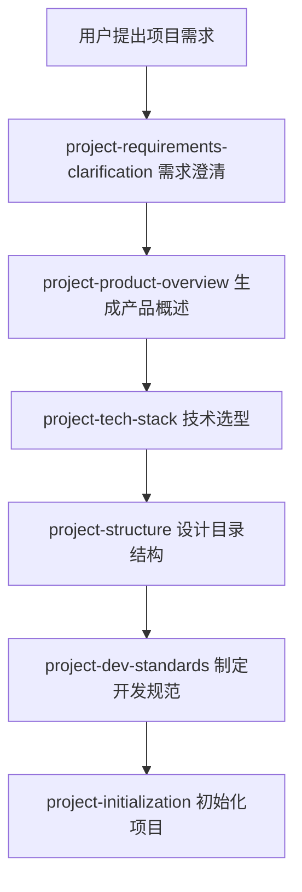
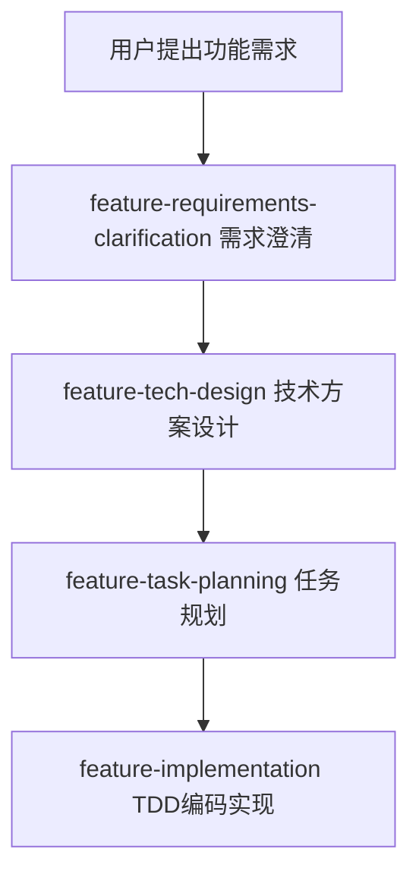
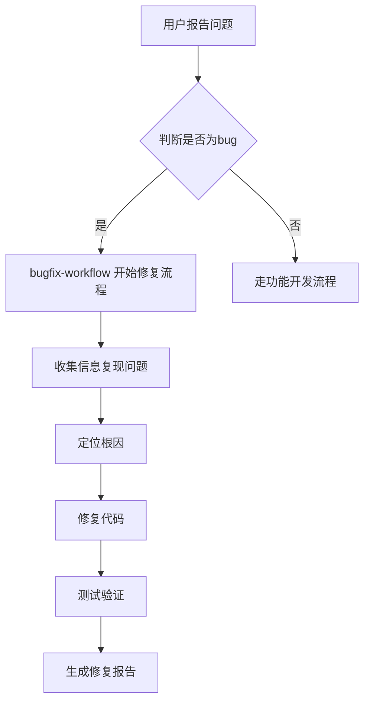

# K线训练营App - Skills 说明管理文档

> **文档版本**: v1.0  
> **最后更新**: 2026-05-13  
> **维护者**: 开发团队  
> **描述**: 本项目所有 skills 能力说明文档，用于快速查询和管理各技能的功能、用途和调用方式。

---

## 目录

1. [Skills 分类概览](#1-skills-分类概览)
2. [核心 Skills 详细说明](#2-核心-skills-详细说明)
3. [技能调用流程](#3-技能调用流程)
4. [添加新 Skills](#4-添加新-skills)
5. [更新记录](#5-更新记录)

---

## 1. Skills 分类概览

| 类别 | Skills | 主要用途 |
|------|--------|---------|
| **项目管理** | project-* | 项目初始化、产品设计、技术选型、架构设计 |
| **功能开发** | feature-* | 需求澄清、技术方案、任务规划、编码实现 |
| **开发工具** | development-essentials | 日常开发命令（代码、调试、测试等） |
| **Bug修复** | bugfix-workflow | 问题定位、修复、验证 |
| **文档协作** | doc-coauthoring | 文档写作工作流 |
| **前端设计** | frontend-design, ui-ux-pro-max | UI界面设计 |
| **Git工作流** | git-workflow | Git规范和提交指南 |
| **其他工具** | pdf, pptx, docx, xlsx 等 | 文档处理、艺术生成等 |

---

## 2. 核心 Skills 详细说明

### 2.1 项目管理类 Skills

#### **project-initialization**
- **名称**: 项目初始化执行者
- **路径**: `skills/project/project-initialization/SKILL.md`
- **功能**: 读取 specs/ 下的定义文档，自动创建目录结构、配置文件和初始化 Git 仓库
- **触发时机**: 项目规划完成后，将文档转化为实际代码骨架
- **前置条件**: 需要 `specs/技术栈.md`、`specs/项目结构.md`、`specs/开发规范.md` 已存在
- **调用方式**: `Use Skill: project-initialization`
- **输出**: 项目目录结构、配置文件、Git 初始化、`docs/开发记录/初始化记录.md`

#### **project-product-overview**
- **名称**: 产品概述生成器
- **路径**: `skills/project/product-overview/SKILL.md`
- **功能**: 将需求转化为标准化的产品概述文档
- **触发时机**: 需求澄清后使用，明确愿景、核心价值、板块、用户、场景和验收标准
- **输出**: `specs/产品概述.md`
- **调用方式**: `Use Skill: project-product-overview`

#### **project-tech-stack**
- **名称**: 技术选型器
- **路径**: `skills/project/project-tech-stack/SKILL.md`
- **功能**: 进行项目技术选型，推荐最合适的技术栈
- **触发时机**: 产品概述确定后使用
- **输出**: `specs/技术栈.md`
- **调用方式**: `Use Skill: project-tech-stack`

#### **project-structure**
- **名称**: 项目结构设计器
- **路径**: `skills/project/project-structure/SKILL.md`
- **功能**: 定义项目目录结构，设计高内聚低耦合的架构
- **触发时机**: 技术栈确定后使用
- **输出**: `specs/项目结构.md`
- **调用方式**: `Use Skill: project-structure`

#### **project-dev-standards**
- **名称**: 开发规范制定器
- **路径**: `skills/project/project-dev-standards/SKILL.md`
- **功能**: 制定代码规范和协作流程
- **触发时机**: 技术栈确定后使用，定义代码风格、命名约定、Git提交规范和AI交互协议
- **输出**: `specs/开发规范.md`
- **调用方式**: `Use Skill: project-dev-standards`

#### **project-roadmap-planning**
- **名称**: 项目路线图规划器
- **路径**: `skills/project/project-roadmap-planning/SKILL.md`
- **功能**: 制定项目开发路线图和里程碑规划
- **输出**: 项目路线图文档
- **调用方式**: `Use Skill: project-roadmap-planning`

---

### 2.2 功能开发类 Skills

#### **feature-requirements-clarification**
- **名称**: 功能需求澄清器
- **路径**: `skills/feature/feature-requirements-clarification/SKILL.md`
- **功能**: 通过自然对话挖掘需求，产出高质量验收标准（AC）
- **触发时机**: 用户说"我想做一个XX功能"、"帮我想想XX怎么做"等模糊需求描述时
- **输出**: `specs/features/{功能名}.md`
- **调用方式**: `Use Skill: feature-requirements-clarification`

#### **feature-tech-design**
- **名称**: 功能技术方案设计器
- **路径**: `skills/feature/feature-tech-design/SKILL.md`
- **功能**: 设计功能的技术实现方案
- **触发时机**: 需求明确后使用，产出包含 API、数据库、核心逻辑的详细技术方案
- **前置条件**: 需求文档 `specs/features/{功能名}.md` 已存在
- **输出**: `specs/features/{功能名}_技术方案.md`
- **调用方式**: `Use Skill: feature-tech-design`

#### **feature-task-planning**
- **名称**: 功能任务规划器
- **路径**: `skills/feature/feature-task-planning/SKILL.md`
- **功能**: 将功能分解为可执行的任务列表
- **输出**: `specs/features/{功能名}_任务规划.md`
- **调用方式**: `Use Skill: feature-task-planning`

#### **feature-implementation**
- **名称**: 功能编码实现器（TDD驱动）
- **路径**: `skills/feature/feature-implementation/SKILL.md`
- **功能**: 按 RED-GREEN-REFACTOR 循环执行开发任务
- **触发时机**: 用户说"完成XX功能的第N阶段"、"开始写代码"、"实现XX阶段"等时
- **前置条件**: 需求文档、技术方案、任务规划都已就绪
- **调用方式**: `Use Skill: feature-implementation`
- **输出**: 实现的代码、测试用例、阶段完成报告

#### **feature-evolution**
- **名称**: 功能演进管理
- **路径**: `skills/feature/feature-evolution/SKILL.md`
- **功能**: 管理功能的演进和迭代
- **调用方式**: `Use Skill: feature-evolution`

---

### 2.3 Git工作流类

#### **git-workflow**
- **名称**: Git工作流指导
- **路径**: `skills/git-workflow/SKILL.md`
- **功能**: Git规范和工作流指导，使用 Conventional Commits、分支策略和版本控制最佳实践
- **触发时机**: 设计 GitHub 管理及提交方案时
- **核心内容**:
  - Conventional Commits 格式规范
  - 分支策略（feature、bugfix、hotfix 等）
  - 提交信息规范
  - GitHub Actions CI/CD 配置
- **调用方式**: `Use Skill: git-workflow`

---

### 2.4 Bug修复类

#### **bugfix-workflow**
- **名称**: BUG修复工作流
- **路径**: `skills/bugfix-workflow/SKILL.md`
- **功能**: 定位问题、修复、确保不再复发
- **触发时机**: 用户报告 bug、错误、异常行为、功能不符合预期时
- **关键判断**: 区分真正的 bug（代码行为与需求不符）和需求变更（用户想要新行为）
- **工作流程**:
  1. 收集信息，复现问题
  2. 定位根因
  3. 修复代码
  4. 测试验证
  5. 生成报告
- **调用方式**: `Use Skill: bugfix-workflow`
- **输出**: 修复后的代码、`docs/BUG修复文档/{时间}_{问题简述}.md`

---

### 2.5 开发工具类

#### **development-essentials**
- **名称**: 开发必备工具集
- **路径**: `skills/development-essentials`
- **功能**: 提供日常开发的子命令
- **子命令列表**:

| 命令 | 功能 | 触发词 | 文档 |
|------|------|--------|------|
| `code` | 编写代码 | "写代码"、"实现"、"编码" | `skills/development-essentials/commands/code.md` |
| `test` | 编写测试 | "写测试"、"测试用例" | `skills/development-essentials/commands/test.md` |
| `debug` | 调试代码 | "调试"、"bug"、"错误" | `skills/development-essentials/commands/debug.md` |
| `review` | 代码审查 | "审查代码"、"review" | `skills/development-essentials/commands/review.md` |
| `refactor` | 重构代码 | "重构"、"优化代码" | `skills/development-essentials/commands/refactor.md` |
| `optimize` | 性能优化 | "优化性能"、"性能问题" | `skills/development-essentials/commands/optimize.md` |
| `docs` | 编写文档 | "写文档"、"文档" | `skills/development-essentials/commands/docs.md` |
| `ask` | 提问解答 | "问一下"、"如何"、"为什么" | `skills/development-essentials/commands/ask.md` |
| `think` | 思考分析 | "分析"、"思考"、"方案" | `skills/development-essentials/commands/think.md` |
| `bugfix` | 修复bug | "修复bug"、"修复问题" | `skills/development-essentials/commands/bugfix.md` |

---

### 2.6 文档协作类

#### **doc-coauthoring**
- **名称**: 文档协作器
- **路径**: `skills/doc-coauthoring/SKILL.md`
- **功能**: 引导用户完成结构化的文档协作工作流
- **工作流程**:
  1. **Context Gathering** - 收集上下文
  2. **Refinement & Structure** - 细化和结构化
  3. **Reader Testing** - 读者测试
- **触发时机**: 用户想写文档、提案、技术规格、决策文档等
- **调用方式**: `Use Skill: doc-coauthoring`

---

### 2.7 前端设计类

#### **frontend-design**
- **名称**: 前端设计器
- **路径**: `skills/frontend-design/SKILL.md`
- **功能**: 创建独特、生产级的前端界面，避免通用AI美学
- **设计原则**:
  - 排版：选择独特字体
  - 色彩：连贯的美学主题
  - 动效：高影响力的动画和微交互
  - 空间布局：非对称、重叠、对角线流动
- **调用方式**: `Use Skill: frontend-design`

#### **ui-ux-pro-max**
- **名称**: UI/UX设计工具集
- **路径**: `skills/ui-ux-pro-max/SKILL.md`
- **功能**: UI/UX设计工具，包含设计系统、组件库、样式指南等数据
- **包含内容**:
  - 多种技术栈的 UI 组件数据（React、Vue、Flutter 等）
  - 设计系统和样式指南
  - 图标和排版数据
- **调用方式**: `Use Skill: ui-ux-pro-max`

#### **UI-Interface-Design-Review**
- **名称**: UI界面设计评审
- **路径**: `skills/UI-Interface-Design-Review/SKILL.md`
- **功能**: 评审和优化 UI 界面设计
- **调用方式**: `Use Skill: UI-Interface-Design-Review`

---

### 2.8 其他工具类

#### **skill-creator**
- **名称**: 技能创建器
- **路径**: `skills/skill-creator/SKILL.md`
- **功能**: 创建新的 skills
- **调用方式**: `Use Skill: skill-creator`

#### **product-manager**
- **名称**: 产品经理工具集
- **路径**: `skills/product-manager/SKILL.md`
- **功能**: 产品管理相关工具，包含 PRD 模板、最佳实践等
- **参考文档**:
  - `skills/product-manager/references/PRD-TEMPLATE.md`
  - `skills/product-manager/references/PM-BEST-PRACTICES.md`
  - `skills/product-manager/references/REVIEW-CHECKLIST.md`
- **调用方式**: `Use Skill: product-manager`

#### **theme-factory**
- **名称**: 主题工厂
- **路径**: `skills/theme-factory/SKILL.md`
- **功能**: 创建和管理 UI 主题
- **预设主题**:
  - arctic-frost
  - botanical-garden
  - desert-rose
  - forest-canopy
  - golden-hour
  - midnight-galaxy
  - modern-minimalist
  - ocean-depths
  - sunset-boulevard
  - tech-innovation
- **调用方式**: `Use Skill: theme-factory`

#### **文档处理工具**
- **pdf**: PDF 文档处理
  - 路径: `skills/pdf/SKILL.md`
  - 功能: 表单填写、字段提取、验证等
- **docx**: Word 文档处理
  - 路径: `skills/docx/SKILL.md`
  - 功能: 文档编辑、修改接受等
- **pptx**: PowerPoint 文档处理
  - 路径: `skills/pptx/SKILL.md`
  - 功能: 幻灯片编辑、缩略图生成等
- **xlsx**: Excel 文档处理
  - 路径: `skills/xlsx/SKILL.md`
  - 功能: 电子表格处理

#### **其他创意工具**
- **algorithmic-art**: 算法艺术生成
  - 路径: `skills/algorithmic-art/SKILL.md`
- **canvas-design**: 画布设计
  - 路径: `skills/canvas-design/SKILL.md`
  - 包含大量字体资源
- **slack-gif-creator**: Slack GIF 创建
  - 路径: `skills/slack-gif-creator/SKILL.md`

#### **技术工具**
- **claude-api**: Claude API 使用指南
  - 路径: `skills/claude-api/SKILL.md`
  - 包含多语言示例（Python、TypeScript、Go、Java、PHP、Ruby、C#）
- **mcp-builder**: MCP服务器构建工具
  - 路径: `skills/mcp-builder/SKILL.md`
  - 功能: 创建高质量的 MCP 服务器
- **fullstack-developer**: 全栈开发工具
  - 路径: `skills/fullstack-developer/SKILL.md`
- **brand-guidelines**: 品牌指南工具
  - 路径: `skills/brand-guidelines/SKILL.md`
- **internal-comms**: 内部沟通工具
  - 路径: `skills/internal-comms/SKILL.md`
  - 包含邮件、通讯等模板
- **web-artifacts-builder**: Web构件构建器
  - 路径: `skills/web-artifacts-builder/SKILL.md`
- **webapp-testing**: Web应用测试
  - 路径: `skills/webapp-testing/SKILL.md`

---

## 3. 技能调用流程

### 3.1 项目初始化流程



### 3.2 功能开发流程



### 3.3 Bug修复流程



### 3.4 调用方式说明

所有 skills 都遵循统一的调用格式：

```
Use Skill: <skill-name>
```

例如：
```
Use Skill: git-workflow
Use Skill: feature-requirements-clarification
Use Skill: project-initialization
```

某些 skills 会在特定对话场景自动触发，无需显式调用。

---

## 4. 添加新 Skills

当添加新 skills 时，请按以下步骤更新本文档：

### 4.1 添加步骤

1. **在 `skills/` 目录下创建新 skill**
   - 确保有 `SKILL.md` 文件
   - 如果有资源文件，放在对应目录

2. **确定 skill 所属分类**
   - 项目管理
   - 功能开发
   - 开发工具
   - Bug修复
   - 文档协作
   - 前端设计
   - Git工作流
   - 其他工具

3. **在对应分类下添加说明**
   - 填写第 2 章节中的标准字段
   - 添加必要的文档路径

4. **更新更新记录**
   - 在第 5 章节添加新记录

5. **更新版本号**
   - 小更新：v1.0 → v1.1
   - 大更新：v1.0 → v2.0

### 4.2 Skill 说明模板

添加新 skill 时，请使用以下模板：

```markdown
#### **skill-name**
- **名称**: 技能名称
- **路径**: `skills/path/to/skill/SKILL.md`
- **功能**: 简要描述技能功能
- **触发时机**: 何时使用此技能
- **前置条件**: 如有必要，列出前置条件
- **调用方式**: `Use Skill: skill-name`
- **输出**: 输出内容描述（可选）
```

---

## 5. 更新记录

| 版本 | 日期 | 更新内容 | 更新者 |
|------|------|---------|--------|
| v1.0 | 2026-05-13 | 初始版本，整理现有所有 skills | DevOps Engineer |

---

## 6. 附录

### 6.1 完整 Skills 清单

| 序号 | Skill 名称 | 分类 | 路径 |
|------|-----------|------|------|
| 1 | project-initialization | 项目管理 | `skills/project/project-initialization/SKILL.md` |
| 2 | project-product-overview | 项目管理 | `skills/project/project-product-overview/SKILL.md` |
| 3 | project-tech-stack | 项目管理 | `skills/project/project-tech-stack/SKILL.md` |
| 4 | project-structure | 项目管理 | `skills/project/project-structure/SKILL.md` |
| 5 | project-dev-standards | 项目管理 | `skills/project/project-dev-standards/SKILL.md` |
| 6 | project-roadmap-planning | 项目管理 | `skills/project/project-roadmap-planning/SKILL.md` |
| 7 | project-requirements-clarification | 项目管理 | `skills/project/project-requirements-clarification/SKILL.md` |
| 8 | feature-requirements-clarification | 功能开发 | `skills/feature/feature-requirements-clarification/SKILL.md` |
| 9 | feature-tech-design | 功能开发 | `skills/feature/feature-tech-design/SKILL.md` |
| 10 | feature-task-planning | 功能开发 | `skills/feature/feature-task-planning/SKILL.md` |
| 11 | feature-implementation | 功能开发 | `skills/feature/feature-implementation/SKILL.md` |
| 12 | feature-evolution | 功能开发 | `skills/feature/feature-evolution/SKILL.md` |
| 13 | git-workflow | Git工作流 | `skills/git-workflow/SKILL.md` |
| 14 | bugfix-workflow | Bug修复 | `skills/bugfix-workflow/SKILL.md` |
| 15 | development-essentials | 开发工具 | `skills/development-essentials` |
| 16 | doc-coauthoring | 文档协作 | `skills/doc-coauthoring/SKILL.md` |
| 17 | frontend-design | 前端设计 | `skills/frontend-design/SKILL.md` |
| 18 | ui-ux-pro-max | 前端设计 | `skills/ui-ux-pro-max/SKILL.md` |
| 19 | UI-Interface-Design-Review | 前端设计 | `skills/UI-Interface-Design-Review/SKILL.md` |
| 20 | theme-factory | 其他工具 | `skills/theme-factory/SKILL.md` |
| 21 | product-manager | 其他工具 | `skills/product-manager/SKILL.md` |
| 22 | skill-creator | 其他工具 | `skills/skill-creator/SKILL.md` |
| 23 | pdf | 其他工具 | `skills/pdf/SKILL.md` |
| 24 | docx | 其他工具 | `skills/docx/SKILL.md` |
| 25 | pptx | 其他工具 | `skills/pptx/SKILL.md` |
| 26 | xlsx | 其他工具 | `skills/xlsx/SKILL.md` |
| 27 | algorithmic-art | 其他工具 | `skills/algorithmic-art/SKILL.md` |
| 28 | canvas-design | 其他工具 | `skills/canvas-design/SKILL.md` |
| 29 | slack-gif-creator | 其他工具 | `skills/slack-gif-creator/SKILL.md` |
| 30 | claude-api | 其他工具 | `skills/claude-api/SKILL.md` |
| 31 | mcp-builder | 其他工具 | `skills/mcp-builder/SKILL.md` |
| 32 | fullstack-developer | 其他工具 | `skills/fullstack-developer/SKILL.md` |
| 33 | brand-guidelines | 其他工具 | `skills/brand-guidelines/SKILL.md` |
| 34 | internal-comms | 其他工具 | `skills/internal-comms/SKILL.md` |
| 35 | web-artifacts-builder | 其他工具 | `skills/web-artifacts-builder/SKILL.md` |
| 36 | webapp-testing | 其他工具 | `skills/webapp-testing/SKILL.md` |

---

**文档结束**

> 提示：本文档会随着项目的发展不断更新，确保保持与项目实际技能集同步。
