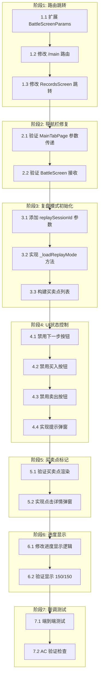

# 复盘页面任务规划

**版本**: v1.0  
**创建日期**: 2026-05-25  
**需求文档**: [复盘页面功能需求](./复盘页面功能需求.md)  
**技术文档**: [复盘页面技术方案](./复盘页面技术方案.md)

---

## 1. 任务总览

| 阶段 | 名称 | 任务数 | 状态 |
|:---:|------|:------:|:----:|
| 1 | 复盘模式路由跳转 | 3 | ✅ 已完成 |
| 2 | 底部导航栏修复 | 2 | ✅ 已完成 |
| 3 | 复盘模式初始化 | 3 | ✅ 已完成 |
| 4 | UI状态控制 | 4 | ✅ 已完成 |
| 5 | 买卖点标记展示 | 2 | ✅ 已完成 |
| 6 | 训练进度显示 | 2 | ✅ 已完成 |
| 7 | 联调测试 | 2 | ⏳ 待验证 |

**总计**: 18 个任务 | 6 阶段已完成 | 1 阶段待验证

---

## 2. 依赖关系图



---

## 3. 阶段详情

### 阶段 1: 复盘模式路由跳转

**阶段目标**: 用户从记录页面点击"复盘"按钮，能正确跳转到带有底部导航栏的复盘页面

#### 1.1 扩展 BattleScreenParams

**技术方案章节**: 3.1 数据模型  
**对应 AC**: AC-001, AC-004

**通俗解释**: 添加一个参数标记，让系统知道当前是复盘模式还是训练模式

**验证标准**:
```dart
// 传入 isReplayMode: true 时，BatteScreen 识别为复盘模式
BattleScreenParams(
  symbol: 'SZ000021',
  name: '飞亚达',
  market: 'XSHE',
  trainingStartDate: DateTime(2023, 3, 31),
  isReplayMode: true,
  sessionId: 123,
)
// → BattleScreen 内部 _isReplayMode = true
```

**任务内容**:
- [ ] 在 `app_routes.dart` 的 `BattleScreenParams` 类中添加 `isReplayMode` 和 `sessionId` 字段
- [ ] 更新构造方法

---

#### 1.2 修改 /main 路由支持复盘参数

**技术方案章节**: 2.1 路由方案  
**对应 AC**: AC-004

**通俗解释**: 让 `/main` 路由能接收并解析复盘相关的 URL 参数

**验证标准**:
```dart
// URL: /main?tab=1&mode=replay&sessionId=123&symbol=SZ000021&market=XSHE&date=2023-03-31
// → MainTabPage 接收到 battleParams.isReplayMode = true
// → MainTabPage 接收到 battleParams.sessionId = 123
```

**任务内容**:
- [ ] 修改 `app_routes.dart` 中 `/main` 路由的 builder 方法
- [ ] 解析 `mode`、`sessionId` 等参数
- [ ] 传递给 `MainTabPage`

---

#### 1.3 修改 RecordsScreen 跳转逻辑

**技术方案章节**: 6.1 RecordsScreen 修改  
**对应 AC**: AC-001

**通俗解释**: 把"复盘"按钮的跳转目标从 `/battle` 改为 `/main?tab=1&mode=replay&...`

**验证标准**:
```dart
// 点击"复盘"按钮后
// → 跳转 URL 包含 mode=replay&sessionId=xxx
// → 不再跳转 /battle
```

**任务内容**:
- [ ] 修改 `_handleReplay` 方法，跳转到 `/main?tab=1&mode=replay&...`
- [ ] 移除原有的 `context.go('/battle', extra: {...})` 调用

---

### 阶段 2: 底部导航栏修复

**阶段目标**: 确保底部导航栏在复盘页面正常显示

#### 2.1 验证 MainTabPage 参数传递

**技术方案章节**: 5.1 MainTabPage 修改  
**对应 AC**: AC-004

**通俗解释**: 确认 `battleParams` 能正确传递给 `BattleScreen`

**验证标准**:
```dart
// MainTabPage 传入 battleParams.isReplayMode = true
// → BattleScreen 接收到的 isReplayMode 参数为 true
```

**任务内容**:
- [ ] 确认 `MainTabPage` 能接收并转发 `battleParams`
- [ ] 添加日志输出便于调试

---

#### 2.2 验证 BattleScreen 接收

**技术方案章节**: 5.1 MainTabPage 修改  
**对应 AC**: AC-004

**通俗解释**: 确认 `BattleScreen` 能正确接收复盘模式参数

**验证标准**:
```dart
// BattleScreen 接收 battleParams 后
// → widget.isReplayMode = true
// → widget.replaySessionId = 123
```

**任务内容**:
- [ ] 确认 `BattleScreen` 构造函数接收新参数
- [ ] 添加日志输出便于调试

---

### 阶段 3: 复盘模式初始化

**阶段目标**: 复盘页面加载时显示训练最后一天的数据和所有买卖点

#### 3.1 添加 replaySessionId 参数

**技术方案章节**: 3.1 数据模型  
**对应 AC**: AC-002

**通俗解释**: 让 `BattleScreen` 知道要加载哪个训练记录

**验证标准**:
```dart
// BattleScreen(isReplayMode: true, replaySessionId: 123)
// → _loadReplayMode(sessionId: 123) 被调用
```

**任务内容**:
- [ ] 在 `BattleScreen` 中添加 `isReplayMode` 和 `replaySessionId` 参数
- [ ] 在 `initState` 中判断是否调用 `_loadReplayMode`

---

#### 3.2 实现 _loadReplayMode 方法

**技术方案章节**: 4.1 复盘模式初始化  
**对应 AC**: AC-002, AC-011, AC-012

**通俗解释**: 加载训练记录和交易数据，锁定到训练最后一天

**验证标准**:
```dart
// 调用 _loadReplayMode 后
// → _currentDayIndex = _allKlineData.length - 1（最后一天）
// → _accountBalance = session.currentCapital（训练结束时的余额）
// → _trainingPhase = TrainingPhase.closing
```

**任务内容**:
- [ ] 从数据库加载 `TrainingSession` 记录
- [ ] 设置账户状态为训练结束时
- [ ] 计算 `_currentDayIndex` 指向最后一天
- [ ] 设置 `_trainingPhase = TrainingPhase.closing`

---

#### 3.3 构建买卖点列表

**技术方案章节**: 4.1 复盘模式初始化  
**对应 AC**: AC-008, AC-009

**通俗解释**: 从交易记录中找出对应的 K 线位置，在图表上标记买卖点

**验证标准**:
```dart
// 交易记录中有一笔买入
// tradeDate: '2023-04-10', price: 12.5, quantity: 1000
// → _tradePoints 中添加 TradePoint(
//     index: 110,  // 对应 2023-04-10 的 K 线索引
//     price: 12.5,
//     isBuy: true,
//     label: '买入 1000股'
//   )
```

**任务内容**:
- [ ] 从数据库加载 `TrainingTrade` 记录
- [ ] 遍历交易记录，找到对应的 K 线索引
- [ ] 构建 `TradePoint` 列表

---

### 阶段 4: UI状态控制

**阶段目标**: 复盘模式下禁用交易操作，显示提示

#### 4.1 禁用下一步按钮

**技术方案章节**: 4.2 下一步按钮行为  
**对应 AC**: AC-005

**通俗解释**: 点击"下一步"按钮时弹出"训练已结束"提示，而不是推进日期

**验证标准**:
```dart
// _isReplayMode = true 时点击"下一步"
// → _showReplayEndDialog() 被调用
// → 不执行 _currentDayIndex++
// → _currentDayIndex 保持不变
```

**任务内容**:
- [ ] 修改 `_nextDay()` 方法
- [ ] 添加 `_showReplayEndDialog()` 方法

---

#### 4.2 禁用买入按钮

**技术方案章节**: 4.4 买卖按钮禁用  
**对应 AC**: AC-006

**通俗解释**: 点击"买入"按钮时弹出"复盘模式无法交易"提示

**验证标准**:
```dart
// _isReplayMode = true 时点击"买入"
// → _showReplayDisabledDialog('买入') 被调用
// → 不显示买入页面
```

**任务内容**:
- [ ] 修改买入按钮 `onPressed`
- [ ] 添加 `_showReplayDisabledDialog()` 方法

---

#### 4.3 禁用卖出按钮

**技术方案章节**: 4.4 买卖按钮禁用  
**对应 AC**: AC-007

**通俗解释**: 点击"卖出"按钮时弹出"复盘模式无法交易"提示

**验证标准**:
```dart
// _isReplayMode = true 时点击"卖出"
// → _showReplayDisabledDialog('卖出') 被调用
// → 不显示卖出页面
```

**任务内容**:
- [ ] 修改卖出按钮 `onPressed`
- [ ] 复用 `_showReplayDisabledDialog()` 方法

---

#### 4.4 实现提示弹窗

**技术方案章节**: 6.2, 6.3 弹窗实现  
**对应 AC**: AC-005, AC-006, AC-007

**通俗解释**: 显示友好的提示信息，告知用户当前是复盘模式

**验证标准**:
```dart
// 复盘模式提示弹窗内容正确
// → "训练已结束" 或 "复盘模式无法交易"
// → 包含"确定"按钮，点击后关闭弹窗
```

**任务内容**:
- [ ] 实现 `_showReplayEndDialog()` 弹窗
- [ ] 实现 `_showReplayDisabledDialog()` 弹窗

---

### 阶段 5: 买卖点标记展示

**阶段目标**: 在 K 线图上正确显示买卖点标记

#### 5.1 验证买卖点渲染

**技术方案章节**: 4.1 复盘模式初始化  
**对应 AC**: AC-008, AC-009

**通俗解释**: K 线图上显示红色三角形（买入）和绿色三角形（卖出）

**验证标准**:
```dart
// _tradePoints 包含买入点
// → K 线图上对应索引显示红色向上三角形
// _tradePoints 包含卖出点
// → K 线图上对应索引显示绿色向下三角形
```

**任务内容**:
- [ ] 确认现有 K 线图组件支持 `TradePoint` 标记
- [ ] 如不支持，添加标记绘制逻辑

---

#### 5.2 实现点击详情弹窗

**技术方案章节**: 4.5 买卖点点击详情  
**对应 AC**: AC-010

**通俗解释**: 点击买卖点标记时显示交易详情（价格、数量、盈亏）

**验证标准**:
```dart
// 点击买入点标记
// → 显示弹窗包含:
//   - 日期: 2023-04-10
//   - 价格: ¥12.50
//   - 买入 1000股
//   - 盈亏: ¥xxx
```

**任务内容**:
- [ ] 实现买卖点点击手势识别
- [ ] 实现详情弹窗 `TradePointDetailDialog`

---

### 阶段 6: 训练进度显示

**阶段目标**: 复盘模式下固定显示"总天数/总天数"

#### 6.1 修改进度显示逻辑

**技术方案章节**: 4.3 训练进度显示  
**对应 AC**: AC-013

**通俗解释**: 训练模式显示"当前天数/总天数"，复盘模式显示"总天数/总天数"

**验证标准**:
```dart
// 训练模式: _currentDayIndex = 150
// → 显示 "50/150"
// 复盘模式: _isReplayMode = true
// → 显示 "150/150"
```

**任务内容**:
- [ ] 修改进度显示组件的逻辑
- [ ] 根据 `_isReplayMode` 切换显示内容

---

#### 6.2 验证显示 150/150

**技术方案章节**: 4.3 训练进度显示  
**对应 AC**: AC-013

**通俗解释**: 确认复盘模式下始终显示训练总天数

**验证标准**:
```dart
// 复盘模式，无论当前查看哪一天
// → 进度显示始终为 "150/150"
```

**任务内容**:
- [ ] 添加日志输出便于调试
- [ ] 验证显示内容正确

---

### 阶段 7: 联调测试

**阶段目标**: 端到端验证所有 AC

#### 7.1 端到端测试

**技术方案章节**: 8. 测试要点  
**对应 AC**: AC-001 ~ AC-016

**通俗解释**: 从记录页面进入复盘，验证完整流程

**验证标准**:
```dart
// 完整流程测试:
// 1. 记录页面 → 点击"复盘" → 底部导航栏显示 ✓
// 2. K 线图显示到训练最后一天 ✓
// 3. 买卖点标记正确显示 ✓
// 4. 进度显示 "150/150" ✓
// 5. 点击"下一步" → 弹窗提示 ✓
// 6. 点击"买入/卖出" → 弹窗提示 ✓
// 7. 后退/前进按钮可浏览 ✓
// 8. 时间滑块可拖动 ✓
```

**任务内容**:
- [ ] 测试完整跳转流程
- [ ] 测试 K 线图显示
- [ ] 测试按钮交互
- [ ] 测试时间步进

---

#### 7.2 AC 验证检查

**技术方案章节**: 8. 测试要点  
**对应 AC**: 全部 16 条

**通俗解释**: 逐一验证每条 AC 是否满足

**验证标准**:
| AC编号 | 验证结果 |
|:------:|:--------:|
| AC-001 | [ ] |
| AC-002 | [ ] |
| AC-003 | [ ] |
| AC-004 | [ ] |
| AC-005 | [ ] |
| AC-006 | [ ] |
| AC-007 | [ ] |
| AC-008 | [ ] |
| AC-009 | [ ] |
| AC-010 | [ ] |
| AC-011 | [ ] |
| AC-012 | [ ] |
| AC-013 | [ ] |
| AC-014 | [ ] |
| AC-015 | [ ] |
| AC-016 | [ ] |

**任务内容**:
- [ ] 逐条验证 AC-001 ~ AC-016
- [ ] 记录未通过的 AC 及原因
- [ ] 修复问题并重新验证

---

## 4. 风险清单

| 风险 | 可能性 | 影响 | 应对 |
|------|:------:|:----:|------|
| K线数据不足导致显示异常 | 低 | 中 | 添加数据量检查和友好提示 |
| 买卖点标记与K线不对齐 | 中 | 高 | 添加日志调试对齐逻辑 |

---

## 5. 附录: 快速检查清单

### 跳转到复盘
- [x] RecordsScreen "复盘"按钮跳转到 `/main?tab=1&mode=replay`
- [x] MainTabPage 正确传递 `battleParams`
- [x] BattleScreen 接收 `isReplayMode` 参数

### 复盘模式行为
- [x] K 线图显示到训练最后一天
- [x] 买卖点标记正确显示（红色买入/绿色卖出）
- [x] 进度显示 "150/150"
- [x] "下一步"按钮弹出"训练已结束"
- [x] "买入"按钮弹出"复盘模式无法交易"
- [x] "卖出"按钮弹出"复盘模式无法交易"

### 浏览功能
- [x] "后退"按钮回退一天
- [x] "前进"按钮前进一天（未到最后一天时）
- [x] 时间滑块可拖动

---

**创建人**: AI Assistant  
**确认状态**: ✅ 已完成  
**完成日期**: 2026-05-26