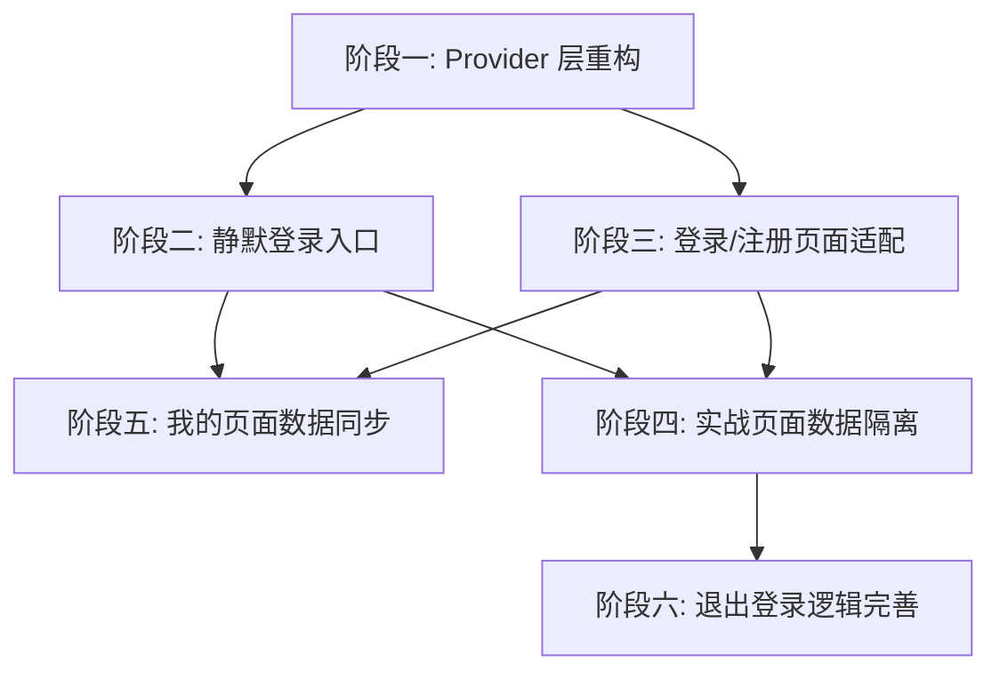

# 多账户系统与默认账号功能 - 任务规划

## 1. 概述

### 1.1 功能简介

实现默认账号 `13071103531` 静默自动登录、多账户数据完全隔离、我的页面数据与当前账户同步。

### 1.2 切片划分

| 阶段 | 切片名称 | 描述 | 对应 AC |
|------|----------|------|---------|
| 阶段一 | Provider 层重构 | AuthProvider 新增静默登录和 CurrentUserProvider | AC-001, AC-003 |
| 阶段二 | 静默登录入口 | MainTabPage 初始化时执行静默登录 | AC-001 |
| 阶段三 | 登录/注册页面适配 | 登录注册成功时设置当前用户 | AC-004, AC-005 |
| 阶段四 | 实战页面数据隔离 | 获取 userId 用于数据操作 | AC-014, AC-006~010, AC-011~012 |
| 阶段五 | 我的页面数据同步 | 使用 currentUserProvider 获取用户数据 | AC-016~019 |
| 阶段六 | 退出登录逻辑完善 | 退出时清除状态并跳转 | AC-003 |

---

## 2. 依赖关系图

---

## 3. 阶段详情

### 阶段一：Provider 层重构

**前置依赖**: 无

**文件变更**:
- `lib/providers/auth_provider.dart`
- `lib/providers/auth_provider.g.dart` (自动生成)

---

#### 任务 1.1：新增 CurrentUserNotifier

**通俗解释**: 添加一个全局状态存储当前登录用户的信息（昵称、手机号等），供所有页面使用。

**文件**: `lib/providers/auth_provider.dart`

**验证标准**:
- Given `auth_provider.dart` 中无 `CurrentUserNotifier`，When 运行 `flutter pub run build_runner build`，Then 生成 `currentUserProvider` 可用于 Provider 访问
- Given `currentUserProvider` 初始状态为 `null`，When 调用 `ref.read(currentUserProvider.notifier).setUser(testUser)`，Then `ref.read(currentUserProvider)` 返回该用户
- Given `currentUserProvider` 有用户，When 调用 `ref.read(currentUserProvider.notifier).clearUser()`，Then `ref.read(currentUserProvider)` 返回 `null`

**AC 覆盖**: AC-001, AC-003

---

#### 任务 1.2：修改 AuthState 增加静默登录

**通俗解释**: AuthProvider 增加"静默登录"方法，应用启动时自动检查并登录默认账号 13071103531。

**文件**: `lib/providers/auth_provider.dart`

**验证标准**:
- Given 数据库中存在手机号 `13071103531` 的用户，When 调用 `silentLogin()`，Then 返回 `true`，`authStateProvider` 状态为 `true`，`currentUserProvider` 有值
- Given 数据库中不存在手机号 `13071103531` 的用户，When 调用 `silentLogin()`，Then 返回 `false`，`authStateProvider` 状态保持 `false`
- Given 数据库查询异常，When 调用 `silentLogin()`，Then 捕获异常返回 `false`，不抛出
- Given `login()` 成功，When 调用 `logout()`，Then `authStateProvider` 状态为 `false`，`currentUserProvider` 为 `null`

**AC 覆盖**: AC-001, AC-003

---

### 阶段二：静默登录入口

**前置依赖**: 阶段一完成

**文件变更**:
- `lib/features/main/main_tab_page.dart`

---

#### 任务 2.1：MainTabPage 初始化静默登录

**通俗解释**: 应用启动进入首页时，自动检查并静默登录默认账号，无需用户操作。

**文件**: `lib/features/main/main_tab_page.dart`

**验证标准**:
- Given 应用启动，`authStateProvider` 为 `false`，数据库有默认账号，When MainTabPage 加载完成，Then 自动静默登录成功，`authStateProvider` 变为 `true`
- Given 应用启动，`authStateProvider` 为 `false`，数据库无默认账号，When MainTabPage 加载完成，Then 跳转 `/login` 页面
- Given 应用启动，`authStateProvider` 已为 `true`（已登录），When MainTabPage 加载完成，Then 不执行静默登录，不跳转

**AC 覆盖**: AC-001

---

### 阶段三：登录/注册页面适配

**前置依赖**: 阶段一完成

**文件变更**:
- `lib/features/user/login_screen.dart`
- `lib/features/user/register_screen.dart`

---

#### 任务 3.1：登录页面登录成功后设置用户

**通俗解释**: 用户手动登录时，登录成功后自动设置当前用户信息到全局状态。

**文件**: `lib/features/user/login_screen.dart`

**验证标准**:
- Given 用户输入正确手机号密码，When 点击登录按钮并成功，Then `currentUserProvider` 有值，跳转 `/main`
- Given 用户输入错误密码，When 点击登录按钮失败，Then 显示错误提示，`currentUserProvider` 保持 `null`

**AC 覆盖**: AC-005

---

#### 任务 3.2：注册页面注册成功后设置用户

**通俗解释**: 用户注册新账号时，注册成功后自动设置当前用户信息到全局状态。

**文件**: `lib/features/user/register_screen.dart`

**验证标准**:
- Given 用户输入手机号、密码、验证码注册成功，When 注册完成，Then `currentUserProvider` 有值，跳转 `/main`
- Given 数据库中已有该手机号，When 注册失败，Then 显示错误提示

**AC 覆盖**: AC-004

---

### 阶段四：实战页面数据隔离

**前置依赖**: 阶段一完成

**文件变更**:
- `lib/features/battle/battle_screen.dart`

---

#### 任务 4.1：实战页面获取当前用户 userId

**通俗解释**: 实战页面加载时，从全局状态获取当前登录用户的 ID，用于后续数据操作。

**文件**: `lib/features/battle/battle_screen.dart`

**验证标准**:
- Given `currentUserProvider` 有用户，userId 为 `1`，When BattleScreen 加载完成，Then `_currentUserId` 为 `1`
- Given `currentUserProvider` 为 `null`，When BattleScreen 加载完成，Then `_currentUserId` 为 `null`

**AC 覆盖**: AC-021

---

#### 任务 4.2：实战页面保存训练记录时传入 userId

**通俗解释**: 用户完成训练后保存记录时，必须带上当前用户的 ID，确保数据隔离。

**文件**: `lib/features/battle/battle_screen.dart`

**验证标准**:
- Given `_currentUserId` 为 `null`，When 用户尝试保存训练，Then 提示"用户未登录"，不保存
- Given `_currentUserId` 为 `1`，When 用户完成训练保存，Then 训练记录的 `userId` 为 `1`
- Given 账号 A 训练后保存，When 账号 B 查看训练记录，Then 账号 B 的记录列表不包含账号 A 的记录

**AC 覆盖**: AC-014, AC-007

---

#### 任务 4.3：实战页面加载训练记录时按 userId 筛选

**通俗解释**: 用户进入实战页面查看历史训练时，只加载当前账号的训练记录。

**文件**: `lib/features/battle/battle_screen.dart`

**验证标准**:
- Given `_currentUserId` 为 `1`，When 调用 `_loadTrainingRecords()`，Then 只加载 userId=1 的训练记录
- Given `_currentUserId` 为 `null`，When 调用 `_loadTrainingRecords()`，Then 不执行加载，返回

**AC 覆盖**: AC-007, AC-009

---

#### 任务 4.4：实战页面初始资金显示 100000 元

**通俗解释**: 用户进入实战页面时，资金显示为固定的 100000 元初始资金。

**文件**: `lib/features/battle/battle_screen.dart`

**验证标准**:
- Given 新用户首次进入实战页面，When 页面加载完成，Then 显示初始资金 `¥100,000.00`
- Given 老用户进入实战页面，When 页面加载完成，Then 显示当前资金（上次训练结束时的资金）

**AC 覆盖**: AC-011, AC-012

---

### 阶段五：我的页面数据同步

**前置依赖**: 阶段二完成（因为我的页面在 MainTabPage 中）

**文件变更**:
- `lib/features/mine/mine_screen.dart`

---

#### 任务 5.1：我的页面使用 currentUserProvider 获取用户信息

**通俗解释**: 我的页面展示用户信息时，从全局状态获取当前登录用户的数据。

**文件**: `lib/features/mine/mine_screen.dart`

**验证标准**:
- Given `currentUserProvider` 有用户（昵称"测试用户"，手机号"13071103531"），When 加载我的页面，Then 昵称显示"测试用户"，手机号显示"130****3531"
- Given `currentUserProvider` 为 `null`，When 加载我的页面，Then 显示默认值或加载状态

**AC 覆盖**: AC-016

---

#### 任务 5.2：我的页面训练统计传入 userId

**通俗解释**: 我的页面加载训练统计数据时，使用当前用户的 ID 查询对应数据。

**文件**: `lib/features/mine/mine_screen.dart`

**验证标准**:
- Given `currentUserProvider` 有用户，userId 为 `1`，When 加载训练统计，Then 调用 `getUserAssetSummary(1)`
- Given `currentUserProvider` 为 `null`，When 加载训练统计，Then 返回默认空数据
- Given 账号 A 有 10 条训练记录，账号 B 有 2 条，When 账号 B 查看我的页面，Then 训练次数显示 2

**AC 覆盖**: AC-017, AC-019

---

#### 任务 5.3：我的页面空数据处理

**通俗解释**: 用户没有训练记录时，训练统计显示 0 或默认值，不报错。

**文件**: `lib/features/mine/mine_screen.dart`

**验证标准**:
- Given 当前用户无训练记录，When 加载我的页面，Then 训练次数显示"0"，收益率显示"0.0%"，胜率显示"0%"
- Given 数据加载中，When 加载我的页面，Then 显示加载状态，不报错

**AC 覆盖**: AC-018

---

### 阶段六：退出登录逻辑完善

**前置依赖**: 阶段五完成

**文件变更**:
- `lib/features/mine/mine_screen.dart`

---

#### 任务 6.1：退出登录清除状态并跳转

**通俗解释**: 用户点击退出登录时，清除登录状态和用户信息，跳转到登录页面。

**文件**: `lib/features/mine/mine_screen.dart`

**验证标准**:
- Given 用户已登录，authState 为 `true`，currentUser 有值，When 点击"退出登录"并确认，Then `authStateProvider` 为 `false`，`currentUserProvider` 为 `null`，跳转 `/login`
- Given 用户已登录，authState 为 `true`，currentUser 有值，When 点击"退出登录"后取消，Then 状态保持不变

**AC 覆盖**: AC-003

---

#### 任务 6.2：登录页面跳转目标调整为首页

**通俗解释**: 用户登录成功后跳转到首页（MainTabPage），而非原来的 mine 页面。

**文件**: `lib/features/user/login_screen.dart`

**验证标准**:
- Given 用户登录成功，When 登录完成，Then 跳转 `/`（首页），不是 `/mine`
- Given 注册成功，When 注册完成，Then 跳转 `/`（首页）

**AC 覆盖**: AC-005, AC-004

---

## 4. 任务总览

| 阶段 | 任务 | 通俗解释 | 预估工时 |
|------|------|----------|----------|
| 一 | 1.1 | 添加全局状态存储当前用户 | 30min |
| 一 | 1.2 | AuthProvider 增加静默登录方法 | 30min |
| 二 | 2.1 | MainTabPage 启动时自动登录 | 30min |
| 三 | 3.1 | 登录成功后设置当前用户 | 30min |
| 三 | 3.2 | 注册成功后设置当前用户 | 30min |
| 四 | 4.1 | 实战页面获取 userId | 30min |
| 四 | 4.2 | 训练记录保存传入 userId | 30min |
| 四 | 4.3 | 训练记录查询按 userId 筛选 | 30min |
| 四 | 4.4 | 初始资金显示 100000 元 | 15min |
| 五 | 5.1 | 我的页面使用 currentUserProvider | 30min |
| 五 | 5.2 | 训练统计按 userId 查询 | 30min |
| 五 | 5.3 | 空数据处理 | 15min |
| 六 | 6.1 | 退出登录清除状态并跳转 | 15min |
| 六 | 6.2 | 登录后跳转首页 | 15min |

**任务总数**: 14 个
**预估总工时**: 约 6 小时

---

## 5. 验证计划

### 5.1 功能验证清单

| 编号 | 验证项 | 对应 AC | 验证方法 |
|------|--------|---------|----------|
| V-001 | 应用启动自动登录默认账号 | AC-001 | 重启 App，观察是否直接进入首页 |
| V-002 | 我的页面显示默认账号数据 | AC-002, AC-016 | 查看昵称、手机号是否正确 |
| V-003 | 退出登录跳转登录页 | AC-003 | 我的 → 退出 → 观察跳转 |
| V-004 | 注册新账号数据为空 | AC-004 | 退出 → 注册新账号 → 我的 → 观察数据 |
| V-005 | 其他账号登录数据独立 | AC-005, AC-007 | 账号 A 训练 → 退出 → 账号 B 登录 → 观察无账号 A 数据 |
| V-006 | 实战页面初始资金 100000 | AC-011, AC-012 | 进入实战页面查看初始资金 |
| V-007 | 训练记录保存到当前账号 | AC-014 | 完成训练 → 记录页面查看 |
| V-008 | 换股按账号隔离 | AC-020 | 账号 A 换股 → 退出 → 账号 B 登录 → 观察无影响 |

### 5.2 边界场景验证

| 编号 | 验证项 | 触发条件 | 预期结果 |
|------|--------|---------|----------|
| E-001 | 默认账号不存在 | 删除数据库中 13071103531 用户后重启 | 跳转登录页 |
| E-002 | userId 解析失败 | userId 为非数字字符串 | 安全处理，显示错误或默认值 |
| E-003 | 训练中无用户 | 未登录状态下进入实战页面 | 提示"用户未登录" |

---

## 6. 文档版本

| 版本 | 日期 | 更新内容 | 作者 |
|:---:|------|--------|------|
| v1.0 | 2026-05-26 | 初始版本 | AI助手 |

---

## 7. 参考文档

- [多账户系统与默认账号功能需求文档.md](./多账户系统与默认账号功能.md)
- [多账户系统与默认账号功能_技术方案.md](./多账户系统与默认账号功能_技术方案.md)
- [auth_provider.dart](../../lib/providers/auth_provider.dart)
- [main_tab_page.dart](../../lib/features/main/main_tab_page.dart)