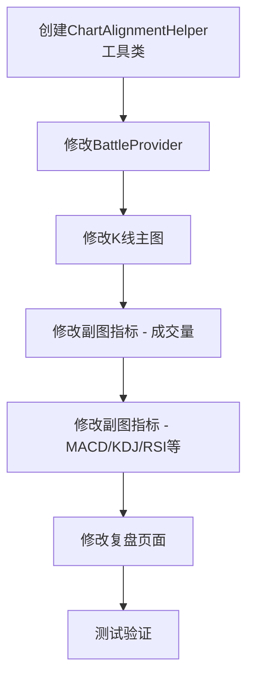

# K线图表与技术指标对齐修复 - 任务规划

> 本文档记录 K线图表与技术指标垂直对齐修复功能的开发任务规划。

**文档版本**：v1.0.0
**创建日期**：2026-05-31
**需求追溯**：REQ-018 - K线图表与技术指标对齐修复
**技术方案**：`docs/features/实战模块/K线与指标对齐修复_技术方案.md`

---

## 1. 任务总览

| 阶段 | 任务数 | 预估工时 | 完成标准 |
|------|--------|---------|----------|
| 工具类创建 | 2 | 1小时 | ChartAlignmentHelper 工具类完成 |
| Provider修改 | 2 | 1.5小时 | 统一数据范围计算方法完成 |
| K线主图修改 | 2 | 2小时 | K线图对齐修复完成 |
| 副图指标修改 | 3 | 3小时 | 所有副图指标对齐修复完成 |
| 复盘页面修改 | 2 | 1小时 | 复盘页面对齐修复完成 |
| 测试验证 | 2 | 1小时 | 对齐效果验证通过 |
| **合计** | **13** | **9.5小时** | |

---

## 2. 任务依赖图

---

## 3. 详细任务清单

### 阶段 1: 工具类创建

#### 任务 1-1: 创建 ChartAlignmentHelper 工具类

**通俗解释**: 创建一个专门用于图表坐标对齐的工具类

**技术方案章节**: 2.3.5 统一坐标转换工具类

**验证标准**:
- 输入: index=5, totalCount=20, chartWidth=400
- 输出: x=130（居中位置）

**关联AC**: AC-001

**预估工时**: 0.5小时

**验收条件**:
- [ ] `indexToX()` 方法正确计算居中 x 坐标
- [ ] `xToIndex()` 方法正确从 x 坐标计算索引
- [ ] `calculateBarWidth()` 方法正确计算柱宽

---

#### 任务 1-2: 添加单元测试验证工具类

**通俗解释**: 为工具类编写测试用例，确保计算正确

**验证标准**:
- 测试 indexToX 边界值
- 测试 xToIndex 边界值
- 测试 barWidth 计算

**预估工时**: 0.5小时

**验收条件**:
- [ ] 所有测试用例通过
- [ ] 边界条件覆盖完整

---

### 阶段 2: 修改 BattleProvider

#### 任务 2-1: 新增 ChartDisplayRange 类

**通俗解释**: 创建一个数据类来统一管理图表显示范围

**技术方案章节**: 2.3.1 统一数据范围计算

**验证标准**:
- 包含 startIndex、dataLength、candleWidth 属性
- 可从 BattleProvider 状态计算

**关联AC**: AC-001

**预估工时**: 0.5小时

**验收条件**:
- [ ] ChartDisplayRange 类创建完成
- [ ] 与现有 BattleState 兼容

---

#### 任务 2-2: 统一所有 display*Data getter 计算逻辑

**通俗解释**: 修改所有指标数据的计算方法，使用统一的计算逻辑

**技术方案章节**: 2.3.1 统一数据范围计算

**验证标准**:
- displayKlineData 和 displayMacdData 返回相同长度的数据
- displayVolumes 和 displayKlineData 返回相同长度的数据

**关联AC**: AC-001, AC-002, AC-003

**预估工时**: 1小时

**验收条件**:
- [ ] 所有 display*Data 方法使用统一计算逻辑
- [ ] 数据长度一致性验证通过

---

### 阶段 3: 修改 K 线主图

#### 任务 3-1: 修改 _CandleStickPainter 统一 x 轴映射

**通俗解释**: 修改 K 线绘制逻辑，使用与副图相同的坐标映射算法

**技术方案章节**: 2.3.3 修改 K 线主图

**验证标准**:
- K 线宽度与副图指标一致
- 初始状态 K 线与指标对齐

**关联AC**: AC-001, AC-006

**预估工时**: 1小时

**验收条件**:
- [ ] K 线宽度计算使用统一算法
- [ ] 初始加载时 K 线与指标对齐

---

#### 任务 3-2: 验证 K 线主图渲染效果

**通俗解释**: 验证修改后的 K 线图在不同数据量下都能正确显示

**验证标准**:
- 显示 20 根 K 线时对齐正确
- 显示 50 根 K 线时对齐正确
- 显示 100 根 K 线时对齐正确

**关联AC**: AC-002, AC-003

**预估工时**: 1小时

**验收条件**:
- [ ] 不同数据量下 K 线宽度正确
- [ ] K 线与副图对齐一致

---

### 阶段 4: 修改副图指标

#### 任务 4-1: 修改成交量图表

**通俗解释**: 修改成交量图表的对齐方式

**技术方案章节**: 2.3.4 修改副图指标

**验证标准**:
- 成交量柱与 K 线精确对齐
- 涨跌颜色正确

**关联AC**: AC-001

**预估工时**: 0.5小时

**验收条件**:
- [ ] 成交量图表使用 center 对齐
- [ ] 柱宽与 K 线一致

---

#### 任务 4-2: 修改 MACD 图表

**通俗解释**: 修改 MACD 图表的对齐方式

**验证标准**:
- MACD 柱、DIF 线、DEA 线与 K 线对齐
- 数据量变化时对齐保持

**关联AC**: AC-001, AC-002

**预估工时**: 0.5小时

**验收条件**:
- [ ] MACD 图表使用 center 对齐
- [ ] 柱状图与线条对齐一致

---

#### 任务 4-3: 修改其他副图指标（KDJ/RSI/BOLL等）

**通俗解释**: 修改 KDJ、RSI、BOLL、DMI、CCI、WR、OBV、DMA、BBI 图表的对齐方式

**验证标准**:
- 所有副图指标与 K 线对齐
- 数据量变化时对齐保持

**关联AC**: AC-001, AC-002, AC-003

**预估工时**: 2小时

**验收条件**:
- [ ] KDJ 图表对齐正确
- [ ] RSI 图表对齐正确
- [ ] BOLL 图表对齐正确
- [ ] DMI/CCI/WR/OBV/DMA/BBI 图表对齐正确

---

### 阶段 5: 修改复盘页面

#### 任务 5-1: 修改 TrainingDetailScreen 图表对齐

**通俗解释**: 修改复盘页面的 K 线图和副图指标，使用与实战页面相同的对齐策略

**验证标准**:
- 复盘页面的 K 线与指标对齐
- 缩放/滑动操作时对齐保持

**关联AC**: AC-008

**预估工时**: 0.5小时

**验收条件**:
- [ ] 复盘页面 K 线图对齐正确
- [ ] 复盘页面副图指标对齐正确

---

#### 任务 5-2: 验证复盘页面多周期支持

**通俗解释**: 验证复盘页面在不同周期下都能正确对齐

**验证标准**:
- 日K周期对齐正确
- 周K周期对齐正确
- 月K周期对齐正确

**关联AC**: AC-005, AC-006, AC-007

**预估工时**: 0.5小时

**验收条件**:
- [ ] 日K周期对齐正确
- [ ] 周K周期对齐正确
- [ ] 月K周期对齐正确

---

### 阶段 6: 测试验证

#### 任务 6-1: 实战页面全场景测试

**通俗解释**: 对实战页面进行全面的对齐测试

**验证标准**:
| 场景 | 操作 | 预期结果 |
|------|------|----------|
| 场景1 | 打开实战页面 | K 线与指标精确对齐 |
| 场景2 | 双指放大 | K 线数量减少，指标同步，位置对齐 |
| 场景3 | 双指缩小 | K 线数量增加，指标同步，位置对齐 |
| 场景4 | 左右滑动 | 数据同步滚动，位置对齐 |
| 场景5 | 切换周期 | 不同周期下均保持对齐 |

**预估工时**: 0.5小时

**验收条件**:
- [ ] 所有测试场景通过
- [ ] 无明显对齐偏差

---

#### 任务 6-2: 复盘页面测试

**通俗解释**: 对复盘页面进行全面的对齐测试

**验证标准**:
| 场景 | 操作 | 预期结果 |
|------|------|----------|
| 场景6 | 打开复盘页面 | K 线与指标精确对齐 |
| 场景7 | 缩放图表 | 对齐保持 |
| 场景8 | 滑动图表 | 对齐保持 |

**预估工时**: 0.5小时

**验收条件**:
- [ ] 所有测试场景通过
- [ ] 无明显对齐偏差

---

## 4. 验证计划

| 检查项 | 关联任务 | 验证方法 |
|--------|---------|---------|
| 工具类正确性 | 1-1, 1-2 | 单元测试验证 |
| 数据范围一致 | 2-2 | 对比 displayKlineData 和 displayMacdData 长度 |
| K线主图对齐 | 3-1, 3-2 | 视觉检查 + 截图对比 |
| 副图指标对齐 | 4-1, 4-2, 4-3 | 视觉检查 + 截图对比 |
| 复盘页面对齐 | 5-1, 5-2 | 视觉检查 + 截图对比 |
| 全场景测试 | 6-1, 6-2 | 执行测试用例 |

---

## 5. 风险提示

| 风险 | 影响 | 应对措施 |
|------|------|----------|
| fl_chart 对齐限制 | 部分对齐效果可能不完美 | 考虑使用自定义 ChartRenderer |
| 性能影响 | 频繁计算可能影响性能 | 添加缓存，避免重复计算 |
| 多周期兼容 | 周K/月K数据量少，对齐难度大 | 针对不同周期使用不同参数 |
| 回归风险 | 修改可能影响现有功能 | 添加单元测试和集成测试 |

---

## 6. 文档版本历史

| 版本 | 日期 | 修改内容 | 修改人 |
|-----|------|--------|-------|
| v1.0 | 2026-05-31 | 初始版本 | AI助手 |

---

*文档版本: v1.0.0*
*创建日期: 2026-05-31*