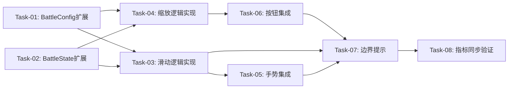

# K线图表交互优化 — 开发任务计划

## 1. 任务概览

**总任务数**：8 个
**预计总工时**：约 240 分钟（约 4 小时）
**开发方法**：TDD — 每个任务按 RED → GREEN → REFACTOR 循环执行

**关键标注**：
- 🔒 阻塞任务：被多个任务依赖，建议优先完成
- ⚠️ 风险任务：技术难度高，可能需要额外时间

### 依赖关系图

### 可并行任务组

| 并行组 | 任务 | 说明 |
|--------|------|------|
| 1 | Task-01, Task-02 | 状态扩展可并行进行，互不依赖 |

---

## 2. 开发任务

### 阶段1：状态层扩展

**阶段完成标准**：BattleConfig 和 BattleState 已正确扩展，配置参数和防抖状态字段就绪

---

#### Task-01: BattleConfig 配置扩展 🔒

**通俗解释**：添加缩放和滑动的配置参数，让程序知道最大/最小显示多少根K线

**做什么**：
- 在 `battle_config.dart` 中添加以下配置字段：
  - `minVisibleKlineCount = 10`
  - `maxVisibleKlineCount = 700`
  - `boundaryDebounceSeconds = 3`
  - `slideStepCount = 5`
  - `zoomFactor = 1.2`

**涉及文件**：
- `lib/features/battle/models/battle_config.dart`

**参考**：技术方案 3.2 → AC-010, AC-011, AC-015

**依赖**：无

**预估工时**：15 分钟

**验证标准**（TDD RED 阶段直接转化为测试用例）：
- [ ] Given BattleConfig 实例，When 访问 minVisibleKlineCount，Then 返回 10
- [ ] Given BattleConfig 实例，When 访问 maxVisibleKlineCount，Then 返回 700
- [ ] Given BattleConfig 实例，When 访问 boundaryDebounceSeconds，Then 返回 3
- [ ] Given BattleConfig 实例，When 访问 slideStepCount，Then 返回 5
- [ ] Given BattleConfig 实例，When 访问 zoomFactor，Then 返回 1.2

---

#### Task-02: BattleState 防抖状态扩展 🔒

**通俗解释**：添加记录边界到达时间的状态，用于实现"3秒内不重复提示"

**做什么**：
- 在 `battle_state.dart` 中添加以下状态字段：
  - `lastLeftBoundaryTime: DateTime?` （默认 null）
  - `lastRightBoundaryTime: DateTime?` （默认 null）
  - `lastZoomBoundaryTime: DateTime?` （默认 null）
- 在 `copyWith` 方法中添加对应的可选参数

**涉及文件**：
- `lib/features/battle/models/battle_state.dart`

**参考**：技术方案 3.1 → AC-008, AC-009, AC-016

**依赖**：无

**预估工时**：20 分钟

**验证标准**（TDD RED 阶段直接转化为测试用例）：
- [ ] Given 新建 BattleState，When 访问 lastLeftBoundaryTime，Then 返回 null
- [ ] Given 新建 BattleState，When 访问 lastRightBoundaryTime，Then 返回 null
- [ ] Given BattleState 有 lastLeftBoundaryTime，When 调用 copyWith 更新，Then 新实例包含新值

---

### 阶段2：核心业务逻辑

**阶段完成标准**：BattleProvider 的滑动和缩放方法已实现，可通过方法调用改变可视范围

---

#### Task-03: 滑动逻辑实现 🔒 ⚠️

**通俗解释**：实现左右滑动查看K线的核心逻辑，包括边界检查

**做什么**：
- 修改 `BattleProvider` 中的 `slideLeft()` 方法：
  - 计算新的 visibleStartIndex
  - 检查是否到达左边界（visibleStartIndex <= 0）
  - 调用防抖检查，返回是否需要提示
- 修改 `slideRight()` 方法：
  - 计算最大可滑动位置（currentDayIndex - visibleKlineCount + 1）
  - 检查是否到达右边界
  - 调用防抖检查，返回是否需要提示
- 调整 visibleStartIndex 保持在有效范围内

**涉及文件**：
- `lib/features/battle/providers/battle_provider.dart`

**参考**：技术方案 4.3 → AC-001, AC-002, AC-014

**依赖**：Task-01, Task-02

**预估工时**：45 分钟

**验证标准**（TDD RED 阶段直接转化为测试用例）：
- [ ] Given visibleStartIndex=50, visibleKlineCount=20, When 调用 slideLeft()，Then visibleStartIndex=45
- [ ] Given visibleStartIndex=0, When 调用 slideLeft()，Then visibleStartIndex=0，返回 shouldAlert=true
- [ ] Given visibleStartIndex=80, currentDayIndex=100, visibleKlineCount=20, When 调用 slideRight()，Then visibleStartIndex=85
- [ ] Given visibleStartIndex=80, currentDayIndex=99, visibleKlineCount=20, When 调用 slideRight()，Then visibleStartIndex=81，返回 shouldAlert=true
- [ ] Given 已到达左边界，When 3秒内再次调用 slideLeft()，Then 返回 shouldAlert=false（防抖生效）

---

#### Task-04: 缩放逻辑实现 🔒 ⚠️

**通俗解释**：实现放大缩小的核心逻辑，保持当前日期始终在最右侧

**做什么**：
- 修改 `zoomIn()` 方法（放大，显示更少K线）：
  - 计算新的 visibleKlineCount = visibleKlineCount / zoomFactor
  - clamp 到 [minVisibleKlineCount, maxVisibleKlineCount]
  - 调整 visibleStartIndex 保持 currentDayIndex 在最右侧
  - 返回是否到达边界
- 修改 `zoomOut()` 方法（缩小，显示更多K线）：
  - 计算新的 visibleKlineCount = visibleKlineCount * zoomFactor
  - clamp 到 [minVisibleKlineCount, maxVisibleKlineCount]
  - 调整 visibleStartIndex 保持 currentDayIndex 在最右侧
  - 返回是否到达边界
- 添加防抖检查逻辑

**涉及文件**：
- `lib/features/battle/providers/battle_provider.dart`

**参考**：技术方案 4.2 → AC-005, AC-006, AC-013, AC-015

**依赖**：Task-01, Task-02

**预估工时**：45 分钟

**验证标准**（TDD RED 阶段直接转化为测试用例）：
- [ ] Given visibleKlineCount=100, currentDayIndex=200, When 调用 zoomIn()，Then visibleKlineCount≈83, currentDayIndex在最右侧
- [ ] Given visibleKlineCount=10, When 调用 zoomIn()，Then visibleKlineCount=10，返回到达上边界
- [ ] Given visibleKlineCount=100, currentDayIndex=200, When 调用 zoomOut()，Then visibleKlineCount≈120, currentDayIndex在最右侧
- [ ] Given visibleKlineCount=700, When 调用 zoomOut()，Then visibleKlineCount=700，返回到达下边界
- [ ] Given 已到达上边界，When 3秒内再次调用 zoomIn()，Then 返回 shouldAlert=false（防抖生效）

---

### 阶段3：UI集成

**阶段完成标准**：用户可以在界面上通过触屏手势和按钮操作K线图表

---

#### Task-05: 触屏手势集成 ⚠️

**通俗解释**：让K线图表区域可以识别左右滑动和双指缩放手势

**做什么**：
- 在 `KlineChartContainer` 中添加 `GestureDetector`：
  - 使用 `onScaleStart`, `onScaleUpdate` 监听双指缩放
  - 使用 `onHorizontalDragStart`, `onHorizontalDragUpdate` 监听水平滑动
  - 根据手势参数判断操作类型
  - 调用 BattleProvider 的 slideLeft/slideRight/zoomIn/zoomOut 方法
- 添加节流逻辑避免高频调用
- 处理手势冲突（滑动 vs 缩放）

**涉及文件**：
- `lib/features/battle/widgets/kline_chart_container.dart`

**参考**：技术方案 4.1 → AC-001, AC-002, AC-003, AC-004

**依赖**：Task-03, Task-04

**预估工时**：60 分钟

**验证标准**（TDD RED 阶段直接转化为测试用例）：
- [ ] Given 手指左滑 100px，visibleKlineCount=50, When 触发 onHorizontalDragUpdate，Then 调用 slideLeft()
- [ ] Given 双指捏合，When 触发 onScaleUpdate 且 scale<1，Then 调用 zoomOut()
- [ ] Given 双指张开，When 触发 onScaleUpdate 且 scale>1，Then 调用 zoomIn()
- [ ] Given 连续快速手势，When 100ms内多次触发，Then 只调用一次 Provider 方法（节流生效）

---

#### Task-06: 控制按钮集成

**通俗解释**：让界面的+-按钮和左右滑动按钮可以正常操作K线图表

**做什么**：
- 更新 `ControlButtons` 组件：
  - 左滑按钮：调用 `ref.read(battleProvider.notifier).slideLeft()`
  - 右滑按钮：调用 `ref.read(battleProvider.notifier).slideRight()`
  - +按钮：调用 `ref.read(battleProvider.notifier).zoomIn()`
  - -按钮：调用 `ref.read(battleProvider.notifier).zoomOut()`
- 从 BattleProvider 获取缩放边界状态，控制按钮样式

**涉及文件**：
- `lib/features/battle/widgets/control_buttons.dart`

**参考**：技术方案 4.1 → AC-005, AC-006

**依赖**：Task-03, Task-04

**预估工时**：30 分钟

**验证标准**（TDD RED 阶段直接转化为测试用例）：
- [ ] Given 点击左滑按钮，When 调用 onPressed，Then 调用 battleProvider.slideLeft()
- [ ] Given 点击右滑按钮，When 调用 onPressed，Then 调用 battleProvider.slideRight()
- [ ] Given 点击+按钮，When 调用 onPressed，Then 调用 battleProvider.zoomIn()
- [ ] Given 点击-按钮，When 调用 onPressed，Then 调用 battleProvider.zoomOut()

---

### 阶段4：边界提示

**阶段完成标准**：用户到达边界时能看到清晰提示，且不会频繁重复提示

---

#### Task-07: 边界提示实现 ⚠️

**通俗解释**：当用户滑动或缩放到极限位置时，界面上显示友好提示

**做什么**：
- 在 `BattleScreen` 中监听边界提示事件：
  - 添加 SnackBar 显示逻辑
  - 使用 ref.listen 监听 BattleProvider 的边界状态
- 实现防抖逻辑：
  - 检查 lastBoundaryTime 是否在防抖时间内
  - 避免重复显示 SnackBar
- 显示提示信息：
  - 左边界："已到达最左边"
  - 右边界："已到达最右边"
  - 缩放上边界："已达到最大放大级别"
  - 缩放下边界："已达到最小缩放级别"

**涉及文件**：
- `lib/features/battle/battle_screen.dart`

**参考**：技术方案 4.4 → AC-008, AC-009, AC-010, AC-011

**依赖**：Task-05, Task-06

**预估工时**：30 分钟

**验证标准**（TDD RED 阶段直接转化为测试用例）：
- [ ] Given 到达左边界，When 调用 slideLeft()，Then 显示 SnackBar "已到达最左边"
- [ ] Given 到达右边界，When 调用 slideRight()，Then 显示 SnackBar "已到达最右边"
- [ ] Given 到达缩放上边界，When 调用 zoomIn()，Then 显示 SnackBar "已达到最大放大级别"
- [ ] Given 到达缩放下边界，When 调用 zoomOut()，Then 显示 SnackBar "已达到最小缩放级别"
- [ ] Given 3秒内重复到达同一边界，When 多次操作，Then SnackBar 只显示一次

---

### 阶段5：指标同步验证

**阶段完成标准**：下方指标图表（成交量、MACD等）与主K线图同步变化

---

#### Task-08: 指标同步验证 ⚠️

**通俗解释**：确保下方的成交量、MACD等图表显示的数据范围与主图完全一致

**做什么**：
- 验证所有指标组件从 BattleProvider 读取数据：
  - VolumeChart
  - MacdChart
  - KDJChart
  - RSIBollChart
  - 其他指标组件
- 确认使用相同的 visibleStartIndex 和 visibleKlineCount
- 测试滑动和缩放后指标数据同步更新

**涉及文件**：
- `lib/features/battle/widgets/volume_chart.dart`
- `lib/features/battle/widgets/macd_chart.dart`
- `lib/features/battle/widgets/kdj_chart.dart`
- `lib/features/battle/widgets/rsi_chart.dart`
- `lib/features/battle/widgets/boll_chart.dart`
- 其他指标组件

**参考**：技术方案 4.5 → AC-007

**依赖**：Task-05, Task-06

**预估工时**：20 分钟

**验证标准**（TDD RED 阶段直接转化为测试用例）：
- [ ] Given visibleStartIndex=100, visibleKlineCount=50, When 渲染 VolumeChart，Then 显示索引100-149的数据
- [ ] Given visibleStartIndex=100, visibleKlineCount=50, When 渲染 MacdChart，Then 显示索引100-149的数据
- [ ] Given 调用 slideLeft() 改变 visibleStartIndex，When 渲染所有指标图表，Then 所有图表同步显示新的数据范围
- [ ] Given 调用 zoomOut() 改变 visibleKlineCount，When 渲染所有指标图表，Then 所有图表同步显示更多数据

---

## 3. AC 覆盖总表

| AC 编号 | 验收标准概述 | 承接任务 | 验证方式 |
|---------|-------------|---------|---------|
| AC-001 | 触屏左滑查看更早数据 | Task-03, Task-05 | 单元测试验证 slideLeft 调用 + 集成测试验证手势响应 |
| AC-002 | 触屏右滑查看更近数据 | Task-03, Task-05 | 单元测试验证 slideRight 调用 + 集成测试验证手势响应 |
| AC-003 | 双指捏合缩小，最多700根 | Task-04, Task-05 | 单元测试验证 zoomOut 边界 + 集成测试验证双指缩放 |
| AC-004 | 双指张开放大，最少10根 | Task-04, Task-05 | 单元测试验证 zoomIn 边界 + 集成测试验证双指缩放 |
| AC-005 | 点击+按钮放大 | Task-04, Task-06 | 单元测试验证 zoomIn + 按钮点击测试 |
| AC-006 | 点击-按钮缩小 | Task-04, Task-06 | 单元测试验证 zoomOut + 按钮点击测试 |
| AC-007 | 指标图表同步变化 | Task-08 | 验证所有指标组件数据与主图一致 |
| AC-008 | 左边界防抖提示，3秒不重复 | Task-03, Task-07 | 单元测试验证防抖逻辑 + SnackBar 显示测试 |
| AC-009 | 右边界防抖提示，3秒不重复 | Task-03, Task-07 | 单元测试验证防抖逻辑 + SnackBar 显示测试 |
| AC-010 | 缩放下边界提示 | Task-04, Task-07 | 单元测试验证 zoomOut 边界 + SnackBar 显示测试 |
| AC-011 | 缩放上边界提示 | Task-04, Task-07 | 单元测试验证 zoomIn 边界 + SnackBar 显示测试 |
| AC-012 | 下一步后自动调整 | Task-03 | 验证 nextDay 后 currentDayIndex 在最右侧 |
| AC-013 | 缩放后当前日期在最右 | Task-04 | 单元测试验证 visibleStartIndex 计算 |
| AC-014 | 滑动不超过当前训练日 | Task-03 | 单元测试验证右边界检查 |
| AC-015 | 缩放数量在10-700之间 | Task-04 | 单元测试验证 clamp 逻辑 |
| AC-016 | 边界提示防抖3秒 | Task-02, Task-03, Task-04 | 单元测试验证时间检查逻辑 |

---

## 4. 完成定义

> 所有任务完成后，功能整体交付前的最终确认。

- [ ] 所有任务的验证标准（测试用例）通过
- [ ] AC 覆盖总表中每条 AC 的验证方式已执行并通过
- [ ] 触屏左右滑动操作流畅，无明显卡顿
- [ ] 双指缩放操作流畅，响应时间 < 100ms
- [ ] +-按钮和左右按钮点击响应正常
- [ ] 边界提示显示正确，防抖机制生效
- [ ] 指标图表（成交量、MACD、KDJ、RSI、BOLL等）与主K线图数据范围一致
- [ ] 缩放时 currentDayIndex 始终在最右侧
- [ ] 右滑不会超过当前训练日线
- [ ] 应用无崩溃、无异常日志

---

## 附录：任务依赖矩阵

| 任务 | Task-01 | Task-02 | Task-03 | Task-04 | Task-05 | Task-06 | Task-07 | Task-08 |
|------|---------|---------|---------|---------|---------|---------|---------|---------|
| Task-01 | - | | | | | | | |
| Task-02 | | - | | | | | | |
| Task-03 | 🔒 | 🔒 | - | | | | | |
| Task-04 | 🔒 | 🔒 | | - | | | | |
| Task-05 | | | 🔒 | 🔒 | - | | | |
| Task-06 | | | 🔒 | 🔒 | | - | | |
| Task-07 | | | | | 🔒 | 🔒 | - | |
| Task-08 | | | | | 🔒 | 🔒 | | - |

🔒 = 前置依赖

---

## 附录：变更记录

| 日期 | 变更内容 | 原因 |
|------|---------|------|
| 2026-05-31 | 初始版本 | K线图表交互优化任务规划 |
