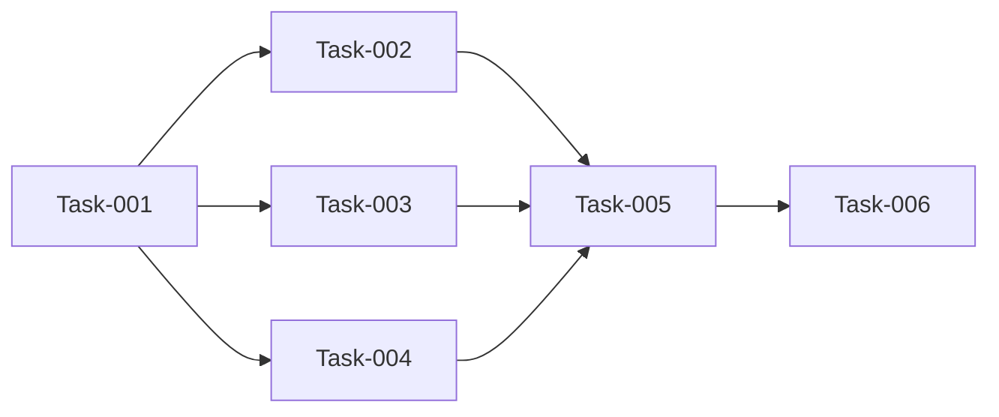

# K线展示优化 — 开发任务计划

> **版本**: v1.0
> **创建日期**: 2026-05-27
> **最后更新**: 2026-05-27
> **状态**: 已完成

---

## 1. 任务概览

**总任务数**：6 个
**预计总工时**：90 分钟（约 1.5 小时）
**开发方法**：TDD — 每个任务按 RED → GREEN → REFACTOR 循环执行

**关键标注**：
- 🔒 阻塞任务：被多个任务依赖，建议优先完成
- ⚠️ 风险任务：技术难度高，可能需要额外时间

### 依赖关系图

### 可并行任务组

| 并行组 | 任务 | 说明 |
|--------|------|------|
| 1 | Task-002, Task-003, Task-004 | 均依赖 Task-001，可依次串行执行，也可按优先级选择先做哪个 |
| 2 | Task-002 和 Task-003 | 互相独立，可并行开发 |
| 3 | Task-004 和 Task-005 | Task-004 完成后才可开始 Task-005 |

---

## 2. 开发任务

> 按垂直切片组织。每个阶段对应一个可独立运行和验证的用户行为。切片内部的任务按技术层自然顺序排列。

### 阶段一：K线图表组件参数扩展

**阶段完成标准**：KlineChart 组件支持传入开盘价和成本价参数

---

#### Task-001: 扩展 KlineChart 组件参数

**通俗解释**：让 K线图表组件能接收开盘价和成本价数据

**做什么**：
1. 在 `KlineChart` 类中添加 `currentOpenPrice?` 可选参数
2. 在 `KlineChart` 类中添加 `positionCost?` 可选参数
3. 在 `CandleStickChart` 中透传这些参数
4. 在 `CandleStickChartPainter` 中添加对应字段

**涉及文件**：`lib/features/training/widgets/kline_chart.dart`

**参考**：技术方案 6.1 → AC-002, AC-003, AC-004, AC-006

**依赖**：无

**预估工时**：15 分钟

**验证标准**（TDD RED 阶段直接转化为测试用例）：
- [ ] `KlineChart(openPrice: 100.0)` 可正常构造
- [ ] `KlineChart(positionCost: 95.0)` 可正常构造
- [ ] `CandleStickChartPainter` 构造函数可接收 `currentOpenPrice` 和 `positionCost`
- [ ] 参数为 null 时图表仍可正常渲染

---

### 阶段二：K线渲染质量优化

**阶段完成标准**：K线蜡烛图边缘清晰锐利，无模糊锯齿

---

#### Task-002: 优化 K线渲染质量

**通俗解释**：让 K线蜡烛图看起来更清晰，边缘更锐利

**做什么**：
1. 确保 `_CandleStickPainter.paint()` 中所有 Paint 对象开启 `isAntiAlias`
2. 检查蜡烛图边框粗细是否适中（当前 `strokeWidth: 1`）
3. 检查均线线条粗细是否适中（当前 `strokeWidth: 1.5`）

**涉及文件**：`lib/features/training/widgets/kline_chart.dart`

**参考**：技术方案 5.2 → AC-001, AC-012

**依赖**：Task-001

**预估工时**：15 分钟

**验证标准**（TDD RED 阶段直接转化为测试用例）：
- [ ] 放大 K线图时蜡烛图边缘无锯齿
- [ ] 均线连接处平滑无毛刺
- [ ] Paint 对象均设置 `isAntiAlias = true`

---

### 阶段三：开盘价虚线功能

**阶段完成标准**：K线图上显示蓝色横向虚线，标注当日开盘价

---

#### Task-003: 实现开盘价虚线绘制

**通俗解释**：在 K线图上画一条蓝色虚线，显示今天的开盘价

**做什么**：
1. 在 `_CandleStickPainter` 中新增 `_drawHorizontalDashedLine()` 私有方法
2. 在 `paint()` 方法中调用该方法绘制开盘价虚线
3. 虚线颜色使用蓝色 #3B82F6
4. 虚线样式：dashWidth=5, dashSpace=3, strokeWidth=1.5
5. 虚线贯穿整个图表宽度

**涉及文件**：`lib/features/training/widgets/kline_chart.dart`

**参考**：技术方案 5.3 → AC-002, AC-013

**依赖**：Task-001

**预估工时**：20 分钟

**验证标准**（TDD RED 阶段直接转化为测试用例）：
- [ ] 传入 `currentOpenPrice: 100.0` 时，图表显示蓝色虚线
- [ ] 虚线颜色为 #3B82F6
- [ ] 虚线为横向，贯穿整个图表宽度
- [ ] 虚线位置对应正确的价格坐标

---

### 阶段四：成本价虚线功能

**阶段完成标准**：有持仓时 K线图上显示红色横向虚线标注成本价

---

#### Task-004: 实现成本价虚线绘制

**通俗解释**：有持仓时在 K线图上画一条红色虚线，显示持仓成本价

**做什么**：
1. 在 `paint()` 方法中判断 `positionCost` 是否有效（不为 null 且持仓数量 > 0）
2. 条件成立时调用 `_drawHorizontalDashedLine()` 绘制成本价虚线
3. 虚线颜色使用红色 #EF4444
4. 持仓数量为 0 时不显示该虚线

**涉及文件**：`lib/features/training/widgets/kline_chart.dart`

**参考**：技术方案 5.3 → AC-004, AC-006, AC-009, AC-014

**依赖**：Task-001

**预估工时**：15 分钟

**验证标准**（TDD RED 阶段直接转化为测试用例）：
- [ ] `positionCost: 95.0` 时显示红色虚线
- [ ] 虚线颜色为 #EF4444
- [ ] 持仓数量为 0 时不显示红色虚线
- [ ] 无持仓时图表仍可正常渲染

---

### 阶段五：买卖点简化显示

**阶段完成标准**：买卖点标记仅显示 B/S 标识，无价格和数量信息

---

#### Task-005: 简化买卖点标记显示

**通俗解释**：买卖点标记只显示 B 或 S 字母，不再显示价格和数量

**做什么**：
1. 修改 `_drawTradePoints()` 方法
2. 移除价格和数量信息的文字绘制
3. 仅保留 "B" (Buy) 或 "S" (Sell) 标识
4. 买入标识使用红色 (#EF4444)，卖出标识使用绿色 (#34C759)
5. 添加从价格点向上/下的垂直虚线延伸

**涉及文件**：`lib/features/training/widgets/kline_chart.dart`

**参考**：技术方案 5.4 → AC-007, AC-008, AC-015

**依赖**：Task-002, Task-003, Task-004

**预估工时**：15 分钟

**验证标准**（TDD RED 阶段直接转化为测试用例）：
- [ ] 买入点显示红色 "B"，不显示价格
- [ ] 卖出点显示绿色 "S"，不显示价格
- [ ] 买卖点有垂直虚线向上/下延伸
- [ ] 买卖点位置与 K线对齐

---

### 阶段六：实战页面集成

**阶段完成标准**：实战页面正确传递开盘价和成本价参数，买卖后成本价动态更新

---

#### Task-006: BattleScreen 传递参数并实现成本计算

**通俗解释**：让实战页面正确显示开盘价虚线和成本价虚线，买卖后成本自动更新

**做什么**：
1. 在 `BattleScreen` 的 `KlineChart` 调用处传入 `currentOpenPrice`
   - 从 `_allKlineData[_currentDayIndex].open` 获取
2. 在 `KlineChart` 调用处传入 `positionCost`（`_positionCost`）
3. 实现 `_calculatePositionCost()` 方法
   - 买入时：`(旧成本 × 旧数量 + 新价格 × 新数量) / (旧数量 + 新数量)`
   - 卖出时：保持成本不变
4. 在 `_executeBuy()` 中调用成本计算方法
5. 确保清仓时 `_positionCost` 重置为 0

**涉及文件**：`lib/features/battle/battle_screen.dart`

**参考**：技术方案 5.1, 6.2 → AC-003, AC-005, AC-010, AC-011

**依赖**：Task-003, Task-004

**预估工时**：20 分钟

**验证标准**（TDD RED 阶段直接转化为测试用例）：
- [ ] 开盘价虚线随 `_currentDayIndex` 更新而移动
- [ ] 买入 100 股 @ 100 元后，成本价计算正确
- [ ] 再买入 100 股 @ 110 元后，成本价 = 105 元
- [ ] 卖出 100 股后，成本价保持 105 元
- [ ] 清仓后红色成本价虚线不显示

---

## 3. AC 覆盖总表

| AC 编号 | 验收标准概述 | 承接任务 | 验证方式 |
|---------|-------------|---------|---------|
| AC-001 | K线图表清晰锐利 | Task-002 | 视觉验证蜡烛图边缘 |
| AC-002 | 开盘价虚线显示 | Task-003 | 蓝色虚线显示 |
| AC-003 | 开盘价虚线动态更新 | Task-006 | 点击下一步后虚线移动 |
| AC-004 | 成本价虚线显示 | Task-004 | 红色虚线显示 |
| AC-005 | 成本价动态计算 | Task-006 | 买入后成本重新计算 |
| AC-006 | 成本价虚线隐藏 | Task-004 | 清仓后虚线消失 |
| AC-007 | 买卖点简化显示 | Task-005 | 仅显示 B/S |
| AC-008 | 买卖点虚线延展 | Task-005 | 垂直虚线存在 |
| AC-009 | 无持仓时成本线隐藏 | Task-004 | 初始状态无红色虚线 |
| AC-010 | 多次买卖后成本计算正确 | Task-006 | 多次交易后成本验证 |
| AC-011 | 部分清仓后成本线仍显示 | Task-004, Task-006 | 部分卖出后仍有虚线 |
| AC-012 | K线渲染质量验证 | Task-002 | Paint.isAntiAlias = true |
| AC-013 | 开盘价虚线样式验证 | Task-003 | 颜色 #3B82F6 |
| AC-014 | 成本价虚线样式验证 | Task-004 | 颜色 #EF4444 |
| AC-015 | 买卖点标记样式验证 | Task-005 | B/S 标识正确颜色 |

---

## 4. 完成定义

> 所有任务完成后，功能整体交付前的最终确认。

- [x] Task-001 验证通过：KlineChart 组件参数扩展完成
- [x] Task-002 验证通过：K线渲染质量优化完成
- [x] Task-003 验证通过：开盘价虚线功能正常
- [x] Task-004 验证通过：成本价虚线功能正常
- [x] Task-005 验证通过：买卖点简化显示正常
- [x] Task-006 验证通过：实战页面集成正常
- [x] AC 覆盖总表中所有 AC 均已验证通过
- [x] 实战页面进入后 K线图清晰锐利
- [x] 开盘价虚线（蓝色）正常显示
- [x] 持仓时成本价虚线（红色）正常显示
- [x] 清仓后成本价虚线消失
- [x] 买卖点仅显示 B/S 标识

---

### 增量任务：买卖点样式优化

#### Task-007: 调整买卖点显示位置和虚线颜色

**通俗解释**：B/S标识显示在垂直虚线的尽头，虚线颜色统一为蓝色

**做什么**：
1. 修改 `_drawTradePoints()` 中虚线颜色为固定蓝色 (#3B82F6)
2. B/S标识显示在垂直虚线的上方（买入）或下方（卖出）尽头
3. 确保虚线长度不超过K线区域边界

**涉及文件**：`lib/features/training/widgets/kline_chart.dart`

**参考**：需求文档 BR-008, BR-009 → AC-015

**依赖**：Task-005

**预估工时**：10 分钟

**验证标准**：
- [x] 垂直虚线颜色为蓝色 (#3B82F6)
- [x] 买入点红色B显示在虚线顶端（图表顶部）
- [x] 卖出点绿色S显示在虚线底端（图表底部）
- [x] 虚线长度不超过K线区域边界

---

## 附录：变更记录

| 日期 | 变更内容 | 原因 |
|------|---------|------|
| 2026-05-27 | 初始版本，创建任务规划 | K线展示优化功能开发计划 |
| 2026-05-27 | 完成所有开发任务 | K线展示优化功能实现完成 |
| 2026-05-27 | 新增增量任务 Task-007：调整买卖点显示位置和虚线颜色 | 用户反馈优化需求 |
