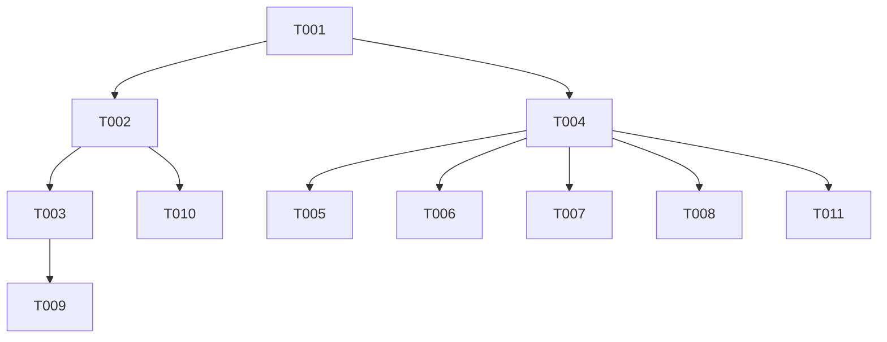

# 买入卖出仓位设置功能任务规划

## 1. 任务概述

根据需求文档和技术方案，本功能需要实现买入/卖出弹窗的仓位快捷选择功能，包括仓位按钮展示、数学计算和仓位设置弹窗。

## 2. 任务拆分

### 阶段一：基础功能实现

| 任务编号 | 任务名称 | 验证标准 | 通俗解释 | 关联AC | 依赖任务 |
| :--- | :--- | :--- | :--- | :--- | :--- |
| T001 | 创建PositionItem数据类 | 类包含id、label、ratio三个字段，支持copyWith方法 | 定义仓位数据结构 | AC-011~018 | 无 |
| T002 | 修改_TradeDialog仓位按钮顺序 | 按钮按全仓、1/2仓、1/3仓、1/4仓、2/3仓、编辑顺序显示 | 用户打开交易弹窗能按新顺序看到仓位按钮 | AC-001, AC-002 | T001 |
| T003 | 实现仓位数学计算逻辑 | 点击各仓位按钮正确计算对应数量，按100股取整 | 用户点击仓位按钮自动填充正确数量 | AC-003~010 | T002 |
| T004 | 创建_PositionSettingDialog弹窗组件 | 弹窗包含买入/卖出标签页、仓位列表、添加/删除按钮 | 用户点击编辑按钮能打开仓位设置弹窗 | AC-011, AC-012 | T001 |
| T005 | 实现拖动排序功能 | 拖动仓位按钮能改变顺序 | 用户可自定义仓位顺序 | AC-013 | T004 |
| T006 | 实现添加/删除仓位功能 | 点击+添加新仓位（≤12），点击×删除（≥1） | 用户可自定义仓位数量和内容 | AC-014, AC-015 | T004 |
| T007 | 实现默认值重置和保存功能 | 点击默认值恢复初始配置，点击保存关闭弹窗 | 用户可恢复默认配置并保存 | AC-016, AC-017 | T004 |
| T008 | 实现"买入时不弹确认框"选项 | 复选框状态可切换 | 用户可选择买入时是否跳过确认 | AC-018 | T004 |

### 阶段二：测试与验证

| 任务编号 | 任务名称 | 验证标准 | 通俗解释 | 关联AC | 依赖任务 |
| :--- | :--- | :--- | :--- | :--- | :--- |
| T009 | 单元测试：仓位计算 | 各比例计算结果正确，按100股取整 | 验证数学计算逻辑正确 | AC-003~010 | T003 |
| T010 | 组件测试：仓位按钮顺序 | 渲染顺序正确 | 验证UI展示符合预期 | AC-001, AC-002 | T002 |
| T011 | 组件测试：弹窗功能 | 编辑弹窗正常打开和关闭 | 验证弹窗交互正常 | AC-011 | T004 |

## 3. 依赖关系图

## 4. 关键路径

| 任务编号 | 任务名称 | 预估工时 | 备注 |
| :--- | :--- | :--- | :--- |
| T001 | 创建PositionItem数据类 | 0.5小时 | 简单数据类 |
| T002 | 修改仓位按钮顺序 | 0.5小时 | 修改现有代码 |
| T003 | 实现仓位数学计算 | 0.5小时 | 增强现有方法 |
| T004 | 创建_PositionSettingDialog组件 | 2小时 | ⚠️ 技术难度较高 |
| T005 | 实现拖动排序 | 1小时 | 使用Draggable组件 |
| T006 | 实现添加/删除仓位 | 0.5小时 | 简单状态操作 |
| T007 | 实现默认值重置和保存 | 0.5小时 | 简单状态操作 |
| T008 | 实现不弹确认框选项 | 0.5小时 | 简单状态操作 |
| T009 | 单元测试 | 1小时 | 覆盖所有比例计算 |
| T010 | 组件测试-按钮顺序 | 0.5小时 | 简单UI验证 |
| T011 | 组件测试-弹窗功能 | 0.5小时 | 验证弹窗交互 |

**总预估工时**: 8小时

## 5. 测试验证计划

### 5.1 单元测试验证

| 测试项 | 输入 | 预期输出 | 关联任务 |
| :--- | :--- | :--- | :--- |
| 全仓计算 | ratio=1.0 | 数量=最大可交易数量 | T003 |
| 1/2仓计算 | ratio=0.5 | 数量=最大数量×0.5 | T003 |
| 1/3仓计算 | ratio=1/3 | 数量=最大数量×1/3 | T003 |
| 1/4仓计算 | ratio=0.25 | 数量=最大数量×0.25 | T003 |
| 2/3仓计算 | ratio=2/3 | 数量=最大数量×2/3 | T003 |
| 按100股取整 | 计算结果=156 | 结果=100 | T003 |
| 数量限制 | 计算结果>maxQuantity | 结果=maxQuantity | T003 |

### 5.2 组件测试验证

| 测试项 | 操作步骤 | 预期结果 | 关联任务 |
| :--- | :--- | :--- | :--- |
| 仓位按钮顺序 | 打开买入弹窗 | 按钮按全仓、1/2仓、1/3仓、1/4仓、2/3仓、编辑顺序显示 | T002 |
| 编辑按钮点击 | 点击编辑按钮 | 弹出仓位设置弹窗 | T004 |
| 标签页切换 | 点击卖出仓位标签 | 显示卖出仓位配置 | T004 |
| 拖动排序 | 拖动1/2仓按钮到全仓前面 | 顺序变为1/2仓、全仓、1/3仓... | T005 |
| 添加仓位 | 点击+按钮 | 添加新仓位（1/N仓格式） | T006 |
| 删除仓位 | 点击×按钮 | 删除该仓位 | T006 |
| 重置默认值 | 点击默认值按钮 | 恢复默认5个仓位 | T007 |
| 保存配置 | 点击保存按钮 | 弹窗关闭 | T007 |

### 5.3 端到端验证

| 测试项 | 操作步骤 | 预期结果 | 关联AC |
| :--- | :--- | :--- | :--- |
| 买入全仓 | 打开买入弹窗，点击全仓 | 数量输入框填充最大可买数量 | AC-004 |
| 买入1/2仓 | 打开买入弹窗，点击1/2仓 | 数量输入框填充最大数量的一半 | AC-005 |
| 卖出全仓 | 打开卖出弹窗，点击全仓 | 数量输入框填充全部持仓 | AC-004 |
| 卖出1/3仓 | 打开卖出弹窗，点击1/3仓 | 数量输入框填充持仓的1/3 | AC-006 |

## 6. 验收标准追踪

| AC编号 | 描述 | 覆盖任务 | 状态 |
| :--- | :--- | :--- | :--- |
| AC-001 | 买入页面仓位行按顺序展示 | T002 | ✅ |
| AC-002 | 卖出页面仓位行按顺序展示 | T002 | ✅ |
| AC-003 | 点击仓位按钮自动计算数量 | T003 | ✅ |
| AC-004 | 全仓 = 1.0 | T003 | ✅ |
| AC-005 | 1/2仓 = 0.5 | T003 | ✅ |
| AC-006 | 1/3仓 = 1/3 | T003 | ✅ |
| AC-007 | 1/4仓 = 0.25 | T003 | ✅ |
| AC-008 | 2/3仓 = 2/3 | T003 | ✅ |
| AC-009 | 买入数量按100股取整 | T003 | ✅ |
| AC-010 | 卖出数量按100股取整 | T003 | ✅ |
| AC-011 | 点击编辑弹出设置弹窗 | T004 | ✅ |
| AC-012 | 买入/卖出标签页切换 | T004 | ✅ |
| AC-013 | 拖动排序 | T005 | ✅ |
| AC-014 | 添加新仓位 | T006 | ✅ |
| AC-015 | 删除仓位 | T006 | ✅ |
| AC-016 | 重置默认值 | T007 | ✅ |
| AC-017 | 保存配置 | T007 | ✅ |
| AC-018 | 买入时不弹确认框选项 | T008 | ✅ |

## 7. 风险评估

| 风险点 | 风险等级 | 影响 | 缓解措施 |
| :--- | :--- | :--- | :--- |
| 拖动排序实现复杂 | 中 | 可能导致UI卡顿或排序错误 | 使用Flutter原生Draggable组件 |
| 数学计算精度问题 | 低 | 仓位比例计算可能有精度损失 | 使用double类型，取整后验证 |
| 边界情况未处理 | 低 | 仓位数量边界可能出错 | 添加边界检查 |

## 8. 里程碑

| 里程碑 | 完成条件 | 预计时间 |
| :--- | :--- | :--- |
| 基础功能完成 | T001-T008完成 | 6小时 |
| 测试验证完成 | T009-T011完成 | 2小时 |
| 功能上线 | 所有测试通过 | 8小时 |
