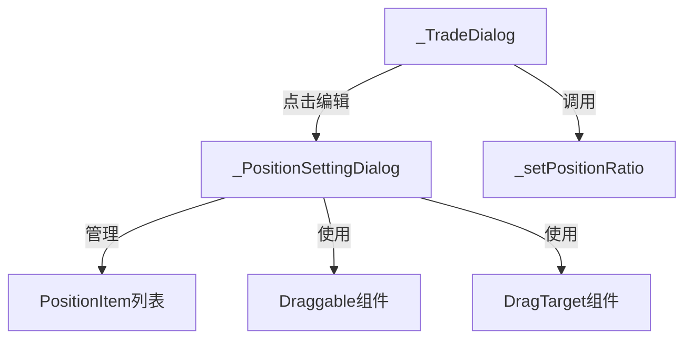

# 买入卖出仓位设置功能技术方案

## 1. 需求分析

### 1.1 需求概述

根据需求文档，本功能需要实现：
1. 买入/卖出弹窗中展示仓位快捷选择按钮（全仓、1/2仓、1/3仓、1/4仓、2/3仓、编辑）
2. 点击仓位按钮自动计算并填充对应数量
3. 点击编辑按钮弹出仓位设置弹窗，支持拖动排序、添加删除仓位等功能

### 1.2 AC 覆盖总表

| AC编号 | 需求描述 | 技术实现方式 |
| :--- | :--- | :--- |
| AC-001 | 买入页面仓位行按顺序展示 | 修改_TradeDialog的build方法 |
| AC-002 | 卖出页面仓位行按顺序展示 | 修改_TradeDialog的build方法 |
| AC-003 | 点击仓位按钮自动计算数量 | _setPositionRatio方法 |
| AC-004 | 全仓 = 1.0 | 传入ratio=1.0 |
| AC-005 | 1/2仓 = 0.5 | 传入ratio=0.5 |
| AC-006 | 1/3仓 = 1/3 | 传入ratio=1/3 |
| AC-007 | 1/4仓 = 0.25 | 传入ratio=0.25 |
| AC-008 | 2/3仓 = 2/3 | 传入ratio=2/3 |
| AC-009 | 买入数量按100股取整 | _setPositionRatio方法中处理 |
| AC-010 | 卖出数量按100股取整 | _setPositionRatio方法中处理 |
| AC-011 | 点击编辑弹出设置弹窗 | _showPositionSettingDialog方法 |
| AC-012 | 买入/卖出标签页切换 | _PositionSettingDialog组件 |
| AC-013 | 拖动排序 | Draggable + DragTarget组件 |
| AC-014 | 添加新仓位 | _addPosition方法 |
| AC-015 | 删除仓位 | _removePosition方法 |
| AC-016 | 重置默认值 | _resetToDefault方法 |
| AC-017 | 保存配置 | _savePositions方法 |
| AC-018 | 买入时不弹确认框选项 | _skipConfirm状态 |

## 2. 技术方案

### 2.1 数据模型

#### 2.1.1 PositionItem 类

```dart
class PositionItem {
  final String id;        // 唯一标识
  final String label;     // 显示标签（如"1/2仓"）
  final double ratio;     // 仓位比例（如0.5）
}
```

**字段说明**：
- `id`: 用于唯一标识每个仓位配置
- `label`: 用户可见的仓位名称
- `ratio`: 仓位比例，用于计算具体数量

### 2.2 核心组件

#### 2.2.1 _TradeDialog 组件扩展

**修改内容**：
- 调整仓位按钮顺序为：全仓、1/2仓、1/3仓、1/4仓、2/3仓、编辑
- 添加编辑按钮，点击弹出仓位设置弹窗

**新增方法**：
- `_showPositionSettingDialog()`: 打开仓位设置弹窗

**现有方法增强**：
- `_setPositionRatio(double ratio)`: 支持所有比例计算

#### 2.2.2 _PositionSettingDialog 组件（新增）

**功能特性**：
- 买入仓位/卖出仓位标签页切换
- 拖动排序支持（使用Flutter Draggable/DragTarget）
- 添加/删除仓位按钮
- 默认值重置
- 保存功能
- "买入时不弹确认框"选项

### 2.3 业务逻辑

#### 2.3.1 仓位数量计算

**买入场景**（BR-001）：
```
maxBuy = (accountBalance / currentPrice / 100).floor() * 100
quantity = (maxBuy * ratio).floorToDouble()
quantity = (quantity / 100).floor() * 100  // 按100股取整
```

**卖出场景**（BR-002）：
```
quantity = (positionQuantity * ratio).floorToDouble()
quantity = (quantity / 100).floor() * 100  // 按100股取整
```

#### 2.3.2 仓位配置管理

```dart
// 默认买入仓位配置
List<PositionItem> _buyPositions = [
  PositionItem(id: '1', label: '全仓', ratio: 1.0),
  PositionItem(id: '2', label: '1/2仓', ratio: 1 / 2),
  PositionItem(id: '3', label: '1/3仓', ratio: 1 / 3),
  PositionItem(id: '4', label: '1/4仓', ratio: 1 / 4),
  PositionItem(id: '5', label: '2/3仓', ratio: 2 / 3),
];

// 默认卖出仓位配置（与买入相同）
List<PositionItem> _sellPositions = [..._buyPositions];
```

### 2.4 界面设计

#### 2.4.1 仓位按钮行

```
Row(
  children: [
    Text('仓位:'),
    ElevatedButton(onPressed: () => _setPositionRatio(1), child: Text('全仓')),
    ElevatedButton(onPressed: () => _setPositionRatio(1/2), child: Text('1/2仓')),
    ElevatedButton(onPressed: () => _setPositionRatio(1/3), child: Text('1/3仓')),
    ElevatedButton(onPressed: () => _setPositionRatio(1/4), child: Text('1/4仓')),
    ElevatedButton(onPressed: () => _setPositionRatio(2/3), child: Text('2/3仓')),
    ElevatedButton(onPressed: _showPositionSettingDialog, child: Text('编辑')),
  ],
)
```

#### 2.4.2 仓位设置弹窗布局

```
┌─────────────────────────────────────┐
│         仓位设置        [×]          │
├─────────────────────────────────────┤
│  ┌─────────┬─────────┐              │
│  │ 买入仓位 │ 卖出仓位 │              │
│  └────┬────┴────┬────┘              │
│       │         │                   │
│  选中状态      未选中                │
├─────────────────────────────────────┤
│ 拖动按钮可以排序，最多可拥有12个仓...  │
├─────────────────────────────────────┤
│  [全仓 ×] [1/2仓 ×] [1/3仓 ×]       │
│  [1/4仓 ×] [2/3仓 ×] [+]            │
├─────────────────────────────────────┤
│  ☐ 买入时不弹确认框                   │
├─────────────────────────────────────┤
│  [默认值]      [保存买入仓位]        │
└─────────────────────────────────────┘
```

### 2.5 组件依赖关系



## 3. 数据库与存储

### 3.1 存储方案

本功能的仓位配置采用**内存存储**方案，原因如下：
1. 配置数据量小（最多12个仓位）
2. 配置变更不频繁
3. 重启后恢复默认配置可接受

**后续扩展方案**：如需要持久化存储，可将配置存入SharedPreferences或数据库。

### 3.2 数据结构

| 数据项 | 类型 | 说明 |
| :--- | :--- | :--- |
| buyPositions | List\<PositionItem\> | 买入仓位配置列表 |
| sellPositions | List\<PositionItem\> | 卖出仓位配置列表 |
| skipConfirm | bool | 买入时是否跳过确认框 |

## 4. API 接口

本功能不涉及后端 API 调用，所有逻辑均在前端完成。

## 5. 错误处理与边界情况

### 5.1 边界情况处理

| 边界情况 | 处理方式 |
| :--- | :--- |
| 仓位数量 = 1 | 禁止删除操作 |
| 仓位数量 = 12 | 禁止添加操作 |
| 计算结果 < 100 | 数量设为0（不允许买入/卖出） |
| 账户余额为0（买入） | 所有仓位按钮计算结果为0 |
| 持仓数量为0（卖出） | 所有仓位按钮计算结果为0 |

### 5.2 异常处理

```dart
// 在_setPositionRatio中处理边界情况
quantity = quantity.clamp(0, maxQuantity);
```

## 6. 代码安全性

### 6.1 注意事项

| 风险点 | 风险描述 | 关联模块 |
| :--- | :--- | :--- |
| 数值溢出 | 仓位比例计算可能导致数值异常 | _setPositionRatio |
| 空值引用 | positionQuantity可能为null | _setPositionRatio |
| 越界访问 | 仓位列表索引越界 | _removePosition, _movePosition |

### 6.2 解决方案

| 风险点 | 解决方案 |
| :--- | :--- |
| 数值溢出 | 使用clamp方法限制数量范围 |
| 空值引用 | 使用??运算符提供默认值 |
| 越界访问 | 操作前检查列表长度和索引范围 |

## 7. 测试方案

### 7.1 单元测试

| 测试项 | 测试方法 | 预期结果 |
| :--- | :--- | :--- |
| 全仓计算 | 调用_setPositionRatio(1) | 返回最大可交易数量 |
| 1/2仓计算 | 调用_setPositionRatio(0.5) | 返回最大数量的一半 |
| 1/3仓计算 | 调用_setPositionRatio(1/3) | 返回最大数量的1/3 |
| 1/4仓计算 | 调用_setPositionRatio(0.25) | 返回最大数量的1/4 |
| 2/3仓计算 | 调用_setPositionRatio(2/3) | 返回最大数量的2/3 |
| 按100股取整 | 计算结果非100倍数 | 结果被取整为100倍数 |
| 数量限制 | 计算结果超过maxQuantity | 结果被限制为maxQuantity |

### 7.2 组件测试

| 测试项 | 测试方法 | 预期结果 |
| :--- | :--- | :--- |
| 仓位按钮顺序 | 渲染_TradeDialog | 按钮按全仓、1/2仓、1/3仓、1/4仓、2/3仓、编辑顺序显示 |
| 编辑按钮点击 | 点击编辑按钮 | 弹出_PositionSettingDialog |
| 拖动排序 | 拖动仓位按钮 | 仓位顺序更新 |
| 添加仓位 | 点击+按钮（仓位<12） | 添加新仓位 |
| 删除仓位 | 点击×按钮（仓位>1） | 删除该仓位 |
| 重置默认值 | 点击默认值按钮 | 恢复默认配置 |

## 8. 部署与集成

### 8.1 依赖检查

确保项目已引入以下依赖：
- Flutter SDK (>=3.0.0)
- 无需新增第三方依赖

### 8.2 集成方式

1. 在 battle_screen.dart 中添加 PositionItem 类
2. 在 battle_screen.dart 中添加 _PositionSettingDialog 组件
3. 修改 _TradeDialog 的 build 方法，调整仓位按钮顺序
4. 在 _TradeDialogState 中添加 _showPositionSettingDialog 方法

## 9. 代码风格与规范

### 9.1 命名规范

| 类型 | 命名规则 | 示例 |
| :--- | :--- | :--- |
| 类名 | PascalCase | PositionItem, _PositionSettingDialog |
| 方法名 | camelCase | _setPositionRatio, _showPositionSettingDialog |
| 变量名 | camelCase | _buyPositions, _sellPositions |
| 常量名 | SCREAMING_CASE | 无 |

### 9.2 代码结构

```
lib/
└── features/
    └── battle/
        └── battle_screen.dart
            ├── PositionItem (数据类)
            ├── _TradeDialog (交易弹窗，已存在，需修改)
            │   └── _TradeDialogState
            │       ├── _setPositionRatio()
            │       └── _showPositionSettingDialog() (新增)
            └── _PositionSettingDialog (新增)
                └── _PositionSettingDialogState
                    ├── _removePosition()
                    ├── _addPosition()
                    ├── _movePosition()
                    └── _resetToDefault()
```

## 10. 性能优化

### 10.1 优化策略

| 优化点 | 策略 |
| :--- | :--- |
| 避免重复计算 | 缓存计算结果 |
| 减少状态更新 | 合理使用setState |
| 组件复用 | 提取公共组件 |

### 10.2 注意事项

- 仓位配置数据量小，无需额外优化
- 拖动排序使用Flutter原生组件，性能良好
