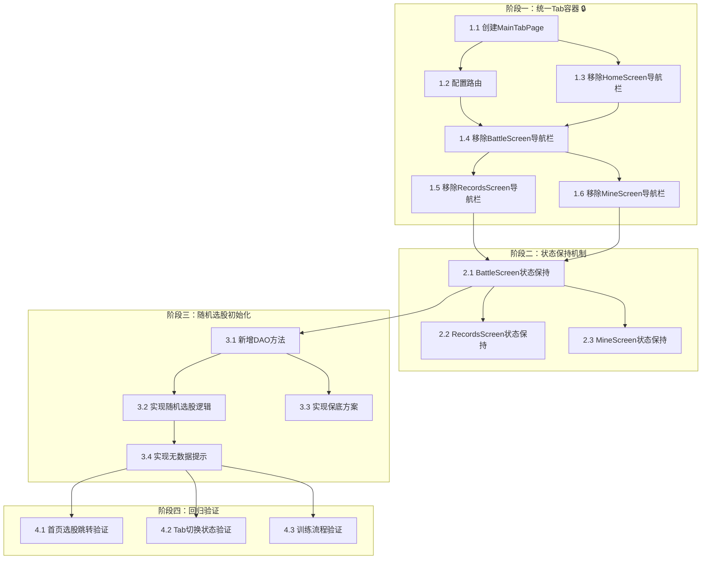

# 实战页面优化 — 开发任务规划

## 1. 概述

### 1.1 功能说明

本次开发任务围绕"实战页面优化"需求，将技术方案拆解为可执行的开发任务清单。核心目标是：
1. 统一底部导航栏架构（使用 IndexedStack + 唯一 BottomNavigationBar）
2. 实现 Tab 页面状态保持（AutomaticKeepAliveClientMixin）
3. 实现随机选股初始化（无路由参数时从数据库随机选择股票）
4. 全部训练状态保持（K线位置、账户信息、交易记录、指标参数等）

### 1.2 切片划分原则

本任务采用**垂直切片策略**，按用户行为划分切片，每个切片穿透所有技术层：

| 切片 | 用户行为 | 说明 |
|------|---------|------|
| 阶段一 | 统一Tab容器搭建 | 创建 MainTabPage，统一导航架构 |
| 阶段二 | 状态保持机制 | 为关键页面添加状态保持能力 |
| 阶段三 | 随机选股初始化 | 实现随机选股和保底方案 |
| 阶段四 | 回归验证 | 确保现有功能不受影响 |

---

## 2. 依赖关系图

---

## 3. 阶段一：统一Tab容器 🔒

**阶段目标**：创建统一Tab容器，移除各页面内嵌导航栏

### 任务 1.1：创建 MainTabPage

| 字段 | 内容 |
|------|------|
| **任务名称** | 创建 MainTabPage 统一Tab容器 |
| **通俗解释** | 创建一个包含4个Tab页面的容器，用户在底部导航栏点击可以切换页面 |
| **涉及文件** | 新建 `lib/features/main/main_tab_page.dart` |
| **技术方案章节** | 4.1 |
| **关联AC** | AC-015 |
| **验证标准** | 1. `MainTabPage` 成功创建 2. 包含 `IndexedStack` 管理4个子页面 3. 包含唯一 `BottomNavigationBar` 4. 编译通过，无语法错误 |

### 任务 1.2：配置路由

| 字段 | 内容 |
|------|------|
| **任务名称** | 配置 GoRouter 路由 |
| **通俗解释** | 修改路由配置，让应用启动时进入 MainTabPage |
| **涉及文件** | `lib/routes/app_routes.dart` |
| **技术方案章节** | 5.1 |
| **关联AC** | AC-015 |
| **验证标准** | 1. `/` 路由指向 `MainTabPage` 2. 保留 `/battle-direct` 等独立路由 3. 路由切换正常工作 4. 编译通过 |

### 任务 1.3：移除 HomeScreen 导航栏

| 字段 | 内容 |
|------|------|
| **任务名称** | 移除 HomeScreen 内嵌导航栏 |
| **通俗解释** | HomeScreen 不再包含独立的底部导航栏，导航由 MainTabPage 统一处理 |
| **涉及文件** | `lib/features/home/home_screen.dart` |
| **技术方案章节** | 4.7 |
| **关联AC** | AC-015 |
| **验证标准** | 1. `HomeScreen` 不再包含 `BottomNavigationBar` 2. `_onItemTapped` 方法不再使用 `context.go` 3. 从 MainTabPage 打开 HomeScreen 正常显示 4. 编译通过 |

### 任务 1.4：移除 BattleScreen 导航栏

| 字段 | 内容 |
|------|------|
| **任务名称** | 移除 BattleScreen 内嵌导航栏 |
| **通俗解释** | BattleScreen 不再包含独立的底部导航栏 |
| **涉及文件** | `lib/features/battle/battle_screen.dart` |
| **技术方案章节** | 4.6 |
| **关联AC** | AC-015 |
| **验证标准** | 1. `BattleScreen` 不再包含 `BottomNavigationBar` 2. `_onItemTapped` 方法不再切换 Tab 3. `_selectedIndex` 变量可移除 4. 编译通过 |

### 任务 1.5：移除 RecordsScreen 导航栏

| 字段 | 内容 |
|------|------|
| **任务名称** | 移除 RecordsScreen 内嵌导航栏 |
| **通俗解释** | RecordsScreen 不再包含独立的底部导航栏 |
| **涉及文件** | `lib/features/records/records_screen.dart` |
| **技术方案章节** | 4.7 |
| **关联AC** | AC-015 |
| **验证标准** | 1. `RecordsScreen` 不再包含 `BottomNavigationBar` 2. `_buildBottomNavigationBar` 方法可移除 3. 从 MainTabPage 打开 RecordsScreen 正常显示 4. 编译通过 |

### 任务 1.6：移除 MineScreen 导航栏

| 字段 | 内容 |
|------|------|
| **任务名称** | 移除 MineScreen 内嵌导航栏 |
| **通俗解释** | MineScreen 不再包含独立的底部导航栏 |
| **涉及文件** | `lib/features/mine/mine_screen.dart` |
| **技术方案章节** | 4.7 |
| **关联AC** | AC-015 |
| **验证标准** | 1. `MineScreen` 不再包含 `BottomNavigationBar` 2. `_onItemTapped` 方法不再使用 `context.go` 3. 从 MainTabPage 打开 MineScreen 正常显示 4. 编译通过 |

---

## 4. 阶段二：状态保持机制

**阶段目标**：为关键页面添加状态保持能力，确保Tab切换后状态不丢失

### 任务 2.1：BattleScreen 状态保持

| 字段 | 内容 |
|------|------|
| **任务名称** | 为 BattleScreen 添加状态保持能力 |
| **通俗解释** | 用户在实战页面训练时切换到其他Tab，再返回后能继续训练，所有状态（K线位置、账户、交易记录等）不丢失 |
| **涉及文件** | `lib/features/battle/battle_screen.dart` |
| **技术方案章节** | 4.2, 3.2 |
| **关联AC** | AC-004, AC-005, AC-006, AC-007, AC-008, AC-009, AC-010 |
| **验证标准** | 1. `_BattleScreenState` 添加 `with AutomaticKeepAliveClientMixin` 2. `wantKeepAlive` 返回 `true` 3. 切换Tab后返回，K线位置保持 4. 切换Tab后返回，账户信息保持 5. 切换Tab后返回，交易记录保持 6. 切换Tab后返回，指标参数保持 |

### 任务 2.2：RecordsScreen 状态保持

| 字段 | 内容 |
|------|------|
| **任务名称** | 为 RecordsScreen 添加状态保持能力 |
| **通俗解释** | 用户在记录页面切换到其他Tab，再返回后页面状态不重置 |
| **涉及文件** | `lib/features/records/records_screen.dart` |
| **技术方案章节** | 4.3 |
| **关联AC** | AC-004 |
| **验证标准** | 1. `_RecordsScreenState` 添加 `with AutomaticKeepAliveClientMixin` 2. `wantKeepAlive` 返回 `true` 3. 切换Tab后返回，训练记录列表保持 |

### 任务 2.3：MineScreen 状态保持

| 字段 | 内容 |
|------|------|
| **任务名称** | 为 MineScreen 添加状态保持能力 |
| **通俗解释** | 用户在"我的"页面切换到其他Tab，再返回后页面状态不重置 |
| **涉及文件** | `lib/features/mine/mine_screen.dart` |
| **技术方案章节** | 4.4 |
| **关联AC** | AC-004 |
| **验证标准** | 1. `_MineScreenState` 添加 `with AutomaticKeepAliveClientMixin` 2. `wantKeepAlive` 返回 `true` 3. 切换Tab后返回，用户信息保持 |

---

## 5. 阶段三：随机选股初始化

**阶段目标**：实现随机选股初始化逻辑，支持无路由参数时从数据库随机选择股票

### 任务 3.1：新增 DAO 方法

| 字段 | 内容 |
|------|------|
| **任务名称** | 新增 getSymbolsWithCompleteKlineData 方法 |
| **通俗解释** | 添加数据库查询方法，获取有足够K线数据的股票列表，用于随机选股 |
| **涉及文件** | `lib/data/database/daos/kline_dao.dart` |
| **技术方案章节** | 3.1 |
| **关联AC** | AC-002 |
| **验证标准** | 1. 方法 `getSymbolsWithCompleteKlineData` 成功添加 2. 支持 `minDays` 参数（默认210天） 3. 支持 `marketCodes` 参数（默认A股） 4. 返回有足够数据的股票列表 5. 编译通过 |

### 任务 3.2：实现随机选股逻辑

| 字段 | 内容 |
|------|------|
| **任务名称** | 实现 _initializeRandomStock 方法 |
| **通俗解释** | 用户直接进入实战页面时，系统自动从数据库随机选择一只股票进行训练 |
| **涉及文件** | `lib/features/battle/battle_screen.dart` |
| **技术方案章节** | 4.5 |
| **关联AC** | AC-001, AC-014 |
| **验证标准** | 1. `_initializeRandomStock` 方法成功添加 2. 无路由参数时执行随机选股 3. 随机选择的股票有210天+数据 4. 加载该股票的K线数据 5. 训练周期显示150天 |

### 任务 3.3：实现保底方案

| 字段 | 内容 |
|------|------|
| **任务名称** | 实现 _useFallbackStock 方法 |
| **通俗解释** | 当随机选股失败时，使用默认股票（深科技 SZ000021）确保用户仍能训练 |
| **涉及文件** | `lib/features/battle/battle_screen.dart` |
| **技术方案章节** | 4.5, 7.2 |
| **关联AC** | AC-011 |
| **验证标准** | 1. `_useFallbackStock` 方法成功添加 2. 当 `getSymbolsWithCompleteKlineData` 返回空时调用 3. 使用 SZ000021（深科技）作为保底股票 4. 加载保底股票的K线数据 5. 正常进入训练状态 |

### 任务 3.4：实现无数据提示

| 字段 | 内容 |
|------|------|
| **任务名称** | 实现数据库无数据时的提示 |
| **通俗解释** | 当数据库完全没有股票数据时，显示友好提示 |
| **涉及文件** | `lib/features/battle/battle_screen.dart` |
| **技术方案章节** | 7.1 |
| **关联AC** | AC-012 |
| **验证标准** | 1. 数据库无数据时显示 `AlertDialog` 2. 提示内容："数据库中没有找到符合条件的股票数据，请先同步数据" 3. 用户点击确定后关闭对话框 4. 编译通过 |

---

## 6. 阶段四：回归验证

**阶段目标**：确保现有功能不受影响，功能正常可用

### 任务 4.1：首页选股跳转验证

| 字段 | 内容 |
|------|------|
| **任务名称** | 验证首页选股跳转功能 |
| **通俗解释** | 用户在首页选择股票后跳转实战页面，股票和条件正确传递 |
| **涉及文件** | `lib/features/home/home_screen.dart`, `lib/features/battle/battle_screen.dart` |
| **技术方案章节** | - |
| **关联AC** | AC-008 |
| **验证标准** | 1. 首页选择股票后点击跳转 2. 实战页面显示选择的股票 3. 股票代码、名称正确 4. 训练周期150天正确 5. 前置60天K线正确加载 |

### 任务 4.2：Tab 切换状态验证

| 字段 | 内容 |
|------|------|
| **任务名称** | 验证Tab切换状态保持功能 |
| **通俗解释** | 用户在任意Tab页面切换后返回，所有状态不丢失 |
| **涉及文件** | 所有Tab页面 |
| **技术方案章节** | - |
| **关联AC** | AC-004, AC-005, AC-006, AC-007 |
| **验证标准** | 1. 实战页面进行训练 → 切换到记录 → 返回实战：状态保持 2. 实战页面进行交易 → 切换到我的 → 返回实战：账户保持 3. 实战页面设置指标 → 切换到首页 → 返回实战：指标保持 4. 记录页面浏览 → 切换到实战 → 返回记录：列表位置保持 |

### 任务 4.3：训练流程验证

| 字段 | 内容 |
|------|------|
| **任务名称** | 验证随机选股训练流程 |
| **通俗解释** | 用户直接进入实战页面，使用随机股票进行完整训练 |
| **涉及文件** | `lib/features/battle/battle_screen.dart` |
| **技术方案章节** | - |
| **关联AC** | AC-009, AC-010 |
| **验证标准** | 1. 直接进入实战页面成功 2. 显示随机选择的股票 3. 点击"下一步"正常推进K线 4. 买入功能正常 5. 卖出功能正常 6. 资金、持仓正确更新 |

---

## 7. 任务汇总

| 阶段 | 任务 | 预估工时 | 优先级 | 状态 |
|------|------|---------|--------|------|
| 阶段一 | 1.1 创建 MainTabPage | 30分钟 | 🔒 高 | 待开发 |
| 阶段一 | 1.2 配置路由 | 15分钟 | 🔒 高 | 待开发 |
| 阶段一 | 1.3 移除 HomeScreen 导航栏 | 15分钟 | 🔒 高 | 待开发 |
| 阶段一 | 1.4 移除 BattleScreen 导航栏 | 15分钟 | 🔒 高 | 待开发 |
| 阶段一 | 1.5 移除 RecordsScreen 导航栏 | 15分钟 | 🔒 高 | 待开发 |
| 阶段一 | 1.6 移除 MineScreen 导航栏 | 15分钟 | 🔒 高 | 待开发 |
| 阶段二 | 2.1 BattleScreen 状态保持 | 20分钟 | 高 | 待开发 |
| 阶段二 | 2.2 RecordsScreen 状态保持 | 10分钟 | 高 | 待开发 |
| 阶段二 | 2.3 MineScreen 状态保持 | 10分钟 | 高 | 待开发 |
| 阶段三 | 3.1 新增 DAO 方法 | 30分钟 | 高 | 待开发 |
| 阶段三 | 3.2 实现随机选股逻辑 | 30分钟 | 高 | 待开发 |
| 阶段三 | 3.3 实现保底方案 | 15分钟 | 中 | 待开发 |
| 阶段三 | 3.4 实现无数据提示 | 15分钟 | 中 | 待开发 |
| 阶段四 | 4.1 首页选股跳转验证 | 20分钟 | 高 | 待开发 |
| 阶段四 | 4.2 Tab 切换状态验证 | 20分钟 | 高 | 待开发 |
| 阶段四 | 4.3 训练流程验证 | 20分钟 | 高 | 待开发 |

**总计**：16个任务，**预估总工时约 4.5 小时**

---

## 8. 阶段完成标准

| 阶段 | 完成标准（用户视角） |
|------|---------------------|
| 阶段一 | 用户可以看到统一底部导航栏，点击各Tab可以切换页面，底部只有一个导航栏 |
| 阶段二 | 用户在任意Tab训练或操作后切换到其他Tab，再返回时状态完整保留 |
| 阶段三 | 用户直接进入实战页面时，系统自动随机选择一只股票，用户可以立即开始训练 |
| 阶段四 | 所有原有功能正常工作，没有回归问题 |

---

## 9. 风险提示

| 风险 | 影响 | 缓解措施 |
|------|------|---------|
| ⚠️ 路由变更影响 | 修改路由可能影响现有跳转逻辑 | 阶段一开发后立即验证现有功能 |
| ⚠️ 状态保持内存占用 | 保持所有页面状态可能占用更多内存 | 只对需要保持的页面开启 wantKeepAlive |
| ⚠️ 随机选股数据不足 | 数据库股票数据可能不足 | 实现保底方案确保功能可用 |

---

## 10. 验收标准覆盖对照表

| AC编号 | 关联任务 | 验证要点 |
|--------|---------|---------|
| AC-001 | 3.2 | 随机选股初始化成功 |
| AC-002 | 3.1 | 股票数据完整性检查 |
| AC-003 | 3.2 | 训练周期150天正确 |
| AC-004 | 2.1, 2.2, 2.3, 4.2 | Tab切换状态保持 |
| AC-005 | 2.1, 4.2 | 账户信息保持 |
| AC-006 | 2.1, 4.2 | 交易记录保持 |
| AC-007 | 2.1, 4.2 | 指标参数保持 |
| AC-008 | 2.1, 4.1 | 从首页选股跳转的状态保持 |
| AC-009 | 3.2, 4.3 | 随机股票训练功能 |
| AC-010 | 4.3 | 随机股票交易功能 |
| AC-011 | 3.3 | 保底方案正常工作 |
| AC-012 | 3.4 | 无数据时友好提示 |
| AC-013 | 4.3 | 训练周期边界处理 |
| AC-014 | 3.2 | 首次进入无路由参数处理 |
| AC-015 | 1.1~1.6 | 导航栏唯一性 |
| AC-016 | 3.2 | 训练周期配置正确 |
| AC-017 | 3.1 | 随机选股仅限A股 |
| AC-018 | 3.2 | 初始资金10万 |

---

## 附录：变更记录

| 日期 | 变更内容 | 原因 |
|------|---------|------|
| 2026-05-25 | 初始版本，任务规划 | 实战页面优化功能开发任务拆解 |