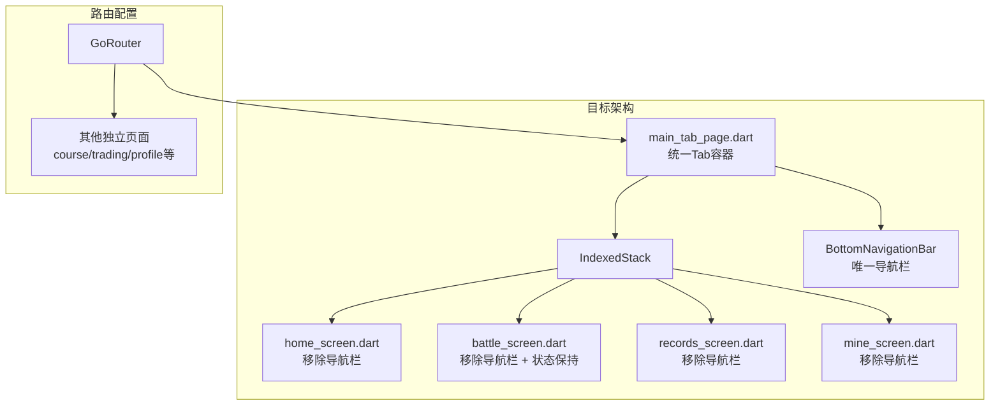
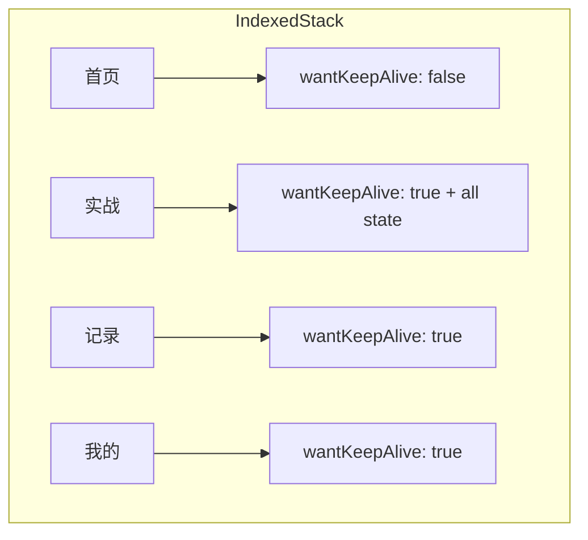
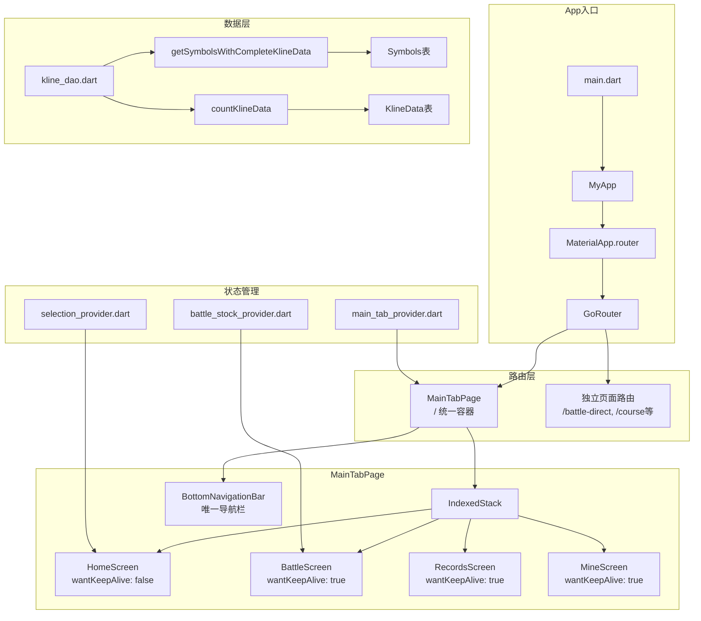

# 实战页面优化 — 技术设计方案

## 1. 设计目标

本文档描述"实战页面优化"功能的技术实现方案，包括：
1. 统一底部导航栏架构（移除多处重复导航栏）
2. Tab页面状态保持机制（IndexedStack + AutomaticKeepAliveClientMixin）
3. 随机选股初始化（无路由参数时从数据库随机选择股票）
4. 全部训练状态保持（K线位置、账户信息、交易记录、指标参数等）

**设计原则**：
- 不影响现有功能
- 融入现有代码模式（GoRouter、Riverpod、Drift ORM）
- 可渐进式开发，先实现核心架构再完善细节

---

## 2. 架构变更

### 2.1 当前架构分析

**问题**：每个Tab页面都有独立的 `BottomNavigationBar`，导致：
- 导航状态无法保持（切换Tab时旧页面被销毁）
- 代码重复，维护成本高
- 用户体验差（返回后训练进度丢失）

**涉及文件**（8处独立导航栏）：
| 文件 | 导航栏类型 | 是否在Tab结构内 |
|------|----------|----------------|
| `home_screen.dart` | 独立 | 是（通过context.go切换） |
| `battle_screen.dart` | 独立 | 是（通过context.go切换） |
| `records_screen.dart` | 独立 | 是（通过context.go切换） |
| `mine_screen.dart` | 独立 | 是（通过context.go切换） |
| `course_list_screen.dart` | 独立 | 否（独立页面） |
| `trading_screen.dart` | 独立 | 否（独立页面） |
| `profile_screen.dart` | 独立 | 否（独立页面） |
| `kline_chart_screen.dart` | 独立 | 否（独立页面） |

### 2.2 目标架构



### 2.3 状态保持架构



---

## 3. 数据模型

### 3.1 新增DAO方法

**文件**：`lib/data/database/daos/kline_dao.dart`

新增方法 `getSymbolsWithCompleteKlineData`：

```dart
/// 获取有完整K线数据的股票列表
/// 用于随机选股功能
/// 
/// [minDays]: 最少需要的日线数据天数（默认210天：150天训练 + 60天预热）
/// [marketCodes]: 市场代码列表（如['SH', 'SZ']）
/// 
/// → AC-002, AC-011
Future<List<Symbol>> getSymbolsWithCompleteKlineData({
  int minDays = 210,
  List<String>? marketCodes,
}) async {
  // 1. 先获取所有标的
  final allSymbols = await getSymbols();
  
  // 2. 过滤有足够数据的标的
  final result = <Symbol>[];
  for (final symbol in allSymbols) {
    // 3. 检查市场代码
    if (marketCodes != null && marketCodes.isNotEmpty) {
      final symbolPrefix = _extractMarketPrefix(symbol.symbol);
      if (!marketCodes.contains(symbolPrefix)) continue;
    }
    
    // 4. 检查数据完整性
    final count = await countKlineData(symbol.symbol, 'day');
    if (count >= minDays) {
      result.add(symbol);
    }
  }
  
  return result;
}

/// 提取市场前缀：SZ000021 -> SZ
String _extractMarketPrefix(String symbol) {
  if (symbol.startsWith('SH') || symbol.startsWith('SZ')) {
    return symbol.substring(0, 2);
  }
  return '';
}
```

### 3.2 现有状态变量清单

**文件**：`lib/features/battle/battle_screen.dart`

需要通过 `AutomaticKeepAliveClientMixin` 保持的状态变量：

| 变量 | 类型 | 说明 | 关联AC |
|------|------|------|-------|
| `_currentDayIndex` | `int` | K线位置（当前第几天） | AC-004 |
| `_accountBalance` | `double` | 账户资金 | AC-005 |
| `_positionQuantity` | `double` | 持仓数量 | AC-005 |
| `_positionCost` | `double` | 持仓成本 | AC-005 |
| `_totalProfitLoss` | `double` | 总盈亏 | AC-005 |
| `_tradePoints` | `List<TradePoint>` | 交易点位列表 | AC-006 |
| `_selectedPeriod` | `String` | 周期选择（日K/周K等） | AC-007 |
| `_selectedTopIndicator` | `String` | 顶部指标 | AC-007 |
| `_selectedBottomIndicator` | `String` | 底部指标 | AC-007 |
| `_currentSymbol` | `String` | 当前股票代码 | AC-008 |
| `_currentSymbolName` | `String` | 当前股票名称 | AC-008 |
| `_currentMarketCode` | `String` | 当前市场代码 | AC-008 |
| `_allKlineData` | `List<KlineModel>` | K线数据 | AC-009 |
| `_trainingStartDate` | `DateTime?` | 训练开始日期 | AC-009 |
| `_trainingDays` | `int` | 训练天数（150） | AC-003 |
| `_visibleStartIndex` | `int` | 可见K线起始位置 | - |
| `_visibleKlineCount` | `int` | 可见K线数量 | - |
| `_zoomScale` | `double` | 缩放比例 | - |
| `_trainingPhase` | `TrainingPhase` | 训练阶段 | - |
| `_isReplayMode` | `bool` | 重播模式 | - |

---

## 4. 核心模块实现

### 4.1 MainTabPage（统一Tab容器）

**新建文件**：`lib/features/main/main_tab_page.dart`

```dart
import 'package:flutter/material.dart';
import 'package:flutter_riverpod/flutter_riverpod.dart';
import 'package:kline_trainer/theme/app_theme.dart';

import 'package:kline_trainer/features/home/home_screen.dart';
import 'package:kline_trainer/features/battle/battle_screen.dart';
import 'package:kline_trainer/features/records/records_screen.dart';
import 'package:kline_trainer/features/mine/mine_screen.dart';

/// 统一Tab页面容器
/// 使用IndexedStack保持所有Tab页面状态
/// 
/// → AC-004, AC-005, AC-006, AC-007, AC-008, AC-015
class MainTabPage extends ConsumerStatefulWidget {
  final int initialIndex;
  
  const MainTabPage({
    super.key,
    this.initialIndex = 0,
  });

  @override
  ConsumerState<MainTabPage> createState() => _MainTabPageState();
}

class _MainTabPageState extends ConsumerState<MainTabPage> {
  late int _currentIndex;
  
  @override
  void initState() {
    super.initState();
    _currentIndex = widget.initialIndex;
  }

  void _onItemTapped(int index) {
    setState(() {
      _currentIndex = index;
    });
  }

  @override
  Widget build(BuildContext context) {
    return Scaffold(
      body: IndexedStack(
        index: _currentIndex,
        children: const [
          HomeScreen(),
          BattleScreen(),
          RecordsScreen(),
          MineScreen(),
        ],
      ),
      bottomNavigationBar: BottomNavigationBar(
        type: BottomNavigationBarType.fixed,
        items: const <BottomNavigationBarItem>[
          BottomNavigationBarItem(
            icon: Icon(Icons.home),
            label: '首页',
          ),
          BottomNavigationBarItem(
            icon: Icon(Icons.bar_chart),
            label: '实战',
          ),
          BottomNavigationBarItem(
            icon: Icon(Icons.history),
            label: '记录',
          ),
          BottomNavigationBarItem(
            icon: Icon(Icons.person),
            label: '我的',
          ),
        ],
        currentIndex: _currentIndex,
        selectedItemColor: AppTheme.accent,
        unselectedItemColor: AppTheme.muted,
        onTap: _onItemTapped,
      ),
    );
  }
}
```

**使用方式**：替换 `app_routes.dart` 中的路由配置

```dart
// app_routes.dart 修改
GoRoute(
  path: '/',
  name: 'main',
  builder: (context, state) => const MainTabPage(),
  routes: [
    // ... 其他子路由
  ],
),
```

### 4.2 BattleScreen状态保持

**修改文件**：`lib/features/battle/battle_screen.dart`

```dart
// 在 _BattleScreenState 类声明中添加 mixin
class _BattleScreenState extends ConsumerState<_BattleScreenState>
    with AutomaticKeepAliveClientMixin {
  
  @override
  bool get wantKeepAlive => true;
  
  // ... 其余代码保持不变
}
```

### 4.3 RecordsScreen状态保持

**修改文件**：`lib/features/records/records_screen.dart`

```dart
class _RecordsScreenState extends ConsumerState<RecordsScreen>
    with AutomaticKeepAliveClientMixin {
  
  @override
  bool get wantKeepAlive => true;
  
  // ... 其余代码保持不变
}
```

### 4.4 MineScreen状态保持

**修改文件**：`lib/features/mine/mine_screen.dart`

```dart
class _MineScreenState extends ConsumerState<MineScreen>
    with AutomaticKeepAliveClientMixin {
  
  @override
  bool get wantKeepAlive => true;
  
  // ... 其余代码保持不变
}
```

### 4.5 随机选股初始化

**修改文件**：`lib/features/battle/battle_screen.dart`

在 `_initializeData` 方法中添加随机选股逻辑：

```dart
Future<void> _initializeData() async {
  final logger = Logger();

  print('🟡🟡🟡 [3.实战页面初始化] 开始');
  print('🟡🟡🟡 [3.实战页面初始化] widget.initialSymbol: ${widget.initialSymbol}');

  if (widget.initialSymbol != null && widget.initialSymbol!.isNotEmpty) {
    // 场景A：从首页选股跳转
    logger.d('📋 使用构造参数: symbol=${widget.initialSymbol}');
    setState(() {
      _currentSymbol = widget.initialSymbol!;
      _currentMarketCode = widget.initialMarketCode ?? '';
      _trainingStartDate = widget.initialTrainingStartDate;
      _currentSymbolName = widget.initialName ?? '';
    });
    await _loadKlineData();
  } else {
    // 场景B：直接进入实战页面（无选股跳转）
    logger.d('📋 无路由参数，执行随机选股初始化');
    await _initializeRandomStock();
  }
}

/// 随机选股初始化
/// → AC-001, AC-002, AC-009
Future<void> _initializeRandomStock() async {
  final logger = Logger();
  final dbService = DatabaseService.instance;
  
  try {
    // 1. 查询有完整数据的A股股票
    logger.d('📋 随机选股：查询有完整数据的股票');
    final stocksWithData = await dbService.klineDao.getSymbolsWithCompleteKlineData(
      minDays: 210,
      marketCodes: ['SH', 'SZ'],
    );
    
    logger.d('📋 随机选股：找到 ${stocksWithData.length} 只符合条件的股票');
    
    // 2. 随机选择
    if (stocksWithData.isNotEmpty) {
      final randomIndex = Random().nextInt(stocksWithData.length);
      final selectedStock = stocksWithData[randomIndex];
      
      logger.d('📋 随机选股：选中 ${selectedStock.symbol} - ${selectedStock.name}');
      
      setState(() {
        _currentSymbol = selectedStock.symbol;
        _currentMarketCode = selectedStock.marketCode ?? '';
        _currentSymbolName = selectedStock.name ?? selectedStock.symbol;
        _trainingStartDate = _DEFAULT_START_DATE;
        _trainingDays = 150;
        _initialBalance = 100000.0;
        _accountBalance = _initialBalance;
      });
    } else {
      // 3. 无符合条件股票，使用保底方案
      logger.w('📋 随机选股：无符合条件股票，使用保底股票');
      await _useFallbackStock();
    }
    
    // 4. 加载K线数据
    await _loadKlineData();
    
  } catch (e) {
    logger.e('📋 随机选股失败: $e');
    await _useFallbackStock();
    await _loadKlineData();
  }
}

/// 使用保底股票
/// → AC-011
Future<void> _useFallbackStock() async {
  setState(() {
    _currentSymbol = _DEFAULT_SYMBOL;
    _currentMarketCode = _DEFAULT_MARKET_CODE;
    _currentSymbolName = '深科技';
    _trainingStartDate = _DEFAULT_START_DATE;
    _trainingDays = 150;
    _initialBalance = 100000.0;
    _accountBalance = _initialBalance;
  });
}
```

### 4.6 移除内嵌导航栏

**修改文件**：`lib/features/battle/battle_screen.dart`

移除或注释掉 `bottomNavigationBar` 相关代码：

```dart
// 注释掉或删除以下代码（约在第1246-1270行）
// bottomNavigationBar: BottomNavigationBar(
//   type: BottomNavigationBarType.fixed,
//   items: const <BottomNavigationBarItem>[
//     BottomNavigationBarItem(
//       icon: Icon(Icons.home),
//       label: '首页',
//     ),
//     // ... 其他items
//   ],
//   currentIndex: _selectedIndex,
//   selectedItemColor: AppTheme.accent,
//   unselectedItemColor: AppTheme.muted,
//   onTap: _onItemTapped,
// ),
```

### 4.7 移除各页面内嵌导航栏

按相同方式修改：
- `home_screen.dart` - 移除 `_onItemTapped` 方法中的导航逻辑和 `BottomNavigationBar`
- `records_screen.dart` - 移除 `BottomNavigationBar`
- `mine_screen.dart` - 移除 `_onItemTapped` 方法中的导航逻辑和 `BottomNavigationBar`

---

## 5. 路由配置调整

### 5.1 app_routes.dart 修改

**修改文件**：`lib/routes/app_routes.dart`

```dart
import 'package:flutter/material.dart';
import 'package:go_router/go_router.dart';

// 导入新组件
import 'package:kline_trainer/features/main/main_tab_page.dart';
import 'package:kline_trainer/features/home/home_screen.dart';
import 'package:kline_trainer/features/battle/battle_screen.dart';
import 'package:kline_trainer/features/records/records_screen.dart';
import 'package:kline_trainer/features/records/record_detail_screen.dart';
import 'package:kline_trainer/features/mine/mine_screen.dart';
// ... 其他导入

final _rootNavigatorKey = GlobalKey<NavigatorState>();

class AppRoutes {
  static const home = '/';
  static const battle = '/battle';
  // ... 其他路由常量

  static final router = GoRouter(
    navigatorKey: _rootNavigatorKey,
    initialLocation: '/',
    routes: [
      // 方案1：使用MainTabPage作为统一容器
      GoRoute(
        path: '/',
        name: 'main',
        builder: (context, state) => const MainTabPage(),
      ),
      
      // 方案2：如果需要参数传递，保留单独的battle路由
      GoRoute(
        path: '/battle-direct',
        name: 'battle-direct',
        builder: (context, state) {
          final symbol = state.uri.queryParameters['symbol'];
          final name = state.uri.queryParameters['name'];
          final market = state.uri.queryParameters['market'];
          final dateStr = state.uri.queryParameters['date'];
          final DateTime? trainingStartDate = 
              dateStr.isNotEmpty ? DateTime.tryParse(dateStr) : null;
          
          return BattleScreen(
            initialSymbol: symbol,
            initialName: name,
            initialMarketCode: market,
            initialTrainingStartDate: trainingStartDate,
          );
        },
      ),
      
      // 其他独立页面路由（course_list_screen、trading_screen等）
      // 这些页面不在Tab容器中，保留各自的导航栏
      GoRoute(
        path: '/course',
        name: 'course',
        builder: (context, state) => const CourseListScreen(),
      ),
      // ... 其他路由
    ],
  );
}
```

### 5.2 HomeScreen选股跳转调整

**修改文件**：`lib/features/home/home_screen.dart`

```dart
void _onItemTapped(int index) {
  setState(() {
    _selectedIndex = index;
  });

  // 不再使用 context.go 切换，而是更新 MainTabPage 的状态
  // 通过回调或 Provider 通知 MainTabPage 切换 Tab
  switch (index) {
    case 0:
      // 首页 - 已经在当前Tab
      break;
    case 1:
      // 实战 - 通知切换
      ref.read(mainTabIndexProvider.notifier).setIndex(1);
      break;
    case 2:
      // 记录 - 通知切换
      ref.read(mainTabIndexProvider.notifier).setIndex(2);
      break;
    case 3:
      // 我的 - 通知切换
      ref.read(mainTabIndexProvider.notifier).setIndex(3);
      break;
  }
}
```

---

## 6. Provider设计

### 6.1 MainTabIndexProvider

**新建文件**：`lib/providers/main_tab_provider.dart`

```dart
import 'package:flutter_riverpod/flutter_riverpod.dart';

/// 统一Tab页面索引Provider
/// 用于首页、实战、记录、我的四个Tab的切换控制
final mainTabIndexProvider = StateProvider<int>((ref) => 0);

/// MainTabPage状态
class MainTabState {
  final int currentIndex;
  final bool isInitialized;
  
  const MainTabState({
    this.currentIndex = 0,
    this.isInitialized = false,
  });
  
  MainTabState copyWith({
    int? currentIndex,
    bool? isInitialized,
  }) {
    return MainTabState(
      currentIndex: currentIndex ?? this.currentIndex,
      isInitialized: isInitialized ?? this.isInitialized,
    );
  }
}

class MainTabNotifier extends StateNotifier<MainTabState> {
  MainTabNotifier() : super(const MainTabState());
  
  void setIndex(int index) {
    state = state.copyWith(currentIndex: index, isInitialized: true);
  }
}

final mainTabProvider = StateNotifierProvider<MainTabNotifier, MainTabState>(
  (ref) => MainTabNotifier(),
);
```

---

## 7. 异常处理

### 7.1 数据库无数据

```dart
// → AC-012
Future<void> _initializeRandomStock() async {
  try {
    final stocksWithData = await dbService.klineDao.getSymbolsWithCompleteKlineData(
      minDays: 210,
      marketCodes: ['SH', 'SZ'],
    );
    
    if (stocksWithData.isEmpty) {
      // 数据库无数据
      _showNoDataDialog();
      return;
    }
    
    // 正常流程...
  } catch (e) {
    _showErrorDialog('加载股票数据失败: $e');
  }
}

void _showNoDataDialog() {
  showDialog(
    context: context,
    builder: (context) => AlertDialog(
      title: const Text('暂无股票数据'),
      content: const Text('数据库中没有找到符合条件的股票数据，请先同步数据。'),
      actions: [
        TextButton(
          onPressed: () => Navigator.pop(context),
          child: const Text('确定'),
        ),
      ],
    ),
  );
}
```

### 7.2 随机选股重试机制

```dart
// → AC-011
Future<void> _initializeRandomStock() async {
  const maxRetries = 3;
  
  for (int retry = 0; retry < maxRetries; retry++) {
    try {
      final stocksWithData = await dbService.klineDao.getSymbolsWithCompleteKlineData(
        minDays: 210,
        marketCodes: ['SH', 'SZ'],
      );
      
      if (stocksWithData.isEmpty) {
        if (retry < maxRetries - 1) {
          // 重试：放宽条件
          final relaxedStocks = await dbService.klineDao.getSymbolsWithCompleteKlineData(
            minDays: 100, // 放宽到100天
            marketCodes: ['SH', 'SZ'],
          );
          
          if (relaxedStocks.isNotEmpty) {
            final randomIndex = Random().nextInt(relaxedStocks.length);
            final selectedStock = relaxedStocks[randomIndex];
            // 使用选中的股票...
            return;
          }
        }
        
        // 所有尝试失败，使用保底股票
        await _useFallbackStock();
        return;
      }
      
      // 正常选择流程
      final randomIndex = Random().nextInt(stocksWithData.length);
      final selectedStock = stocksWithData[randomIndex];
      // 使用选中的股票...
      return;
      
    } catch (e) {
      if (retry == maxRetries - 1) {
        await _useFallbackStock();
        return;
      }
    }
  }
}
```

---

## 8. 测试要点

### 8.1 单元测试

| 测试项 | 验证点 | 关联AC |
|-------|-------|-------|
| `getSymbolsWithCompleteKlineData` | 返回有足够数据的股票 | AC-002 |
| 随机选股 | 每次调用返回不同的股票 | AC-001 |
| 保底方案 | 数据库无数据时使用SZ000021 | AC-011 |

### 8.2 集成测试

| 测试项 | 验证点 | 关联AC |
|-------|-------|-------|
| Tab切换状态保持 | 切换Tab后返回，K线位置不变 | AC-004 |
| 账户状态保持 | 买入后切换Tab，返回资金正确 | AC-005 |
| 交易记录保持 | 交易后切换Tab，返回买卖点存在 | AC-006 |
| 指标参数保持 | 切换指标后切换Tab，返回参数正确 | AC-007 |
| 随机选股训练 | 随机选股后可以进行正常训练 | AC-009 |
| 导航栏唯一性 | 页面底部只有一个导航栏 | AC-015 |

---

## 9. 风险与注意事项

### 9.1 风险识别

| 风险 | 影响 | 缓解措施 |
|------|------|---------|
| IndexedStack性能 | 保持所有页面状态可能占用内存 | 只对需要保持状态的页面开启wantKeepAlive |
| 状态同步 | MainTabPage和子页面状态可能不一致 | 使用Provider统一管理Tab索引 |
| 现有功能回归 | 修改导航架构可能影响现有功能 | 分阶段开发，先修改非关键页面 |

### 9.2 注意事项

1. **渐进式开发**：建议按以下顺序开发：
   - 阶段1：创建MainTabPage，统一导航架构
   - 阶段2：为各页面添加AutomaticKeepAliveClientMixin
   - 阶段3：实现随机选股初始化
   - 阶段4：测试验证

2. **现有功能保护**：在开发过程中，确保：
   - GoRouter的路由配置保持兼容
   - 首页选股跳转功能正常
   - 训练记录查看/复盘功能正常

3. **内存管理**：定期检查内存使用情况，确保状态保持不会导致内存泄漏

---

## 10. 文件变更清单

### 10.1 新建文件

| 文件路径 | 说明 |
|---------|------|
| `lib/features/main/main_tab_page.dart` | 统一Tab容器 |
| `lib/providers/main_tab_provider.dart` | Tab索引Provider |

### 10.2 修改文件

| 文件路径 | 修改内容 |
|---------|---------|
| `lib/routes/app_routes.dart` | 路由配置调整 |
| `lib/features/home/home_screen.dart` | 移除内嵌导航栏 |
| `lib/features/battle/battle_screen.dart` | 状态保持+随机选股+移除导航栏 |
| `lib/features/records/records_screen.dart` | 移除内嵌导航栏 |
| `lib/features/mine/mine_screen.dart` | 移除内嵌导航栏 |
| `lib/data/database/daos/kline_dao.dart` | 新增随机选股查询方法 |

---

## 11. 附录：Mermaid架构图

### 11.1 完整架构图



---

## 12. 验收标准覆盖对照表

| AC编号 | 设计要点 | 实现位置 |
|--------|---------|---------|
| AC-001 | 随机选股初始化 | `battle_screen.dart` - `_initializeRandomStock` |
| AC-002 | 随机股票数据完整性 | `kline_dao.dart` - `getSymbolsWithCompleteKlineData` |
| AC-003 | 训练周期正确展示 | `battle_screen.dart` - `_trainingDays = 150` |
| AC-004 | 状态保持 - Tab切换 | `AutomaticKeepAliveClientMixin` + `IndexedStack` |
| AC-005 | 状态保持 - 账户信息 | `AutomaticKeepAliveClientMixin` |
| AC-006 | 状态保持 - 交易记录 | `AutomaticKeepAliveClientMixin` |
| AC-007 | 状态保持 - 指标参数 | `AutomaticKeepAliveClientMixin` |
| AC-008 | 从首页选股跳转的状态保持 | 路由参数传递 + `IndexedStack` |
| AC-009 | 随机股票训练功能 | `_loadKlineData` |
| AC-010 | 随机股票交易功能 | 现有交易流程 |
| AC-011 | 随机选股失败处理 | `_useFallbackStock` |
| AC-012 | 数据库无数据处理 | `_showNoDataDialog` |
| AC-013 | 训练周期边界 | 现有边界处理逻辑 |
| AC-014 | 首次进入无路由参数 | `_initializeRandomStock` |
| AC-015 | 导航栏唯一性 | `MainTabPage` + 移除各页面导航栏 |
| AC-016 | 训练周期配置 | `_trainingDays`, `_historyDays` 常量 |
| AC-017 | 随机选股范围 | `marketCodes: ['SH', 'SZ']` |
| AC-018 | 初始资金 | `_initialBalance = 100000.0` |

---

## 附录：变更记录

| 日期 | 变更内容 | 原因 |
|------|---------|------|
| 2026-05-25 | 初始版本，技术设计方案 | 实战页面优化功能开发指导 |