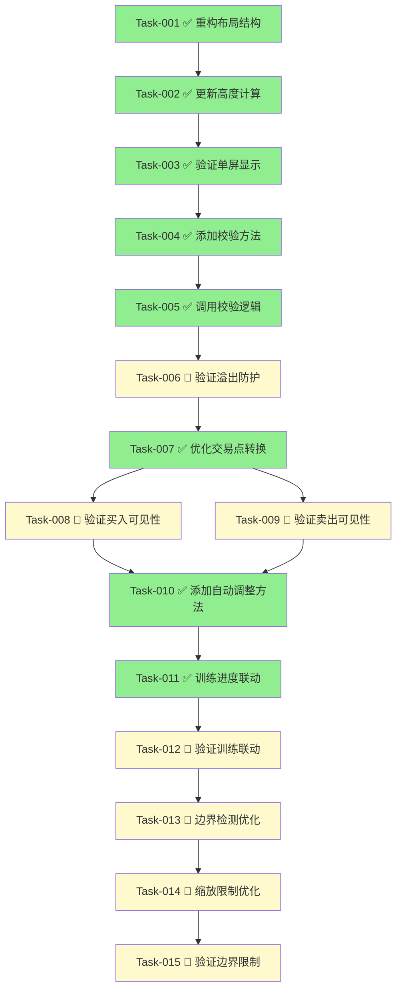

# 实战页面布局优化 — 开发任务计划

## 1. 任务概览

**总任务数**：15 个
**预计总工时**：约 180 分钟（约 3 小时）
**开发方法**：TDD — 每个任务按 RED → GREEN → REFACTOR 循环执行
**已完成任务**：8 个（Task-001, 002, 003, 004, 005, 007, 010, 011）

**关键标注**：
- 🔒 阻塞任务：被多个任务依赖，建议优先完成
- ⚠️ 风险任务：技术难度高，可能需要额外时间

### 依赖关系图

### 可并行任务组

| 并行组 | 任务 | 说明 |
|--------|------|------|
| 1 | Task-008, Task-009 | 都依赖 Task-007，可并行开发 |
| 2 | Task-013, Task-014 | 都依赖 Task-012，可并行开发 |

---

## 2. 开发任务

### 阶段1：基础布局重构

**阶段完成标准**：用户进入实战页面，布局自动适配屏幕尺寸，各区域按弹性比例分配空间

---

#### Task-001: 重构BattleScreen build方法为LayoutBuilder+Flexible 🔒

**通俗解释**：页面使用弹性布局而非固定高度，能自动适应不同大小的手机屏幕

**做什么**：
1. 在 `build()` 方法外层添加 `LayoutBuilder`
2. 将 `Column` 内所有固定高度区域改为 `Flexible` 或 `Expanded`
3. 设置正确的 flex 值：股票信息(0.6), K线图(2), 控制按钮(0.4), 指标图1(1), 指标图2(1), 交易按钮(0.5), 资产信息(0.7)

**涉及文件**：`lib/features/battle/battle_screen.dart` (第861-921行)

**参考**：技术方案 4.1 → AC-001, AC-002, AC-003, AC-004, AC-005

**依赖**：无

**预估工时**：30 分钟

**验证标准**（TDD RED 阶段直接转化为测试用例）：
- [ ] 布局结构使用 LayoutBuilder 包裹
- [ ] Column 内使用 Flexible/Expanded 而非固定 height
- [ ] K线图区域 flex=2, 指标图1 flex=1, 指标图2 flex=1
- [ ] 股票信息区域使用 Flexible(flex: 0.6)
- [ ] SafeArea 已正确包裹

---

#### Task-002: 更新KlineChart支持动态高度

**通俗解释**：K线图能根据屏幕大小自动调整高度

**做什么**：
1. 修改 KlineChart 构造函数，添加可选的 height 参数
2. 在 SizedBox 中使用传入的 height 或默认值
3. 添加内部 ClipRect 防护

**涉及文件**：`lib/features/training/widgets/kline_chart.dart`

**参考**：技术方案 4.3 → AC-002, AC-021, AC-022

**依赖**：Task-001

**预估工时**：20 分钟

**验证标准**：
- [ ] KlineChart 支持可选的 height 参数
- [ ] 默认高度为 280
- [ ] SizedBox 使用动态高度
- [ ] 内部包含 ClipRect 组件

---

#### Task-003: 验证单屏完整显示

**通俗解释**：实战页面所有内容在一屏内显示，不需要上下滚动

**做什么**：
1. 检查页面不包含 SingleChildScrollView
2. 验证各区域没有固定 height 属性
3. 使用 LayoutBuilder 确保弹性布局生效

**涉及文件**：`lib/features/battle/battle_screen.dart`

**参考**：技术方案 4.1 → AC-003, AC-009, AC-010

**依赖**：Task-001, Task-002

**预估工时**：15 分钟

**验证标准**：
- [ ] 页面不包含 SingleChildScrollView 组件
- [ ] iPhone SE (小屏) 上一屏完整显示
- [ ] iPhone 16 Pro Max (大屏) 上布局协调
- [ ] 底部导航栏不遮挡内容

---

### 阶段2：溢出防护增强

**阶段完成标准**：K线图表在任何操作下都不会溢出边界

---

#### Task-004: 添加可见范围校验方法 ⚠️

**通俗解释**：添加智能校验，确保K线显示范围永远在安全边界内

**做什么**：
1. 添加 `_validateVisibleRange()` 方法
2. 校验可见K线数量：10 ≤ visibleKlineCount ≤ 700
3. 校验可见起始索引：0 ≤ visibleStartIndex ≤ dataCount - visibleKlineCount
4. 添加 `_validateTrainingProgress()` 方法校验训练进度边界

**涉及文件**：`lib/features/battle/battle_screen.dart`

**参考**：技术方案 3.2 → AC-023, AC-024, AC-025

**依赖**：Task-003

**预估工时**：25 分钟

**验证标准**：
- [ ] `_validateVisibleRange()` 方法存在
- [ ] visibleKlineCount 被 clamp 到 10-700 范围
- [ ] visibleStartIndex 被 clamp 到有效范围
- [ ] `_validateTrainingProgress()` 方法存在
- [ ] currentDayIndex 在 historyDays 到 totalDays-1 之间

---

#### Task-005: 在关键操作后调用校验方法

**通俗解释**：每次缩放、平移后自动校验，防止范围越界

**做什么**：
1. 在 `_zoomIn()` 和 `_zoomOut()` 方法末尾调用 `_validateVisibleRange()`
2. 在 `_slideLeft()` 和 `_slideRight()` 方法中调用校验
3. 在 `_loadKlineData()` 数据加载完成后调用校验

**涉及文件**：`lib/features/battle/battle_screen.dart`

**参考**：技术方案 3.4 → AC-013, AC-014

**依赖**：Task-004

**预估工时**：15 分钟

**验证标准**：
- [ ] `_zoomIn()` 后调用 `_validateVisibleRange()`
- [ ] `_zoomOut()` 后调用 `_validateVisibleRange()`
- [ ] `_slideLeft()` 和 `_slideRight()` 中调用校验
- [ ] `_loadKlineData()` 完成后调用校验

---

#### Task-006: 验证溢出防护机制

**通俗解释**：无论用户如何操作，K线永远显示在边界内

**做什么**：
1. 连续放大10次，验证最多到10根K线
2. 连续缩小10次，验证最多到700根K线
3. 快速切换训练日期，验证无溢出

**涉及文件**：`lib/features/battle/battle_screen.dart`

**参考**：技术方案 3.2 → AC-015

**依赖**：Task-005

**预估工时**：20 分钟

**验证标准**：
- [ ] 放大操作最多显示10根K线，继续放大无效
- [ ] 缩小操作最多显示700根K线，继续缩小无效
- [ ] 页面渲染时无任何溢出警告
- [ ] ClipRect 正确裁剪溢出内容

---

### 阶段3：交易点可见性

**阶段完成标准**：买入或卖出后，交易标记自动出现在可视区域内

---

#### Task-007: 优化_visibleTradePoints相对坐标转换 ⚠️

**通俗解释**：交易标记使用相对于可见区域的坐标，永远显示在屏幕上

**做什么**：
1. 修改 `_visibleTradePoints` getter
2. 添加数据范围校验：`point.index >= _visibleStartIndex && point.index < _visibleStartIndex + _visibleKlineCount`
3. 将绝对坐标转换为相对坐标：`point.index - _visibleStartIndex`

**涉及文件**：`lib/features/battle/battle_screen.dart`

**参考**：技术方案 3.3 第三层防护 → AC-007, AC-008, AC-026

**依赖**：Task-006

**预估工时**：20 分钟

**验证标准**：
- [ ] `_visibleTradePoints` 返回相对坐标
- [ ] 过滤掉不可见范围的交易点
- [ ] 交易点索引 = 绝对索引 - visibleStartIndex
- [ ] 数据为空时返回空列表

---

#### Task-008: 验证买入后交易点可见

**通俗解释**：用户买入后，买入标记立即显示在K线图上

**做什么**：
1. 执行买入操作
2. 验证买入点在K线可视区域内
3. 验证买入标记显示正确（红色向上三角形）

**涉及文件**：`lib/features/battle/battle_screen.dart`

**参考**：技术方案 3.3 → AC-007

**依赖**：Task-007

**预估工时**：15 分钟

**验证标准**：
- [ ] 买入操作后立即显示买入标记
- [ ] 买入标记在当前K线位置
- [ ] 买入标记颜色为红色
- [ ] 标记包含"买入 X股"文字

---

#### Task-009: 验证卖出后交易点可见

**通俗解释**：用户卖出后，卖出标记立即显示在K线图上

**做什么**：
1. 先执行买入操作
2. 执行卖出操作
3. 验证卖出点在K线可视区域内
4. 验证卖出标记显示正确（绿色向下三角形）

**涉及文件**：`lib/features/battle/battle_screen.dart`

**参考**：技术方案 3.3 → AC-008

**依赖**：Task-007

**预估工时**：15 分钟

**验证标准**：
- [ ] 卖出操作后立即显示卖出标记
- [ ] 卖出标记在当前K线位置
- [ ] 卖出标记颜色为绿色
- [ ] 标记包含"卖出 X股"文字

---

### 阶段4：训练进度联动

**阶段完成标准**：训练进度自动调整可见范围，用户总是能看到当前训练日期

---

#### Task-010: 添加可见范围自动调整方法 ⚠️

**通俗解释**：训练进度变化时，自动滚动K线图让用户看到新日期

**做什么**：
1. 添加 `_adjustVisibleRangeForCurrentDay()` 方法
2. 计算当前可见区域：`currentVisibleEnd = _visibleStartIndex + _visibleKlineCount`
3. 如果 `_currentDayIndex >= currentVisibleEnd`，调整 `_visibleStartIndex`
4. 如果 `_currentDayIndex < _visibleStartIndex`，调整 `_visibleStartIndex`

**涉及文件**：`lib/features/battle/battle_screen.dart`

**参考**：技术方案 3.3 第四层防护 → AC-006, AC-012

**依赖**：Task-009

**预估工时**：25 分钟

**验证标准**：
- [ ] `_adjustVisibleRangeForCurrentDay()` 方法存在
- [ ] 训练天超出可见右边界时自动调整
- [ ] 训练天超出可见左边界时自动调整
- [ ] 调整后训练天在可视范围内

---

#### Task-011: 在训练和交易操作中调用自动调整

**通俗解释**：点击"下一步"或交易后，K线图自动滚动显示当前位置

**做什么**：
1. 在 `_nextDay()` 方法中调用 `_adjustVisibleRangeForCurrentDay()`
2. 在 `_executeBuy()` 方法中调用 `_adjustVisibleRangeForCurrentDay()`
3. 在 `_executeSell()` 方法中调用 `_adjustVisibleRangeForCurrentDay()`

**涉及文件**：`lib/features/battle/battle_screen.dart`

**参考**：技术方案 3.3 → AC-006, AC-012

**依赖**：Task-010

**预估工时**：15 分钟

**验证标准**：
- [ ] `_nextDay()` 调用 `_adjustVisibleRangeForCurrentDay()`
- [ ] `_executeBuy()` 调用 `_adjustVisibleRangeForCurrentDay()`
- [ ] `_executeSell()` 调用 `_adjustVisibleRangeForCurrentDay()`
- [ ] 连续点击下一步，可见范围自动跟随

---

#### Task-012: 验证训练进度自动调整

**通俗解释**：训练过程中，K线图总是显示当前训练日期，不需要手动滚动

**做什么**：
1. 点击"下一步"10次
2. 验证当前训练天始终在可视区域内
3. 验证可见范围自动向右滚动

**涉及文件**：`lib/features/battle/battle_screen.dart`

**参考**：技术方案 3.3 → AC-006

**依赖**：Task-011

**预估工时**：20 分钟

**验证标准**：
- [ ] 连续下一步时，可见范围自动跟随
- [ ] 当前训练天始终在可见范围内
- [ ] 买入后立即能看到买入标记
- [ ] 卖出后立即能看到卖出标记

---

### 阶段5：边界限制

**阶段完成标准**：K线缩放和平移有明确的边界限制，防止越界操作

---

#### Task-013: 优化平移边界检测

**通俗解释**：K线图向左向右滑动有边界，到达边界时提示用户

**做什么**：
1. 优化 `_slideLeft()` 方法
   - 左边界检测：`if (_visibleStartIndex <= 0) _showEdgeAlert('已经到达最左边')`
   - 右边界检测：`_visibleStartIndex >= 0`
2. 优化 `_slideRight()` 方法
   - 右边界检测：`if (currentVisibleEnd > _currentDayIndex + 1)`
   - 限制向右不能超出当前训练天

**涉及文件**：`lib/features/battle/battle_screen.dart`

**参考**：技术方案 3.3 边界检测 → AC-011, AC-012

**依赖**：Task-012

**预估工时**：20 分钟

**验证标准**：
- [ ] `_slideLeft()` 到达左边界时显示提示
- [ ] `_slideRight()` 到达右边界时显示提示
- [ ] 提示消息为"已经到达最左边"或"已经到达最右边"
- [ ] 1.5秒防抖机制生效

---

#### Task-014: 优化缩放边界限制

**通俗解释**：K线图放大缩小有边界，达到极限后继续操作无效

**做什么**：
1. 优化 `_zoomIn()` 方法
   - 最多放大到10根K线：`if (newCount >= 10)`
2. 优化 `_zoomOut()` 方法
   - 最多缩小到700根K线：`if (newCount <= 700)`
3. 缩放后调用校验和调整方法

**涉及文件**：`lib/features/battle/battle_screen.dart`

**参考**：技术方案 3.4 → AC-013, AC-014

**依赖**：Task-013

**预估工时**：15 分钟

**验证标准**：
- [ ] 放大到10根K线后继续点击放大无效
- [ ] 缩小到700根K线后继续点击缩小无效
- [ ] 缩放后可见范围自动调整

---

#### Task-015: 验证边界限制机制

**通俗解释**：用户无法将K线图滑动或缩放到无效范围

**做什么**：
1. 连续点击"向左"直到提示"已经到达最左边"
2. 连续点击"向右"直到提示"已经到达最右边"
3. 连续点击"放大"直到无效
4. 连续点击"缩小"直到无效

**涉及文件**：`lib/features/battle/battle_screen.dart`

**参考**：技术方案 3.3, 3.4 → AC-011, AC-012, AC-013, AC-014

**依赖**：Task-014

**预估工时**：15 分钟

**验证标准**：
- [ ] 到达左边界时正确提示
- [ ] 到达右边界时正确提示
- [ ] 达到放大极限后继续放大无效
- [ ] 达到缩小极限后继续缩小无效
- [ ] 边界提示有1.5秒防抖

---

## 3. AC 覆盖总表

| AC 编号 | 验收标准概述 | 承接任务 | 验证方式 |
|---------|-------------|---------|---------|
| AC-001 | 核心布局比例2:1:1 | Task-001 | 检查flex值设置 |
| AC-002 | 整体弹性比例 | Task-001, Task-002 | 检查Flexible使用 |
| AC-003 | 单屏完整显示 | Task-001, Task-003 | 实际设备测试 |
| AC-004 | SafeArea适配 | Task-001 | 检查SafeArea包裹 |
| AC-005 | 自适应不同屏幕 | Task-001, Task-003 | 多设备测试 |
| AC-006 | 训练进度自动调整 | Task-010, Task-011, Task-012 | 实际操作验证 |
| AC-007 | 买入后交易点可见 | Task-007, Task-008 | 执行买入操作 |
| AC-008 | 卖出后交易点可见 | Task-007, Task-009 | 执行卖出操作 |
| AC-009 | 极小屏幕适配 | Task-003 | iPhone SE测试 |
| AC-010 | 大屏手机适配 | Task-003 | iPhone 16 Pro Max测试 |
| AC-011 | K线边界-左边界 | Task-013, Task-015 | 连续左滑验证 |
| AC-012 | K线边界-右边界 | Task-013, Task-015 | 连续右滑验证 |
| AC-013 | 缩放-最大缩放 | Task-014, Task-015 | 连续放大验证 |
| AC-014 | 缩放-最小缩放 | Task-014, Task-015 | 连续缩小验证 |
| AC-015 | 溢出防护验证 | Task-006 | 操作验证 |
| AC-021 | ClipRect防护验证 | Task-001, Task-002 | 代码检查 |
| AC-022 | 无固定高度验证 | Task-001, Task-002 | 代码检查 |
| AC-023 | 可见范围验证 | Task-004 | 边界测试 |
| AC-024 | 训练进度验证 | Task-004 | 进度测试 |
| AC-025 | 可视范围包含训练天 | Task-010, Task-011 | 操作验证 |

---

## 4. 完成定义

> 所有任务完成后，功能整体交付前的最终确认。

- [ ] 所有15个任务的验证标准通过
- [ ] AC 覆盖总表中每条 AC 的验证方式已执行并通过
- [ ] iPhone SE (小屏) 实机测试通过
- [ ] iPhone 16 Pro Max (大屏) 实机测试通过
- [ ] 训练流程（下一步、买入、卖出）完整测试通过
- [ ] 边界限制（缩放、平移）完整测试通过
- [ ] 无 SingleChildScrollView 组件存在
- [ ] 所有区域使用 Flexible/Expanded 布局
- [ ] ClipRect 防护正确实现

---

## 附录：开发记录

| 日期 | 完成任务 | 问题记录 | 解决方案 |
|------|---------|---------|---------|
| 2026-05-24 | - | - | - |