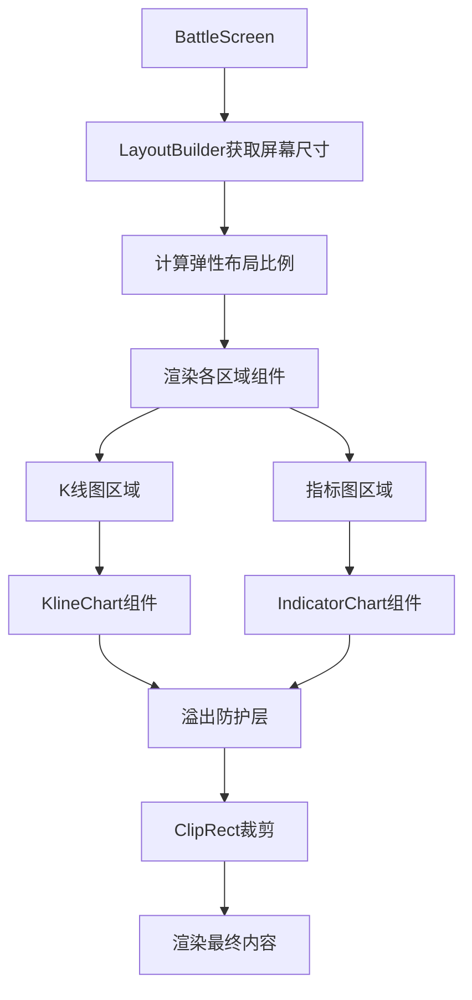
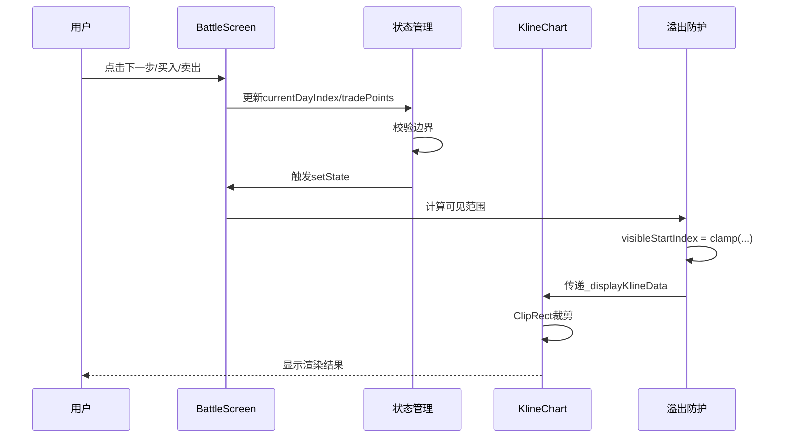

# 实战页面布局优化 — 技术设计文档

## 1. 设计概要

**功能描述**：重新设计实战页面布局，实现自适应不同屏幕尺寸的响应式布局，所有区域采用弹性比例分配，彻底杜绝K线和交易点溢出问题。

**影响范围**：实战页面（BattleScreen）、K线图表组件（KlineChart）

**技术难点**：
- 多层级溢出防护机制设计
- 弹性布局比例计算
- 训练进度与可视区域自动同步

**外部依赖**：无

---

## 2. 架构概览

### 整体架构

采用 `SafeArea` → `LayoutBuilder` → `Column` → `Expanded/Flexible` 的层级结构：

```
SafeArea
└── LayoutBuilder (获取屏幕尺寸)
    └── Column (主布局容器)
        ├── Expanded(flex: 0.6)     // 股票信息区域
        ├── Expanded(flex: 2)       // K线图区域
        ├── Flexible(flex: 0.4)     // 控制按钮区域
        ├── Expanded(flex: 1)       // 指标图1区域
        ├── Expanded(flex: 1)       // 指标图2区域
        ├── Flexible(flex: 0.5)     // 交易按钮区域
        └── Expanded(flex: 0.7)    // 资产信息区域
```

### 关键模块交互



### 数据流与状态管理



---

## 3. 核心逻辑设计

### 3.1 弹性布局计算逻辑 → AC-002, AC-003

**触发条件**：页面初始化或屏幕旋转时

**处理流程**：
1. LayoutBuilder 获取当前屏幕尺寸 `constraints`
2. 计算总可用高度：`availableHeight = constraints.maxHeight - bottomNavHeight`
3. 计算固定区域高度：股票信息 + 控制按钮 + 交易按钮 + 资产信息 ≈ 180dp
4. 计算弹性区域总flex值：`totalFlex = 2.0 + 1.0 + 1.0 = 4.0`
5. 计算弹性区域可用高度：`flexHeight = availableHeight - fixedHeight`
6. 各区域高度 = `flexHeight * (区域flex / totalFlex)`

**代码实现**：
```dart
// LayoutBuilder 获取屏幕尺寸
LayoutBuilder(
  builder: (context, constraints) {
    final bottomNavHeight = 56.0;
    final fixedHeight = 180.0; // 股票信息+控制按钮+交易按钮+资产信息
    final totalHeight = constraints.maxHeight - bottomNavHeight - fixedHeight;
    final klineHeight = totalHeight * (2.0 / 4.0); // K线图
    final indicatorHeight = totalHeight * (1.0 / 4.0); // 每个指标图
    // ...
  }
)
```

### 3.2 多层级溢出防护机制

#### 第一层：组件边界防护 → AC-021, AC-022

**实现方式**：
```dart
// 所有图表区域使用ClipRect强制裁剪
Expanded(
  flex: 2,
  child: ClipRect(
    child: _buildKlineChartWithoutControls(),
  ),
)

// KlineChart内部同样使用ClipRect
SizedBox(
  height: klineHeight, // 基于弹性计算的高度
  child: ClipRect(
    child: CandleStickChart(...),
  ),
)
```

#### 第二层：数据边界防护 → AC-024, AC-025

**索引范围校验**：
```dart
void _validateVisibleRange() {
  // 1. 可见K线数量限制：10 ≤ visibleKlineCount ≤ 700
  _visibleKlineCount = _visibleKlineCount.clamp(10, 700);

  // 2. 可见起始索引限制：0 ≤ visibleStartIndex
  _visibleStartIndex = _visibleStartIndex.clamp(0, _allKlineData.length);

  // 3. 可见范围不超过数据范围
  final maxVisibleStart = _allKlineData.length - _visibleKlineCount;
  _visibleStartIndex = _visibleStartIndex.clamp(0, maxVisibleStart);
}

void _validateTrainingProgress() {
  // 训练进度边界：historyDays ≤ currentDayIndex ≤ totalDays - 1
  final minDayIndex = _historyDays;
  final maxDayIndex = _historyDays + _trainingDays - 1;
  _currentDayIndex = _currentDayIndex.clamp(minDayIndex, maxDayIndex);
}
```

#### 第三层：交易点可见性防护 → AC-007, AC-008, AC-026

**相对坐标转换**：
```dart
List<TradePoint> get _visibleTradePoints {
  if (_tradePoints.isEmpty) return [];

  // 绝对坐标到相对坐标的转换
  return _tradePoints
      .where((point) =>
          point.index >= _visibleStartIndex &&
          point.index < _visibleStartIndex + _visibleKlineCount)
      .map((point) => TradePoint(
            index: point.index - _visibleStartIndex, // 转换为相对索引
            price: point.price,
            isBuy: point.isBuy,
            label: point.label,
            date: point.date,
          ))
      .toList();
}
```

#### 第四层：训练进度自动调整 → AC-006, AC-012

**自动调整可视范围**：
```dart
void _nextDay() {
  final maxTrainingIndex = _historyDays + _trainingDays - 1;

  if (_currentDayIndex < maxTrainingIndex) {
    setState(() {
      _currentDayIndex++;

      // 关键：自动调整可见范围，确保当前训练天在可视区域右侧
      _adjustVisibleRangeForCurrentDay();

      _checkConditionalOrders();
      _updateAccount();
    });
  } else {
    _showTrainingCompleteDialog();
  }
}

void _adjustVisibleRangeForCurrentDay() {
  final currentVisibleEnd = _visibleStartIndex + _visibleKlineCount;

  // 如果当前训练天不在可见范围内，自动调整
  if (_currentDayIndex >= currentVisibleEnd) {
    // 将训练天放在可见区域的最右边（留一个K线间隔）
    _visibleStartIndex = (_currentDayIndex - _visibleKlineCount + 1)
        .clamp(0, _currentDayIndex);
  } else if (_currentDayIndex < _visibleStartIndex) {
    // 如果训练天超出左边，自动调整
    _visibleStartIndex = _currentDayIndex.clamp(0, _allKlineData.length - _visibleKlineCount);
  }
}

void _executeBuy(double price, double quantity) {
  // ... 执行买入逻辑 ...

  setState(() {
    _tradePoints.add(TradePoint(
      index: _currentDayIndex,
      price: price,
      isBuy: true,
      label: '买入 ${quantity.toInt()}股',
      date: _allKlineData[_currentDayIndex].dateTime,
    ));

    // 确保新交易点在可视范围内
    _adjustVisibleRangeForCurrentDay();
  });
}
```

### 3.3 边界检测与自动回退 → AC-011, AC-012

**左右平移边界检测**：
```dart
void _slideLeft() {
  // 左边界检测
  if (_visibleStartIndex <= 0) {
    _showEdgeAlert('已经到达最左边');
    return;
  }

  setState(() {
    _visibleStartIndex = (_visibleStartIndex - 5).clamp(0, _allKlineData.length);
  });
}

void _slideRight() {
  // 当前可见区域的结束索引
  final currentVisibleEnd = _visibleStartIndex + _visibleKlineCount;

  // 右边界检测：不允许超出当前训练天
  if (currentVisibleEnd > _currentDayIndex + 1) {
    _showEdgeAlert('已经到达最右边');
    return;
  }

  setState(() {
    final maxStart = (_currentDayIndex + 1 - _visibleKlineCount).clamp(0, _currentDayIndex);
    _visibleStartIndex = (_visibleStartIndex + 5).clamp(0, maxStart);
  });
}
```

### 3.4 缩放边界限制 → AC-013, AC-014

```dart
void _zoomIn() {
  setState(() {
    // 放大：减少可见K线数量，最少10根
    final newCount = (_visibleKlineCount / 1.2).round();
    if (newCount >= 10) {
      _visibleKlineCount = newCount;

      // 缩放后重新校验可见范围
      _validateVisibleRange();

      // 确保当前训练天仍在可视范围
      _adjustVisibleRangeForCurrentDay();
    }
  });
}

void _zoomOut() {
  setState(() {
    // 缩小：增加可见K线数量，最多700根
    final newCount = (_visibleKlineCount * 1.2).round();
    if (newCount <= 700) {
      _visibleKlineCount = newCount;

      // 缩放后重新校验可见范围
      _validateVisibleRange();

      // 确保当前训练天仍在可视范围
      _adjustVisibleRangeForCurrentDay();
    }
  });
}
```

---

## 4. 现有代码改动

| 模块 / 文件 | 改动内容 | 原因 | 对应 AC |
|------------|---------|------|---------|
| `lib/features/battle/battle_screen.dart` | 重构布局结构为弹性比例 | 实现自适应屏幕和2:1:1比例 | AC-001, AC-002, AC-003 |
| `lib/features/battle/battle_screen.dart` | 添加溢出防护层 | 防止K线和交易点溢出 | AC-015, AC-021, AC-022 |
| `lib/features/battle/battle_screen.dart` | 优化_visibleTradePoints逻辑 | 确保交易点可见性 | AC-007, AC-008, AC-026 |
| `lib/features/battle/battle_screen.dart` | 优化_nextDay和交易方法 | 自动调整可视范围 | AC-006, AC-012 |
| `lib/features/training/widgets/kline_chart.dart` | 移除固定高度，接收动态高度 | 配合弹性布局 | AC-002 |
| `lib/features/training/widgets/kline_chart.dart` | 强化ClipRect防护 | 双重溢出保护 | AC-022 |

### 详细改动说明

#### 4.1 battle_screen.dart - 布局结构重构

**改动位置**：第861-921行 `build()` 方法

**改动内容**：
```dart
@override
Widget build(BuildContext context) {
  return Scaffold(
    body: SafeArea(
      child: LayoutBuilder(
        builder: (context, constraints) {
          // 计算各区域弹性高度
          final bottomNavHeight = 56.0;
          final fixedHeight = _calculateFixedHeight();
          final flexHeight = constraints.maxHeight - bottomNavHeight - fixedHeight;

          return Column(
            children: [
              // 股票信息区域 - 使用Flexible而非固定高度
              Flexible(
                flex: 0.6,
                child: _buildStockInfo(),
              ),
              // K线图区域 - 2:1:1比例的核心
              Flexible(
                flex: 2,
                child: ClipRect(
                  child: _buildKlineChartWithoutControls(),
                ),
              ),
              // 控制按钮区域
              Flexible(
                flex: 0.4,
                child: _buildControlButtons(),
              ),
              // 指标图1区域
              Flexible(
                flex: 1,
                child: ClipRect(
                  child: _buildIndicatorWithSelector(_selectedTopIndicator, true),
                ),
              ),
              // 指标图2区域
              Flexible(
                flex: 1,
                child: ClipRect(
                  child: _buildIndicatorWithSelector(_selectedBottomIndicator, false),
                ),
              ),
              // 交易按钮区域
              Flexible(
                flex: 0.5,
                child: _buildTradeButtons(),
              ),
              // 资产信息区域
              Flexible(
                flex: 0.7,
                child: _buildAssetInfo(),
              ),
            ],
          );
        },
      ),
    ),
    bottomNavigationBar: BottomNavigationBar(...),
  );
}

double _calculateFixedHeight() {
  // 基于屏幕宽度计算固定高度区域
  final screenWidth = MediaQuery.of(context).size.width;
  // 股票信息高度：约60-70dp
  final stockInfoHeight = screenWidth > 380 ? 70 : 60;
  // 控制按钮高度：32dp
  const controlHeight = 32.0;
  // 交易按钮高度：36dp
  const tradeHeight = 36.0;
  // 资产信息高度：约50dp
  const assetHeight = 50.0;

  return stockInfoHeight + controlHeight + tradeHeight + assetHeight;
}
```

#### 4.2 battle_screen.dart - 溢出防护增强

**改动位置**：新增校验方法，优化状态更新逻辑

**改动内容**：
```dart
// 新增方法：校验可见范围
void _validateVisibleRange() {
  // 校验可见K线数量
  _visibleKlineCount = _visibleKlineCount.clamp(10, 700);

  // 校验可见起始索引
  if (_allKlineData.isNotEmpty) {
    final maxStart = (_allKlineData.length - _visibleKlineCount).clamp(0, _allKlineData.length);
    _visibleStartIndex = _visibleStartIndex.clamp(0, maxStart);
  }
}

// 新增方法：调整可见范围确保当前训练天可见
void _adjustVisibleRangeForCurrentDay() {
  if (_allKlineData.isEmpty) return;

  final currentVisibleEnd = _visibleStartIndex + _visibleKlineCount;

  // 如果当前训练天超出可见范围
  if (_currentDayIndex >= currentVisibleEnd) {
    _visibleStartIndex = (_currentDayIndex - _visibleKlineCount + 1)
        .clamp(0, _currentDayIndex);
  } else if (_currentDayIndex < _visibleStartIndex) {
    _visibleStartIndex = _currentDayIndex.clamp(0, _allKlineData.length - _visibleKlineCount);
  }
}

// 优化_visibleTradePoints方法
List<TradePoint> get _visibleTradePoints {
  if (_tradePoints.isEmpty) return [];

  return _tradePoints
      .where((point) =>
          point.index >= _visibleStartIndex &&
          point.index < _visibleStartIndex + _visibleKlineCount)
      .map((point) => TradePoint(
            index: point.index - _visibleStartIndex,
            price: point.price,
            isBuy: point.isBuy,
            label: point.label,
            date: point.date,
          ))
      .toList();
}
```

#### 4.3 kline_chart.dart - 动态高度支持

**改动位置**：KlineChart 和 CandleStickChart 组件

**改动内容**：
```dart
class KlineChart extends StatelessWidget {
  final List<KlineData> klineData;
  // ... 其他参数 ...
  final double? height; // 新增：可选的动态高度参数

  const KlineChart({
    super.key,
    required this.klineData,
    // ... 其他参数 ...
    this.height, // 可选，默认280
  });

  @override
  Widget build(BuildContext context) {
    // ...
    final chartHeight = height ?? 280; // 使用传入的高度或默认值

    return SizedBox(
      height: chartHeight, // 使用动态高度
      child: ClipRect( // 双重ClipRect防护
        child: CandleStickChart(
          klineData: klineData,
          // ...
          chartHeight: chartHeight, // 传递高度到底层组件
        ),
      ),
    );
  }
}
```

---

## 5. 技术决策

### 5.1 固定高度 vs 弹性高度

**背景**：现有代码使用固定高度（height: 32, height: 36等），无法适配不同屏幕尺寸。

**选项**：
- A: 继续使用固定高度，按最小屏幕设计 → 内容在大屏上显得拥挤
- B: 使用百分比布局（如 flex: 1, 2, 3）→ 简单但比例不精确
- C: 使用Flexible/Flexible精确比例 → 灵活精确，需要额外计算

**结论**：C方案。采用Flexible/Flexible方案，可以精确控制2:1:1等比例，同时通过LayoutBuilder动态计算实际高度。

### 5.2 ClipRect位置选择

**背景**：需要在多个层级添加ClipRect防止溢出。

**选项**：
- A: 只在外层添加 → 简单但可能漏掉内部溢出
- B: 每层都添加 → 冗余但更安全
- C: 外层+关键组件内部 → 平衡安全和性能

**结论**：C方案。在Expanded外层添加ClipRect，同时在KlineChart内部也添加，双重保护。

### 5.3 可见范围校验时机

**背景**：需要在多个操作后校验可见范围。

**选项**：
- A: 在每个操作方法内单独校验 → 代码重复
- B: 在didUpdateWidget中统一校验 → 可能遗漏某些场景
- C: 提取为独立校验方法，在关键时机调用 → 灵活可控

**结论**：C方案。提取_validateVisibleRange和_adjustVisibleRangeForCurrentDay方法，在_nextDay、_executeBuy、_executeSell、缩放操作后调用。

---

## 6. 安全与性能

### 6.1 输入校验

- 所有索引操作前必须校验数据非空
- 所有clamp操作必须指定明确的上下界
- 交易点坐标转换前必须校验索引在有效范围内

### 6.2 性能考量

- 使用LayoutBuilder避免重复计算
- ClipRect只裁剪溢出区域，不影响正常渲染
- 可见范围校验在setState前执行，避免无效渲染
- 交易点过滤使用where+map，避免遍历全量数据

---

## 7. AC 覆盖总表

| AC 编号 | 验收标准概述 | 实现位置 |
|---------|-------------|---------|
| AC-001 | 核心布局比例2:1:1 | 4.1 布局结构重构 |
| AC-002 | 整体弹性比例 | 4.1 布局结构重构 |
| AC-003 | 单屏完整显示 | 4.1 布局结构重构 |
| AC-004 | SafeArea适配 | 4.1 布局结构重构 |
| AC-005 | 自适应不同屏幕 | 4.1 布局结构重构 |
| AC-006 | 训练进度自动调整可视范围 | 3.3 第四层防护 |
| AC-007 | 买入后交易点可见 | 3.3 第三层防护 |
| AC-008 | 卖出后交易点可见 | 3.3 第三层防护 |
| AC-009 | 极小屏幕适配 | 4.1 LayoutBuilder |
| AC-010 | 大屏手机适配 | 4.1 LayoutBuilder |
| AC-011 | K线边界限制-左边界 | 3.3 边界检测 |
| AC-012 | K线边界限制-右边界 | 3.3 边界检测 |
| AC-013 | 缩放边界-最大缩放 | 3.4 缩放限制 |
| AC-014 | 缩放边界-最小缩放 | 3.4 缩放限制 |
| AC-015 | 溢出防护验证 | 4.2 溢出防护增强 |
| AC-016 | 字体大小-股票信息 | 现有代码（已实现） |
| AC-017 | 字体大小-控制按钮 | 现有代码（已实现） |
| AC-018 | 字体大小-指标选择器 | 现有代码（已实现） |
| AC-019 | 字体大小-交易按钮 | 现有代码（已实现） |
| AC-020 | 字体大小-资产信息 | 现有代码（已实现） |
| AC-021 | ClipRect防护验证 | 4.1, 4.3 |
| AC-022 | 无固定高度验证 | 4.1, 4.3 |
| AC-023 | 可见范围验证-初始化 | 3.2 第二层防护 |
| AC-024 | 训练进度验证 | 3.2 第二层防护 |
| AC-025 | 可视范围包含当前训练天 | 3.3 第四层防护 |

---

## 附录：变更记录

| 日期 | 变更内容 | 原因 |
|------|---------|------|
| 2026-05-24 | 初始版本 | 完成技术方案设计 |