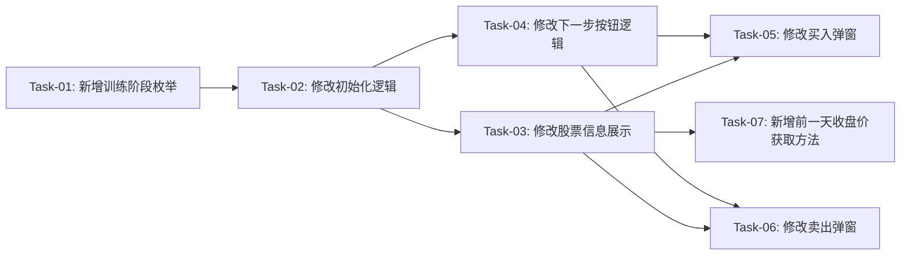

# 实战页面股票信息与交易价格优化 — 开发任务计划

## 1. 任务概览

**总任务数**：7 个
**预计总工时**：360 分钟（约 6 小时）
**开发方法**：TDD — 每个任务按 RED → GREEN → REFACTOR 循环执行

**关键标注**：
- 🔒 阻塞任务：被多个任务依赖，建议优先完成
- ⚠️ 风险任务：技术难度高，可能需要额外时间

### 依赖关系图

### 可并行任务组

| 并行组 | 任务 | 说明 |
|--------|------|------|
| 组1 | Task-05, Task-06 | 买入和卖出弹窗修改逻辑类似，可并行开发 |

---

## 2. 开发任务

### 阶段一：训练阶段状态管理

**阶段完成标准**：页面初始化时正确设置训练阶段为开盘阶段，状态能够正确切换

---

#### Task-01: 新增训练阶段枚举和状态变量 🔒

**通俗解释**：添加一个状态来追踪当前是开盘阶段还是收盘阶段

**做什么**：
1. 在 `battle_screen.dart` 中新增 `TrainingPhase` 枚举（opening/closing）
2. 添加 `_trainingPhase` 状态变量
3. 添加 `_currentDayIndex` 状态变量（如未存在）

**涉及文件**：`lib/features/battle/battle_screen.dart`

**参考**：技术方案 5.1 → AC-001, AC-006, AC-011

**依赖**：无

**预估工时**：30 分钟

**验证标准**（TDD RED 阶段直接转化为测试用例）：
- [ ] 初始化时 `_trainingPhase` 为 `TrainingPhase.opening`
- [ ] `_currentDayIndex` 初始值为历史天数（如 `_historyDays`）
- [ ] 状态切换后 `_trainingPhase` 值正确更新

---

### 阶段二：开盘阶段数据展示

**阶段完成标准**：开盘阶段正确显示开盘价、涨跌计算（基于昨收）、高/低等显示"--"

---

#### Task-02: 修改初始化逻辑 🔒

**通俗解释**：页面初始化时设置正确的初始状态

**做什么**：
1. 修改 `_initData()` 方法，初始化 `_trainingPhase` 为 `opening`
2. 确保初始化时加载足够的历史数据（包含前一天数据用于涨跌计算）

**涉及文件**：`lib/features/battle/battle_screen.dart`

**参考**：技术方案 6 → AC-001

**依赖**：Task-01

**预估工时**：20 分钟

**验证标准**：
- [ ] 页面初始化后 `_trainingPhase` 为 `opening`
- [ ] 历史数据包含前一天 K 线数据
- [ ] 初始显示日期为训练第一天

---

#### Task-03: 修改股票信息展示方法

**通俗解释**：根据训练阶段显示不同的价格和数据

**做什么**：
1. 修改 `_buildStockInfo()` 方法
2. 开盘阶段：显示开盘价+"开"，涨跌基于昨收计算，高/低/换手/量/金额显示"--"
3. 收盘阶段：显示收盘价+"收"，涨跌基于昨收计算，显示完整数据（高/低/换手/量/金额）

**涉及文件**：`lib/features/battle/battle_screen.dart`

**参考**：技术方案 5.2 → AC-001, AC-002, AC-003, AC-007, AC-008

**依赖**：Task-01, Task-02

**预估工时**：60 分钟

**验证标准**：
- [ ] 开盘阶段显示开盘价，价格后有"开"标识
- [ ] 开盘阶段涨跌额 = 开盘价 - 前一天收盘价
- [ ] 开盘阶段高、低、换手、量、金额显示"--"
- [ ] 收盘阶段显示收盘价，价格后有"收"标识
- [ ] 收盘阶段涨跌额 = 收盘价 - 前一天收盘价
- [ ] 收盘阶段显示当日最高价、最低价

---

### 阶段三：训练阶段切换逻辑

**阶段完成标准**：点击下一步按钮能正确切换阶段或进入下一天

---

#### Task-04: 修改下一步按钮逻辑

**通俗解释**：点击下一步时，开盘阶段切换到收盘阶段，收盘阶段进入下一天

**做什么**：
1. 修改 `_nextDay()` 方法
2. 开盘阶段：切换到收盘阶段，不改变日期
3. 收盘阶段：进入下一天，重置为开盘阶段
4. 最后一天收盘阶段：弹出训练结束对话框

**涉及文件**：`lib/features/battle/battle_screen.dart`

**参考**：技术方案 5.4 → AC-006, AC-007, AC-011, AC-014

**依赖**：Task-01, Task-02

**预估工时**：40 分钟

**验证标准**：
- [ ] 开盘阶段点击下一步 → 切换到收盘阶段，日期不变
- [ ] 收盘阶段点击下一步（非最后一天）→ 进入下一天，重置为开盘阶段
- [ ] 最后一天收盘阶段点击下一步 → 弹出训练结束对话框
- [ ] 阶段切换时股票信息区域自动更新

---

### 阶段四：交易价格限制

**阶段完成标准**：开盘阶段买卖价格限制在高低价之间，收盘阶段价格固定为收盘价

---

#### Task-05: 修改买入弹窗

**通俗解释**：买入弹窗根据训练阶段设置不同的价格规则

**做什么**：
1. 修改 `_showBuyDialog()` 方法，传递阶段信息
2. 修改 `_TradeDialog` 组件
3. 开盘阶段：价格可编辑，限制在 [最低价, 最高价]
4. 收盘阶段：价格固定为收盘价，只读状态

**涉及文件**：`lib/features/battle/battle_screen.dart`

**参考**：技术方案 5.3 → AC-004, AC-009, AC-012

**依赖**：Task-01, Task-03, Task-04

**预估工时**：60 分钟

**验证标准**：
- [ ] 开盘阶段打开买入弹窗，价格默认显示开盘价
- [ ] 开盘阶段输入价格低于最低价 → 显示错误提示
- [ ] 开盘阶段输入价格高于最高价 → 显示错误提示
- [ ] 收盘阶段打开买入弹窗，价格显示收盘价且只读

---

#### Task-06: 修改卖出弹窗

**通俗解释**：卖出弹窗根据训练阶段设置不同的价格规则

**做什么**：
1. 修改 `_showSellDialog()` 方法，传递阶段信息
2. 修改 `_TradeDialog` 组件（与买入共用）
3. 开盘阶段：价格可编辑，限制在 [最低价, 最高价]
4. 收盘阶段：价格固定为收盘价，只读状态
5. 无持仓时显示提示

**涉及文件**：`lib/features/battle/battle_screen.dart`

**参考**：技术方案 5.3 → AC-005, AC-010, AC-013

**依赖**：Task-01, Task-03, Task-04

**预估工时**：60 分钟

**验证标准**：
- [ ] 开盘阶段打开卖出弹窗，价格默认显示开盘价
- [ ] 开盘阶段输入价格低于最低价 → 显示错误提示
- [ ] 开盘阶段输入价格高于最高价 → 显示错误提示
- [ ] 收盘阶段打开卖出弹窗，价格显示收盘价且只读
- [ ] 无持仓时点击卖出 → 显示"没有持仓"提示

---

### 阶段五：涨跌计算支持

**阶段完成标准**：能够正确获取前一天收盘价用于涨跌计算

---

#### Task-07: 新增前一天收盘价获取方法

**通俗解释**：添加一个方法来获取前一天的收盘价

**做什么**：
1. 新增 `_getPrevDayClose()` 方法
2. 从 `_allKlineData` 中获取前一天数据的收盘价
3. 处理边界情况（第一天训练时无历史数据）

**涉及文件**：`lib/features/battle/battle_screen.dart`

**参考**：技术方案 5.2 → AC-002, AC-007, AC-016, AC-020

**依赖**：Task-03

**预估工时**：50 分钟

**验证标准**：
- [ ] 正常情况下能正确获取前一天收盘价
- [ ] 第一天训练时（无前一天数据）有合理的默认处理
- [ ] 计算的涨跌额和涨跌比例正确

---

## 3. AC 覆盖总表

| AC 编号 | 验收标准概述 | 承接任务 | 验证方式 |
|---------|-------------|---------|---------|
| AC-001 | 开盘阶段股票信息展示（开盘价+"开"） | Task-03 | 界面检查 |
| AC-002 | 开盘阶段涨跌计算（基于昨收） | Task-03, Task-07 | 计算结果验证 |
| AC-003 | 开盘阶段高/低/换手/量/金额显示"--" | Task-03 | 界面检查 |
| AC-004 | 开盘阶段买入价格限制 | Task-05 | 输入测试 |
| AC-005 | 开盘阶段卖出价格限制 | Task-06 | 输入测试 |
| AC-006 | 第一次点击下一步进入收盘阶段 | Task-04 | 流程测试 |
| AC-007 | 收盘阶段涨跌计算（基于昨收） | Task-03, Task-04, Task-07 | 计算结果验证 |
| AC-008 | 收盘阶段完整数据展示 | Task-03 | 界面检查 |
| AC-009 | 收盘阶段买入价格固定 | Task-05 | 界面检查+输入测试 |
| AC-010 | 收盘阶段卖出价格固定 | Task-06 | 界面检查+输入测试 |
| AC-011 | 第二次点击下一步进入下一天 | Task-04 | 流程测试 |
| AC-012 | 开盘阶段价格超限提示 | Task-05, Task-06 | 错误提示验证 |
| AC-013 | 收盘阶段无持仓卖出提示 | Task-06 | 提示验证 |
| AC-014 | 训练结束判断 | Task-04 | 边界测试 |
| AC-015 | 开盘阶段价格标识验证 | Task-03 | 界面检查 |
| AC-016 | 开盘阶段涨跌计算验证 | Task-03, Task-07 | 计算验证 |
| AC-017 | 开盘阶段未确定数据验证 | Task-03 | 界面检查 |
| AC-018 | 开盘阶段价格范围验证 | Task-05, Task-06 | 输入测试 |
| AC-019 | 收盘阶段价格标识验证 | Task-03 | 界面检查 |
| AC-020 | 收盘阶段涨跌计算验证 | Task-03, Task-07 | 计算验证 |
| AC-021 | 收盘阶段价格固定验证 | Task-05, Task-06 | 界面检查 |
| AC-022 | 训练阶段循环验证 | Task-04 | 流程测试 |

---

## 4. 完成定义

- [ ] 所有任务的验证标准（测试用例）通过
- [ ] AC 覆盖总表中每条 AC 的验证方式已执行并通过
- [ ] 实战页面能正常运行，无编译错误
- [ ] 开盘阶段和收盘阶段切换流畅，数据更新正确
- [ ] 交易价格限制功能正常工作
- [ ] 训练循环机制正确（点击两次下一步进入新一天）