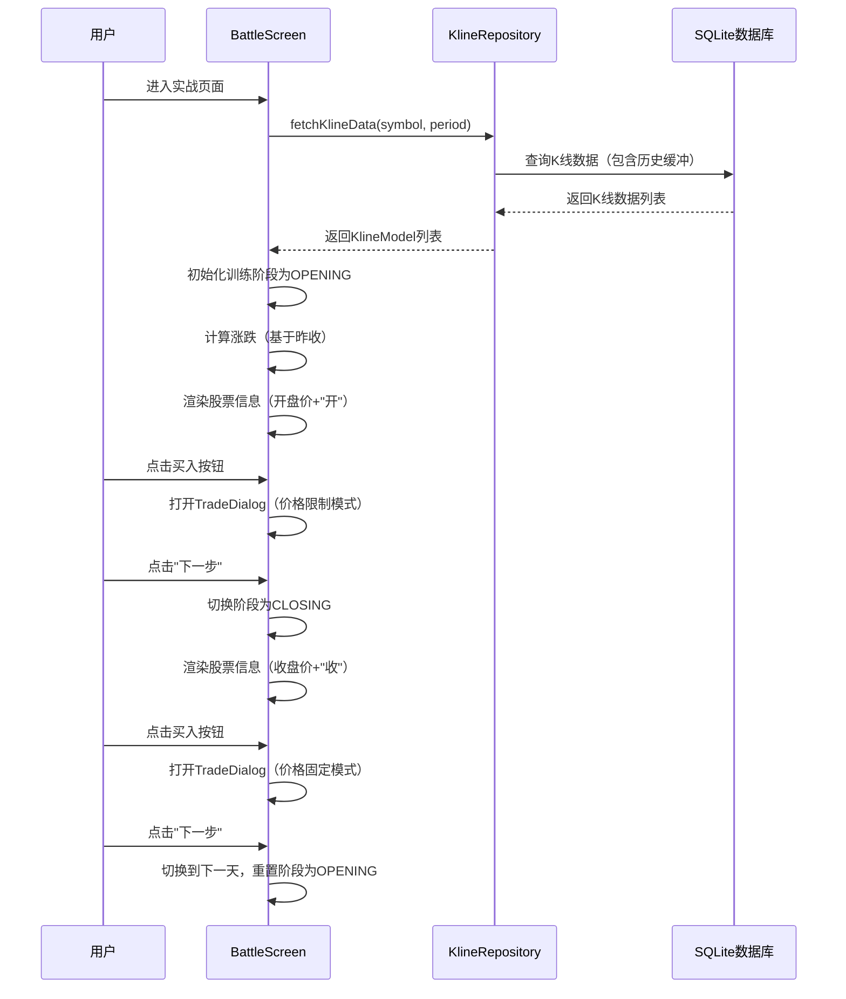
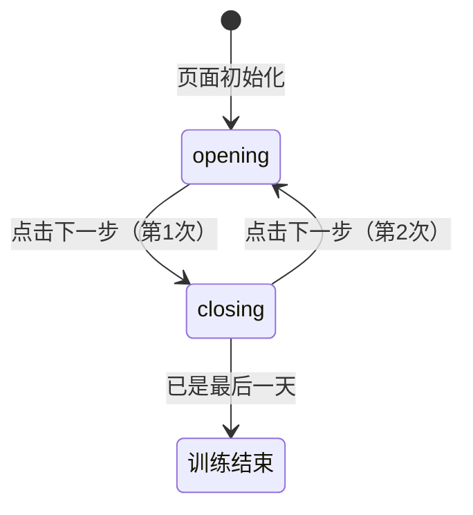

# 实战页面股票信息与交易价格优化 — 技术设计文档

## 1. 设计概要

**功能描述**：实现训练阶段感知的股票信息展示和交易价格限制，开盘阶段显示开盘价并限制价格在当日高低价之间，收盘阶段显示收盘价并固定交易价格。

**影响范围**：实战页面（battle_screen.dart）、交易弹窗组件、K线数据模型

**技术难点**：训练阶段状态管理、价格限制校验逻辑、前一天收盘价获取

**外部依赖**：KlineRepository（数据库读取）、KlineModel（K线数据模型）

---

## 2. 架构概览

### 2.1 模块职责

| 模块 | 职责 |
|------|------|
| BattleScreen | 训练阶段状态管理、股票信息展示、下一步按钮逻辑 |
| TradeDialog | 买入/卖出弹窗、价格输入校验、仓位计算 |
| KlineRepository | K线数据获取、前一天收盘价查询 |
| KlineModel | K线数据模型（包含开盘价、收盘价、最高价、最低价） |

### 2.2 核心流程图



---

## 3. 数据库设计

### 3.1 现有表复用

本功能主要复用现有的 `kline_data` 表，无需新增表。

#### `kline_data` 表（已存在）

**用途**：存储K线数据，包含开盘价、收盘价、最高价、最低价、成交量等

| 字段名 | 类型 | 约束 | 说明 |
|--------|------|------|------|
| id | INTEGER | PRIMARY KEY AUTOINCREMENT | 主键 |
| symbol | TEXT | NOT NULL | 股票代码 |
| period | TEXT | NOT NULL | 周期（day/week/month） |
| timestamp | INTEGER | NOT NULL | 时间戳 |
| open | REAL | NOT NULL | 开盘价 |
| high | REAL | NOT NULL | 最高价 |
| low | REAL | NOT NULL | 最低价 |
| close | REAL | NOT NULL | 收盘价 |
| volume | REAL | NOT NULL | 成交量 |
| turnover | REAL | | 成交额 |
| created_at | TIMESTAMP | DEFAULT CURRENT_TIMESTAMP | 创建时间 |

**索引**：`symbol_period_timestamp_idx`（加速按股票+周期+时间查询）

---

## 4. API 设计

本功能主要在前端实现，不涉及新的API接口。数据通过已有的 `KlineRepository.fetchKlineData()` 和 `fetchKlineDataFromDbWithDateRange()` 方法获取。

### 4.1 数据获取方法

#### `fetchKlineDataFromDbWithDateRange`

**描述**：从数据库按日期范围查询K线数据 → AC-001, AC-002, AC-007, AC-008

**参数**：
| 参数 | 类型 | 说明 |
|------|------|------|
| symbol | String | 股票代码 |
| period | String | 周期（如"day"） |
| startTime | DateTime | 开始日期 |
| endTime | DateTime | 结束日期 |

**返回**：`Future<List<KlineModel>>`

---

## 5. 核心逻辑

### 5.1 训练阶段状态管理 → AC-001, AC-006, AC-010

**触发条件**：页面初始化、点击下一步按钮

**状态定义**：
```dart
enum TrainingPhase {
  opening,  // 开盘阶段（第一次进入）
  closing,  // 收盘阶段（第一次点击下一步后）
}
```

**处理流程**：
1. 页面初始化时，设置阶段为 `opening`
2. 第一次点击"下一步"，阶段切换为 `closing`
3. 第二次点击"下一步"，阶段重置为 `opening`，并进入下一天

**状态流转**：


### 5.2 涨跌计算逻辑 → AC-002, AC-015

**触发条件**：训练阶段切换、进入新一天

**处理流程**：
1. 获取当前天数据（`_allKlineData[_currentDayIndex]`）
2. 获取前一天数据（`_allKlineData[_currentDayIndex - 1]`）
3. 根据当前阶段获取基准价格：
   - **开盘阶段**：基准 = 当前天开盘价
   - **收盘阶段**：基准 = 当前天收盘价
4. 计算涨跌额 = 基准 - 前一天收盘价
5. 计算涨跌比例 = 涨跌额 / 前一天收盘价 × 100%

**伪代码**：
```dart
double basePrice;
if (_trainingPhase == TrainingPhase.opening) {
  basePrice = currentKline.open;
} else {
  basePrice = currentKline.close;
}

double prevClose = _allKlineData[_currentDayIndex - 1].close;
double change = basePrice - prevClose;
double changePercent = (change / prevClose) * 100;
```

### 5.3 交易价格限制逻辑 → AC-004, AC-005, AC-008, AC-009

**触发条件**：打开买入/卖出弹窗

**处理流程**：
1. 根据当前阶段确定价格模式：
   - **开盘阶段**：价格可修改，限制在 [最低价, 最高价] 范围内
   - **收盘阶段**：价格固定为收盘价，不可修改
2. 在弹窗中设置价格输入框状态（可编辑/只读）
3. 开盘阶段时进行价格校验：
   - 如果输入价格 < 最低价 → 显示错误提示
   - 如果输入价格 > 最高价 → 显示错误提示
   - 否则允许提交

**价格校验伪代码**：
```dart
bool _validatePrice(double price) {
  if (_trainingPhase == TrainingPhase.closing) {
    return true; // 收盘阶段价格固定，无需校验
  }
  
  final currentKline = _allKlineData[_currentDayIndex];
  if (price < currentKline.low || price > currentKline.high) {
    // 显示错误提示
    return false;
  }
  return true;
}
```

### 5.4 下一步按钮逻辑 → AC-006, AC-010

**触发条件**：点击"下一步"按钮

**处理流程**：
1. 检查是否为最后一天训练：
   - 如果是最后一天且处于收盘阶段 → 弹出训练结束对话框
   - 否则继续
2. 根据当前阶段处理：
   - **开盘阶段**：切换到收盘阶段，不改变日期
   - **收盘阶段**：进入下一天，重置为开盘阶段
3. 更新可视区域（K线自动滑动）

**伪代码**：
```dart
void _nextDay() {
  // 检查是否到达最后一天
  final maxTrainingIndex = _historyDays + _trainingDays - 1;
  
  if (_trainingPhase == TrainingPhase.opening) {
    // 开盘阶段 → 收盘阶段（同一天）
    setState(() {
      _trainingPhase = TrainingPhase.closing;
    });
  } else {
    // 收盘阶段 → 下一天开盘阶段
    if (_currentDayIndex < maxTrainingIndex && _currentDayIndex < _allKlineData.length - 1) {
      setState(() {
        _currentDayIndex++;
        _trainingPhase = TrainingPhase.opening;
        // 更新可视区域
        _visibleStartIndex = (_currentDayIndex - _visibleKlineCount + 1)
            .clamp(0, _currentDayIndex);
        _updateAccount();
      });
    } else {
      // 训练结束
      _showTrainingCompleteDialog();
    }
  }
}
```

---

## 6. 现有代码改动

| 模块 / 文件 | 改动内容 | 原因 | 对应 AC |
|-------------|---------|------|---------|
| `lib/features/battle/battle_screen.dart` | 新增 `TrainingPhase` 枚举、`_trainingPhase` 状态变量 | 管理训练阶段状态 | AC-001, AC-006, AC-010 |
| `lib/features/battle/battle_screen.dart` | 修改 `_buildStockInfo()` 方法，根据阶段显示开盘价/收盘价和"开"/"收"标识 | 实现阶段感知的股票信息展示 | AC-001, AC-003, AC-007 |
| `lib/features/battle/battle_screen.dart` | 修改 `_nextDay()` 方法，实现阶段切换逻辑 | 实现阶段循环机制 | AC-006, AC-010 |
| `lib/features/battle/battle_screen.dart` | 修改 `_showBuyDialog()` 和 `_showSellDialog()` 方法，传递阶段信息 | 实现交易价格限制 | AC-004, AC-005, AC-008, AC-009 |
| `lib/features/battle/battle_screen.dart` | 修改 `_initData()` 方法，初始化阶段为 opening | 页面初始化设置 | AC-001 |
| `lib/features/battle/battle_screen.dart` | 新增 `_getPrevDayClose()` 方法，获取前一天收盘价 | 计算涨跌需要 | AC-002, AC-015 |
| `lib/features/battle/battle_screen.dart` | 修改 `_TradeDialog` 组件，支持价格限制和只读模式 | 实现交易价格动态限制 | AC-004, AC-005, AC-008, AC-009, AC-011 |

---

## 7. 技术决策

### 7.1 阶段状态存储方案

**背景**：需要在页面状态中管理训练阶段（开盘/收盘），决定采用哪种状态管理方式。

**选项**：
- A: 使用 `enum` + 状态变量 — 实现简单，适合单一页面状态管理
- B: 使用 Provider 全局状态 — 可跨组件共享，但增加复杂度

**结论**：选择 A。阶段状态仅在实战页面内部使用，不需要跨组件共享，使用简单的状态变量即可满足需求，避免过度设计。

### 7.2 价格校验时机

**背景**：开盘阶段需要限制价格在当日高低价之间，需要决定校验时机。

**选项**：
- A: 输入时实时校验 — 用户体验好，即时反馈
- B: 提交时校验 — 实现简单

**结论**：选择 A。实时校验能给用户更好的体验，避免填写完所有信息后才发现价格无效。

---

## 8. AC 覆盖总表

| AC 编号 | 验收标准概述 | 实现位置 |
|---------|-------------|---------|
| AC-001 | 开盘阶段股票信息展示（开盘价+"开"） | BattleScreen._buildStockInfo() |
| AC-002 | 开盘阶段涨跌计算（基于昨收） | BattleScreen._calculateChange() |
| AC-003 | 开盘阶段高/低/换手/量/金额显示"--" | BattleScreen._buildStockInfo() |
| AC-004 | 开盘阶段买入价格限制 | TradeDialog（价格校验逻辑） |
| AC-005 | 开盘阶段卖出价格限制 | TradeDialog（价格校验逻辑） |
| AC-006 | 第一次点击下一步进入收盘阶段 | BattleScreen._nextDay() |
| AC-007 | 收盘阶段完整数据展示 | BattleScreen._buildStockInfo() |
| AC-008 | 收盘阶段买入价格固定 | TradeDialog（只读模式） |
| AC-009 | 收盘阶段卖出价格固定 | TradeDialog（只读模式） |
| AC-010 | 第二次点击下一步进入下一天 | BattleScreen._nextDay() |
| AC-011 | 开盘阶段价格超限提示 | TradeDialog（输入校验） |
| AC-012 | 收盘阶段无持仓卖出提示 | BattleScreen._showSellDialog() |
| AC-013 | 训练结束判断 | BattleScreen._nextDay() |
| AC-014 | 开盘阶段价格标识验证 | BattleScreen._buildStockInfo() |
| AC-015 | 开盘阶段涨跌计算验证 | BattleScreen._calculateChange() |
| AC-016 | 开盘阶段未确定数据验证 | BattleScreen._buildStockInfo() |
| AC-017 | 开盘阶段价格范围验证 | TradeDialog（价格校验） |
| AC-018 | 收盘阶段价格标识验证 | BattleScreen._buildStockInfo() |
| AC-019 | 收盘阶段价格固定验证 | TradeDialog（只读状态） |
| AC-020 | 训练阶段循环验证 | BattleScreen._nextDay() |

---

## 附录：变更记录

| 日期 | 变更内容 | 原因 |
|------|---------|------|
| 2026-05-25 | 初始版本，完成技术方案设计 | 基于需求文档生成可操作的技术方案 |