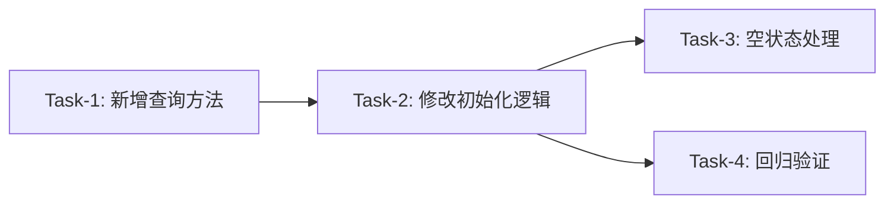

# 实战页面随机选股优化 — 开发任务计划

**版本**: v1.0  
**创建日期**: 2026-05-26  
**需求文档**: [实战页面随机选股优化需求](./实战页面随机选股优化需求.md)  
**技术方案**: [实战页面随机选股优化技术方案](./实战页面随机选股优化技术方案.md)

---

## 1. 任务概览

**总任务数**：4 个  
**预计总工时**：60 分钟（约 1 小时）  
**开发方法**：TDD — 每个任务按 RED → GREEN → REFACTOR 循环执行

**关键标注**：
- 🔒 阻塞任务：被多个任务依赖，建议优先完成
- ⚠️ 风险任务：技术难度高，可能需要额外时间

### 依赖关系图

### 切片划分

| 切片 | 名称 | AC | 说明 |
|:----:|------|:---:|------|
| 阶段1 | 基础设施 | AC-006, AC-007 | 新增 getSymbolsWithMinKlineData 方法 |
| 阶段2 | 随机选股核心 | AC-001, AC-003 | 修改 _initializeRandomStock 逻辑 |
| 阶段3 | 空状态处理 | AC-004 | 无数据时显示友好提示 |
| 阶段4 | 回归验证 | AC-002, AC-005 | 确保已有功能正常 |

---

## 2. 开发任务

### 阶段1: 基础设施 — 新增股票查询方法

**阶段完成标准**：能够从 kline_data 表查询有足够数据的股票列表

---

#### Task-1: 新增 getSymbolsWithMinKlineData 方法 🔒 ✅

**通俗解释**：系统能直接从 K 线数据表查询出有足够历史数据的股票

**做什么**：在 `KlineDao` 中新增 `getSymbolsWithMinKlineData(int minDays)` 方法，使用 GROUP BY + HAVING COUNT 查询有 >= minDays 条日线数据的股票

**涉及文件**：`lib/data/database/daos/kline_dao.dart`

**参考**：技术方案 3.1 数据库设计 → AC-006, AC-007

**依赖**：无

**预估工时**：20 分钟

**验证标准**（TDD RED 阶段直接转化为测试用例）：
- [x] 调用 `getSymbolsWithMinKlineData(210)` 当数据库有 >= 210 天数据的股票时 → 返回股票列表（非空）
- [x] 调用 `getSymbolsWithMinKlineData(210)` 当数据库没有 >= 210 天数据的股票时 → 返回空列表
- [x] 返回的 symbol 格式为纯数字（如 `600519`），不含 SH/SZ 前缀或 .XSHE/.XSHG 后缀
- [x] 返回结果包含 symbol 和 marketCode 字段

---

### 阶段2: 随机选股核心功能

**阶段完成标准**：实战页面初始化时能从数据库随机获取一只股票并加载 K 线数据

---

#### Task-2: 修改 _initializeRandomStock 方法 ✅

**通俗解释**：实战页面打开时自动从数据库找一只合适的股票开始训练

**做什么**：修改 `BattleScreen._initializeRandomStock()` 方法，调用新的 `getSymbolsWithMinKlineData()` 方法，根据结果随机选择股票或显示空状态

**涉及文件**：`lib/features/battle/battle_screen.dart`

**参考**：技术方案 4.1 核心逻辑 → AC-001, AC-003

**依赖**：Task-1

**预估工时**：20 分钟

**验证标准**（TDD RED 阶段直接转化为测试用例）：
- [x] 当数据库有符合条件的股票时 → `_currentSymbol` 被设置为随机选中的股票代码（纯数字格式）
- [x] 当数据库无符合条件的股票时 → 设置空状态标志 `_hasAvailableData = false`
- [x] symbol 参数格式与数据库一致（纯数字格式），能正确查询到 K 线数据
- [x] 加载 K 线数据后 `_allKlineData` 包含完整的历史 + 训练数据

---

### 阶段3: 空状态处理

**阶段完成标准**：数据库无数据时页面显示友好提示而非黑屏或错误

---

#### Task-3: 添加空状态 UI 显示 ✅

**通俗解释**：当没有可用股票训练时，页面告诉用户"暂无可训练股票"

**做什么**：在 `BattleScreen` 中添加空状态判断逻辑，当 `_hasAvailableData = false` 时显示空状态提示组件

**涉及文件**：`lib/features/battle/battle_screen.dart`

**参考**：技术方案 4.1 核心逻辑 → AC-004

**依赖**：Task-2

**预估工时**：10 分钟

**验证标准**（TDD RED 阶段直接转化为测试用例）：
- [x] 当 `_hasAvailableData = false` 时 → 页面显示"暂无可训练股票"提示文字
- [x] 空状态提示不显示 K 线图表或交易按钮
- [x] 提示信息友好，不显示技术错误信息

---

### 阶段4: 回归验证

**阶段完成标准**：确保首页选股跳转等已有功能不受本次修改影响

---

#### Task-4: 已有功能回归测试

**通俗解释**：之前能正常用的功能改完后还能用

**做什么**：
1. 验证从首页选股跳转实战页面功能正常（AC-005）
2. 验证 K 线数据加载和显示正常（AC-002）
3. 检查 symbol 格式在整个数据流中保持一致

**涉及文件**：`lib/features/battle/battle_screen.dart`、`lib/data/repositories/kline_repository.dart`

**参考**：技术方案 5. 现有代码改动 → AC-002, AC-005

**依赖**：Task-2

**预估工时**：10 分钟

**验证标准**（TDD RED 阶段直接转化为测试用例）：
- [ ] 从首页选股传入 `symbol=SH600000` 跳转实战页面 → 页面正常显示 K 线数据（格式兼容）
- [ ] 从首页选股传入 `symbol=600519`（纯数字）跳转实战页面 → 页面正常显示 K 线数据
- [ ] K 线图表正确渲染，显示数据条数符合预期（历史 + 训练天数）
- [ ] 底部导航栏、交易按钮等 UI 组件正常工作

---

## 3. AC 覆盖总表

| AC 编号 | 验收标准概述 | 承接任务 | 验证方式 |
|---------|-------------|---------|---------|
| AC-001 | 实战页面随机选股成功加载数据 | Task-2 | 数据库有数据时能正常加载并显示 |
| AC-002 | K 线数据显示正常 | Task-4 | K 线图表渲染正确，数据完整 |
| AC-003 | 实战页面初始化参数格式统一 | Task-2 | symbol 参数为纯数字格式，能正确查询 |
| AC-004 | 数据库无数据时显示空状态提示 | Task-3 | 无数据时显示"暂无可训练股票"提示 |
| AC-005 | 已有功能不受影响 | Task-4 | 首页选股跳转功能正常 |
| AC-006 | symbol 参数格式验证 | Task-1 | 返回的 symbol 格式正确（纯数字） |
| AC-007 | 数据量要求验证 | Task-1 | 筛选出 >= 210 天数据的股票 |

---

## 4. 完成定义

> 所有任务完成后，功能整体交付前的最终确认。

- [ ] Task-1 的所有验证标准通过（getSymbolsWithMinKlineData 方法正确实现）
- [ ] Task-2 的所有验证标准通过（随机选股功能正常）
- [ ] Task-3 的所有验证标准通过（空状态 UI 正确显示）
- [ ] Task-4 的所有验证标准通过（已有功能不受影响）
- [ ] AC 覆盖总表中每条 AC 的验证方式已执行并通过
- [ ] 模拟器测试：进入实战页面能正常显示 K 线数据或空状态提示
- [ ] 模拟器测试：从首页选股跳转实战页面功能正常

---

## 附录：变更记录

| 日期 | 变更内容 | 原因 |
|------|---------|------|
| 2026-05-26 | 初始版本 | 实战页面随机选股优化功能任务规划 |