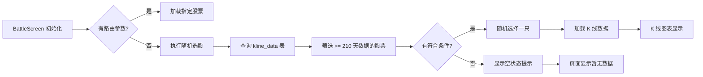

# 实战页面随机选股优化 — 技术设计方案

**版本**: v1.0  
**创建日期**: 2026-05-26  
**需求文档**: [实战页面随机选股优化需求](./实战页面随机选股优化需求.md)

---

## 1. 设计概要

**功能描述**：优化实战页面初始化时的随机选股逻辑，直接从 `kline_data` 表查询有足够数据的股票，不再依赖 `symbols` 表。

**影响范围**：
- `lib/data/database/daos/kline_dao.dart` - 新增查询方法
- `lib/features/battle/battle_screen.dart` - 修改初始化逻辑
- `lib/data/repositories/kline_repository.dart` - 可能需要调整

**技术难点**：
- 确保 symbol 参数格式与数据库 `kline_data` 表一致
- 高效查询有完整数据的股票列表

**外部依赖**：无

---

## 2. 架构概览

### 2.1 数据流图



### 2.2 模块职责

| 模块 / 文件 | 职责 |
|-----------|------|
| `kline_dao.dart` | 提供 `getSymbolsWithMinKlineData()` 方法直接从 kline_data 查询 |
| `battle_screen.dart` | 调用随机选股逻辑，根据结果决定显示内容 |

---

## 3. 数据库设计

### 3.1 新增方法

本次设计不涉及新增表，只在 `kline_dao.dart` 中新增查询方法。

#### `getSymbolsWithMinKlineData(int minDays)` → AC-001, AC-007

**用途**：直接从 `kline_data` 表查询有足够数据的股票列表

**SQL 设计**：
```sql
SELECT DISTINCT symbol, market_code
FROM kline_data
WHERE period = 'day'
GROUP BY symbol, market_code
HAVING COUNT(*) >= ?
ORDER BY symbol
```

**参数**：
- `minDays`: 最少需要的日线数据天数（默认 210 天：150 天训练 + 60 天预热）

**返回值**：包含 `symbol`（纯数字格式如 `600519`）和 `market_code` 的列表

→ 对应 AC-001（随机选股成功加载数据）

---

## 4. 核心逻辑

### 4.1 随机选股逻辑 → AC-001, AC-004

**触发条件**：BattleScreen 初始化时无路由参数（`widget.initialSymbol` 为空）

**处理流程**：
```
1. 调用 klineDao.getSymbolsWithMinKlineData(210)
2. 如果返回列表为空 → 显示"暂无可训练股票"提示
3. 如果返回列表非空 → 随机选择一只股票
4. 加载选中股票的 K 线数据
```

**伪代码**：
```dart
Future<void> _initializeRandomStock() async {
  final dbService = DatabaseService.instance;
  
  // 从 kline_data 表查询有足够数据的股票
  final symbols = await dbService.klineDao.getSymbolsWithMinKlineData(210);
  
  if (symbols.isEmpty) {
    // 显示空状态
    setState(() {
      _hasAvailableData = false;
      _errorMessage = '暂无可训练股票';
    });
    return;
  }
  
  // 随机选择一只股票
  final random = Random();
  final selectedSymbol = symbols[random.nextInt(symbols.length)];
  
  setState(() {
    _currentSymbol = selectedSymbol.symbol;  // 纯数字格式
    _currentMarketCode = selectedSymbol.marketCode;
  });
  
  // 加载 K 线数据
  await _loadKlineData();
}
```

→ 对应 AC-004（数据库无数据时显示空状态提示）

### 4.2 symbol 格式统一 → AC-003, AC-006

**背景**：数据库 `kline_data` 表存储的 symbol 格式可能是纯数字（如 `600519`），需要确保查询和存储格式一致。

**解决方案**：
- `getSymbolsWithMinKlineData` 返回的 symbol 统一为纯数字格式
- 后续查询 K 线数据时直接使用该格式，无需额外转换

**格式约定**：
| 格式类型 | 示例 | 说明 |
|--------|------|------|
| 纯数字 | `600519` | 数据库存储格式，本方案统一使用 |
| 带前缀 | `SH600519` | 老代码兼容，不推荐新使用 |
| 带后缀 | `600519.XSHE` | 外部 API 格式，需转换后使用 |

→ 对应 AC-003（参数格式统一）

### 4.3 K 线数据加载 → AC-002

**触发条件**：随机选股成功后

**处理流程**：
```
1. 计算查询范围：
   - startTime = 随机选择日期 - 100 天（历史数据）
   - endTime = 随机选择日期 + 150 天（训练数据）
2. 调用 klineDao.getKlineDataRange(symbol, period, startTime, endTime)
3. 更新 _allKlineData 并刷新 UI
```

→ 对应 AC-002（K 线数据显示正常）

---

## 5. 现有代码改动

| 模块 / 文件 | 改动内容 | 原因 | 对应 AC |
|-----------|---------|------|---------|
| `kline_dao.dart` | 新增 `getSymbolsWithMinKlineData()` 方法 | 直接从 kline_data 表查询有足够数据的股票 | AC-001 |
| `battle_screen.dart` | 修改 `_initializeRandomStock()` 方法 | 调用新的查询方法，适配 symbol 格式 | AC-001, AC-003, AC-004 |
| `battle_screen.dart` | 新增空状态处理 | 数据库无数据时显示友好提示 | AC-004 |

---

## 6. 技术决策

### 决策：直接从 kline_data 查询 vs 修复 symbols 表

**背景**：当前 `getSymbolsWithCompleteKlineData()` 方法依赖 `symbols` 表，但该表与 `kline_data` 表的 symbol 格式可能不一致，导致查询失败。

**选项**：
- **A: 修复 symbols 表数据** — 同步 symbols 表的 symbol 格式为纯数字
  - 优势：一劳永逸，所有功能都受益
  - 代价：需要数据迁移，可能影响其他功能

- **B: 直接从 kline_data 表查询** — 新增方法直接从 kline_data 查询
  - 优势：改动小，不影响现有功能
  - 代价：需要新增方法

**结论**：选择方案 B（直接查询）
**理由**：改动最小，不影响已有功能，符合本次需求范围

---

## 7. AC 覆盖总表

| AC 编号 | 验收标准概述 | 实现位置 |
|--------|-------------|---------|
| AC-001 | 实战页面随机选股成功加载数据 | 核心逻辑 4.1 `_initializeRandomStock()` |
| AC-002 | K 线数据显示正常 | 核心逻辑 4.3 `_loadKlineData()` |
| AC-003 | 实战页面初始化参数格式统一 | 核心逻辑 4.2 symbol 格式约定 |
| AC-004 | 数据库无数据时显示空状态提示 | 核心逻辑 4.1 空状态处理 |
| AC-005 | 已有功能不受影响 | 现有代码改动说明 |
| AC-006 | symbol 参数格式验证 | 数据库设计 3.1 SQL 查询 |
| AC-007 | 数据量要求验证 | 数据库设计 3.1 HAVING COUNT >= 210 |

---

## 8. 风险与注意事项

| 风险 | 影响 | 应对措施 |
|------|------|----------|
| 数据库初始化时 kline_data 表为空 | 随机选股返回空列表 | 页面显示友好提示，引导用户等待数据加载 |
| 查询性能问题 | kline_data 表数据量大时查询慢 | 使用 GROUP BY + HAVING COUNT 优化 |
| symbol 格式不统一 | 部分股票查询失败 | 统一使用纯数字格式 |

---

## 附录：变更记录

| 日期 | 变更内容 | 原因 |
|------|---------|------|
| 2026-05-26 | 初始版本 | 优化实战页面随机选股功能 |

---

**确认状态**: 待用户确认  
**优先级**: 高