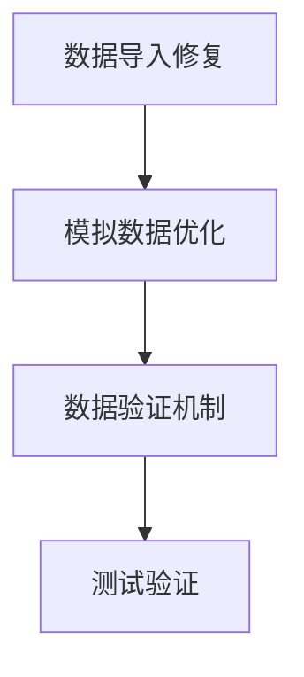

# 成交量图表修复 - 任务规划

**功能名称**: 实战页面成交量图表显示真实数据
**文档版本**: v1.0
**创建日期**: 2026-05-21
**需求追溯**: 实战页面的成交量目前每天图形是一样高的，需要从数据库获取真实成交量信息

---

## 1. 任务总览

| 阶段 | 任务数 | 预估工时 | 完成标准 |
|------|--------|---------|----------|
| 数据导入修复 | 2 | 2小时 | 成交量字段能正确导入数据库 |
| 模拟数据优化 | 2 | 1.5小时 | 模拟成交量有真实变化 |
| 数据验证机制 | 1 | 1小时 | 能检测异常数据并降级处理 |
| 测试验证 | 1 | 0.5小时 | 图表显示正常 |
| **合计** | **6** | **5小时** | |

---

## 2. 任务依赖图

---

## 3. 详细任务清单

### 阶段 1: 数据导入修复

#### 任务 1-1: 分析CSV文件字段结构

**通俗解释**: 查看CSV文件中有哪些字段，确认成交量字段名

**技术方案章节**: 2.2.1 数据导入修复

**验证标准**:
- 输入: CSV文件路径
- 输出: 字段名列表，确认成交量字段名（可能为volume/vol/amount等）

**关联AC**: 无（基础设施任务）

**预估工时**: 0.5小时

---

#### 任务 1-2: 修改数据导入脚本支持多字段名映射

**通俗解释**: 修改Python导入脚本，让它能识别不同的成交量字段名

**技术方案章节**: 2.2.1 数据导入修复

**验证标准**:
- 输入: CSV文件包含任意成交量字段名(volume/vol/amount)
- 输出: 数据正确导入kline_data表的volume字段

**关联AC**: 无（基础设施任务）

**预估工时**: 1.5小时

---

### 阶段 2: 模拟数据优化

#### 任务 2-1: 优化模拟数据生成算法

**通俗解释**: 修改模拟数据生成方法，让成交量有真实的波动变化

**技术方案章节**: 2.2.2 模拟数据优化

**验证标准**:
- 输入: 调用 `_generateMockData('SH600000', 20)`
- 输出: 返回的KlineModel列表中，volume字段值在300万~3000万之间，且最大值/最小值 > 1.1

**关联AC**: 无（基础设施任务）

**预估工时**: 1小时

---

#### 任务 2-2: 添加数据验证方法

**通俗解释**: 添加一个方法来检查数据是否正常，避免显示异常数据

**技术方案章节**: 2.2.3 数据验证机制

**验证标准**:
- 输入: 正常数据列表 → 输出: true
- 输入: 所有volume值相同的列表 → 输出: false

**关联AC**: 无（基础设施任务）

**预估工时**: 0.5小时

---

### 阶段 3: 数据验证集成

#### 任务 3-1: 在数据获取流程中集成验证逻辑

**通俗解释**: 在获取K线数据后进行验证，如果数据异常就使用模拟数据

**技术方案章节**: 2.2.3 数据验证机制

**验证标准**:
- 场景1: 数据库有有效数据 → 使用数据库数据
- 场景2: 数据库数据异常 → 自动切换到模拟数据
- 场景3: 数据库无数据 → 使用模拟数据

**关联AC**: 无（基础设施任务）

**预估工时**: 1小时

---

### 阶段 4: 测试验证

#### 任务 4-1: 验证成交量图表显示

**通俗解释**: 运行模拟器验证成交量图表显示正常

**技术方案章节**: 4.1 测试用例

**验证标准**:
- 进入实战页面
- 查看成交量图表，柱状图高度有明显差异
- 确认绿色/红色柱正确显示（涨红跌绿）

**关联AC**: 无（测试任务）

**预估工时**: 0.5小时

---

## 4. 验证计划

| 检查项 | 关联任务 | 验证方法 |
|--------|---------|---------|
| 数据导入正确 | 1-2 | 查询数据库kline_data表，确认volume字段有不同值 |
| 模拟数据正常 | 2-1 | 查看应用启动日志，确认生成的数据有合理波动 |
| 数据验证生效 | 3-1 | 测试空数据和异常数据场景 |
| 图表显示正常 | 4-1 | 模拟器中查看成交量柱状图有高度差异 |

---

## 5. 风险提示

| 风险 | 影响 | 应对措施 |
|------|------|---------|
| CSV字段名完全不匹配 | 成交量数据为空 | 支持多种常见字段名，日志记录未识别的字段 |
| 数据验证阈值过严 | 频繁切换到模拟数据 | 设置合理的阈值（10%差异） |
| 模拟器运行失败 | 无法验证 | 使用单元测试验证数据逻辑 |

---

## 6. 文档版本历史

| 版本 | 日期 | 修改内容 | 修改人 |
|-----|------|--------|-------|
| v1.0 | 2026-05-21 | 初始版本 | AI助手 |

