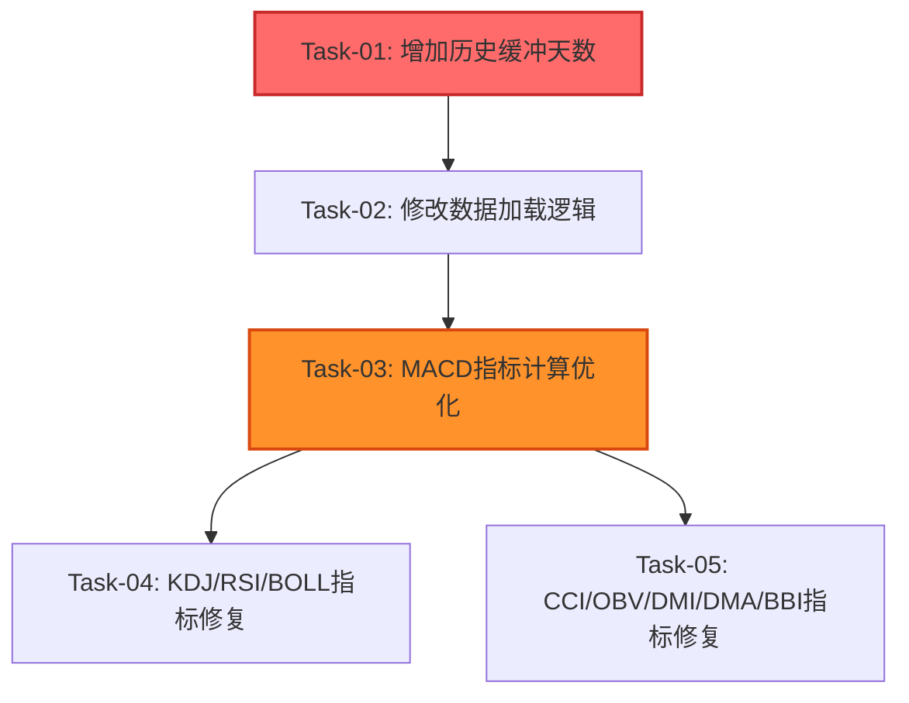

# 指标初始化显示真实值 — 开发任务计划

## 1. 任务概览

**总任务数**：5 个
**预计总工时**：90 分钟（约 1.5 小时）
**开发方法**：TDD — 每个任务按 RED → GREEN → REFACTOR 循环执行

**关键标注**：
- 🔒 阻塞任务：被多个任务依赖，建议优先完成
- ⚠️ 风险任务：技术难度高，可能需要额外时间

### 依赖关系图



### 可并行任务组

| 并行组 | 任务 | 说明 |
|--------|------|------|
| 组1 | Task-04, Task-05 | 两类指标修复逻辑相同，可以并行执行 |

---

## 2. 开发任务

> 按垂直切片组织。每个阶段对应一个可独立运行和验证的用户行为。
>
> 每个任务按 TDD 循环执行：RED（根据验证标准写测试）→ GREEN（写最小实现通过测试）→ REFACTOR（重构）

### 阶段1：增加历史缓冲

**阶段完成标准**：实战页面初始化时加载 250 天 K 线数据（100天历史 + 150天训练），训练起点在第 100 天

---

#### Task-01: 增加历史缓冲天数 🔒

**通俗解释**：让系统记住更多历史数据，这样技术指标有足够的时间"预热"，训练开始时就能显示真实的指标值

**做什么**：修改 `_historyDays` 常量，从 30 改为 100

**涉及文件**：`lib/features/battle/battle_screen.dart`

**参考**：技术方案 5.1 → AC-INDICATOR-001

**依赖**：无

**预估工时**：10 分钟

**验证标准**（TDD RED 阶段直接转化为测试用例）：
- [ ] 常量 `_historyDays` 值为 100
- [ ] 常量类型为 `int`
- [ ] 常量声明位置正确（类成员变量）

---

#### Task-02: 修改数据加载逻辑

**通俗解释**：确保进入实战页面时，系统能正确加载 250 天的 K 线数据，并且训练从第 100 天开始

**做什么**：
1. 修改 `_loadKlineData()` 方法中的总天数计算
2. 修改 `_currentDayIndex` 初始化值
3. 添加数据不足时的兜底加载逻辑
4. 调整 `_visibleStartIndex` 计算

**涉及文件**：`lib/features/battle/battle_screen.dart`

**参考**：技术方案 6.1.2 → AC-INDICATOR-001

**依赖**：Task-01

**预估工时**：20 分钟

**验证标准**（TDD RED 阶段直接转化为测试用例）：
- [ ] `_loadKlineData()` 中 `totalDays = _historyDays + _trainingDays` 计算正确
- [ ] 有训练起始日期时，正确计算 `startTime = _trainingStartDate - 100天`
- [ ] 数据不足时，尝试加载 `totalDays + 50` 天数据
- [ ] `_currentDayIndex` 初始化为 `_historyDays`（100）
- [ ] `_visibleStartIndex` 计算为 `(101 - _visibleKlineCount).clamp(0, 101)`
- [ ] 边界情况：数据库数据少于 250 天时，使用可用数据
- [ ] 异常情况：数据库无数据时，显示加载中状态

---

### 阶段2：MACD指标修复

**阶段完成标准**：MACD指标在初始化时显示真实计算值，不再显示横线（全为0）

---

#### Task-03: MACD指标计算优化 ⚠️

**通俗解释**：让MACD指标图表在训练第一天就能显示真实的红绿柱和DIF/DEA线，而不是一条平线

**做什么**：
1. 修改 `_displayMacdData` getter 的计算逻辑
2. 从历史起点（索引0）开始计算完整MACD
3. 构建包含真实值和padding的完整结果列表
4. 返回可视范围的指标数据

**涉及文件**：`lib/features/battle/battle_screen.dart`

**参考**：技术方案 6.1.3 → AC-INDICATOR-002

**依赖**：Task-02

**预估工时**：25 分钟

**验证标准**（TDD RED 阶段直接转化为测试用例）：
- [ ] 正常情况：`_allKlineData` 有 250 条数据，返回的 MACD 数据长度等于可视范围
- [ ] 正常情况：MACD结果中，索引 100 以后的值是真实计算值（非全0）
- [ ] 边界情况：`_allKlineData` 为空时，返回空列表
- [ ] 边界情况：`startIndex` 超出范围时，正确处理
- [ ] 边界情况：预热期（索引 0-25）的 MACD 值为 0
- [ ] 异常情况：`macdResult.macd` 长度异常时，不抛出异常
- [ ] 验证：MACD柱状图颜色正确（正值红色，负值绿色）

---

### 阶段3：其他指标修复

**阶段完成标准**：KDJ、RSI、BOLL、CCI、OBV、DMI、DMA、BBI 所有指标在初始化时显示真实值

---

#### Task-04: KDJ/RSI/BOLL指标修复

**通俗解释**：让KDJ、RSI、BOLL这三个常用技术指标在训练开始时就能显示真实的曲线和数值

**做什么**：
1. 修改 `_displayKdjData` getter，从历史起点计算完整KDJ
2. 修改 `_displayRsiData` getter，从历史起点计算完整RSI
3. 修改 `_displayBollData` getter，从历史起点计算完整BOLL
4. 统一使用与MACD相同的计算模式

**涉及文件**：`lib/features/battle/battle_screen.dart`

**参考**：技术方案 6.1.3 → AC-INDICATOR-003

**依赖**：Task-03

**预估工时**：20 分钟

**验证标准**（TDD RED 阶段直接转化为测试用例）：
- [ ] KDJ：K/D/J 三条线在训练起点有真实值（非全50）
- [ ] KDJ：预热期（索引 0-8）的值为 50
- [ ] RSI：RSI 线在训练起点有真实值（非全50）
- [ ] RSI：预热期（索引 0-13）的值为 50
- [ ] BOLL：上轨/中轨/下轨在训练起点有真实值
- [ ] BOLL：预热期使用收盘价近似值
- [ ] 边界情况：所有指标空数据时返回空列表
- [ ] 异常情况：数据长度不足时，不抛出 RangeError

---

#### Task-05: CCI/OBV/DMI/DMA/BBI指标修复

**通俗解释**：让CCI、OBV、DMI、DMA、BBI这五个技术指标在训练开始时也能显示真实的曲线和数值

**做什么**：
1. 修改 `_displayCciData` getter，从历史起点计算完整CCI
2. 修改 `_displayObvData` getter，从历史起点计算完整OBV
3. 修改 `_displayDmiData` getter，从历史起点计算完整DMI
4. 修改 `_displayDmaData` getter，从历史起点计算完整DMA
5. 修改 `_displayBbiData` getter，从历史起点计算完整BBI
6. 统一使用与MACD相同的计算模式

**涉及文件**：`lib/features/battle/battle_screen.dart`

**参考**：技术方案 6.1.3 → AC-INDICATOR-003

**依赖**：Task-03

**预估工时**：25 分钟

**验证标准**（TDD RED 阶段直接转化为测试用例）：
- [ ] CCI：CCI 线在训练起点有真实值
- [ ] CCI：预热期（索引 0-13）的值为 0
- [ ] OBV：OBV 线从第一天就有值（无预热期）
- [ ] DMI：+DI/-DI/ADX 三条线在训练起点有真实值
- [ ] DMI：预热期（索引 0-13）的值为 0
- [ ] DMA：DMA/AMA 两条线在训练起点有真实值
- [ ] DMA：预热期（索引 0-49）的值为 0
- [ ] BBI：BBI 线在训练起点有真实值
- [ ] BBI：预热期（索引 0-23）的值为 0
- [ ] 边界情况：所有指标空数据时返回空列表
- [ ] 异常情况：数据长度不足时，不抛出 RangeError

---

## 3. AC 覆盖总表

| AC 编号 | 验收标准概述 | 承接任务 | 验证方式 |
|---------|-------------|---------|---------|
| AC-INDICATOR-001 | 历史缓冲增加到 100 天，确保训练期指标有效 | Task-01, Task-02 | 检查 `_historyDays = 100`，验证 `_loadKlineData()` 加载 250 天数据 |
| AC-INDICATOR-002 | MACD 指标初始化时显示真实计算值，不再显示横线 | Task-03 | 启动实战页面，检查 MACD 图表在训练第一天显示真实红绿柱 |
| AC-INDICATOR-003 | KDJ/RSI/BOLL 等所有指标初始化时显示真实值 | Task-04, Task-05 | 切换不同指标，验证训练第一天都有真实曲线显示 |
| AC-INDICATOR-004 | 点击下一步时指标同步更新 | Task-02, Task-03, Task-04, Task-05 | 点击"下一步"，验证指标随 K 线同步推进 |
| AC-INDICATOR-005 | 指标与 K 线时间轴完全对齐 | Task-03, Task-04, Task-05 | 对比 K 线日期和指标数据，确保时间轴一致 |

---

## 4. 完成定义

> 所有任务完成后，功能整体交付前的最终确认。

- [ ] 所有任务的验证标准（测试用例）通过
- [ ] AC 覆盖总表中每条 AC 的验证方式已执行并通过
- [ ] 启动实战页面，MACD 指标在训练第一天显示真实值（非全0）
- [ ] 切换所有指标（KDJ/RSI/BOLL/CCI/OBV/DMI/DMA/BBI），均显示真实值
- [ ] 点击"下一步"推进 K 线，指标同步更新
- [ ] 左右滑动 K 线，指标随 K 线同步滑动
- [ ] 边界测试：数据库数据不足 250 天时，使用可用数据正常显示
- [ ] 异常测试：数据库无数据时，显示加载中状态，不崩溃

---

## 附录：开发顺序建议

### 推荐执行顺序

```
Task-01 (10分钟)
    ↓
Task-02 (20分钟)
    ↓
Task-03 (25分钟) ──→ Task-04 (20分钟)
    │                    │
    └────────────────────┘
           ↓
    Task-05 (25分钟)
```

### 快速验证清单

每完成一个任务，运行以下检查：

**Task-01 完成后**：
- [ ] 代码中 `_historyDays = 100`

**Task-02 完成后**：
- [ ] 启动应用，进入实战页面
- [ ] 检查日志或断点，确认加载了 250 天数据
- [ ] 确认 `_currentDayIndex = 100`

**Task-03 完成后**：
- [ ] 启动应用，进入实战页面
- [ ] 确认 MACD 图表显示红绿柱（非全0）
- [ ] 点击"下一步"，MACD 同步更新

**Task-04/05 完成后**：
- [ ] 切换每个指标，确认都显示真实曲线
- [ ] 点击"下一步"，所有指标同步更新

---

**文档版本**: v1.0
**创建日期**: 2026-05-21
**最后更新**: 2026-05-21
