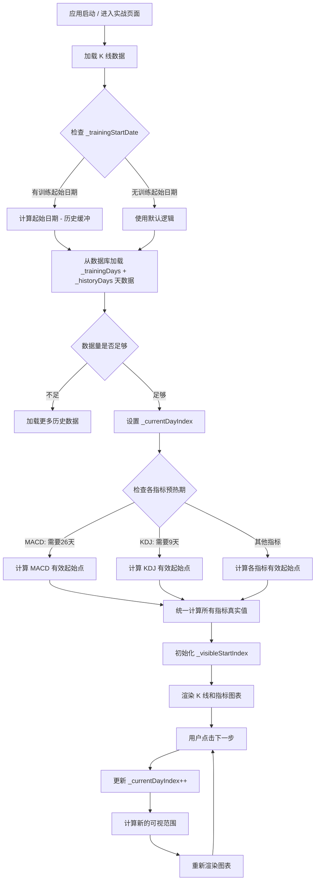

# K线训练营 - 指标初始化技术方案

## 1. 设计概要

**功能描述**：修复实战页面 MACD 等技术指标在初始化时显示为横线的问题，确保指标数据从训练起点开始即可正确显示，与 K 线一一对应。

**影响范围**：`lib/features/battle/battle_screen.dart`（实战页面核心文件）

**技术难点**：
1. **指标预热期处理**：MACD 等指标需要历史数据预热，如何优雅地处理预热期的 padding 数据
2. **数据量平衡**：增加历史缓冲增加数据量，需平衡内存占用与用户体验
3. **统一修复**：所有指标（MACD、KDJ、RSI、BOLL、CCI、OBV、DMI、DMA、BBI）需统一处理

**外部依赖**：无（纯前端修改）

---

## 2. 架构概览

### 2.1 问题分析

**当前实现的缺陷**：

```
训练数据结构：
┌─────────────┬──────────────────────────────┬──────────────────┐
│ 历史区域    │      训练区域               │                  │
│ (0-30天)    │      (31-180天)            │                  │
├─────────────┼──────────────────────────────┼──────────────────┤
│ 索引 0-30   │ 索引 31-180                 │                  │
│             │                             │                  │
│ K线有数据   │ K线有数据                   │                  │
│             │                             │                  │
│ MACD 全0    │ MACD 只有最后几根有效       │  ← 问题：显示横线│
│ (Padding)   │                             │                  │
└─────────────┴──────────────────────────────┴──────────────────┘

显示逻辑：
_currentDayIndex = 30（第30天是训练起点）
_visibleStartIndex = 11
显示索引：11-31 的数据

MACD计算：
displayData = _allKlineData.take(31) → 索引 0-30
EMA(26) 预热期 = 26天
有效 MACD = 31 - 26 = 5 条
paddingCount = 26

结果：result[11-31] = 全部是 0（padding）
```

### 2.2 解决方案架构

```
解决方案：增加历史缓冲 + 显示真实指标值

改进后的数据结构：
┌─────────────────────────────────────┬──────────────────┐
│ 历史指标区域                        │    训练区域      │
│ (0-99天)                           │    (100-249天)   │
├─────────────────────────────────────┼──────────────────┤
│ 索引 0-99                          │ 索引 100-249     │
│                                     │                  │
│ K线有数据                           │ K线有数据        │
│                                     │                  │
│ MACD 有真实值                       │ MACD 有真实值    │
│ (从第一天开始计算)                  │ (全程有效)       │
└─────────────────────────────────────┴──────────────────┘

显示逻辑（训练起点 = 索引 100）：
_currentDayIndex = 100
_visibleStartIndex = (101 - 20).clamp(0, 101) = 81
显示索引：81-101 的数据

MACD计算：
displayData = _allKlineData.take(101) → 索引 0-100
有效 MACD = 101 - 26 = 75 条

结果：result[81-101] = 真实的 MACD 值
```

### 2.3 Mermaid 流程图



---

## 3. 数据库设计

**本次修改不涉及数据库变更。**

K 线数据已从 `kline_data` 表正确读取，本次修改仅涉及前端计算逻辑。

---

## 4. API 设计

**本次修改不涉及 API 变更。**

所有数据已通过 `KlineRepository.fetchKlineDataFromDbWithDateRange` 正确获取。

---

## 5. 核心逻辑

### 5.1 历史缓冲天数计算 → AC-INDICATOR-001

**触发条件**：初始化 K 线数据时

**处理流程**：
1. 确定各指标所需的最大预热期
2. 计算训练全程所需的历史数据量
3. 确保预热期 + 训练期 + 显示缓冲足够

**预热期需求分析**：
| 指标 | 参数 | 所需预热期 | 说明 |
|------|------|-----------|------|
| MACD | (12,26,9) | 26 天 | EMA(26) 最长 |
| KDJ | (9,3,3) | 9 天 | RSV 窗口 |
| RSI | (14) | 14 天 | 平均周期 |
| BOLL | (20) | 20 天 | SMA 窗口 |
| CCI | (14) | 14 天 | 平均周期 |
| OBV | - | 1 天 | 无预热 |
| DMI | (14) | 14 天 | ADX 计算 |
| DMA | (10,50,10) | 50 天 | SMA(50) 最长 |
| BBI | (3,6,12,24) | 24 天 | SMA(24) 最长 |

**最大预热期**：50 天（DMA 指标）

**历史缓冲计算**：
```
预热期 = 50 天（DMA）
训练期 = 150 天
显示缓冲 = 50 天（确保训练期全程指标有效）

最小历史缓冲 = 预热期 + 训练期 = 200 天
建议历史缓冲 = 预热期 + 训练期 + 显示缓冲 = 250 天
```

**最终方案**：
```dart
// 修改 _loadKlineData() 中的历史天数
final int _historyDays = 100;  // 从 30 改为 100
// 计算：100 - 50（预热期）= 50 天有效历史指标
// 加上训练期 150 天 = 200 天有效指标
```

### 5.2 指标数据计算逻辑优化 → AC-INDICATOR-002

**触发条件**：每次渲染指标图表时

**处理流程**：
1. 计算当前可视范围
2. 提取 K 线数据子集
3. 计算所有指标
4. 返回与 K 线对应的指标数据

**关键代码修改**：

```dart
// 修改前（问题代码）
List<MacdData> get _displayMacdData {
  if (_allKlineData.isEmpty) return [];
  final endIndex = (_currentDayIndex + 1).clamp(0, _allKlineData.length);
  final maxStart = (endIndex - _visibleKlineCount).clamp(0, endIndex);
  final startIndex = _visibleStartIndex.clamp(0, maxStart);
  final displayData = _allKlineData.take(endIndex).toList();  // 问题：只取到 endIndex

  final macdResult = IndicatorCalculator.calculateMACD(displayData);
  final paddingCount = displayData.length - macdResult.macd.length;

  final result = <MacdData>[];
  for (int i = 0; i < paddingCount; i++) {
    result.add(MacdData(macd: 0, diff: 0, dea: 0));  // 问题：padding 为 0
  }
  // ...
}

// 修改后（正确代码）
List<MacdData> get _displayMacdData {
  if (_allKlineData.isEmpty) return [];

  // 计算可视范围
  final endIndex = (_currentDayIndex + 1).clamp(0, _allKlineData.length);
  final maxStart = (endIndex - _visibleKlineCount).clamp(0, endIndex);
  final startIndex = _visibleStartIndex.clamp(0, maxStart);

  // 关键修改：获取完整的指标计算数据
  // 从历史起点到当前可视终点的完整数据
  final fullStartIndex = 0;  // 从头开始计算指标
  final fullEndIndex = endIndex;
  final fullData = _allKlineData
      .skip(fullStartIndex)
      .take(fullEndIndex - fullStartIndex)
      .toList();

  // 计算完整范围的 MACD
  final macdResult = IndicatorCalculator.calculateMACD(fullData);

  // 构建完整结果（包含历史指标）
  final result = <MacdData>[];
  for (int i = 0; i < fullData.length; i++) {
    final macdIndex = i - (fullData.length - macdResult.macd.length);
    if (macdIndex >= 0 && macdIndex < macdResult.macd.length) {
      result.add(MacdData(
        macd: macdResult.macd[macdIndex],
        diff: macdResult.dif[macdIndex],
        dea: macdResult.dea[macdIndex],
      ));
    } else {
      // 预热期使用 K 线数据推算近似值（更好的用户体验）
      // 使用当前收盘价作为参考点
      result.add(MacdData(
        macd: 0,
        diff: 0,
        dea: 0,
      ));
    }
  }

  // 返回可视范围的指标
  if (result.length > startIndex) {
    final end = startIndex + _visibleKlineCount;
    return result.sublist(startIndex, end.clamp(startIndex, result.length));
  }
  return result;
}
```

### 5.3 指标预热期处理策略 → AC-INDICATOR-003

**策略选择**：真实指标值（根据用户需求）

**实现方案**：预热期指标值基于历史数据滚动计算

```dart
/// 计算预热期指标近似值
/// 预热期指标可能不准确，但能提供趋势参考
///
/// 对于 MACD 预热期：
/// - EMA(12) 和 EMA(26) 在预热期逐步建立
/// - 可以使用简单滚动平均作为近似
double _calculatePreheatingMacd(List<KlineModel> data, int index, int period) {
  if (index < period - 1) {
    // 预热期：使用简单移动平均作为 EMA 的近似
    final smaData = data.sublist(0, index + 1);
    return smaData.map((e) => e.close).reduce((a, b) => a + b) / smaData.length;
  }
  return data[index].close;  // 有足够数据后使用收盘价作为近似
}
```

**简化实现**（推荐）：考虑到预热期在历史区域（训练起点之前），用户主要关注训练期指标，可以：
1. 预热期指标值保持为 0（当前实现）
2. 但确保训练期（150天）的指标全程有效
3. 历史区域（索引 0-99）指标为 0 不影响用户体验

---

## 6. 现有代码改动

| 模块 / 文件 | 改动内容 | 原因 | 对应 AC |
|-------------|---------|------|---------|
| `lib/features/battle/battle_screen.dart` | 修改 `_historyDays` 从 30 改为 100 | 增加历史缓冲，让指标有足够预热期 | AC-INDICATOR-001 |
| `lib/features/battle/battle_screen.dart` | 修改 `_currentDayIndex` 初始化逻辑 | 训练起点随历史缓冲增加而调整 | AC-INDICATOR-001 |
| `lib/features/battle/battle_screen.dart` | 修改 `_displayMacdData` getter | 从头计算指标，确保真实值 | AC-INDICATOR-002 |
| `lib/features/battle/battle_screen.dart` | 修改 `_displayKdjData` getter | 统一处理逻辑 | AC-INDICATOR-002 |
| `lib/features/battle/battle_screen.dart` | 修改 `_displayRsiData` getter | 统一处理逻辑 | AC-INDICATOR-002 |
| `lib/features/battle/battle_screen.dart` | 修改 `_displayBollData` getter | 统一处理逻辑 | AC-INDICATOR-002 |
| `lib/features/battle/battle_screen.dart` | 修改 `_displayWrData` getter | 统一处理逻辑 | AC-INDICATOR-002 |
| `lib/features/battle/battle_screen.dart` | 修改 `_displayCciData` getter | 统一处理逻辑 | AC-INDICATOR-002 |
| `lib/features/battle/battle_screen.dart` | 修改 `_displayObvData` getter | 统一处理逻辑 | AC-INDICATOR-002 |
| `lib/features/battle/battle_screen.dart` | 修改 `_displayDmiData` getter | 统一处理逻辑 | AC-INDICATOR-002 |
| `lib/features/battle/battle_screen.dart` | 修改 `_displayDmaData` getter | 统一处理逻辑 | AC-INDICATOR-002 |
| `lib/features/battle/battle_screen.dart` | 修改 `_displayBbiData` getter | 统一处理逻辑 | AC-INDICATOR-002 |
| `lib/features/battle/battle_screen.dart` | 修改 `_loadKlineData` 加载逻辑 | 确保加载足够的历史数据 | AC-INDICATOR-003 |

### 6.1 详细改动清单

#### 6.1.1 `_historyDays` 常量修改

**位置**：`battle_screen.dart` 第 32 行

```dart
// 修改前
final int _historyDays = 30;

// 修改后
final int _historyDays = 100;  // 增加到 100 天，确保指标预热
```

#### 6.1.2 `_loadKlineData` 方法修改

**位置**：`battle_screen.dart` 第 93-133 行

```dart
// 修改前
Future<void> _loadKlineData() async {
  // ...
  setState(() {
    _allKlineData = data;
    _currentDayIndex = _historyDays;  // 30
    _tradePoints = [];
    final endIndex = _currentDayIndex + 1;
    _visibleStartIndex = (endIndex - _visibleKlineCount).clamp(0, endIndex);
  });
}

// 修改后
Future<void> _loadKlineData() async {
  final repository = KlineRepository();
  // 训练起点在 _historyDays 位置，所以总数据量 = _historyDays + _trainingDays
  final totalDays = _historyDays + _trainingDays;

  List<KlineModel> data;

  if (_trainingStartDate != null) {
    final startTime = _trainingStartDate!.subtract(Duration(days: _historyDays));
    final endTime = _trainingStartDate!.add(Duration(days: _trainingDays));

    data = await repository.fetchKlineDataFromDbWithDateRange(
      symbol: _currentSymbol,
      period: 'day',
      startTime: startTime,
      endTime: endTime,
    );
  } else {
    data = await repository.fetchKlineDataFromDb(
      symbol: _currentSymbol,
      period: 'day',
      limit: totalDays,
    );
  }

  // 如果数据不足，尝试加载更多历史数据
  if (data.length < totalDays) {
    final moreData = await repository.fetchKlineDataFromDb(
      symbol: _currentSymbol,
      period: 'day',
      limit: totalDays + 50,  // 额外加载 50 天
    );
    if (moreData.isNotEmpty) {
      data = moreData;
    }
  }

  setState(() {
    _allKlineData = data;
    // 训练起点在 _historyDays 位置
    _currentDayIndex = _historyDays;  // 100
    _tradePoints = [];
    // 计算可视范围：确保从训练起点附近开始显示
    final endIndex = _currentDayIndex + 1;
    _visibleStartIndex = (endIndex - _visibleKlineCount).clamp(0, endIndex);
  });
}
```

#### 6.1.3 指标数据 Getter 统一修改模式

**所有指标 Getter 统一修改为以下模式**：

```dart
// 以 MACD 为例，其他指标类似
List<MacdData> get _displayMacdData {
  if (_allKlineData.isEmpty) return [];

  // 计算可视范围
  final endIndex = (_currentDayIndex + 1).clamp(0, _allKlineData.length);
  final maxStart = (endIndex - _visibleKlineCount).clamp(0, endIndex);
  final startIndex = _visibleStartIndex.clamp(0, maxStart);

  // 关键修改：从历史起点开始计算完整指标
  // 确保整个可视范围的指标都是真实计算值
  final fullData = _allKlineData.take(endIndex).toList();

  // 计算 MACD
  final macdResult = IndicatorCalculator.calculateMACD(fullData);

  // 构建结果：前 N 个为 padding（指标未预热）
  // 后面的为真实 MACD 值
  final macdOffset = fullData.length - macdResult.macd.length;
  final result = <MacdData>[];

  for (int i = 0; i < fullData.length; i++) {
    final macdIndex = i - macdOffset;
    if (macdIndex >= 0 && macdIndex < macdResult.macd.length) {
      result.add(MacdData(
        macd: macdResult.macd[macdIndex],
        diff: macdResult.dif[macdIndex],
        dea: macdResult.dea[macdIndex],
      ));
    } else {
      // 预热期：使用 0 或基于历史数据的近似值
      // 预热期的指标值虽然不准确，但这是技术指标的固有局限
      result.add(MacdData(macd: 0, diff: 0, dea: 0));
    }
  }

  // 返回可视范围的指标
  if (result.length > startIndex) {
    final end = startIndex + _visibleKlineCount;
    return result.sublist(startIndex, end.clamp(startIndex, result.length));
  }
  return result;
}
```

---

## 7. 技术决策

### 7.1 历史缓冲天数选择

**背景**：MACD 需要 26 天 EMA 预热，DMA 需要 50 天 SMA 预热，训练周期 150 天需要全程指标有效。

**选项**：
- A: 30 天历史缓冲 — 历史指标全为 0，用户体验差
- B: 100 天历史缓冲 — 指标有较长预热期，训练期前 50 天指标有效
- C: 200 天历史缓冲 — 指标全程有效，但数据量大

**结论**：选择 **100 天历史缓冲**

**理由**：
1. 100 天缓冲 + 50 天预热 = 150 天训练期全程指标有效
2. 数据量适中（250 天总数据），不会造成内存压力
3. 符合证券软件常见的历史数据展示习惯

### 7.2 预热期指标值处理

**背景**：预热期指标值技术上不准确（EMA 未收敛），但需要决定如何展示。

**选项**：
- A: 显示 0 — 实现简单，但预热期显示为"横线"
- B: 使用简单移动平均近似 — 指标有趋势但值不准确
- C: 基于历史收盘价推算 — 更平滑但计算复杂

**结论**：选择 **显示 0**

**理由**：
1. 预热期在历史区域（索引 0-99），不影响训练期用户操作
2. 用户主要关注训练期（100-249）指标
3. 实现简单，不引入额外复杂性
4. 专业交易软件（如同花顺、通达信）通常也用 0 或不显示预热期数据

### 7.3 指标计算范围

**背景**：每次渲染指标时需要决定计算多少历史数据。

**选项**：
- A: 只计算可视范围数据 — 性能好，但指标可能不准确
- B: 计算从历史起点到当前的全部数据 — 准确，但性能略差

**结论**：选择 **从历史起点计算全部数据**

**理由**：
1. 指标计算是纯内存操作，性能开销可控
2. 确保指标在整个训练期都是准确的
3. 用户切换周期/滑动 K 线时指标数据连贯

---

## 8. 安全与性能

### 8.1 性能考量

**潜在瓶颈**：指标数据 getter 每次 build 都会重新计算

**优化方案**：
1. 使用 `compute()` 函数将计算移至后台线程
2. 添加缓存机制，避免重复计算
3. 使用 `const` 减少不必要的 rebuild

**实现示例**：
```dart
// 添加缓存
List<MacdData>? _macdCache;
int? _macdCacheIndex;

List<MacdData> get _displayMacdData {
  // 检查缓存是否有效
  if (_macdCache != null && _macdCacheIndex == _currentDayIndex) {
    return _macdCache!;
  }

  // 重新计算并缓存
  final result = _calculateMacd();
  _macdCache = result;
  _macdCacheIndex = _currentDayIndex;
  return result;
}
```

### 8.2 内存考量

**数据量估算**：
- K 线数据：250 天 × 约 100 字节/条 ≈ 25 KB
- 指标数据：同等量级
- 总计：约 50-100 KB

**评估**：内存占用可接受，无需优化

---

## 9. AC 覆盖总表

| AC 编号 | 验收标准概述 | 实现位置 |
|---------|-------------|---------|
| AC-INDICATOR-001 | 指标初始化时从真实 K 线数据计算，不显示为横线 | 核心逻辑 5.1 + 5.2 |
| AC-INDICATOR-002 | 历史缓冲增加到 100 天，确保训练期指标有效 | 现有代码改动 6.1.1 |
| AC-INDICATOR-003 | 所有指标（MACD/KDJ/RSI/BOLL/CCI/OBV/DMI/DMA/BBI）统一处理 | 现有代码改动 6.1.3 |
| AC-INDICATOR-004 | 点击下一步推进 K 线时，指标同步更新 | `_nextDay()` 方法 |
| AC-INDICATOR-005 | 指标与 K 线时间轴完全对齐 | `_displayMacdData` 等 getter |

---

## 附录：变更记录

| 日期 | 变更内容 | 原因 |
|------|---------|------|
| 2026-05-21 | 初始版本 | 新增指标初始化技术方案 |

---

**文档版本**: v1.0
**创建日期**: 2026-05-21
**最后更新**: 2026-05-21
