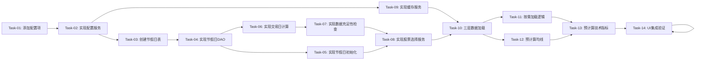

# 指标预加载与缓存优化 — 开发任务计划

## 1. 任务概览

**总任务数**：14 个
**预计总工时**：420 分钟（约 7 小时）
**开发方法**：TDD — 每个任务按 RED → GREEN → REFACTOR 循环执行

**关键标注**：
- 🔒 阻塞任务：被多个任务依赖，建议优先完成
- ⚠️ 风险任务：技术难度高，可能需要额外时间

### 依赖关系图

---

## 2. 开发任务

### 基础设施层

**阶段完成标准**：定义系统配置项并实现配置服务，为后续开发奠定基础

---

#### Task-01: 添加三层数据加载配置项到 systemConfigs 🔒

**通俗解释**：在 ConfigDao 中添加训练和指标相关的配置项，使用数据库的 systemConfigs 表存储，便于后续调优

**做什么**：
- 在 `ConfigDao.initSystemConfigs()` 方法中添加三个系统配置项：
  - `training.days` = "150"（训练周期天数）
  - `training.preload_days` = "100"（预加载数据天数）
  - `training.indicator_preload_days` = "33"（指标前置数据天数）
- 配置项归类到 "training" 分类下

**涉及文件**：`lib/data/database/daos/config_dao.dart`

**依赖**：无

**预估工时**：15 分钟

**验证标准**：
- [ ] 验证 `ConfigDao.getConfig("training.days")` 返回 "150"
- [ ] 验证 `ConfigDao.getConfig("training.preload_days")` 返回 "100"
- [ ] 验证 `ConfigDao.getConfig("training.indicator_preload_days")` 返回 "33"
- [ ] 验证配置项的 category 为 "training"

---

#### Task-02: 实现 TrainingConfigService 配置服务 🔒

**通俗解释**：创建配置服务，封装对 training 相关配置项的读取，提供类型安全的配置访问接口

**做什么**：
- 创建 `lib/features/battle/services/training_config_service.dart`
- 实现 `TrainingConfigService` 类：
  - 提供 `getTrainingDays()` 方法，返回 `int` 类型
  - 提供 `getPreloadDays()` 方法，返回 `int` 类型
  - 提供 `getIndicatorPreloadDays()` 方法，返回 `int` 类型
  - 提供 `getTotalPreloadDays()` 方法，返回 `preloadDays + indicatorPreloadDays`
  - 提供 `getRequiredTradingDays()` 方法，返回 `trainingDays + preloadDays + indicatorPreloadDays`
  - 内部调用 `ConfigDao` 读取配置值，进行类型转换
  - 配置不存在时提供默认值回退

**涉及文件**：`lib/features/battle/services/training_config_service.dart`

**依赖**：Task-01

**预估工时**：30 分钟

**验证标准**：
- [ ] `TrainingConfigService.getTrainingDays()` 返回 150
- [ ] `TrainingConfigService.getPreloadDays()` 返回 100
- [ ] `TrainingConfigService.getIndicatorPreloadDays()` 返回 33
- [ ] `TrainingConfigService.getTotalPreloadDays()` 返回 133（100 + 33）
- [ ] `TrainingConfigService.getRequiredTradingDays()` 返回 283（150 + 100 + 33）

---

### 第一阶段：节假日表设计

**阶段完成标准**：实现节假日表和相关服务，支持中国A股节假日查询

---

#### Task-03: 创建节假日表定义 🔒

**通俗解释**：创建节假日表的 Drift 定义，用于存储中国A股的节假日数据

**做什么**：
- 创建 `lib/data/database/tables/holidays.dart`
- 定义 `Holidays` 表结构：
  - `date`: TEXT PRIMARY KEY（yyyy-MM-dd 格式）
  - `isHoliday`: BOOLEAN NOT NULL
  - `holidayName`: TEXT NULLABLE
- 在 `AppDatabase` 中注册节假日表

**涉及文件**：
- `lib/data/database/tables/holidays.dart`
- `lib/data/database/app_database.dart`

**依赖**：无

**预估工时**：20 分钟

**验证标准**：
- [ ] Holidays 表定义正确
- [ ] 表能够被数据库创建
- [ ] 能够插入和查询节假日数据

---

#### Task-04: 实现节假日 DAO 🔒

**通俗解释**：创建节假日数据访问对象，提供节假日查询功能

**做什么**：
- 创建 `lib/data/database/daos/holiday_dao.dart`
- 实现 `HolidayDao` 类：
  - `isHoliday(DateTime date)`: 检查指定日期是否为节假日
  - `insertHoliday(DateTime date, bool isHoliday, String? name)`: 插入节假日
  - `countTradingDays(DateTime startDate, DateTime endDate)`: 计算日期范围内的工作日数

**涉及文件**：`lib/data/database/daos/holiday_dao.dart`

**依赖**：Task-03

**预估工时**：30 分钟

**验证标准**：
- [ ] `isHoliday()` 对周末返回 true
- [ ] `isHoliday()` 对插入的节假日返回 true
- [ ] `countTradingDays()` 正确计算工作日数（排除节假日和周末）

---

#### Task-05: 实现节假日初始化服务 🔒

**通俗解释**：创建节假日初始化服务，应用启动时自动生成中国A股节假日数据

**做什么**：
- 创建 `lib/data/services/holiday_initializer.dart`
- 实现 `HolidayInitializer` 类：
  - 生成当年及前后1-2年的节假日数据
  - 生成以下节假日：
    - 国庆节（10月1日至7日）
    - 元旦（1月1日）
    - 清明节（4月4日至6日）
    - 劳动节（5月1日至3日）
    - 端午节（农历五月初五前后各1天）
    - 中秋节（农历八月十五前后各1天）
    - 春节（农历正月初一前后各3天）
  - 在数据库应用启动时自动初始化

**涉及文件**：`lib/data/services/holiday_initializer.dart`

**依赖**：Task-04

**预估工时**：45 分钟

**验证标准**：
- [ ] 节假日数据正确插入数据库
- [ ] 国庆节、春节等主要节假日都被正确标记
- [ ] 节假日初始化在应用启动时自动执行

---

### 第二阶段：工作日计算服务

**阶段完成标准**：实现交易日计算和数据充足性检查服务

---

#### Task-06: 实现交易日计算服务 🔒 ⚠️

**通俗解释**：创建交易日计算服务，使用节假日表精确计算工作日对应的日历天数

**做什么**：
- 创建 `lib/data/services/trading_day_calculator.dart`
- 实现 `TradingDayCalculator` 类：
  - `tradingDaysToCalendarDays(int tradingDays, DateTime endDate)`: 计算从结束日期往回N个交易日对应的日历天数
  - 逐日往前计算，查询节假日表判断是否为工作日
  - 考虑周末和节假日

**涉及文件**：`lib/data/services/trading_day_calculator.dart`

**依赖**：Task-04

**预估工时**：30 分钟

**验证标准**：
- [ ] 给定 endDate = 2025-05-31，tradingDays = 283，估算日历天数约 320
- [ ] 计算结果考虑周末和节假日
- [ ] 计算结果正确（283个工作日对应的日历天数）

---

#### Task-07: 实现数据充足性检查服务 🔒 ⚠️

**通俗解释**：创建数据充足性检查服务，检查加载的数据是否满足需求（≥ 283个工作日）

**做什么**：
- 创建 `lib/data/services/data_sufficiency_checker.dart`
- 实现 `DataSufficiencyResult` 数据类：
  - `isSufficient`: 是否充足
  - `reason`: 原因
  - `availableDays`: 可用工作日数
  - `requiredDays`: 需求工作日数
  - `shortage`: 缺口（可选）
- 实现 `DataSufficiencyChecker` 类：
  - `checkSufficiency(List<KlineModel> data, int requiredTradingDays)`: 检查数据充足性
  - 计算 K 线数据覆盖的实际工作日数
  - 返回充足性结果

**涉及文件**：`lib/data/services/data_sufficiency_checker.dart`

**依赖**：Task-06

**预估工时**：30 分钟

**验证标准**：
- [ ] 给定 320 个工作日的 K 线数据，requiredTradingDays = 283，返回 isSufficient = true
- [ ] 给定 180 个工作日的 K 线数据，requiredTradingDays = 283，返回 isSufficient = false
- [ ] 返回结果包含 availableDays、requiredDays、shortage 等信息

---

#### Task-08: 实现股票选择服务 🔒 ⚠️

**通俗解释**：创建股票选择服务，数据不充足时自动切换到数据充足的股票

**做什么**：
- 创建 `lib/data/services/stock_selector.dart`
- 实现 `StockSelectionResult` 数据类：
  - `symbol`: 选中的股票代码
  - `data`: 股票数据
  - `sufficiencyCheck`: 充足性检查结果
  - `isAutoSelected`: 是否自动选择
  - `error`: 错误信息（可选）
- 实现 `StockSelector` 类：
  - `selectSufficientStock(preferredStartDate, totalRequiredDays)`: 选择数据充足的股票
  - 遍历所有股票，检查数据充足性
  - 找到数据充足的股票则返回
  - 找不到则返回错误

**涉及文件**：`lib/data/services/stock_selector.dart`

**依赖**：Task-07

**预估工时**：45 分钟

**验证标准**：
- [ ] 当所有股票数据都不足时，返回 error 信息
- [ ] 当找到数据充足的股票时，返回该股票信息和充足性检查结果
- [ ] isAutoSelected 正确标识是否自动选择

---

### 第三阶段：缓存服务实现

**阶段完成标准**：实现 LRU 缓存服务，支持存储、读取、淘汰缓存数据

---

#### Task-09: 实现 IndicatorCacheService 缓存服务 🔒 ⚠️

**通俗解释**：创建一个缓存管理服务，用来存储和读取已计算的指标数据，避免重复查询数据库

**做什么**：
- 创建 `lib/features/battle/services/indicator_cache_service.dart`
- 实现 `IndicatorCache` 数据类：
  - `cacheKey`: 缓存键
  - `dataLength`: 数据长度
  - `startDate/endDate`: 数据日期范围
  - `klineData`: K线数据
  - `indicators`: 预计算的指标数据
  - `createdAt`: 创建时间
- 实现 `IndicatorCacheService` 服务类：
  - `put()`: 存储缓存（自动 LRU 淘汰）
  - `get()`: 读取缓存（自动 LRU 更新）
  - `findMatch()`: 查找匹配的缓存
  - `clearBySymbol()`: 清除指定股票的缓存
  - `clearAll()`: 清除所有缓存
  - `getStats()`: 获取缓存统计信息

**涉及文件**：`lib/features/battle/services/indicator_cache_service.dart`

**依赖**：Task-02（需要使用 TrainingConfigService 常量定义缓存容量）

**预估工时**：60 分钟

**验证标准**：
- [ ] 缓存容量达到 50 个时，新增缓存自动淘汰最旧的缓存项
- [ ] 读取缓存后，缓存项自动移到 LRU 队列末尾
- [ ] 传入 `cacheKey = "600519.XSHG_100"` 存储缓存，传入相同 key 能读取到相同缓存
- [ ] 调用 `clearBySymbol("600519.XSHG")` 清除指定股票的缓存
- [ ] 调用 `clearAll()` 清除所有缓存后，`get()` 返回 null

---

### 第四阶段：三层数据加载

**阶段完成标准**：修改 `_loadKlineData` 方法，实现从数据库加载训练周期 + 预加载数据 + 指标前置数据的三层数据加载

---

#### Task-10: 实现三层数据加载逻辑 🔒 ⚠️

**通俗解释**：修改数据加载逻辑，使用工作日精确计算，让系统一次性加载训练数据、预加载的历史数据、以及用于计算指标的前置数据

**做什么**：
- 修改 `BattleProvider._loadKlineData()` 方法
- 注入 `TradingDayCalculator`、`DataSufficiencyChecker`、`StockSelector` 依赖
- 添加三层数据范围计算逻辑：
  - 使用 `TradingDayCalculator.tradingDaysToCalendarDays()` 精确计算日历天数
  - 计算 `dataLoadStart = trainingStart - 精确计算的日历天数`
  - 调用 `fetchKlineDataFromDbWithDateRange()` 查询扩展数据
- 添加数据充足性检查
- 处理数据不足 283 天的边界情况

**涉及文件**：`lib/features/battle/providers/battle_provider.dart`

**依赖**：Task-02、Task-06、Task-07、Task-08

**预估工时**：60 分钟

**验证标准**：
- [ ] 日志显示"精确日历天: XXX"
- [ ] 给定 `trainingStart = 2020-01-01`，验证加载的数据范围包含足够的工作日
- [ ] 数据不足时，日志显示"当前股票数据不足，自动切换..."
- [ ] 数据充足时，正常继续初始化流程

---

#### Task-11: 实现按需加载逻辑 ⚠️

**通俗解释**：当用户缩放或左滑K线图时，根据新的可见范围动态加载所需的数据

**做什么**：
- 在 `BattleProvider` 中添加 `_loadDataForRange()` 方法
- 使用 `TrainingConfigService` 读取配置值
- 实现按需加载流程：
  - 接收 `visibleKlineCount`、`visibleStart`、`visibleEnd` 参数
  - 使用 `TradingDayCalculator` 计算 `dataStart`
  - 检查缓存是否命中且覆盖范围
  - 缓存未命中时调用 `_loadExtendedKlineData()` 加载新数据
  - 预计算指标并更新缓存
- 实现异步加载，不阻塞 UI

**涉及文件**：`lib/features/battle/providers/battle_provider.dart`

**依赖**：Task-09

**预估工时**：60 分钟

**验证标准**：
- [ ] 给定 `visibleKlineCount = 700`，验证 `dataStart = visibleStart - 33天`
- [ ] 给定缓存命中且覆盖范围，直接使用缓存数据，不查询数据库
- [ ] 给定缓存未命中，调用数据库查询并预计算指标
- [ ] 给定加载过程中，UI 不会被阻塞（异步执行）

---

### 第五阶段：指标预计算

**阶段完成标准**：预计算均线和所有技术指标，确保从最早数据点开始就能正常显示

---

#### Task-12: 预计算均线 MA5/MA10/MA30 🔒

**通俗解释**：在从数据库加载的完整K线数据上预计算5日、10日、30日均线，确保用户缩放或左滑到K线图最左侧时，均线曲线从最早数据点开始就是真实计算值

**做什么**：
- 在 `BattleState` 中添加均线数据存储字段：
  - `precomputedMa5`: List<double>
  - `precomputedMa10`: List<double>
  - `precomputedMa30`: List<double>
- 在 `BattleProvider` 中添加 `_precomputeMA()` 方法
- 在从数据库加载的完整K线数据（283天）上预计算均线
- 确保均线数组长度与K线数据长度一致
- 所有均线值都是真实计算的，不需要填充0
- 均线计算公式：
  - MA5 = (C1 + C2 + C3 + C4 + C5) / 5
  - MA10 = (C1 + C2 + ... + C10) / 10
  - MA30 = (C1 + C2 + ... + C30) / 30

**涉及文件**：
- `lib/features/battle/models/battle_state.dart`
- `lib/features/battle/providers/battle_provider.dart`
- `lib/data/utils/indicator_calculator.dart`

**依赖**：Task-10（需要三层数据加载提供的完整K线数据）

**预估工时**：30 分钟

**验证标准**：
- [ ] 给定283天完整K线数据，验证 `ma5` 数组长度为283
- [ ] 给定283天完整K线数据，验证 `ma5[0]` ~ `ma5[4]` 都是真实计算的均线值（不是0）
- [ ] 给定283天完整K线数据，验证 `ma10` 数组长度为283
- [ ] 给定283天完整K线数据，验证 `ma30` 数组长度为283

---

#### Task-13: 预计算技术指标（MACD/KDJ/RSI等） ⚠️

**通俗解释**：在从数据库加载的完整K线数据上预计算MACD、KDJ、RSI等技术指标，确保用户缩放或左滑到K线图最左侧时，指标曲线从最早数据点开始就是真实计算值

**做什么**：
- 增强 `BattleProvider._precomputeIndicators()` 方法
- 在从数据库加载的完整K线数据（283天）上预计算所有技术指标
- 确保所有指标计算方法返回与K线数据长度一致的数组
- 所有指标值都是真实计算的，不需要填充0
- 覆盖所有技术指标：
  - 成交量（基础数据，无需前置）
  - MACD（需33天EMA预热，但在真实数据上计算）
  - KDJ（需9天RSV预热，但在真实数据上计算）
  - RSI（需14天预热，但在真实数据上计算）
  - 布林带（需20天预热，但在真实数据上计算）
  - DMI（需14天预热，但在真实数据上计算）
  - CCI（需14天预热，但在真实数据上计算）
  - WR（需14天预热，但在真实数据上计算）
  - OBV（基础数据，无需前置）
  - DMA（需10天预热，但在真实数据上计算）
  - BBI（需24天预热，但在真实数据上计算）

**涉及文件**：
- `lib/features/battle/providers/battle_provider.dart`
- `lib/data/utils/indicator_calculator.dart`

**依赖**：Task-12

**预估工时**：45 分钟

**验证标准**：
- [ ] 给定283天完整K线数据，验证 `macd` 数组长度为283
- [ ] 给定283天完整K线数据，验证 `macd[0]` ~ `macd[32]` 都是真实计算的MACD值（不是MacdData(0, 0, 0)）
- [ ] 给定283天完整K线数据，验证 `kdj` 数组长度为283
- [ ] 给定283天完整K线数据，验证 `kdj[0]` ~ `kdj[8]` 都是真实计算的KDJ值
- [ ] 给定283天完整K线数据，验证 `rsi` 数组长度为283
- [ ] 给定283天完整K线数据，验证 `boll` 数组长度为283

---

### 第六阶段：UI 集成和验证

**阶段完成标准**：集成三层数据加载和按需加载到 UI 层，验证所有指标在 K 线图最左侧正常显示

---

#### Task-14: UI 层集成和端到端验证 🔒 ⚠️

**通俗解释**：将三层数据加载和按需加载逻辑集成到实战页面，让用户缩放或左滑时能看到连续的均线和指标曲线

**做什么**：
- 修改 `BattleScreen` 或相关 Widget，触发 `_loadDataForRange()` 方法
- 处理缩放事件（`onScaleUpdate`）并调用按需加载
- 处理左滑事件并调用按需加载
- 在缩放/加载过程中显示轻量级 loading 提示（可选）
- 端到端测试：
  - 缩放到 700 根 K 线，验证均线和指标从最早数据点正常显示
  - 缩放到 100 根 K 线，验证均线和指标从最早数据点正常显示
  - 左滑到最左侧，验证均线无断档显示
  - 验证边界情况（数据不足 283 天时自动切换股票）

**涉及文件**：
- `lib/features/battle/battle_screen.dart` 或相关 Widget
- `lib/features/battle/widgets/kline_chart_container.dart`

**依赖**：Task-11、Task-12、Task-13

**预估工时**：60 分钟

**验证标准**：
- [ ] 缩放到 700 根 K 线时，MA5/MA10/MA30 从最早可见 K 线开始显示曲线（非横线）
- [ ] 缩放到 700 根 K 线时，MACD 从最早可见 K 线开始显示（非横线或空白）
- [ ] 缩放到 100 根 K 线时，KDJ/RSI/布林带从最早可见 K 线开始显示
- [ ] 左滑到最左侧时，所有均线和指标无断档地正常显示
- [ ] 日志显示"数据充足性: true"和"数据充足"
- [ ] 日志显示加载的日历天数（约320天）

---

## 3. AC 覆盖总表

| AC 编号 | 验收标准概述 | 承接任务 | 验证方式 |
|---------|-------------|---------|---------|
| AC-001 | 精确计算需要的日历天数（查询节假日表） | Task-06 | 验证 tradingDaysToCalendarDays 计算结果 |
| AC-002 | 缩放到700根K线时加载 | Task-11 | 验证按需加载触发和数据范围 |
| AC-003 | 缩放到100根K线时加载 | Task-11 | 验证按需加载触发和数据范围 |
| AC-004 | 训练日索引正确计算 | Task-07 | 验证 DataSufficiencyResult 信息 |
| AC-005 | 数据不足时自动切换股票 | Task-08 | 验证 StockSelector 返回正确结果 |
| AC-006 | 所有股票都不足时显示错误 | Task-08 | 验证返回 error 信息 |
| AC-007 | MA5/MA10/MA30从最早数据点显示 | Task-12 | 验证均线数组从真实数据计算 |
| AC-008 | MACD从最早数据点显示（非横线） | Task-13 | 验证MACD数组从真实数据计算 |
| AC-009 | KDJ/RSI/布林带从最早数据点显示 | Task-13 | 验证各指标数组从真实数据计算 |
| AC-010 | 任意缩放级别左滑到最左侧时指标正常显示 | Task-14 | 端到端验证指标显示 |
| AC-011 | 缓存命中时不重复查询数据库 | Task-09 | 验证缓存命中时跳过数据库查询 |
| AC-012 | 不同股票清除旧缓存 | Task-09 | 验证 clearBySymbol 清除缓存 |
| AC-013 | 缓存达到50个时自动淘汰 | Task-09 | 验证 LRU 淘汰最旧缓存 |
| AC-014 | 首次加载响应时间 < 300ms | Task-14 | 性能测试验证响应时间 |
| AC-015 | 缓存命中响应时间 < 10ms | Task-14 | 性能测试验证响应时间 |
| AC-016 | 异步加载不阻塞UI | Task-11 | 验证加载过程异步执行 |
| AC-017 | 数据不足283天时使用所有可用数据 | Task-10 | 验证数据不足时的处理 |
| AC-018 | 数据完全不存在时显示错误提示 | Task-10 | 验证错误提示显示 |
| AC-019 | 左滑到数据库最早日期时显示提示 | Task-14 | 端到端验证边界提示 |

---

## 4. 完成定义

- [ ] 所有任务的验证标准（测试用例）通过
- [ ] AC 覆盖总表中每条 AC 的验证方式已执行并通过
- [ ] 端到端测试：缩放和左滑操作流畅，指标显示正常
- [ ] 日志验证：显示"精确日历天: XXX"和"数据充足性: true"
- [ ] 性能测试：首次加载 < 300ms，缓存命中 < 10ms
- [ ] 边界情况测试：数据不足自动切换股票等异常情况处理正确
- [ ] UI 集成测试：加载过程中不阻塞用户交互

---

## 附录：变更记录

| 日期 | 变更内容 | 原因 |
|------|---------|------|
| 2026-05-20 | 初始版本 | 根据技术方案生成 |
| 2026-05-20 | 把硬编码常量改为可配置项 | 便于后续时间或周期变化调优 |
| 2026-05-20 | 修正指标预计算描述 | 强调在真实数据上计算，不是填充0 |
| 2026-05-20 | 把均线计算作为独立任务 | 强调均线是K线图的重要基础组成部分 |
| 2026-05-31 | 合并数据查询逻辑问题分析 | 发现使用日历天而非工作日计算的问题 |
| 2026-05-31 | 添加节假日表相关任务 | Task-03~Task-05：节假日表设计 |
| 2026-05-31 | 添加工作日计算相关任务 | Task-06~Task-08：工作日计算服务 |
| 2026-05-31 | 更新三层数据加载任务 | Task-10：使用工作日精确计算 |
| 2026-05-31 | 更新验收标准 | 添加AC-001~AC-006等新验收标准 |
