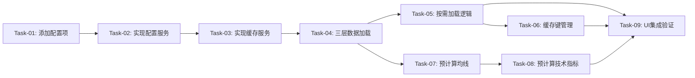

# 指标预加载与缓存优化 — 开发任务计划

## 1. 任务概览

**总任务数**：9 个
**预计总工时**：300 分钟（约 5 小时）
**开发方法**：TDD — 每个任务按 RED → GREEN → REFACTOR 循环执行

**关键标注**：
- 🔒 阻塞任务：被多个任务依赖，建议优先完成
- ⚠️ 风险任务：技术难度高，可能需要额外时间

### 依赖关系图

### 可并行任务组

| 并行组 | 任务 | 说明 |
|--------|------|------|
| 无 | - | 任务之间有强依赖关系，需要按顺序执行 |

---

## 2. 开发任务

> 按垂直切片组织。每个阶段对应一个可独立运行和验证的用户行为（加可选的基础设施层）。切片内部的任务按技术层自然顺序排列。
>
> 每个任务按 TDD 循环执行：RED（根据验证标准写测试）→ GREEN（写最小实现通过测试）→ REFACTOR（重构）

---

### 基础设施层

**阶段完成标准**：定义系统配置项并实现配置服务，为后续开发奠定基础

---

#### Task-01: 添加三层数据加载配置项到 systemConfigs 🔒

**通俗解释**：在 ConfigDao 中添加训练和指标相关的配置项，使用数据库的 systemConfigs 表存储，便于后续调优

**做什么**：
- 在 `ConfigDao.initSystemConfigs()` 方法中添加三个系统配置项：
  - `training.days` = "150"（训练周期天数）
  - `training.preload_days` = "100"（预加载数据天数）
  - `training.indicator_preload_days` = "33"（指标前置数据天数）
- 配置项归类到 "training" 分类下

**涉及文件**：`lib/data/database/daos/config_dao.dart`

**参考**：数据库设计 → AC-001

**依赖**：无

**预估工时**：15 分钟

**验证标准**（TDD RED 阶段直接转化为测试用例）：
- [ ] 验证 `ConfigDao.getConfig("training.days")` 返回 "150"
- [ ] 验证 `ConfigDao.getConfig("training.preload_days")` 返回 "100"
- [ ] 验证 `ConfigDao.getConfig("training.indicator_preload_days")` 返回 "33"
- [ ] 验证配置项的 category 为 "training"

---

#### Task-02: 实现 TrainingConfigService 配置服务 🔒

**通俗解释**：创建配置服务，封装对 training 相关配置项的读取，提供类型安全的配置访问接口

**做什么**：
- 创建 `lib/features/battle/services/training_config_service.dart`
- 实现 `TrainingConfigService` 类：
  - 提供 `getTrainingDays()` 方法，返回 `int` 类型
  - 提供 `getPreloadDays()` 方法，返回 `int` 类型
  - 提供 `getIndicatorPreloadDays()` 方法，返回 `int` 类型
  - 提供 `getTotalPreloadDays()` 方法，返回 `preloadDays + indicatorPreloadDays`
  - 内部调用 `ConfigDao` 读取配置值，进行类型转换
  - 配置不存在时提供默认值回退

**涉及文件**：`lib/features/battle/services/training_config_service.dart`

**参考**：技术方案 5.1 三层数据加载逻辑 → AC-001

**依赖**：Task-01

**预估工时**：30 分钟

**验证标准**（TDD RED 阶段直接转化为测试用例）：
- [ ] `TrainingConfigService.getTrainingDays()` 返回 150
- [ ] `TrainingConfigService.getPreloadDays()` 返回 100
- [ ] `TrainingConfigService.getIndicatorPreloadDays()` 返回 33
- [ ] `TrainingConfigService.getTotalPreloadDays()` 返回 133（100 + 33）

---

### 第一阶段：缓存服务实现

**阶段完成标准**：实现 LRU 缓存服务，支持存储、读取、淘汰缓存数据

---

#### Task-03: 实现 IndicatorCacheService 缓存服务 🔒 ⚠️

**通俗解释**：创建一个缓存管理服务，用来存储和读取已计算的指标数据，避免重复查询数据库

**做什么**：
- 创建 `lib/features/battle/services/indicator_cache_service.dart`
- 实现 `IndicatorCache` 数据类：
  - `cacheKey`: 缓存键
  - `dataLength`: 数据长度
  - `startDate/endDate`: 数据日期范围
  - `klineData`: K线数据
  - `indicators`: 预计算的指标数据
  - `createdAt`: 创建时间
- 实现 `IndicatorCacheService` 服务类：
  - `put()`: 存储缓存（自动 LRU 淘汰）
  - `get()`: 读取缓存（自动 LRU 更新）
  - `findMatch()`: 查找匹配的缓存
  - `clearBySymbol()`: 清除指定股票的缓存
  - `clearAll()`: 清除所有缓存
  - `getStats()`: 获取缓存统计信息

**涉及文件**：`lib/features/battle/services/indicator_cache_service.dart`

**参考**：技术方案 6. 缓存管理逻辑 → AC-008, AC-009, AC-010

**依赖**：Task-02（需要使用 TrainingConfigService 常量定义缓存容量）

**预估工时**：60 分钟

**验证标准**（TDD RED 阶段直接转化为测试用例）：
- [ ] 缓存容量达到 50 个时，新增缓存自动淘汰最旧的缓存项
- [ ] 读取缓存后，缓存项自动移到 LRU 队列末尾
- [ ] 传入 `cacheKey = "600519.XSHG_100"` 存储缓存，传入相同 key 能读取到相同缓存
- [ ] 调用 `clearBySymbol("600519.XSHG")` 清除指定股票的缓存
- [ ] 调用 `clearAll()` 清除所有缓存后，`get()` 返回 null
- [ ] `getStats()` 返回正确的缓存数量、最大容量和使用符号列表

---

### 第二阶段：三层数据加载

**阶段完成标准**：修改 `_loadKlineData` 方法，实现从数据库加载训练周期 + 预加载数据 + 指标前置数据的三层数据加载

---

#### Task-04: 实现三层数据加载逻辑 🔒

**通俗解释**：修改数据加载逻辑，让系统一次性加载训练数据、预加载的历史数据、以及用于计算指标的前置数据

**做什么**：
- 修改 `BattleProvider._loadKlineData()` 方法
- 注入 `TrainingConfigService` 依赖
- 添加三层数据范围计算逻辑：
  - 使用 `TrainingConfigService.getTotalPreloadDays()` 获取总前置天数
  - 计算 `dataLoadStart = trainingStart - totalPreloadDays`
  - 调用 `fetchKlineDataFromDbWithDateRange()` 查询扩展数据
- 添加数据充足性检查
- 处理数据不足 133 天的边界情况

**涉及文件**：`lib/features/battle/providers/battle_provider.dart`

**参考**：技术方案 5.1 三层数据加载逻辑 → AC-001, AC-014, AC-015

**依赖**：Task-02（需要使用 TrainingConfigService）

**预估工时**：45 分钟

**验证标准**（TDD RED 阶段直接转化为测试用例）：
- [ ] 给定 `trainingStart = 2020-01-01`，验证加载的数据范围是 `2019-09-01 ~ 2020-01-01`
- [ ] 给定 `trainingStart = 2020-01-01` 和 `trainingEnd = 2020-05-30`，验证加载的数据范围是 `2019-09-01 ~ 2020-05-30`
- [ ] 给定股票历史数据不足 133 天，系统应尽可能加载所有可用数据并打印警告日志
- [ ] 给定股票完全没有数据，系统返回空列表

---

#### Task-05: 实现按需加载逻辑 ⚠️

**通俗解释**：当用户缩放或左滑K线图时，根据新的可见范围动态加载所需的数据

**做什么**：
- 在 `BattleProvider` 中添加 `_loadDataForRange()` 方法
- 使用 `TrainingConfigService` 读取配置值
- 实现按需加载流程：
  - 接收 `visibleKlineCount`、`visibleStart`、`visibleEnd` 参数
  - 使用 `TrainingConfigService.getIndicatorPreloadDays()` 计算 `dataStart`
  - 检查缓存是否命中且覆盖范围
  - 缓存未命中时调用 `_loadExtendedKlineData()` 加载新数据
  - 预计算指标并更新缓存
- 实现异步加载，不阻塞 UI

**涉及文件**：`lib/features/battle/providers/battle_provider.dart`

**参考**：技术方案 5.2 按需加载逻辑 → AC-002, AC-003, AC-013

**依赖**：Task-03（需要使用缓存服务检查缓存）

**预估工时**：60 分钟

**验证标准**（TDD RED 阶段直接转化为测试用例）：
- [ ] 给定 `visibleKlineCount = 700`，验证 `dataStart = visibleStart - 33天`
- [ ] 给定缓存命中且覆盖范围，直接使用缓存数据，不查询数据库
- [ ] 给定缓存未命中，调用数据库查询并预计算指标
- [ ] 给定加载过程中，UI 不会被阻塞（异步执行）

---

#### Task-06: 实现缓存键管理和覆盖检查 🔒

**通俗解释**：实现缓存键的生成和匹配逻辑，确保相同缩放级别使用相同缓存

**做什么**：
- 在 `BattleProvider` 中添加 `_generateCacheKey()` 方法
  - 格式：`{symbol}_{visibleKlineCount}`
  - 例如：`600519.XSHG_700`
- 实现 `_coversRange()` 方法检查缓存是否覆盖请求范围
- 实现 `_applyCachedData()` 方法应用缓存数据到状态

**涉及文件**：`lib/features/battle/providers/battle_provider.dart`

**参考**：技术方案 6.1 缓存键生成、6.2 LRU 缓存实现 → AC-008

**依赖**：Task-03（需要使用 IndicatorCacheService 的数据结构）

**预估工时**：30 分钟

**验证标准**（TDD RED 阶段直接转化为测试用例）：
- [ ] `_generateCacheKey("600519.XSHG", 700)` 返回 `"600519.XSHG_700"`
- [ ] 给定缓存 `startDate = 2019-08-01, endDate = 2020-05-30`，请求 `startDate = 2019-09-01, endDate = 2020-05-30`，`_coversRange()` 返回 true
- [ ] 给定缓存 `startDate = 2019-09-01, endDate = 2020-05-30`，请求 `startDate = 2019-08-01, endDate = 2020-05-30`，`_coversRange()` 返回 false

---

### 第三阶段：指标预计算

**阶段完成标准**：预计算均线和所有技术指标，确保从最早数据点开始就能正常显示

---

#### Task-07: 预计算均线 MA5/MA10/MA30 🔒

**通俗解释**：在从数据库加载的完整K线数据上预计算5日、10日、30日均线，确保用户缩放或左滑到K线图最左侧时，均线曲线从最早数据点开始就是真实计算值

**做什么**：
- 在 `BattleState` 中添加均线数据存储字段：
  - `precomputedMa5`: List<double>
  - `precomputedMa10`: List<double>
  - `precomputedMa30`: List<double>
- 在 `BattleProvider` 中添加 `_precomputeMA()` 方法
- 在从数据库加载的完整K线数据（283天）上预计算均线
- 确保均线数组长度与K线数据长度一致
- 所有均线值都是真实计算的，不需要填充0
- 均线计算公式：
  - MA5 = (C1 + C2 + C3 + C4 + C5) / 5
  - MA10 = (C1 + C2 + ... + C10) / 10
  - MA30 = (C1 + C2 + ... + C30) / 30

**涉及文件**：
- `lib/features/battle/models/battle_state.dart`
- `lib/features/battle/providers/battle_provider.dart`
- `lib/data/utils/indicator_calculator.dart`

**参考**：技术方案 5.4 指标预计算逻辑 → AC-004

**依赖**：Task-04（需要三层数据加载提供的完整K线数据）

**预估工时**：30 分钟

**验证标准**（TDD RED 阶段直接转化为测试用例）：
- [ ] 给定283天完整K线数据，验证 `ma5` 数组长度为283
- [ ] 给定283天完整K线数据，验证 `ma5[0]` ~ `ma5[4]` 都是真实计算的均线值（不是0）
- [ ] 给定283天完整K线数据，验证 `ma10` 数组长度为283
- [ ] 给定283天完整K线数据，验证 `ma30` 数组长度为283
- [ ] 验证均线值计算正确（MA5取最近5天收盘价的均值）

---

#### Task-08: 预计算技术指标（MACD/KDJ/RSI等） ⚠️

**通俗解释**：在从数据库加载的完整K线数据上预计算MACD、KDJ、RSI等技术指标，确保用户缩放或左滑到K线图最左侧时，指标曲线从最早数据点开始就是真实计算值

**做什么**：
- 增强 `BattleProvider._precomputeIndicators()` 方法
- 在从数据库加载的完整K线数据（283天）上预计算所有技术指标
- 确保所有指标计算方法返回与K线数据长度一致的数组
- 所有指标值都是真实计算的，不需要填充0
- 覆盖所有技术指标：
  - 成交量（基础数据，无需前置）
  - MACD（需33天EMA预热，但在真实数据上计算）
  - KDJ（需9天RSV预热，但在真实数据上计算）
  - RSI（需14天预热，但在真实数据上计算）
  - 布林带（需20天预热，但在真实数据上计算）
  - DMI（需14天预热，但在真实数据上计算）
  - CCI（需14天预热，但在真实数据上计算）
  - WR（需14天预热，但在真实数据上计算）
  - OBV（基础数据，无需前置）
  - DMA（需10天预热，但在真实数据上计算）
  - BBI（需24天预热，但在真实数据上计算）

**涉及文件**：
- `lib/features/battle/providers/battle_provider.dart`
- `lib/data/utils/indicator_calculator.dart`

**参考**：技术方案 5.4 指标预计算逻辑 → AC-005, AC-006, AC-007

**依赖**：Task-07（均线计算完成后再计算技术指标）

**预估工时**：45 分钟

**验证标准**（TDD RED 阶段直接转化为测试用例）：
- [ ] 给定283天完整K线数据，验证 `macd` 数组长度为283
- [ ] 给定283天完整K线数据，验证 `macd[0]` ~ `macd[32]` 都是真实计算的MACD值（不是MacdData(0, 0, 0)）
- [ ] 给定283天完整K线数据，验证 `kdj` 数组长度为283
- [ ] 给定283天完整K线数据，验证 `kdj[0]` ~ `kdj[8]` 都是真实计算的KDJ值
- [ ] 给定283天完整K线数据，验证 `rsi` 数组长度为283
- [ ] 给定283天完整K线数据，验证 `boll` 数组长度为283

---

### 第四阶段：UI 集成和验证

**阶段完成标准**：集成三层数据加载和按需加载到 UI 层，验证所有指标在 K 线图最左侧正常显示

---

#### Task-09: UI 层集成和端到端验证 🔒 ⚠️

**通俗解释**：将三层数据加载和按需加载逻辑集成到实战页面，让用户缩放或左滑时能看到连续的均线和指标曲线

**做什么**：
- 修改 `BattleScreen` 或相关 Widget，触发 `_loadDataForRange()` 方法
- 处理缩放事件（`onScaleUpdate`）并调用按需加载
- 处理左滑事件并调用按需加载
- 在缩放/加载过程中显示轻量级 loading 提示（可选）
- 端到端测试：
  - 缩放到 700 根 K 线，验证均线和指标从最早数据点正常显示
  - 缩放到 100 根 K 线，验证均线和指标从最早数据点正常显示
  - 左滑到最左侧，验证均线无断档显示
  - 验证边界情况（数据不足 133 天时）

**涉及文件**：
- `lib/features/battle/battle_screen.dart` 或相关 Widget
- `lib/features/battle/widgets/kline_chart_container.dart`

**参考**：技术方案 2.2 模块交互关系 → AC-002, AC-003, AC-004, AC-005, AC-006, AC-007, AC-016

**依赖**：Task-05、Task-06、Task-07、Task-08（需要所有核心逻辑已完成）

**预估工时**：60 分钟

**验证标准**（TDD RED 阶段直接转化为测试用例）：
- [ ] 缩放到 700 根 K 线时，MA5/MA10/MA30 从最早可见 K 线开始显示曲线（非横线）
- [ ] 缩放到 700 根 K 线时，MACD 从最早可见 K 线开始显示（非横线或空白）
- [ ] 缩放到 100 根 K 线时，KDJ/RSI/布林带从最早可见 K 线开始显示
- [ ] 左滑到最左侧时，所有均线和指标无断档地正常显示
- [ ] 数据不足 133 天时，前置指标显示为 0，但不显示横线

---

## 3. AC 覆盖总表

> 最终检查：每条 AC 是否都有任务承接。这是全文档唯一的 AC 映射汇总。

| AC 编号 | 验收标准概述 | 承接任务 | 验证方式 |
|---------|-------------|---------|---------|
| AC-001 | 三层数据加载（150+100+33天） | Task-04 | 验证加载数据范围包含三层数据 |
| AC-002 | 缩放到700根K线时加载 | Task-05 | 验证按需加载触发和数据范围 |
| AC-003 | 缩放到100根K线时加载 | Task-05 | 验证按需加载触发和数据范围 |
| AC-004 | MA5/MA10/MA30从最早数据点显示 | Task-07 | 验证均线数组从真实数据计算 |
| AC-005 | MACD从最早数据点显示（非横线） | Task-08 | 验证MACD数组从真实数据计算 |
| AC-006 | KDJ/RSI/布林带从最早数据点显示 | Task-08 | 验证各指标数组从真实数据计算 |
| AC-007 | 任意缩放级别左滑到最左侧时指标正常显示 | Task-09 | 端到端验证指标显示 |
| AC-008 | 缓存命中时不重复查询数据库 | Task-03, Task-05, Task-06 | 验证缓存命中时跳过数据库查询 |
| AC-009 | 不同股票清除旧缓存 | Task-03 | 验证 clearBySymbol 清除缓存 |
| AC-010 | 缓存达到50个时自动淘汰 | Task-03 | 验证 LRU 淘汰最旧缓存 |
| AC-011 | 首次加载响应时间 < 300ms | Task-09 | 性能测试验证响应时间 |
| AC-012 | 缓存命中响应时间 < 10ms | Task-09 | 性能测试验证响应时间 |
| AC-013 | 异步加载不阻塞UI | Task-05 | 验证加载过程异步执行 |
| AC-014 | 数据不足283天时使用所有可用数据 | Task-04 | 验证数据不足时的处理 |
| AC-015 | 数据完全不存在时显示错误提示 | Task-04 | 验证错误提示显示 |
| AC-016 | 左滑到数据库最早日期时显示提示 | Task-09 | 端到端验证边界提示 |

---

## 4. 完成定义

> 所有任务完成后，功能整体交付前的最终确认。只列出跟这个功能相关的检查项，不要套用通用清单。

- [ ] 所有任务的验证标准（测试用例）通过
- [ ] AC 覆盖总表中每条 AC 的验证方式已执行并通过
- [ ] 端到端测试：缩放和左滑操作流畅，指标显示正常
- [ ] 性能测试：首次加载 < 300ms，缓存命中 < 10ms
- [ ] 边界情况测试：数据不足、股票不存在等异常情况处理正确
- [ ] UI 集成测试：加载过程中不阻塞用户交互

---

## 附录：变更记录

| 日期 | 变更内容 | 原因 |
|------|---------|------|
| 2026-05-20 | 初始版本 | 根据技术方案生成 |
| 2026-05-20 | 把硬编码常量改为可配置项 | 便于后续时间或周期变化调优 |
| 2026-05-20 | 修正指标预计算描述 | 强调在真实数据上计算，不是填充0 |
| 2026-05-20 | 把均线计算作为独立任务 | 强调均线是K线图的重要基础组成部分 |
