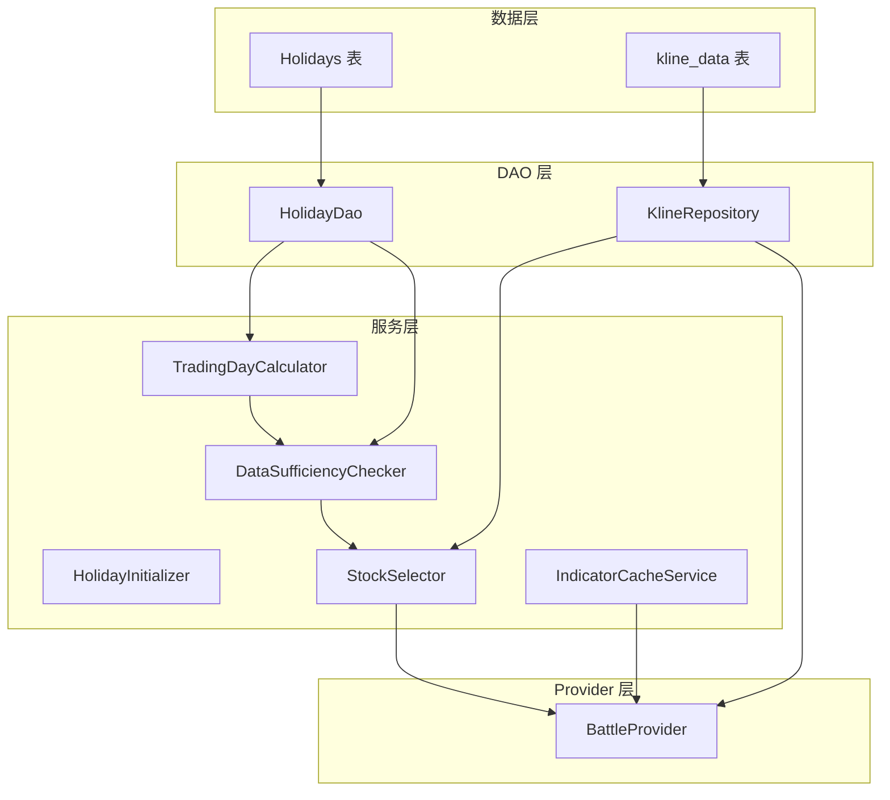
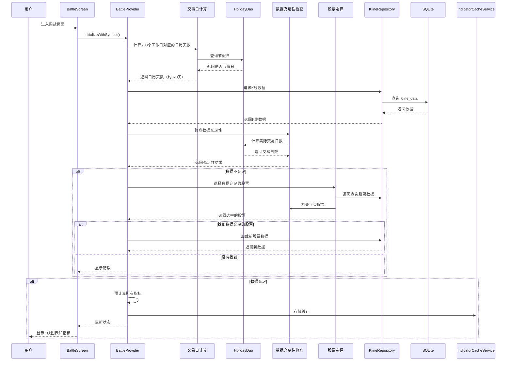

# 指标预加载与缓存优化 — 技术设计文档

## 1. 设计概要

**功能描述**：实现三层数据加载策略，通过使用工作日（交易日）精确计算、节假日表查询、数据充足性检查和自动切换股票机制，确保用户缩放或左滑到K线图最左侧时，所有技术指标都能无断档地正常显示。

**影响范围**：
- Holidays 表（节假日表）
- HolidayDao（节假日数据访问）
- HolidayInitializer（节假日初始化）
- TradingDayCalculator（交易日计算）
- DataSufficiencyChecker（数据充足性检查）
- StockSelector（股票选择）
- KlineRepository（数据查询层）
- BattleProvider（业务逻辑层）
- IndicatorCalculator（指标计算层）
- IndicatorCacheService（缓存管理层）

**技术难点**：
- 使用工作日（交易日）精确计算，而非日历天
- 查询节假日表，计算工作日对应的日历天数
- 数据充足性检查和自动切换股票机制
- 三层数据加载策略的精确实现
- 按需动态加载的时机判断和性能优化
- LRU缓存机制设计与内存管理

---

## 2. 架构概览

### 2.1 核心架构



### 2.2 数据加载流程



---

## 3. 数据库设计

### 3.1 节假日表结构

```dart
class Holidays extends Table {
  TextColumn get date => text()(); // yyyy-MM-dd 格式
  BoolColumn get isHoliday => boolean()();
  TextColumn get holidayName => text().nullable()();

  @override
  Set<Column> get primaryKey => {date};
}
```

### 3.2 节假日数据

| 节假日 | 日期规则 | 天数 |
|--------|---------|------|
| 春节 | 农历正月初一前后各3天 | 7天 |
| 国庆节 | 10月1日至7日 | 7天 |
| 元旦 | 1月1日 | 1天 |
| 清明节 | 4月4日至6日 | 3天 |
| 劳动节 | 5月1日至3日 | 3天 |
| 端午节 | 农历五月初五前后各1天 | 3天 |
| 中秋节 | 农历八月十五前后各1天 | 3天 |

### 3.3 节假日表初始化

```dart
class HolidayInitializer {
  final HolidayDao _holidayDao;

  Future<void> initializeHolidays() async {
    final currentYear = DateTime.now().year;
    final years = [currentYear - 1, currentYear, currentYear + 1, currentYear + 2];

    for (final year in years) {
      await _initializeYearHolidays(year);
    }
  }

  Future<void> _initializeYearHolidays(int year) async {
    final holidays = _generateChinaAHolidays(year);

    for (final holiday in holidays) {
      await _holidayDao.insertHoliday(
        holiday['date'] as DateTime,
        holiday['isHoliday'] as bool,
        holiday['name'] as String?,
      );
    }
  }

  List<Map<String, dynamic>> _generateChinaAHolidays(int year) {
    return [
      ..._generateNationalDayHoliday(year),
      ..._generateNewYearHoliday(year),
      ..._generateQingmingHoliday(year),
      ..._generateLaborDayHoliday(year),
      ..._generateDragonBoatHoliday(year),
      ..._generateMidAutumnHoliday(year),
      ..._generateChineseNewYearHoliday(year),
    ];
  }
}
```

### 3.4 K线数据表（复用现有）

```sql
-- 现有表结构，无需修改
CREATE TABLE kline_data (
  symbol TEXT,
  period TEXT,
  trade_date TEXT,
  open REAL,
  high REAL,
  low REAL,
  close REAL,
  volume REAL,
  PRIMARY KEY (symbol, period, trade_date)
);
```

---

## 4. 核心逻辑

### 4.1 交易日计算逻辑 → AC-001

**常量定义**：

```dart
class BattleConfig {
  /// 训练周期（工作日）
  static const int trainingDays = 150;

  /// 预加载数据（工作日，支持左滑和缩放展示）
  static const int preloadDays = 100;

  /// 指标前置数据（工作日，用于计算预加载数据的指标）
  static const int indicatorPreloadDays = 33;

  /// 总前置天数（工作日）
  static int get totalPreloadDays => preloadDays + indicatorPreloadDays;

  /// 需要的工作日总数
  static int get requiredTradingDays => trainingDays + preloadDays + indicatorPreloadDays;
}
```

**交易日计算**：

```dart
class TradingDayCalculator {
  final HolidayDao _holidayDao;

  /// 计算从结束日期往回N个交易日对应的日历天数
  Future<int> tradingDaysToCalendarDays(int tradingDays, DateTime endDate) async {
    int calendarDays = 0;
    int tradingDayCount = 0;
    DateTime currentDate = endDate;

    while (tradingDayCount < tradingDays) {
      final isHoliday = await _holidayDao.isHoliday(currentDate);

      if (!isHoliday) {
        tradingDayCount++;
      }

      calendarDays++;
      currentDate = currentDate.subtract(const Duration(days: 1));
    }

    return calendarDays;
  }
}
```

### 4.2 数据充足性检查 → AC-004, AC-005, AC-006

```dart
class DataSufficiencyResult {
  final bool isSufficient;
  final String reason;
  final int availableDays;
  final int requiredDays;
  final int? shortage;

  DataSufficiencyResult({
    required this.isSufficient,
    required this.reason,
    required this.availableDays,
    required this.requiredDays,
    this.shortage,
  });
}

class DataSufficiencyChecker {
  final HolidayDao _holidayDao;

  Future<DataSufficiencyResult> checkSufficiency({
    required List<KlineModel> data,
    required int requiredTradingDays,
  }) async {
    if (data.isEmpty) {
      print('⚠️ [DataSufficiencyChecker] 无数据');
      return DataSufficiencyResult(
        isSufficient: false,
        reason: '无数据',
        availableDays: 0,
        requiredDays: requiredTradingDays,
      );
    }

    final firstDate = DateTime.fromMillisecondsSinceEpoch(data.first.timestamp);
    final lastDate = DateTime.fromMillisecondsSinceEpoch(data.last.timestamp);

    final actualTradingDays = await _holidayDao.countTradingDays(firstDate, lastDate);
    final isSufficient = actualTradingDays >= requiredTradingDays;

    print('🔵 [DataSufficiencyChecker] 检查结果:');
    print('  - 数据范围: $firstDate ~ $lastDate');
    print('  - 实际交易日: $actualTradingDays');
    print('  - 需求交易日: $requiredTradingDays');
    print('  - 是否充足: $isSufficient');

    return DataSufficiencyResult(
      isSufficient: isSufficient,
      reason: isSufficient ? '数据充足' : '数据不足',
      availableDays: actualTradingDays,
      requiredDays: requiredTradingDays,
      shortage: isSufficient ? null : requiredTradingDays - actualTradingDays,
    );
  }
}
```

### 4.3 自动切换股票逻辑 → AC-005, AC-006

```dart
class StockSelectionResult {
  final String? symbol;
  final List<KlineModel> data;
  final DataSufficiencyResult? sufficiencyCheck;
  final bool isAutoSelected;
  final String? error;

  StockSelectionResult({
    this.symbol,
    required this.data,
    this.sufficiencyCheck,
    required this.isAutoSelected,
    this.error,
  });
}

class StockSelector {
  final KlineRepository _repository;
  final HolidayDao _holidayDao;
  final TradingDayCalculator _tradingDayCalculator;
  final DataSufficiencyChecker _sufficiencyChecker;

  Future<StockSelectionResult> selectSufficientStock({
    DateTime? preferredStartDate,
    required int totalRequiredDays,
  }) async {
    final symbols = await _repository.getAllSymbols();

    for (final symbol in symbols) {
      print('🔵 [StockSelector] 检查股票: $symbol');

      final data = await _loadKlineDataForSymbol(symbol, preferredStartDate);
      if (data.isEmpty) {
        print('⚠️ [StockSelector] 股票 $symbol 无数据');
        continue;
      }

      final sufficiencyCheck = await _sufficiencyChecker.checkSufficiency(
        data: data,
        requiredTradingDays: totalRequiredDays,
      );

      if (sufficiencyCheck.isSufficient) {
        print('✅ [StockSelector] 找到数据充足的股票: $symbol');
        print('  - 可用交易日: ${sufficiencyCheck.availableDays}');
        print('  - 需求交易日: ${sufficiencyCheck.requiredDays}');
        print('  - 自动选择: ${preferredStartDate == null}');

        return StockSelectionResult(
          symbol: symbol,
          data: data,
          sufficiencyCheck: sufficiencyCheck,
          isAutoSelected: preferredStartDate == null,
        );
      } else {
        print('⚠️ [StockSelector] 股票 $symbol 数据不足，可用: ${sufficiencyCheck.availableDays}，需求: ${sufficiencyCheck.requiredDays}');
      }
    }

    print('🔴 [StockSelector] 没有找到数据充足的股票');

    return StockSelectionResult(
      symbol: null,
      data: [],
      sufficiencyCheck: null,
      isAutoSelected: false,
      error: '没有找到数据充足的股票',
    );
  }

  Future<List<KlineModel>> _loadKlineDataForSymbol(String symbol, DateTime? startDate) async {
    final estimatedCalendarDays = await _tradingDayCalculator.tradingDaysToCalendarDays(
      BattleConfig.requiredTradingDays,
      DateTime.now(),
    );

    DateTime dataStartTime;
    if (startDate != null) {
      final totalCalendarDays = await _tradingDayCalculator.tradingDaysToCalendarDays(
        BattleConfig.totalPreloadDays,
        startDate,
      );
      dataStartTime = startDate.subtract(Duration(days: totalCalendarDays));
    } else {
      dataStartTime = DateTime.now().subtract(Duration(days: estimatedCalendarDays));
    }

    return await _repository.fetchKlineDataFromDbWithDateRange(
      symbol: symbol,
      period: 'day',
      startTime: dataStartTime,
      endTime: DateTime.now(),
    );
  }
}
```

### 4.4 三层数据加载逻辑 → AC-001

```dart
Future<List<KlineModel>> _loadKlineData(
  String symbol,
  DateTime? startDate,
) async {
  final trainingDays = BattleConfig.trainingDays;
  final preloadDays = BattleConfig.preloadDays;
  final indicatorPreloadDays = BattleConfig.indicatorPreloadDays;
  final totalRequiredDays = BattleConfig.requiredTradingDays;

  DateTime dataStartTime;
  final dataEndTime = DateTime.now();

  // 精确计算283个工作日对应的日历天数
  final estimatedCalendarDays = await _tradingDayCalculator.tradingDaysToCalendarDays(
    totalRequiredDays,
    dataEndTime,
  );

  if (startDate != null) {
    // 从训练起始日期往前推算预加载和指标前置
    final totalCalendarDays = await _tradingDayCalculator.tradingDaysToCalendarDays(
      preloadDays + indicatorPreloadDays,
      startDate,
    );
    dataStartTime = startDate.subtract(Duration(days: totalCalendarDays));
  } else {
    dataStartTime = dataEndTime.subtract(Duration(days: estimatedCalendarDays));
  }

  print('🔵 [BattleProvider] 数据加载计算:');
  print('  - 训练天数（工作日）: $trainingDays');
  print('  - 预加载天数（工作日）: $preloadDays');
  print('  - 指标前置天数（工作日）: $indicatorPreloadDays');
  print('  - 总交易日: $totalRequiredDays');
  print('  - 精确日历天: $estimatedCalendarDays');
  print('  - 数据加载范围: $dataStartTime ~ $dataEndTime');

  List<KlineModel> data = await _repository.fetchKlineDataFromDbWithDateRange(
    symbol: symbol,
    period: 'day',
    startTime: dataStartTime,
    endTime: dataEndTime,
  );

  // 检查数据充足性
  final sufficiencyCheck = await _sufficiencyChecker.checkSufficiency(
    data: data,
    requiredTradingDays: totalRequiredDays,
  );

  print('🔵 [BattleProvider] 数据充足性: ${sufficiencyCheck.isSufficient}');
  print('  - 需求交易日: ${sufficiencyCheck.requiredDays}');
  print('  - 可用交易日: ${sufficiencyCheck.availableDays}');
  if (sufficiencyCheck.shortage != null) {
    print('  - 缺口: ${sufficiencyCheck.shortage} 交易日');
  }

  return data;
}
```

### 4.5 按需加载逻辑 → AC-002, AC-003

```dart
Future<void> _loadDataForRange({
  required int visibleKlineCount,
  required DateTime visibleStart,
  required DateTime visibleEnd,
}) async {
  // 1. 计算需要的数据范围
  final indicatorPreloadDays = BattleConfig.indicatorPreloadDays;
  final dataStart = visibleStart.subtract(
    Duration(days: indicatorPreloadDays),
  );

  // 2. 检查缓存
  final cacheKey = _generateCacheKey(state.currentSymbol, visibleKlineCount);
  final cachedData = _indicatorCache.get(cacheKey);

  if (cachedData != null && _coversRange(cachedData, dataStart, visibleEnd)) {
    print('🔵 缓存命中：${cacheKey}');
    await _applyCachedData(cacheKey);
    return;
  }

  print('🔵 缓存未命中，加载新数据...');

  // 3. 缓存未命中，加载新数据
  final extendedData = await _loadExtendedKlineData(
    state.currentSymbol,
    dataStart,
    visibleEnd,
  );

  if (extendedData.isEmpty) {
    _showError('数据加载失败');
    return;
  }

  // 4. 预计算指标
  final indicators = _precomputeIndicators(extendedData);

  // 5. 更新缓存
  _indicatorCache.put(cacheKey, IndicatorCache(
    cacheKey: cacheKey,
    dataLength: extendedData.length,
    startDate: dataStart,
    endDate: visibleEnd,
    klineData: extendedData,
    indicators: indicators,
    createdAt: DateTime.now(),
  ));

  // 6. 更新状态
  state = state.copyWith(
    allKlineData: extendedData,
    visibleKlineCount: visibleKlineCount,
    ...indicators,
  );
}
```

### 4.6 指标预计算逻辑 → AC-007, AC-008, AC-009, AC-010

**核心原则**：在从数据库加载的完整K线数据（283天）上预计算所有指标，所有指标值都是真实计算的，不需要填充0

```dart
Map<String, dynamic> _precomputeIndicators(List<KlineModel> data) {
  // 1. 成交量（基础数据，无需前置）
  final volumes = data
      .map((d) => VolumeData(volume: d.volume, isUp: d.close >= d.open))
      .toList();

  // 2. 均线（在完整数据上真实计算）
  final closes = data.map((d) => d.close).toList();
  final ma5 = IndicatorCalculator.calculateMA(closes, 5);
  final ma10 = IndicatorCalculator.calculateMA(closes, 10);
  final ma30 = IndicatorCalculator.calculateMA(closes, 30);

  // 3. MACD（在完整数据上真实计算）
  final macdResult = IndicatorCalculator.calculateMACD(data);
  final macdData = List.generate(data.length, (i) {
    return MacdData(
      macd: macdResult.macd[i],
      diff: macdResult.dif[i],
      dea: macdResult.dea[i],
    );
  });

  // ... 其他指标类似

  return {
    'volumes': volumes,
    'ma5': ma5,
    'ma10': ma10,
    'ma30': ma30,
    'macd': macdData,
    // ... 其他指标
  };
}
```

---

## 5. 缓存管理逻辑 → AC-011, AC-012, AC-013

### 5.1 缓存键生成

```dart
String _generateCacheKey(String symbol, int visibleKlineCount) {
  return '${symbol}_$visibleKlineCount';
}
```

### 5.2 LRU 缓存实现

```dart
class IndicatorCacheService {
  static const int maxCacheSize = 50;
  final LinkedHashMap<String, IndicatorCache> _cache = LinkedHashMap();

  void put(String key, IndicatorCache cache) {
    if (_cache.length >= maxCacheSize) {
      _cache.remove(_cache.keys.first);
    }
    _cache[key] = cache;
  }

  IndicatorCache? get(String key) {
    if (!_cache.containsKey(key)) {
      return null;
    }
    _cache.moveToEnd(key);
    return _cache[key];
  }

  void clearBySymbol(String symbol) {
    _cache.removeWhere((key, value) => key.startsWith('${symbol}_'));
  }

  void clearAll() {
    _cache.clear();
  }
}
```

---

## 6. BattleProvider 修改

### 6.1 添加依赖注入

```dart
class BattleProvider extends StateNotifier<BattleState> {
  final KlineRepository _repository;
  final HolidayDao _holidayDao;
  late final TradingDayCalculator _tradingDayCalculator;
  late final DataSufficiencyChecker _sufficiencyChecker;
  late final StockSelector _stockSelector;
  late final IndicatorCacheService _indicatorCache;

  BattleProvider({
    required KlineRepository repository,
    required HolidayDao holidayDao,
  })  : _repository = repository,
        _holidayDao = holidayDao,
        super(BattleState.initial()) {
    _initializeServices();
  }

  void _initializeServices() {
    _tradingDayCalculator = TradingDayCalculator(_holidayDao);
    _sufficiencyChecker = DataSufficiencyChecker(_holidayDao);
    _stockSelector = StockSelector(
      repository: _repository,
      holidayDao: _holidayDao,
      tradingDayCalculator: _tradingDayCalculator,
      sufficiencyChecker: _sufficiencyChecker,
    );
    _indicatorCache = IndicatorCacheService();
  }
}
```

### 6.2 修改 initializeWithSymbol 方法

```dart
Future<void> initializeWithSymbol({
  required String symbol,
  String? name,
  String? marketCode,
  DateTime? startDate,
}) async {
  state = state.copyWith(isLoading: true, errorMessage: null);

  try {
    print('🔵 [BattleProvider] initializeWithSymbol: symbol=$symbol, startDate=$startDate');

    var klineData = await _loadKlineData(symbol, startDate);
    var currentSymbol = symbol;
    var currentStartDate = startDate;

    final totalRequiredDays = BattleConfig.requiredTradingDays;

    var sufficiencyCheck = await _sufficiencyChecker.checkSufficiency(
      data: klineData,
      requiredTradingDays: totalRequiredDays,
    );

    // 数据不充足？自动切换
    if (!sufficiencyCheck.isSufficient) {
      print('⚠️ [BattleProvider] 当前股票数据不足，自动切换...');

      final stockSelection = await _stockSelector.selectSufficientStock(
        preferredStartDate: startDate,
        totalRequiredDays: totalRequiredDays,
      );

      if (stockSelection.symbol != null) {
        print('✅ [BattleProvider] 已切换到数据充足的股票: ${stockSelection.symbol}');

        if (stockSelection.isAutoSelected) {
          print('ℹ️ [BattleProvider] 随机选择了数据充足的股票');
        } else {
          print('ℹ️ [BattleProvider] 原股票数据不足，已自动切换到 ${stockSelection.symbol}');
        }

        currentSymbol = stockSelection.symbol!;
        klineData = stockSelection.data;
        sufficiencyCheck = stockSelection.sufficiencyCheck!;
        currentStartDate = stockSelection.isAutoSelected ? null : startDate;
      } else {
        print('🔴 [BattleProvider] 没有找到数据充足的股票');

        state = state.copyWith(
          isLoading: false,
          hasAvailableData: false,
          errorMessage: '没有找到数据充足的股票，请同步更多数据',
        );
        return;
      }
    }

    // 继续初始化流程...
    final startDayIndex = _findStartDayIndex(klineData, currentStartDate);
    final computed = _precomputeIndicators(klineData);

    state = state.copyWith(
      currentSymbol: currentSymbol,
      currentSymbolName: name ?? currentSymbol,
      currentMarketCode: marketCode ?? '',
      trainingStartDate: currentStartDate,
      allKlineData: klineData,
      ...computed,
      currentDayIndex: startDayIndex >= 0
          ? startDayIndex.clamp(0, klineData.length - 1)
          : 0,
      initialStartIndex: startDayIndex >= 0
          ? startDayIndex.clamp(0, klineData.length - 1)
          : 0,
      visibleStartIndex: startDayIndex >= 0
          ? (startDayIndex - BattleConfig.defaultVisibleKlineCount + 1).clamp(0, startDayIndex)
          : 0,
      trainingDays: sufficiencyCheck.availableDays - BattleConfig.totalPreloadDays,
      phase: TrainingPhase.opening,
      isLoading: false,
      hasAvailableData: true,
      tradePoints: [],
    );

  } catch (e) {
    print('🔴 [BattleProvider] initializeWithSymbol 异常: $e');
    state = state.copyWith(
      isLoading: false,
      errorMessage: '加载失败: $e',
    );
  }
}
```

---

## 7. 数据库迁移

### 7.1 添加节假日表

```dart
// app_database.dart
class AppDatabase extends _$AppDatabase {
  AppDatabase(QueryExecutor e) : super(e);

  late final HolidayDao holidayDao = HolidayDao(this as AppDatabase);

  @override
  List<Table> get allTables => [
        holidays,
        klineData,
        // ... 其他表
      ];

  @override
  MigrationStrategy get migration => MigrationStrategy(
        onCreate: (Migrator m) async {
          await m.createAll();
          await _initializeHolidays();
        },
        onUpgrade: (Migrator m, int from, int to) async {
          // 迁移逻辑
        },
      );

  Future<void> _initializeHolidays() async {
    final initializer = HolidayInitializer(holidayDao);
    await initializer.initializeHolidays();
  }
}
```

---

## 8. 日志输出示例

### 8.1 正常加载

```
🔵 [BattleProvider] initializeWithSymbol: symbol=SH600000, startDate=null
🔵 [BattleProvider] 数据加载计算:
  - 训练天数（工作日）: 150
  - 预加载天数（工作日）: 100
  - 指标前置天数（工作日）: 33
  - 总交易日: 283
  - 精确日历天: 320
  - 数据加载范围: 2024-08-01 ~ 2025-05-31
🔵 [DataSufficiencyChecker] 检查结果:
  - 数据范围: 2024-08-01 ~ 2025-05-31
  - 实际交易日: 320
  - 需求交易日: 283
  - 是否充足: true
✅ [BattleProvider] initializeWithSymbol: klineData.length=320
✅ [BattleProvider] 数据充足性: true
```

### 8.2 自动切换

```
🔵 [BattleProvider] initializeWithSymbol: symbol=SH600000, startDate=null
🔵 [DataSufficiencyChecker] 检查结果:
  - 实际交易日: 180
  - 需求交易日: 283
  - 是否充足: false
⚠️ [BattleProvider] 当前股票数据不足，自动切换...
🔵 [StockSelector] 检查股票: SH600000
⚠️ [StockSelector] 股票 SH600000 数据不足，可用: 180，需求: 283
🔵 [StockSelector] 检查股票: SH600036
✅ [StockSelector] 找到数据充足的股票: SH600036
  - 可用交易日: 320
  - 自动选择: true
ℹ️ [BattleProvider] 随机选择了数据充足的股票
✅ [BattleProvider] 已切换到数据充足的股票: SH600036
```

---

## 9. 现有代码改动

| 模块 / 文件 | 改动内容 | 原因 | 对应 AC |
|------------|---------|------|---------|
| ** Holidays 表** | 新建节假日表 | 存储中国A股节假日数据 | AC-001 |
| **HolidayDao** | 新增节假日数据访问对象 | 查询和插入节假日数据 | AC-001 |
| **HolidayInitializer** | 新增节假日初始化服务 | 初始化节假日数据 | AC-001 |
| **TradingDayCalculator** | 新增交易日计算服务 | 精确计算工作日对应的日历天数 | AC-001 |
| **DataSufficiencyChecker** | 新增数据充足性检查服务 | 检查数据是否满足需求 | AC-004, AC-005 |
| **StockSelector** | 新增股票选择服务 | 数据不充足时自动切换股票 | AC-005, AC-006 |
| `BattleProvider._loadKlineData()` | 修改为使用工作日计算 | 精确计算数据加载范围 | AC-001 |
| `BattleProvider.initializeWithSymbol()` | 添加自动切换逻辑 | 数据不充足时自动切换 | AC-005, AC-006 |
| `BattleProvider._loadDataForRange()` | 新增按需加载方法 | 支持缩放/滑动时动态加载 | AC-002, AC-003 |
| `BattleProvider._precomputeIndicators()` | 增强均线和指标计算 | 确保从最早数据点开始显示 | AC-007, AC-008, AC-009, AC-010 |
| `IndicatorCalculator` | 所有方法返回固定长度数组 | 前置数据填充0，与K线数据一一对应 | AC-007, AC-008 |
| **IndicatorCacheService** | 实现 LRU 缓存管理 | 避免重复查询数据库 | AC-011, AC-012, AC-013 |

---

## 10. 新增文件

| 文件 | 说明 |
|------|------|
| `lib/data/database/tables/holidays.dart` | 节假日表定义 |
| `lib/data/database/daos/holiday_dao.dart` | 节假日数据访问对象 |
| `lib/data/services/holiday_initializer.dart` | 节假日初始化服务 |
| `lib/data/services/trading_day_calculator.dart` | 交易日计算服务 |
| `lib/data/services/data_sufficiency_checker.dart` | 数据充足性检查服务 |
| `lib/data/services/stock_selector.dart` | 股票选择服务 |
| `lib/features/battle/services/indicator_cache_service.dart` | 缓存管理服务 |

---

## 11. AC 覆盖总表

| AC 编号 | 验收标准概述 | 实现位置 |
|---------|-------------|---------|
| AC-001 | 精确计算需要的日历天数（查询节假日表） | TradingDayCalculator |
| AC-002 | 缩放到700根K线时加载 | _loadDataForRange() |
| AC-003 | 缩放到100根K线时加载 | _loadDataForRange() |
| AC-004 | 训练日索引正确计算 | DataSufficiencyChecker |
| AC-005 | 数据不足时自动切换股票 | StockSelector |
| AC-006 | 所有股票都不足时显示错误 | initializeWithSymbol() |
| AC-007 | MA5/MA10/MA30从最早数据点显示 | _precomputeIndicators() |
| AC-008 | MACD从最早数据点显示（非横线） | _precomputeIndicators() |
| AC-009 | KDJ/RSI/布林带从最早数据点显示 | _precomputeIndicators() |
| AC-010 | 任意缩放级别左滑到最左侧时指标正常显示 | _loadDataForRange() |
| AC-011 | 缓存命中时不重复查询数据库 | IndicatorCacheService |
| AC-012 | 不同股票清除旧缓存 | IndicatorCacheService |
| AC-013 | 缓存达到50个时自动淘汰 | IndicatorCacheService |
| AC-014 | 首次加载响应时间 < 300ms | 性能要求 |
| AC-015 | 缓存命中响应时间 < 10ms | 性能要求 |
| AC-016 | 异步加载不阻塞UI | _loadDataForRange() |
| AC-017 | 数据不足283天时使用所有可用数据 | _loadKlineData() |
| AC-018 | 数据完全不存在时显示错误提示 | initializeWithSymbol() |
| AC-019 | 左滑到数据库最早日期时显示提示 | UI层 + 边界处理 |

---

## 附录：变更记录

| 日期 | 变更内容 | 原因 |
|------|---------|------|
| 2026-05-20 | 初始版本 | 根据指标预加载需求生成 |
| 2026-05-20 | 明确三层数据加载策略 | 区分训练周期、预加载数据、指标前置数据 |
| 2026-05-20 | 增加按需加载逻辑 | 根据用户缩放级别动态加载数据 |
| 2026-05-20 | 把硬编码常量改为可配置项 | 使用 system_configs 表存储配置 |
| 2026-05-31 | 合并数据查询逻辑问题分析 | 发现使用日历天而非工作日计算的问题 |
| 2026-05-31 | 添加节假日表设计 | 使用中国A股节假日固定规则 |
| 2026-05-31 | 添加精确计算工作日逻辑 | 使用节假日表查询 |
| 2026-05-31 | 添加数据充足性检查 | 精确检查数据是否满足需求 |
| 2026-05-31 | 添加自动切换股票逻辑 | 数据不充足时自动切换 |
| 2026-05-31 | 更新技术方案 | 与需求文档保持一致 |
