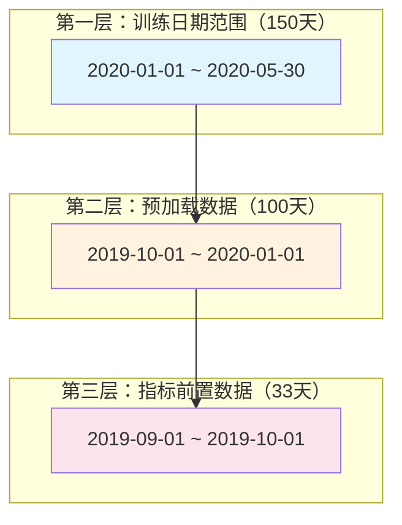
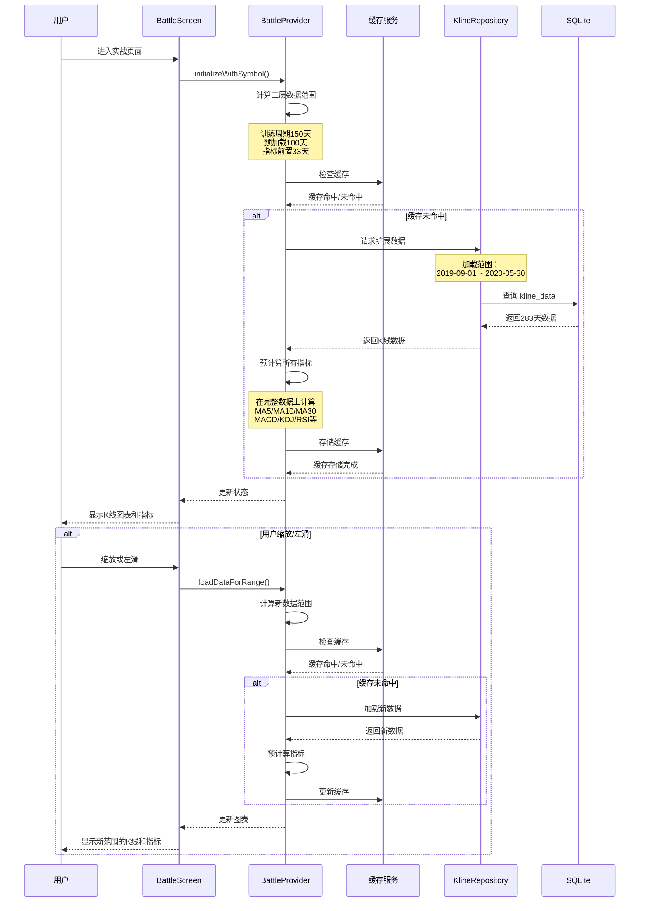

# 指标预加载与缓存优化 — 技术设计文档

## 1. 设计概要

**功能描述**：实现三层数据加载策略（训练周期 + 预加载数据 + 指标前置数据），通过按需动态加载和前端缓存机制，确保用户缩放或左滑到K线图最左侧时，所有技术指标都能无断档地正常显示。

**影响范围**：
- KlineRepository（数据查询层）
- BattleProvider（业务逻辑层）
- IndicatorCalculator（指标计算层）
- 新增 IndicatorCacheService（缓存管理层）

**技术难点**：
- 三层数据加载策略的精确实现
- 按需动态加载的时机判断和性能优化
- LRU缓存机制设计与内存管理
- 异步加载不阻塞UI的体验优化

**外部依赖**：无

---

## 2. 架构概览

### 2.1 三层数据加载架构



### 2.2 模块交互关系



---

## 3. 数据库设计

**无需修改**：本功能不涉及数据库 schema 变更，完全通过查询策略实现。

### 3.1 现有表结构复用

#### `kline_data`

**用途**：存储K线数据（已存在）

**查询策略**：
```sql
-- 查询三层扩展数据
SELECT * FROM kline_data
WHERE symbol = :symbol
  AND period = 'day'
  AND trade_date BETWEEN :startDate - 133 days AND :endDate
ORDER BY trade_date ASC
```

**索引优化**（已存在）：
- `idx_symbol_period_date` (symbol, period, trade_date)

**查询优化参数**：
```dart
// KlineRepository 查询参数
await fetchKlineDataFromDbWithDateRange(
  symbol: symbol,
  period: 'day',
  startTime: DateTime(2019, 9, 1),  // 训练起始 - 133天
  endTime: DateTime(2020, 5, 30),    // 训练结束
);
```

---

## 4. API 设计

> 本功能不涉及新增 API 接口，完全在 Provider 层实现内部逻辑。

### 4.1 KlineRepository 扩展方法

#### `fetchKlineDataFromDbWithDateRange`（已存在）

**描述**：按日期范围查询K线数据 → AC-001, AC-002, AC-003

**参数**：
```dart
Future<List<KlineModel>> fetchKlineDataFromDbWithDateRange({
  required String symbol,
  required String period,
  required DateTime startTime,
  required DateTime endTime,
})
```

**使用场景**：
```dart
// 三层数据加载
final maxPreloadDays = 100;  // 预加载数据
final indicatorPreloadDays = 33; // 指标前置数据
final dataLoadStart = trainingStart.subtract(
  Duration(days: maxPreloadDays + indicatorPreloadDays),
);

final extendedData = await _repository.fetchKlineDataFromDbWithDateRange(
  symbol: symbol,
  period: 'day',
  startTime: dataLoadStart,
  endTime: trainingEnd,
);
```

---

## 5. 核心逻辑

### 5.1 三层数据加载逻辑 → AC-001, AC-002, AC-003

**常量定义**：

```dart
class BattleConfig {
  /// 训练周期（天）
  static const int trainingDays = 150;

  /// 预加载数据（天，支持左滑和缩放展示）
  static const int preloadDays = 100;

  /// 指标前置数据（天，用于计算预加载数据的指标）
  static const int indicatorPreloadDays = 33;

  /// 总前置天数
  static int get totalPreloadDays => preloadDays + indicatorPreloadDays;
}
```

**三层数据加载**：

```dart
Future<List<KlineModel>> _loadExtendedKlineData(
  String symbol,
  DateTime? trainingStart,
  DateTime trainingEnd,
) async {
  // 1. 如果没有训练起始日期，返回空
  if (trainingStart == null) {
    return [];
  }

  // 2. 计算三层数据范围
  final dataLoadStart = trainingStart.subtract(
    Duration(days: BattleConfig.totalPreloadDays),
  );

  print('🔵 三层数据加载：');
  print('  - 训练周期：${trainingStart} ~ ${trainingEnd}');
  print('  - 预加载数据：${dataLoadStart} ~ ${trainingStart}');
  print('  - 指标前置数据：${dataLoadStart - Duration(days: BattleConfig.indicatorPreloadDays)} ~ ${dataLoadStart}');

  // 3. 查询数据库
  final extendedData = await _repository.fetchKlineDataFromDbWithDateRange(
    symbol: symbol,
    period: 'day',
    startTime: dataLoadStart,
    endTime: trainingEnd,
  );

  print('🔵 加载数据量：${extendedData.length} 天');

  // 4. 检查数据充足性
  final minRequiredDays = BattleConfig.totalPreloadDays;
  if (extendedData.length < minRequiredDays) {
    print('⚠️ 数据不足${minRequiredDays}天，仅有 ${extendedData.length} 天数据');
  }

  return extendedData;
}
```

### 5.2 按需加载逻辑 → AC-002, AC-003

**触发时机**：
- 用户缩放K线图
- 用户左滑K线图
- visibleKlineCount 发生变化

**加载流程**：

```dart
Future<void> _loadDataForRange({
  required int visibleKlineCount,
  required DateTime visibleStart,
  required DateTime visibleEnd,
}) async {
  // 1. 计算需要的数据范围
  final dataStart = visibleStart.subtract(
    Duration(days: BattleConfig.indicatorPreloadDays),
  );

  print('🔵 按需加载：');
  print('  - 可见K线数：${visibleKlineCount}');
  print('  - 可见范围：${visibleStart} ~ ${visibleEnd}');
  print('  - 数据起始：${dataStart}');

  // 2. 检查缓存
  final cacheKey = _generateCacheKey(state.currentSymbol, visibleKlineCount);
  final cachedData = _indicatorCache.get(cacheKey);

  if (cachedData != null && _coversRange(cachedData, dataStart, visibleEnd)) {
    print('🔵 缓存命中：${cacheKey}');
    await _applyCachedData(cacheKey);
    return;
  }

  print('🔵 缓存未命中，加载新数据...');

  // 3. 缓存未命中，加载新数据
  final extendedData = await _loadExtendedKlineData(
    state.currentSymbol,
    dataStart,
    visibleEnd,
  );

  if (extendedData.isEmpty) {
    _showError('数据加载失败');
    return;
  }

  // 4. 预计算指标
  final indicators = _precomputeIndicators(extendedData);

  // 5. 更新缓存
  _indicatorCache.put(cacheKey, IndicatorCache(
    cacheKey: cacheKey,
    dataLength: extendedData.length,
    startDate: dataStart,
    endDate: visibleEnd,
    klineData: extendedData,
    indicators: indicators,
    createdAt: DateTime.now(),
  ));

  // 6. 更新状态
  state = state.copyWith(
    allKlineData: extendedData,
    visibleKlineCount: visibleKlineCount,
    ...indicators,
  );
}
```

**缓存覆盖检查**：

```dart
bool _coversRange(IndicatorCache cache, DateTime start, DateTime end) {
  // 检查缓存是否覆盖请求的范围
  return cache.startDate.isBefore(start) ||
         cache.startDate.isAtSameMomentAs(start)) &&
         (cache.endDate.isAfter(end) ||
          cache.endDate.isAtSameMomentAs(end));
}
```

### 5.4 指标预计算逻辑 → AC-004, AC-005, AC-006, AC-007

**核心原则**：在从数据库加载的完整K线数据（283天）上预计算所有指标，所有指标值都是真实计算的，不需要填充0

**关键点**：
- 三层数据加载确保我们有足够的历史数据（训练周期 + 预加载 + 指标前置）
- 所有指标计算都基于真实的K线数据
- 前置的K线数据也是从数据库真实获取的，不是填充的0
- 因此所有指标从最早的数据点开始就是真实计算值

**前置数据填充策略**（仅在数据库数据不足时使用）：

在极少数情况下（如用户左滑到数据库最早日期），如果加载的K线数据不足指标计算所需的前置天数，系统才会使用0填充：

```dart
// MA 计算示例
static List<double> calculateMA(List<double> closes, int period) {
  final ma = List<double>.filled(closes.length, 0.0);

  // 如果数据不足period天，返回全0
  if (closes.length < period) {
    return ma;
  }

  // 数据充足，在真实数据上计算
  double sum = 0;
  for (int i = 0; i < period; i++) {
    sum += closes[i];
  }
  ma[period - 1] = sum / period;

  // 滑动窗口计算后续值
  for (int i = period; i < closes.length; i++) {
    sum = sum - closes[i - period] + closes[i];
    ma[i] = sum / period;
  }

  return ma;
}
```

**完整预计算**：

```dart
Map<String, dynamic> _precomputeIndicators(List<KlineModel> data) {
  // 1. 成交量（基础数据，无需前置）
  final volumes = data
      .map((d) => VolumeData(volume: d.volume, isUp: d.close >= d.open))
      .toList();

  // 2. 均线（在完整数据上真实计算）
  final closes = data.map((d) => d.close).toList();
  final ma5 = IndicatorCalculator.calculateMA(closes, 5);
  final ma10 = IndicatorCalculator.calculateMA(closes, 10);
  final ma30 = IndicatorCalculator.calculateMA(closes, 30);

  // 3. MACD（在完整数据上真实计算，33天EMA预热）
  final macdResult = IndicatorCalculator.calculateMACD(data);
  final macdData = List.generate(data.length, (i) {
    return MacdData(
      macd: macdResult.macd[i],
      diff: macdResult.dif[i],
      dea: macdResult.dea[i],
    );
  });

  // 4. KDJ（在完整数据上真实计算，9天RSV预热）
  final kdjResult = IndicatorCalculator.calculateKDJ(data);
  final kdjData = List.generate(data.length, (i) {
    return KdjData(
      k: kdjResult.k[i],
      d: kdjResult.d[i],
      j: kdjResult.j[i],
    );
  });

  // 5. RSI（在完整数据上真实计算，14天预热）
  final rsiResult = IndicatorCalculator.calculateRSI(data);
  final rsi = rsiResult.values;

  // 6. 布林带（在完整数据上真实计算，20天预热）
  final bollResult = IndicatorCalculator.calculateBoll(data);
  final bollData = List.generate(data.length, (i) {
    return BollData(
      mb: bollResult.mb[i],
      up: bollResult.up[i],
      dn: bollResult.dn[i],
    );
  });

  // 7. DMI（在完整数据上真实计算，14天预热）
  final dmiResult = IndicatorCalculator.calculateDMI(data);
  final dmiData = List.generate(data.length, (i) {
    return DmiData(
      plusDI: dmiResult.plusDI[i],
      minusDI: dmiResult.minusDI[i],
      adx: dmiResult.adx[i],
    );
  });

  // 8. CCI（在完整数据上真实计算，14天预热）
  final cciResult = IndicatorCalculator.calculateCCI(data);

  // 9. WR（在完整数据上真实计算，14天预热）
  final wrResult = IndicatorCalculator.calculateWR(data);

  // 10. OBV（基础数据，无需前置）
  final obvResult = IndicatorCalculator.calculateOBV(data);

  // 11. DMA（在完整数据上真实计算，10天预热）
  final dmaResult = IndicatorCalculator.calculateDMA(data);

  // 12. BBI（在完整数据上真实计算，24天预热）
  final bbi = IndicatorCalculator.calculateBBI(closes);

  return {
    'volumes': volumes,
    'ma5': ma5,
    'ma10': ma10,
    'ma30': ma30,
    'macd': macdData,
    'kdj': kdjData,
    'rsi': rsi,
    'boll': bollData,
    'dmi': dmiData,
    'cci': cciResult.values,
    'wr': wrResult.values,
    'obv': obvResult.values,
    'dma': dmaResult.values,
    'bbi': bbi,
  };
}
```

---

## 6. 缓存管理逻辑 → AC-008, AC-009, AC-010

### 6.1 缓存键生成

```dart
String _generateCacheKey(String symbol, int visibleKlineCount) {
  return '${symbol}_$visibleKlineCount';
}
```

### 6.2 LRU 缓存实现

```dart
class IndicatorCacheService {
  static const int maxCacheSize = 50;
  final LinkedHashMap<String, IndicatorCache> _cache = LinkedHashMap();

  /// 存储缓存（自动LRU淘汰）
  void put(String key, IndicatorCache cache) {
    // 如果缓存已满，删除最旧的项
    if (_cache.length >= maxCacheSize) {
      _cache.remove(_cache.keys.first);
    }

    _cache[key] = cache;
  }

  /// 读取缓存（自动LRU更新）
  IndicatorCache? get(String key) {
    if (!_cache.containsKey(key)) {
      return null;
    }

    // LRU 更新：将访问的项移到末尾
    _cache.moveToEnd(key);
    return _cache[key];
  }

  /// 检查缓存覆盖范围
  bool _coversRange(IndicatorCache cache, DateTime start, DateTime end) {
    return (cache.startDate.isBefore(start) ||
            cache.startDate.isAtSameMomentAs(start)) &&
           (cache.endDate.isAfter(end) ||
            cache.endDate.isAtSameMomentAs(end));
  }

  /// 查找匹配的缓存
  IndicatorCache? findMatch(String symbol, int visibleKlineCount) {
    final key = _generateCacheKey(symbol, visibleKlineCount);
    return get(key);
  }

  /// 清除指定股票的缓存
  void clearBySymbol(String symbol) {
    _cache.removeWhere((key, value) => key.startsWith('${symbol}_'));
  }

  /// 清除所有缓存
  void clearAll() {
    _cache.clear();
  }

  /// 获取缓存统计信息
  CacheStats getStats() {
    return CacheStats(
      count: _cache.length,
      maxSize: maxCacheSize,
      symbols: _cache.keys.map((k) => k.split('_')[0]).toSet().toList(),
    );
  }
}
```

### 6.3 缓存数据结构

```dart
class IndicatorCache {
  final String cacheKey;
  final int dataLength;
  final DateTime startDate;
  final DateTime endDate;
  final List<KlineModel> klineData;
  final PrecomputedIndicators indicators;
  final DateTime createdAt;

  IndicatorCache({
    required this.cacheKey,
    required this.dataLength,
    required this.startDate,
    required this.endDate,
    required this.klineData,
    required this.indicators,
    required this.createdAt,
  });
}

class PrecomputedIndicators {
  final List<MacdData> macd;
  final List<KdjData> kdj;
  final List<double> rsi;
  final List<BollData> boll;
  final List<DmiData> dmi;
  final List<double> cci;
  final List<double> wr;
  final List<double> obv;
  final List<DmaData> dma;
  final List<double> bbi;
  final List<double> ma5;
  final List<double> ma10;
  final List<double> ma30;

  PrecomputedIndicators({
    required this.macd,
    required this.kdj,
    required this.rsi,
    required this.boll,
    required this.dmi,
    required this.cci,
    required this.wr,
    required this.obv,
    required this.dma,
    required this.bbi,
    required this.ma5,
    required this.ma10,
    required this.ma30,
  });
}

class CacheStats {
  final int count;
  final int maxSize;
  final List<String> symbols;

  double get usagePercent => (count / maxSize) * 100;
}
```

---

## 7. 现有代码改动

| 模块 / 文件 | 改动内容 | 原因 | 对应 AC |
|------------|---------|------|---------|
| `BattleConfig` | 添加三层数据常量 | 定义预加载和指标前置天数 | AC-001 |
| `BattleProvider._loadKlineData()` | 修改为三层数据加载 | 需要加载训练周期+预加载+指标前置 | AC-001 |
| `BattleProvider._loadDataForRange()` | 新增按需加载方法 | 支持缩放/滑动时动态加载 | AC-002, AC-003 |
| `BattleProvider._precomputeIndicators()` | 增强均线和指标计算 | 确保从最早数据点开始显示 | AC-004, AC-005, AC-006, AC-007 |
| `IndicatorCalculator` | 所有方法返回固定长度数组 | 前置数据填充0，与K线数据一一对应 | AC-004, AC-005, AC-006 |
| **新增** `IndicatorCacheService` | 实现 LRU 缓存管理 | 避免重复查询数据库 | AC-008, AC-009, AC-010 |

---

## 8. 新增文件

### 8.1 IndicatorCacheService

**文件位置**：`lib/features/battle/services/indicator_cache_service.dart`

**职责**：
- 管理指标缓存（存储、读取、淘汰）
- 实现 LRU 策略
- 提供缓存键生成和匹配逻辑
- 提供缓存统计信息

**核心接口**：

```dart
class IndicatorCacheService {
  static const int maxCacheSize = 50;

  final LinkedHashMap<String, IndicatorCache> _cache = LinkedHashMap();

  /// 存储缓存（自动LRU淘汰）
  void put(String key, IndicatorCache cache);

  /// 读取缓存（自动LRU更新）
  IndicatorCache? get(String key);

  /// 查找匹配的缓存
  IndicatorCache? findMatch(String symbol, int visibleKlineCount);

  /// 检查缓存覆盖范围
  bool _coversRange(IndicatorCache cache, DateTime start, DateTime end);

  /// 清除指定股票的缓存
  void clearBySymbol(String symbol);

  /// 清除所有缓存
  void clearAll();

  /// 获取缓存统计信息
  CacheStats getStats();
}
```

---

## 9. 技术决策

### 9.1 三层数据常量选择

**背景**：如何定义预加载数据和指标前置数据的大小？

**选项**：
- A: 预加载100天 + 指标前置33天 — 平衡内存使用和功能需求
- B: 预加载200天 + 指标前置33天 — 内存占用翻倍，但支持更多历史数据查看
- C: 动态计算（根据训练周期比例） — 灵活但实现复杂

**结论**：选择 A，预加载100天 + 指标前置33天
**理由**：
- 100天预加载足够支持日常查看需求
- 33天指标前置满足所有指标的预热需求
- 总计133天前置数据，内存占用可控（约40-50KB per 缓存项）

### 9.2 缓存键策略

**背景**：如何设计缓存键以支持按需加载？

**选项**：
- A: 缓存key = "{symbol}_{dataLength}" — 精确匹配数据长度
- B: 缓存key = "{symbol}_{visibleKlineCount}" — 匹配可见K线数
- C: 缓存key = "{symbol}_{dateRange}" — 精确匹配日期范围

**结论**：选择 B，缓存key = "{symbol}_{visibleKlineCount}"
**理由**：
- 用户关注的是能看到的K线数量，不是具体日期
- 相同可见K线数在不同时间可能对应不同日期，但指标计算逻辑相同
- 简化缓存查找和复用逻辑

### 9.3 缓存容量选择

**背景**：需要平衡内存使用和缓存命中率

**选项**：
- A: 固定容量 50 个缓存项 — 足够存储50次不同缩放级别
- B: 动态容量，根据可用内存调整 — 实现复杂，可能导致内存不稳定

**结论**：选择 A，固定容量 50 个缓存项
**理由**：
- 一个缓存项约占用 40-50 KB 内存
- 50 个约 2-2.5 MB 内存，风险可控
- 简单可靠，易于调试

### 9.4 异步加载策略

**背景**：用户缩放操作不应该阻塞UI

**选项**：
- A: 同步加载 — 简单但会卡顿
- B: 异步加载，显示loading状态 — 体验好但实现复杂

**结论**：选择 B，异步加载
**理由**：
- 用户体验优先，不阻塞交互
- 可以显示轻量级loading提示
- Flutter 的 async/await 支持良好

---

## 10. 安全与性能

### 10.1 性能要求

| 指标 | 要求 | 说明 |
|------|------|------|
| 首次加载时间 | < 300ms | 283天数据查询+指标计算 |
| 缓存命中时间 | < 10ms | 纯内存操作 |
| 缓存容量 | 50 个（约 2-2.5 MB） | 内存占用可控 |
| 数据库查询 | 使用索引 | idx_symbol_period_date |
| UI 响应 | < 16ms | 不阻塞主线程 |

### 10.2 性能优化措施

1. **数据库查询优化**
   - 使用已有索引：`idx_symbol_period_date`
   - 只查询必要字段
   - 限制返回数量

2. **指标计算优化**
   - 批量预计算，一次遍历计算多个指标
   - 使用 `List.generate` 代替循环添加
   - 避免重复计算（如多次使用收盘价）

3. **缓存优化**
   - LRU 淘汰策略，保持热点数据
   - 内存占用监控，避免 OOM
   - 缓存键设计优化查找效率

4. **异步加载优化**
   - 使用 `async/await` 异步加载
   - 不阻塞UI主线程
   - 可选的轻量级loading提示

### 10.3 边界情况处理

| 场景 | 处理策略 | 对应 AC |
|------|---------|---------|
| 股票历史数据不足283天 | 使用所有可用数据，前置指标填充0 | AC-014 |
| 股票历史数据完全不存在 | 显示错误提示 | AC-015 |
| 缓存达到容量上限 | LRU淘汰最旧缓存 | AC-010 |
| 用户左滑到数据库最早日期 | 显示"数据最早日期"提示 | AC-016 |
| 数据库查询失败 | 显示错误提示，提示用户重试 | AC-001 |

---

## 11. AC 覆盖总表

| AC 编号 | 验收标准概述 | 实现位置 |
|---------|-------------|---------|
| AC-001 | 三层数据加载（150+100+33天） | 核心逻辑 5.1 `_loadExtendedKlineData()` |
| AC-002 | 缩放到700根K线时加载 | 核心逻辑 5.2 `_loadDataForRange()` |
| AC-003 | 缩放到100根K线时加载 | 核心逻辑 5.2 `_loadDataForRange()` |
| AC-004 | MA5/MA10/MA30从最早数据点显示 | 核心逻辑 5.3 `_precomputeIndicators()` |
| AC-005 | MACD从最早数据点显示（非横线） | 核心逻辑 5.3 `calculateMACD()` |
| AC-006 | KDJ/RSI/布林带从最早数据点显示 | 核心逻辑 5.3 各指标计算方法 |
| AC-007 | 任意缩放级别左滑到最左侧时指标正常显示 | 核心逻辑 5.2 预计算 + UI层 |
| AC-008 | 缓存命中时不重复查询数据库 | 缓存逻辑 6.2 `get()` |
| AC-009 | 不同股票清除旧缓存 | 缓存逻辑 6.2 `clearBySymbol()` |
| AC-010 | 缓存达到50个时自动淘汰 | 缓存逻辑 6.2 `put()` |
| AC-011 | 首次加载响应时间 < 300ms | 性能要求 10.1 |
| AC-012 | 缓存命中响应时间 < 10ms | 性能要求 10.1 |
| AC-013 | 异步加载不阻塞UI | 核心逻辑 5.2 `async/await` |
| AC-014 | 数据不足283天时使用所有可用数据 | 核心逻辑 5.1 边界处理 |
| AC-015 | 数据完全不存在时显示错误提示 | 核心逻辑 5.1 错误处理 |
| AC-016 | 左滑到数据库最早日期时显示提示 | UI层 + 边界处理 |

---

## 附录：变更记录

| 日期 | 变更内容 | 原因 |
|------|---------|------|
| 2026-05-20 | 初始版本 | 根据指标预加载需求生成 |
| 2026-05-20 | 明确三层数据加载策略 | 区分训练周期、预加载数据、指标前置数据 |
| 2026-05-20 | 增加按需加载逻辑 | 根据用户缩放级别动态加载数据 |
| 2026-05-20 | 更新技术方案 | 与需求文档保持一致 |
| 2026-05-20 | 把硬编码常量改为可配置项 | 使用 system_configs 表存储配置，便于后续调优 |
