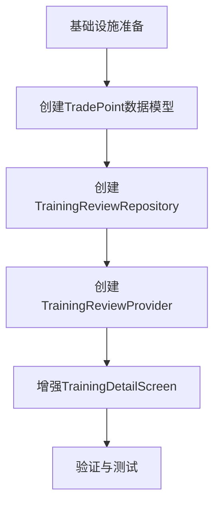
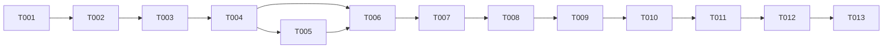

# 训练记录复盘功能 - 任务规划

## 1. 需求概述

根据技术方案，训练记录复盘功能需要实现以下核心能力：
- 训练详情页面展示训练期间的K线走势图
- K线上标注用户的交易操作点（买入/卖出）
- 显示MA均线、成交量、MACD等技术指标
- 与实战页面的K线展示保持一致的视觉风格

---

## 2. 任务切片与依赖关系

---

## 3. 任务清单

### 阶段1：基础设施准备

| 任务ID | 任务名称 | 通俗解释 | 依赖 | 验证标准 | AC覆盖 | 状态 |
|--------|----------|----------|------|----------|--------|------|
| T001 | 检查KlineDao日期范围查询方法 | 确保数据库层支持按日期范围查询K线数据 | 无 | KlineDao存在`getKlineDataByDateRange`方法 | AC-01 | ✅ 已完成 |

### 阶段2：创建数据模型

| 任务ID | 任务名称 | 通俗解释 | 依赖 | 验证标准 | AC覆盖 | 状态 |
|--------|----------|----------|------|----------|--------|------|
| T002 | 创建TradePoint模型类 | 定义交易点位数据结构，用于在K线上标记买卖点 | T001 | 文件`lib/data/models/trade_point_model.dart`存在，包含index、price、isBuy、label、date、tradeId、quantity字段 | AC-02 | ✅ 已完成 |
| T003 | 创建TrainingReviewData模型类 | 定义复盘数据结构，组合会话、K线、交易点位数据 | T002 | 文件`lib/data/models/training_review_data.dart`存在，包含session、klineData、tradePoints、trades字段 | AC-01 | ✅ 已完成 |

### 阶段3：创建Repository层

| 任务ID | 任务名称 | 通俗解释 | 依赖 | 验证标准 | AC覆盖 | 状态 |
|--------|----------|----------|------|----------|--------|------|
| T004 | 创建TrainingReviewRepository | 实现复盘数据的组合逻辑，整合会话、K线和交易数据 | T003 | 文件`lib/data/repositories/training_review_repository.dart`存在，包含`getReviewData`方法 | AC-01 | ✅ 已完成 |
| T005 | 实现交易点位匹配逻辑 | 将交易记录转换为K线上的点位索引 | T004 | `_convertTradesToPoints`方法正确将交易日期匹配到K线索引 | AC-02 | ✅ 已完成 |

### 阶段4：创建Provider层

| 任务ID | 任务名称 | 通俗解释 | 依赖 | 验证标准 | AC覆盖 | 状态 |
|--------|----------|----------|------|----------|--------|------|
| T006 | 创建TrainingReviewProvider | 使用Riverpod实现状态管理，提供复盘数据 | T004 | 文件`lib/providers/training_review_provider.dart`存在，`TrainingReview` provider正确加载数据 | AC-01 | ✅ 已完成 |

### 阶段5：增强UI层

| 任务ID | 任务名称 | 通俗解释 | 依赖 | 验证标准 | AC覆盖 | 状态 |
|--------|----------|----------|------|----------|--------|------|
| T007 | 更新TrainingDetailScreen布局 | 添加K线图表区域和交易记录列表 | T006 | 页面包含K线图表和交易记录列表 | AC-01, AC-04 | ✅ 已完成 |
| T008 | 集成KlineChart组件 | 复用训练页面的K线组件，添加交易点位标记 | T007 | K线图表正确显示训练期间数据，并标记交易点位 | AC-02, AC-05 | ✅ 已完成 |
| T009 | 添加技术指标计算 | 计算MA均线、成交量、MACD等指标 | T008 | 图表显示MA5、MA10、成交量柱状图 | AC-03 | ✅ 已完成 |
| T010 | 添加图例说明 | 在图表下方添加买入/卖出/均线图例 | T009 | 图例正确显示各指标含义 | AC-03 | ✅ 已完成 |

### 阶段6：验证与测试

| 任务ID | 任务名称 | 通俗解释 | 依赖 | 验证标准 | AC覆盖 | 状态 |
|--------|----------|----------|------|----------|--------|------|
| T011 | 运行代码生成 | 确保drift代码生成完整 | T010 | `flutter pub run build_runner build`成功 | 全部 | ✅ 已完成 |
| T012 | 构建验证 | 确保应用能正常构建 | T011 | `flutter build ios`成功 | 全部 | ✅ 已完成 |
| T013 | 功能测试 | 在模拟器中验证复盘功能 | T012 | 训练详情页面正确显示K线和交易点位 | 全部 | ✅ 已完成 |

---

## 4. 任务依赖图

---

## 5. 关键任务说明

### 🔒 T004 - 创建TrainingReviewRepository
**说明**：这是核心业务逻辑层，负责整合会话信息、K线数据和交易记录。必须确保日期范围查询正确，交易点位匹配逻辑准确。

### ⚠️ T008 - 集成KlineChart组件
**说明**：需要确保复用的KlineChart组件能够接收并正确渲染交易点位标记。如果现有组件不支持，可能需要进行增强。

---

## 6. AC覆盖追踪

| AC编号 | AC描述 | 关联任务 |
|--------|--------|----------|
| AC-01 | 训练详情页面展示训练期间的K线走势图 | T001, T003, T004, T006, T007 |
| AC-02 | K线上标注用户的交易操作点 | T002, T005, T008 |
| AC-03 | 显示MA均线、成交量、MACD等技术指标 | T009, T010 |
| AC-04 | 下方显示详细交易记录列表 | T007 |
| AC-05 | 与实战页面的K线展示保持一致 | T008 |

---

## 7. 预估工时

| 阶段 | 任务数 | 预估工时（小时） |
|------|--------|-----------------|
| 基础设施准备 | 1 | 0.5 |
| 创建数据模型 | 2 | 1.0 |
| 创建Repository层 | 2 | 2.0 |
| 创建Provider层 | 1 | 0.5 |
| 增强UI层 | 4 | 4.0 |
| 验证与测试 | 3 | 2.0 |
| **总计** | **13** | **10.0** |

---

## 8. 文档变更记录

| 日期 | 版本 | 变更内容 | 作者 |
|------|------|----------|------|
| 2026-05-21 | v1.0 | 初始版本 | System |
