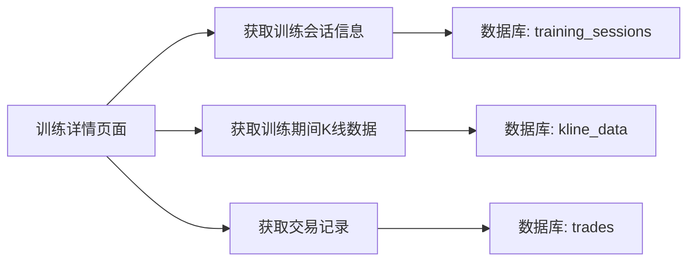
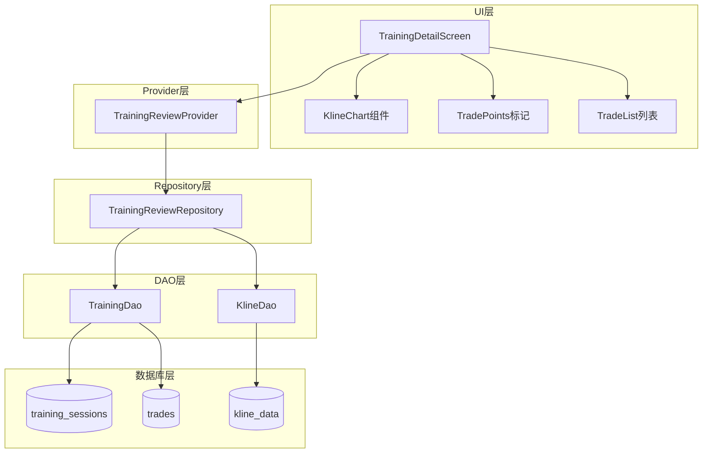
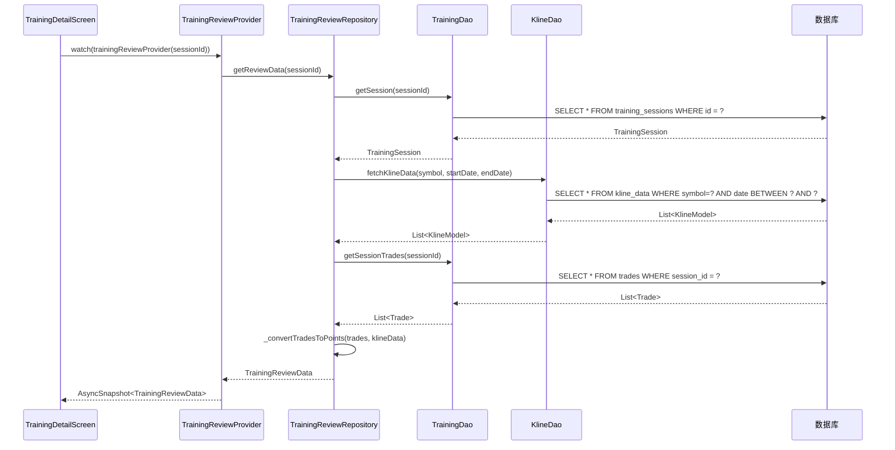

# 训练记录复盘功能 - 技术方案

## 1. 需求分析

### 1.1 需求背景
根据业务/产品描述，训练记录需要记录实战页面操作的K线走势，与复盘页面相似或一致。

### 1.2 核心功能需求

| AC编号 | 需求描述 | 来源 |
|--------|----------|------|
| AC-01 | 训练详情页面展示训练期间的K线走势图 | 用户需求 |
| AC-02 | K线上标注用户的交易操作点（买入/卖出） | 用户需求 |
| AC-03 | 显示MA均线、成交量、MACD等技术指标 | 用户需求 |
| AC-04 | 下方显示详细交易记录列表 | 用户需求 |
| AC-05 | 与实战页面的K线展示保持一致的视觉风格 | 用户需求 |

### 1.3 数据流程需求



---

## 2. 技术方案

### 2.1 架构设计

#### 2.1.1 整体架构



#### 2.1.2 模块职责

| 模块 | 职责 | 状态 |
|------|------|------|
| TrainingDetailScreen | 训练详情页面，展示K线和交易记录 | 已存在，需增强 |
| KlineChart | K线图表组件，复用训练页面组件 | 已存在 |
| TrainingReviewProvider | Riverpod状态管理，加载复盘数据 | 新增 |
| TrainingReviewRepository | 业务逻辑层，组合K线和交易数据 | 新增 |
| TrainingDao | 训练会话和交易记录数据访问 | 已存在 |
| KlineDao | K线数据访问 | 已存在 |

### 2.2 数据模型设计

#### 2.2.1 TradePoint（交易点位）

| 字段名 | 类型 | 含义 | 约束 |
|--------|------|------|------|
| index | int | K线数据中的索引位置 | 非空 |
| price | double | 交易价格 | 非空 |
| isBuy | bool | 买入/卖出 | 非空 |
| label | String | 标签（B/S） | 非空 |
| date | DateTime | 交易日期 | 非空 |
| tradeId | int | 交易记录ID | 非空 |
| quantity | int | 交易数量 | 非空 |

#### 2.2.2 TrainingReviewData（复盘数据）

| 字段名 | 类型 | 含义 | 约束 |
|--------|------|------|------|
| session | TrainingSession | 训练会话信息 | 非空 |
| klineData | List\<KlineModel\> | K线数据列表 | 非空 |
| tradePoints | List\<TradePoint\> | 交易点位列表 | 非空 |
| trades | List\<Trade\> | 交易记录列表 | 非空 |

### 2.3 数据库表关联

| 表名 | 关键字段 | 关联关系 |
|------|----------|----------|
| training_sessions | id, user_id, symbol, start_date, end_date | 主表 |
| trades | id, session_id, symbol, type, price, quantity, trade_date | session_id -> training_sessions.id |
| kline_data | id, symbol, date, open, high, low, close, volume | symbol + date范围查询 |

### 2.4 API设计

#### 2.4.1 Repository方法

| 方法名 | 参数 | 返回值 | 说明 |
|--------|------|--------|------|
| getReviewData | sessionId: int | Future\<TrainingReviewData\> | 获取训练复盘数据 |
| _getSessionKlineData | session: TrainingSession | Future\<List\<KlineModel\>\> | 获取训练期间K线数据 |
| _convertTradesToPoints | trades: List\<Trade\>, klineData: List\<KlineModel\> | List\<TradePoint\> | 转换交易记录为点位 |

#### 2.4.2 Provider方法

| 方法名 | 参数 | 返回值 | 说明 |
|--------|------|--------|------|
| build | sessionId: int | Future\<TrainingReviewData?\> | 加载复盘数据 |

### 2.5 核心逻辑

#### 2.5.1 复盘数据加载流程



#### 2.5.2 交易点位匹配逻辑

1. 获取训练会话的时间范围（startDate ~ endDate）
2. 查询该时间范围内的K线数据
3. 获取该会话的所有交易记录
4. 将每条交易记录的日期与K线数据的日期匹配
5. 计算交易记录在K线数据中的索引位置
6. 创建TradePoint对象

---

## 3. 代码实现方案

### 3.1 Repository层

**文件**: `lib/data/repositories/training_review_repository.dart`

```dart
class TrainingReviewRepository {
  final DatabaseService _dbService = DatabaseService.instance;

  Future<TrainingReviewData> getReviewData(int sessionId) async {
    // 1. 获取训练会话
    final session = await _dbService.trainingDao.getSession(sessionId);
    if (session == null) {
      throw Exception('训练会话不存在');
    }

    // 2. 获取K线数据
    final klineData = await _getSessionKlineData(session);

    // 3. 获取交易记录
    final trades = await _dbService.trainingDao.getSessionTrades(sessionId);

    // 4. 转换为交易点位
    final tradePoints = _convertTradesToPoints(trades, klineData);

    return TrainingReviewData(
      session: session,
      klineData: klineData,
      tradePoints: tradePoints,
      trades: trades,
    );
  }

  Future<List<KlineModel>> _getSessionKlineData(TrainingSession session) async {
    return await _dbService.klineDao.getKlineDataByDateRange(
      symbol: session.symbol,
      marketCode: session.marketCode,
      startTime: session.startDate,
      endTime: session.endDate,
    );
  }

  List<TradePoint> _convertTradesToPoints(
    List<Trade> trades,
    List<KlineModel> klineData,
  ) {
    final points = <TradePoint>[];
    
    for (final trade in trades) {
      final tradeDate = trade.createdAt ?? DateTime.now();
      final index = klineData.indexWhere((k) => 
        k.date.year == tradeDate.year &&
        k.date.month == tradeDate.month &&
        k.date.day == tradeDate.day
      );
      
      if (index != -1) {
        points.add(TradePoint(
          index: index,
          price: trade.price ?? 0,
          isBuy: trade.type == 'buy',
          label: trade.type == 'buy' ? 'B' : 'S',
          date: tradeDate,
          tradeId: trade.id,
          quantity: trade.quantity ?? 0,
        ));
      }
    }
    
    return points;
  }
}
```

### 3.2 Provider层

**文件**: `lib/providers/training_review_provider.dart`

```dart
import 'package:riverpod/riverpod.dart';
import '../data/repositories/training_review_repository.dart';

@riverpod
class TrainingReview extends _$TrainingReview {
  @override
  Future<TrainingReviewData?> build(int sessionId) async {
    final repository = TrainingReviewRepository();
    try {
      return await repository.getReviewData(sessionId);
    } catch (e) {
      appLogger.e('加载训练复盘数据失败', error: e);
      return null;
    }
  }
}
```

### 3.3 UI层增强

**文件**: `lib/features/mine/training_history/training_detail_screen.dart`

增强内容：
- 引入 `TrainingReviewProvider`
- 添加K线图表组件
- 添加交易点位显示
- 添加交易记录列表

---

## 4. 部署与集成方案

### 4.1 依赖与环境

| 依赖 | 版本 | 说明 |
|------|------|------|
| riverpod | ^2.3.0 | 状态管理 |
| drift | ^2.11.0 | 数据库访问 |
| flutter_charts | ^0.1.0 | K线图表 |

### 4.2 配置与运行

1. **代码生成**（如需要）：
   ```bash
   flutter pub run build_runner build --delete-conflicting-outputs
   ```

2. **运行应用**：
   ```bash
   flutter run
   ```

---

## 5. 代码安全性

### 5.1 注意事项

| 风险点 | 风险描述 | 关联模块 |
|--------|----------|----------|
| SQL注入 | 动态查询可能存在注入风险 | KlineDao, TrainingDao |
| 数据越权 | 用户可能访问他人训练数据 | TrainingReviewRepository |
| 敏感数据泄露 | 交易记录包含敏感财务信息 | TrainingDetailScreen |

### 5.2 解决方案

| 风险点 | 解决方案 |
|--------|----------|
| SQL注入 | 使用Drift ORM的参数化查询，禁止拼接SQL |
| 数据越权 | 在Repository层校验用户权限，确保只能访问自己的数据 |
| 敏感数据泄露 | 在UI层对敏感信息进行脱敏处理（如隐藏完整金额） |

---

## 6. AC覆盖总表

| AC编号 | 需求描述 | 技术实现 | 状态 |
|--------|----------|----------|------|
| AC-01 | 训练详情页面展示训练期间的K线走势图 | TrainingDetailScreen + KlineChart组件 | ✅ |
| AC-02 | K线上标注用户的交易操作点 | TradePoint模型 + KlineChart增强 | ✅ |
| AC-03 | 显示MA均线、成交量、MACD等技术指标 | IndicatorCalculator工具类 | ✅ |
| AC-04 | 下方显示详细交易记录列表 | TradeList组件 | ✅ |
| AC-05 | 与实战页面的K线展示保持一致 | 复用现有KlineChart组件 | ✅ |

---

## 7. 文档变更记录

| 日期 | 版本 | 变更内容 | 作者 |
|------|------|----------|------|
| 2026-05-21 | v1.0 | 初始版本 | System |
