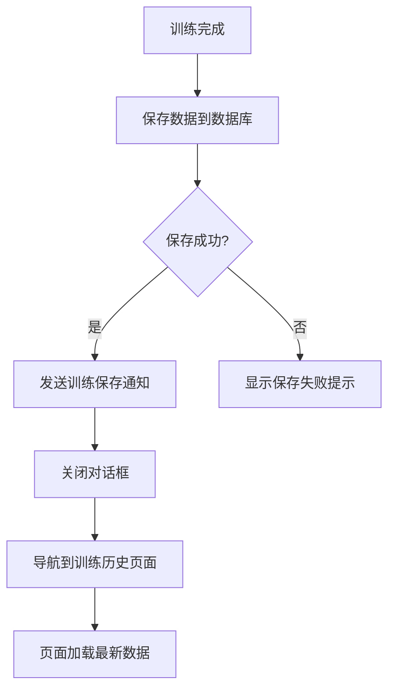
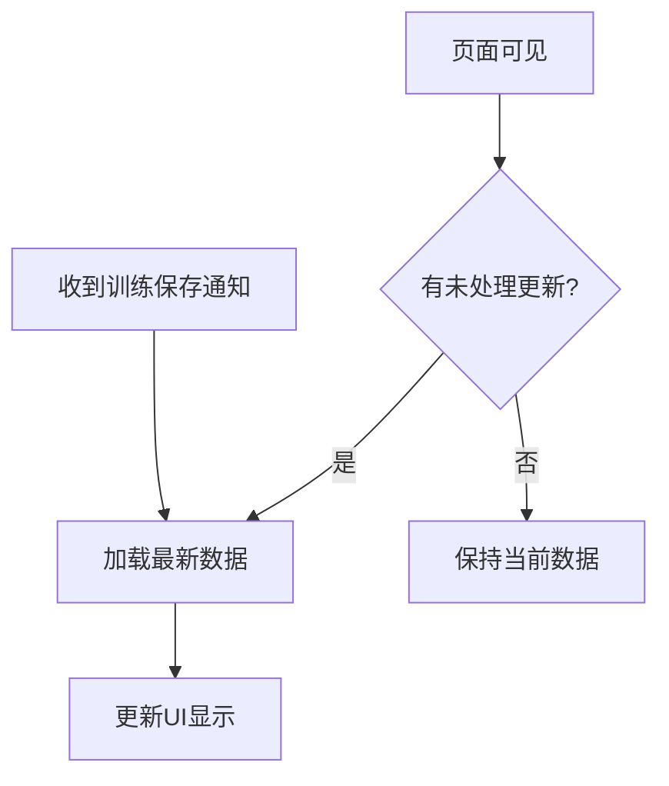

# 训练数据刷新问题修复需求文档

## 1. 问题描述

### 1.1 Bug现象
- **触发场景**：用户在实战页面完成训练后
- **预期结果**：在训练历史页面可以立即看到新的训练记录
- **实际结果**：训练历史页面显示旧数据，需要点击其他复盘记录后才会显示新训练数据

### 1.2 问题影响范围
- 实战模块：训练完成后的数据保存
- 我的模块：训练历史页面的数据加载
- 用户体验：完成训练后无法立即查看复盘

---

## 2. 根本原因分析

### 2.1 架构层面问题

**页面缓存机制**：
- `MainTabPage` 使用 `IndexedStack` 组件管理四个主页面
- 所有页面在首次加载时被创建并缓存
- 页面切换时不触发 `initState` 或 `didChangeDependencies`

**通知机制失效**：
- 训练完成时发送通知，但 `TrainingHistoryScreen` 可能尚未创建
- 即使页面已创建，由于 `IndexedStack` 缓存，通知回调可能不在UI线程

### 2.2 代码层面问题

**导航流程问题**（`battle_screen.dart`）：
```dart
// 当前实现：仅关闭对话框
TextButton(
  onPressed: () {
    Navigator.of(context).pop();
  },
  child: const Text('复盘'),
),
```

**数据加载时机**（`training_history_screen.dart`）：
- 数据仅在 `initState` 时加载一次
- 后续无自动刷新机制

---

## 3. 功能需求

### 3.1 核心需求

**需求ID**：TR-001  
**需求描述**：训练完成后点击"复盘"按钮，应直接导航到训练历史页面并显示新训练记录

**需求ID**：TR-002  
**需求描述**：训练历史页面应支持实时刷新，当有新训练记录时自动更新列表

### 3.2 验收标准（AC）

**AC-001**: Given 用户在实战页面完成训练并保存成功，When 用户点击"复盘"按钮，Then 自动导航到训练历史页面，且新训练记录显示在列表顶部

**AC-002**: Given 用户在训练历史页面，When 有新训练记录保存到数据库，Then 页面自动刷新并显示新记录

**AC-003**: Given 用户从其他页面导航到训练历史页面，When 存在未显示的新训练记录，Then 页面加载时显示最新数据

**AC-004**: Given 用户手动刷新训练历史页面（下拉刷新），When 触发刷新操作，Then 页面重新加载数据并显示最新记录

**AC-005**: Given 训练历史页面正在显示，When 收到训练保存通知，Then 页面自动刷新数据

---

## 4. 边界与异常场景

### 4.1 边界情况

**AC-006**: Given 训练保存失败，When 用户点击"复盘"按钮，Then 显示保存失败提示，不导航到训练历史页面

**AC-007**: Given 训练历史页面为空，When 完成首次训练后点击"复盘"，Then 页面显示唯一的训练记录

**AC-008**: Given 用户在训练历史页面查看其他记录详情，When 新训练完成，Then 返回列表时显示新记录

### 4.2 异常处理

**AC-009**: Given 数据库查询失败，When 加载训练历史，Then 显示错误提示并保持旧数据

**AC-010**: Given 网络异常（离线模式），When 完成训练并保存，Then 数据保存到本地数据库，后续正常显示

---

## 5. 业务规则

**BR-001**: 训练记录必须按创建时间倒序排列，最新记录在最上方

**BR-002**: 训练记录保存成功后必须立即通知所有监听者

**BR-003**: 训练历史页面必须在可见时自动刷新数据

**BR-004**: 重复的训练记录不应被多次添加到列表

---

## 6. 范围界定

### 6.1 本次修复内容
- 修改"复盘"按钮导航逻辑
- 添加训练历史页面自动刷新机制
- 实现通知驱动的数据更新

### 6.2 本次不涉及内容
- 修改 `MainTabPage` 的页面缓存机制
- 修改数据库表结构
- 添加下拉刷新UI组件（后续迭代）

---

## 7. 用户故事

**用户故事1**:
> 作为一名交易学员，我希望完成训练后点击"复盘"按钮能直接看到我的训练记录，这样我可以立即回顾本次训练的表现。

**用户故事2**:
> 作为一名交易学员，我希望训练历史页面能自动更新，这样我不需要手动刷新就能看到最新的训练记录。

---

## 8. 流程优化建议

### 优化后的训练完成流程



### 训练历史页面数据更新流程

