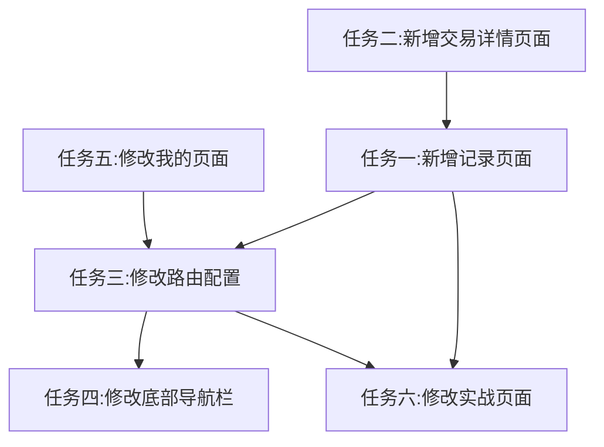

# 记录页面功能 - 开发任务清单

## 1. 任务概述

根据需求文档和技术方案，本功能需要完成以下核心开发任务：

| 序号 | 任务名称 | 任务描述 | 关联AC |
|:---:|----------|----------|:-----:|
| 1 | 新增记录页面 | 创建记录页面主入口，展示训练记录列表 | AC-001, AC-002 |
| 2 | 新增交易详情页面 | 创建交易详情页面，展示交易明细 | AC-003 |
| 3 | 修改路由配置 | 新增记录页面路由配置 | - |
| 4 | 修改底部导航栏 | 在实战和我的之间新增"记录"入口 | AC-001 |
| 5 | 修改我的页面 | 删除训练记录入口 | AC-007 |
| 6 | 修改实战页面 | 支持复盘和重训模式 | AC-004, AC-005, AC-006 |

---

## 2. 详细任务清单

### 2.1. 任务一：新增记录页面 (records_screen.dart)

| 子任务 | 描述 | 状态 | 预估工时 |
|--------|------|------|:-------:|
| 2.1.1 | 创建 records 目录 | 新增 `lib/features/records/` 目录 | 待开始 |
| 2.1.2 | 创建 RecordsScreen 组件 | 创建记录页面主组件 | 待开始 |
| 2.1.3 | 实现训练记录列表加载 | 调用 DatabaseService 获取训练记录 | 待开始 |
| 2.1.4 | 实现记录卡片UI | 展示股票名称、代码、周期、收益率等 | 待开始 |
| 2.1.5 | 实现详情按钮点击 | 跳转至交易详情页面 | 待开始 |
| 2.1.6 | 实现复盘按钮点击 | 跳转至实战页面（复盘模式） | 待开始 |
| 2.1.7 | 实现重训按钮点击 | 跳转至实战页面（重训模式） | 待开始 |
| 2.1.8 | 实现空状态处理 | 无训练记录时显示提示 | 待开始 |

**依赖**：路由配置、DatabaseService

---

### 2.2. 任务二：新增交易详情页面 (record_detail_screen.dart)

| 子任务 | 描述 | 状态 | 预估工时 |
|--------|------|------|:-------:|
| 2.2.1 | 创建 RecordDetailScreen 组件 | 创建交易详情页面组件 | 待开始 |
| 2.2.2 | 实现交易明细加载 | 调用 DatabaseService 获取交易记录 | 待开始 |
| 2.2.3 | 实现交易列表UI | 展示买卖类型、价格、数量、金额 | 待开始 |
| 2.2.4 | 实现空状态处理 | 无交易记录时显示提示 | 待开始 |

**依赖**：记录页面

---

### 2.3. 任务三：修改路由配置 (app_routes.dart)

| 子任务 | 描述 | 状态 | 预估工时 |
|--------|------|------|:-------:|
| 2.3.1 | 新增记录页面路由 | 添加 `/records` 路由 | 待开始 |
| 2.3.2 | 新增交易详情路由 | 添加 `/records/:id/detail` 路由 | 待开始 |
| 2.3.3 | 导入新页面组件 | 导入 RecordsScreen 和 RecordDetailScreen | 待开始 |

**依赖**：记录页面、交易详情页面

---

### 2.4. 任务四：修改底部导航栏

| 子任务 | 描述 | 状态 | 预估工时 |
|--------|------|------|:-------:|
| 2.4.1 | 修改 home_screen.dart | 添加"记录"导航项 | 待开始 |
| 2.4.2 | 修改 battle_screen.dart | 添加"记录"导航项 | 待开始 |
| 2.4.3 | 更新导航索引逻辑 | 调整导航索引对应关系 | 待开始 |

**依赖**：路由配置

---

### 2.5. 任务五：修改我的页面 (mine_screen.dart)

| 子任务 | 描述 | 状态 | 预估工时 |
|--------|------|------|:-------:|
| 2.5.1 | 删除训练记录入口 | 移除 ListTile 训练记录入口 | 待开始 |

**依赖**：无

---

### 2.6. 任务六：修改实战页面 (battle_screen.dart)

| 子任务 | 描述 | 状态 | 预估工时 |
|--------|------|------|:-------:|
| 2.6.1 | 添加路由参数解析 | 解析 mode、sessionId、symbol 等参数 | 待开始 |
| 2.6.2 | 实现复盘模式 | 加载训练最后一天状态，展示完整K线和交易标记 | 待开始 |
| 2.6.3 | 实现重训模式 | 使用原会话参数重新开始训练 | 待开始 |
| 2.6.4 | 复用训练复盘数据 | 使用 TrainingReviewRepository 获取数据 | 待开始 |

**依赖**：路由配置、TrainingReviewRepository

---

## 3. 任务依赖关系

---

## 4. 任务优先级

| 优先级 | 任务 | 理由 |
|:---:|------|------|
| P0 | 任务五 | 删除入口，避免用户访问旧页面 |
| P0 | 任务三 | 路由是其他页面的基础 |
| P1 | 任务一 | 记录页面是核心功能 |
| P1 | 任务二 | 详情页面是记录页面的附属功能 |
| P2 | 任务四 | 导航栏依赖路由配置 |
| P2 | 任务六 | 复盘和重训依赖记录页面 |

---

## 5. 验收标准对照表

| 任务 | AC编号 | 验收标准摘要 |
|------|:-----:|--------------|
| 任务一 | AC-001 | 点击记录图标导航到记录页面 |
| 任务一 | AC-002 | 显示训练记录列表（股票名称、代码、周期、收益率等） |
| 任务一 | AC-004 | 点击复盘按钮跳转至实战页面展示最后一天状态 |
| 任务一 | AC-005 | 点击重训按钮重新训练该股票和周期 |
| 任务一 | AC-009 | 无训练记录时显示提示 |
| 任务二 | AC-003 | 展示交易明细（买卖类型、价格、数量、金额） |
| 任务二 | AC-010 | 无交易记录时显示提示 |
| 任务四 | AC-001 | 底部导航栏新增记录入口 |
| 任务五 | AC-007 | 我的页面移除训练记录入口 |
| 任务六 | AC-006 | 复盘效果与实战完成后一致 |

---

## 6. 开发资源

### 6.1. 参考文件

| 文件 | 路径 | 用途 |
|------|------|------|
| TrainingHistoryScreen | `lib/features/mine/training_history/training_history_screen.dart` | 参考列表展示逻辑 |
| TrainingDetailScreen | `lib/features/mine/training_history/training_detail_screen.dart` | 参考交易详情实现 |
| BattleScreen | `lib/features/battle/battle_screen.dart` | 参考K线图表和交易逻辑 |
| AppRoutes | `lib/routes/app_routes.dart` | 参考路由配置方式 |

### 6.2. 数据模型

| 模型 | 路径 | 用途 |
|------|------|------|
| TrainingSession | `lib/data/database/app_database.dart` | 训练会话数据 |
| Trade | `lib/data/database/app_database.dart` | 交易记录数据 |
| TradePoint | `lib/data/models/trade_point_model.dart` | 买卖点数据 |

---

## 7. 任务状态跟踪

| 任务 | 负责人 | 开始日期 | 结束日期 | 状态 |
|------|--------|----------|----------|------|
| 任务一：新增记录页面 | - | - | - | 待开始 |
| 任务二：新增交易详情页面 | - | - | - | 待开始 |
| 任务三：修改路由配置 | - | - | - | 待开始 |
| 任务四：修改底部导航栏 | - | - | - | 待开始 |
| 任务五：修改我的页面 | - | - | - | 待开始 |
| 任务六：修改实战页面 | - | - | - | 待开始 |

---

**文档版本**: v1.0  
**创建日期**: 2026-05-25  
**最后更新**: 2026-05-25