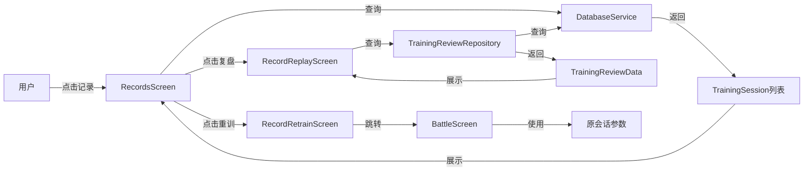

# 记录页面功能 - 技术方案

## 1. 需求分析

基于需求文档，本功能需要实现以下核心功能：

| 序号 | 需求点 | 描述 | 对应AC |
|:---:|--------|------|:-----:|
| 1 | 新增底部导航栏"记录"入口 | 在实战和我的之间新增记录页面入口 | AC-001 |
| 2 | 训练记录列表展示 | 展示所有历史训练记录，包含股票名称、代码、周期、收益率等 | AC-002 |
| 3 | 详情按钮 | 点击展示交易明细（买卖类型、价格、数量、金额） | AC-003 |
| 4 | 复盘按钮 | 点击展示K线复盘页面，标记买卖点 | AC-004 |
| 5 | 重训按钮 | 点击重新训练该股票和周期 | AC-005 |
| 6 | 复盘页面与实战一致 | K线图展示效果与实战结束页面一致 | AC-006 |
| 7 | 删除我的页面入口 | 移除"我的"页面中的训练记录入口 | AC-007 |

---

## 2. 技术方案

### 2.1. 架构设计

#### 2.1.1. 整体架构

```
┌─────────────────────────────────────────────────────────────────┐
│                        App Layer                                │
│  ┌──────────┐  ┌──────────┐  ┌──────────┐  ┌──────────┐       │
│  │  首页    │  │  实战    │  │  记录    │  │  我的    │       │
│  └────┬─────┘  └────┬─────┘  └────┬─────┘  └────┬─────┘       │
│       │             │             │             │              │
└───────┼─────────────┼─────────────┼─────────────┼──────────────┘
        │             │             │             │
        ▼             ▼             ▼             ▼
┌─────────────────────────────────────────────────────────────────┐
│                      Route Layer                                │
│              app_routes.dart (GoRouter配置)                     │
└─────────────────────────────────────────────────────────────────┘
        │             │             │             │
        ▼             ▼             ▼             ▼
┌─────────────────────────────────────────────────────────────────┐
│                      Feature Layer                              │
│  ┌──────────────────────────┐  ┌──────────────────────────┐    │
│  │        mine/            │  │        records/          │    │
│  │  - mine_screen.dart     │  │  - records_screen.dart   │    │
│  │  - training_history/    │  │  - record_detail_screen.dart│   │
│  │    - training_history_screen.dart│  │  - record_replay_screen.dart│
│  │    - training_detail_screen.dart│  │  - record_retrain_screen.dart│
│  └──────────────────────────┘  └──────────────────────────┘    │
└─────────────────────────────────────────────────────────────────┘
        │             │             │
        ▼             ▼             ▼
┌─────────────────────────────────────────────────────────────────┐
│                      Provider Layer                             │
│  training_review_provider.dart (复盘数据状态管理)                │
└─────────────────────────────────────────────────────────────────┘
        │             │             │
        ▼             ▼             ▼
┌─────────────────────────────────────────────────────────────────┐
│                      Repository Layer                           │
│  training_review_repository.dart (数据获取逻辑)                 │
└─────────────────────────────────────────────────────────────────┘
        │             │             │
        ▼             ▼             ▼
┌─────────────────────────────────────────────────────────────────┐
│                      Data Layer                                 │
│  ┌─────────────────┐  ┌─────────────────┐                     │
│  │  Database       │  │  API Service    │                     │
│  │  (训练记录)     │  │  (K线数据)      │                     │
│  └─────────────────┘  └─────────────────┘                     │
└─────────────────────────────────────────────────────────────────┘
```

#### 2.1.2. 模块职责

| 模块 | 职责 | 状态 |
|------|------|------|
| records_screen | 记录页面主入口，展示训练记录列表 | 新增 |
| record_detail_screen | 交易详情页面 | 新增 |
| battle_screen | 实战页面（复用，支持复盘和重训模式） | 复用/修改 |
| training_review_provider | 复盘数据状态管理 | 复用现有 |
| training_review_repository | 复盘数据获取 | 复用现有 |

---

### 2.2. 目录结构

```
lib/
├── features/
│   ├── records/                    # 新增记录模块
│   │   ├── records_screen.dart     # 记录页面（列表）
│   │   ├── record_detail_screen.dart   # 交易详情页面
│   │   ├── record_replay_screen.dart   # 复盘页面
│   │   └── record_retrain_screen.dart  # 重训页面
│   └── mine/                       # 我的模块（需修改）
│       └── mine_screen.dart        # 删除训练记录入口
├── routes/
│   └── app_routes.dart             # 新增路由配置
└── providers/
    └── training_review_provider.dart  # 复用现有
```

---

### 2.3. 关键类与方法设计

#### 2.3.1. RecordsScreen（记录页面）

| 方法名 | 功能说明 | 参数 | 返回值 |
|--------|----------|------|--------|
| `_loadTrainingSessions()` | 加载训练记录列表 | 无 | `Future<void>` |
| `_buildRecordCard()` | 构建训练记录卡片 | `TrainingSession session` | `Widget` |
| `_handleDetail()` | 点击详情按钮 | `int sessionId` | `void` |
| `_handleReplay()` | 点击复盘按钮 | `int sessionId` | `void` |
| `_handleRetrain()` | 点击重训按钮 | `TrainingSession session` | `void` |

#### 2.3.2. RecordDetailScreen（交易详情页面）

| 方法名 | 功能说明 | 参数 | 返回值 |
|--------|----------|------|--------|
| `_loadTradeDetails()` | 加载交易明细 | `int sessionId` | `Future<void>` |
| `_buildTradeList()` | 构建交易列表 | `List<Trade> trades` | `Widget` |

#### 2.3.3. RecordReplayScreen（复盘页面）

| 方法名 | 功能说明 | 参数 | 返回值 |
|--------|----------|------|--------|
| `_loadReplayData()` | 加载复盘数据 | `int sessionId` | `Future<void>` |
| `_buildKlineChart()` | 构建K线图表 | 无 | `Widget` |
| `_buildTradeMarkers()` | 构建买卖点标记 | `List<TradePoint> points` | `List<Widget>` |

#### 2.3.4. RecordRetrainScreen（重训页面）

| 方法名 | 功能说明 | 参数 | 返回值 |
|--------|----------|------|--------|
| `_initRetrain()` | 初始化重训参数 | `TrainingSession session` | `void` |
| `_startRetrain()` | 开始重新训练 | 无 | `void` |

---

### 2.4. 数据库与数据结构

#### 2.4.1. 数据来源

| 数据项 | 来源表/接口 | 说明 |
|--------|-------------|------|
| 训练记录列表 | `training_sessions` | 用户训练会话记录 |
| 交易明细 | `trades` | 通过 `session_id` 关联 |
| K线数据 | `kline_data` | 通过 `symbol` 和日期范围查询 |
| 买卖点标记 | 通过 trades 和 kline_data 关联生成 | 根据交易日期匹配K线索引 |

#### 2.4.2. 核心数据模型

**TrainingSession（训练会话）**

| 字段名 | 类型 | 说明 |
|--------|------|------|
| `id` | `int` | 会话ID |
| `symbol` | `String` | 股票代码 |
| `startDate` | `DateTime` | 训练开始日期 |
| `endDate` | `DateTime` | 训练结束日期 |
| `profitRate` | `double?` | 收益率 |
| `tradeCount` | `int?` | 交易次数 |
| `winRate` | `double?` | 胜率 |
| `initialCapital` | `double?` | 初始资金 |
| `currentCapital` | `double?` | 最终资金 |

**Trade（交易记录）**

| 字段名 | 类型 | 说明 |
|--------|------|------|
| `id` | `int` | 交易ID |
| `sessionId` | `int` | 关联会话ID |
| `type` | `String` | 交易类型（buy/sell） |
| `price` | `double?` | 交易价格 |
| `quantity` | `int?` | 交易数量 |
| `amount` | `double?` | 交易金额 |
| `tradeDate` | `String?` | 交易日期 |
| `profit` | `double?` | 盈利金额 |
| `profitRate` | `double?` | 盈利率 |

**TradePoint（买卖点）**

| 字段名 | 类型 | 说明 |
|--------|------|------|
| `index` | `int` | K线索引位置 |
| `price` | `double` | 价格 |
| `isBuy` | `bool` | 是否买入 |
| `label` | `String` | 标签（B/S） |
| `date` | `DateTime` | 日期 |

---

### 2.5. API 接口设计

#### 2.5.1. 数据库操作（通过Dao层）

| 操作 | Dao方法 | 参数 | 返回值 |
|------|---------|------|--------|
| 获取用户训练记录 | `getUserSessions(userId)` | `int userId` | `List<TrainingSession>` |
| 获取会话详情 | `getSession(sessionId)` | `int sessionId` | `TrainingSession?` |
| 获取会话交易 | `getSessionTrades(sessionId)` | `int sessionId` | `List<Trade>` |
| 获取K线数据 | `getKlineDataRange(symbol, period, start, end)` | `String, String, DateTime, DateTime` | `List<KlineData>` |

---

### 2.6. 路由与页面跳转

#### 2.6.1. 新增路由配置

| 路由路径 | 页面 | 说明 |
|----------|------|------|
| `/records` | `RecordsScreen` | 记录页面（底部导航） |
| `/records/:id/detail` | `RecordDetailScreen` | 交易详情 |
| `/records/:id/replay` | `RecordReplayScreen` | 复盘页面 |
| `/records/:id/retrain` | `RecordRetrainScreen` | 重训页面 |

#### 2.6.2. 路由配置代码示例

```dart
// app_routes.dart 新增路由
GoRoute(
  path: '/records',
  name: 'records',
  builder: (context, state) => const RecordsScreen(),
  routes: [
    GoRoute(
      path: ':id/detail',
      name: 'record-detail',
      builder: (context, state) {
        final id = int.parse(state.pathParameters['id']!);
        return RecordDetailScreen(sessionId: id);
      },
    ),
    GoRoute(
      path: ':id/replay',
      name: 'record-replay',
      builder: (context, state) {
        final id = int.parse(state.pathParameters['id']!);
        return RecordReplayScreen(sessionId: id);
      },
    ),
    GoRoute(
      path: ':id/retrain',
      name: 'record-retrain',
      builder: (context, state) {
        final id = int.parse(state.pathParameters['id']!);
        return RecordRetrainScreen(sessionId: id);
      },
    ),
  ],
),
```

---

### 2.7. 主业务流程与调用链

#### 2.7.1. 记录页面加载流程

```mermaid
flowchart TD
    A[用户点击底部导航"记录"] --> B[RecordsScreen.build]
    B --> C[_loadTrainingSessions]
    C --> D[DatabaseService.trainingDao.getUserSessions]
    D --> E[返回 List&lt;TrainingSession&gt;]
    E --> F[构建记录列表UI]
    F --> G[显示训练记录卡片]
```

#### 2.7.2. 复盘页面流程

```mermaid
flowchart TD
    A[用户点击"复盘"按钮] --> B[Navigator.push /records/:id/replay]
    B --> C[RecordReplayScreen.build]
    C --> D[ref.watch trainingReviewProvider]
    D --> E[TrainingReviewRepository.getReviewData]
    E --> F{获取数据}
    F -->|成功| G[展示K线图表+买卖点标记]
    F -->|失败| H[显示错误提示]
```

#### 2.7.3. 重训流程

```mermaid
flowchart TD
    A[用户点击"重训"按钮] --> B[Navigator.push /records/:id/retrain]
    B --> C[RecordRetrainScreen.build]
    C --> D[_initRetrain - 获取原会话参数]
    D --> E[跳转到实战页面]
    E --> F[使用原股票和时间范围开始训练]
```

---

## 3. 部署与集成方案

### 3.1. 前端集成

#### 3.1.1. 修改底部导航栏

需要修改 `home_screen.dart` 和 `battle_screen.dart` 中的 `BottomNavigationBar`：

```dart
BottomNavigationBar(
  type: BottomNavigationBarType.fixed,
  items: const <BottomNavigationBarItem>[
    BottomNavigationBarItem(icon: Icon(Icons.home), label: '首页'),
    BottomNavigationBarItem(icon: Icon(Icons.bar_chart), label: '实战'),
    BottomNavigationBarItem(icon: Icon(Icons.history), label: '记录'),  // 新增
    BottomNavigationBarItem(icon: Icon(Icons.person), label: '我的'),
  ],
  currentIndex: _selectedIndex,
  onTap: _onItemTapped,
)
```

#### 3.1.2. 修改我的页面

从 `mine_screen.dart` 中移除训练记录入口：

```dart
// 删除以下代码块
ListTile(
  leading: const Icon(Icons.history),
  title: const Text('训练记录'),
  trailing: const Icon(Icons.chevron_right),
  onTap: () => context.push('/mine/training-history'),
),
```

---

### 3.2. 依赖与环境

| 依赖 | 版本 | 用途 |
|------|------|------|
| `go_router` | ^12.0.0 | 路由管理 |
| `flutter_riverpod` | ^2.4.0 | 状态管理 |
| `drift` | ^2.14.0 | 数据库 |
| `logger` | ^2.0.0 | 日志 |

---

## 4. 代码安全性

### 4.1. 注意事项

| 序号 | 风险点 | 描述 |
|:---:|--------|------|
| 1 | SQL注入 | 通过Dao层使用参数化查询，避免SQL注入 |
| 2 | 越权访问 | 确保用户只能访问自己的训练记录 |
| 3 | 数据验证 | 对sessionId进行合法性校验 |
| 4 | 敏感信息泄露 | 不记录或显示用户敏感信息 |

### 4.2. 解决方案

| 风险点 | 解决方案 |
|--------|----------|
| SQL注入 | 使用Drift ORM的参数化查询，禁止拼接SQL |
| 越权访问 | 查询时强制传入用户ID，后端验证用户权限 |
| 数据验证 | 在页面初始化时校验sessionId有效性，无效则返回错误 |
| 敏感信息泄露 | 日志中不记录完整的用户信息，仅记录必要的ID |

---

## 5. 测试策略

### 5.1. 单元测试

| 测试项 | 测试内容 | 预期结果 |
|--------|----------|----------|
| 训练记录列表加载 | 调用getUserSessions | 返回正确的训练记录列表 |
| 交易明细加载 | 调用getSessionTrades | 返回正确的交易列表 |
| 复盘数据加载 | 调用getReviewData | 返回完整的复盘数据 |

### 5.2. 集成测试

| 测试项 | 测试内容 | 预期结果 |
|--------|----------|----------|
| 记录页面跳转 | 点击底部导航 | 成功跳转到记录页面 |
| 详情页面跳转 | 点击详情按钮 | 成功跳转到交易详情 |
| 复盘页面跳转 | 点击复盘按钮 | 成功跳转到复盘页面 |
| 重训功能 | 点击重训按钮 | 成功开始重新训练 |

### 5.3. UI测试

| 测试项 | 测试内容 | 预期结果 |
|--------|----------|----------|
| 空状态展示 | 无训练记录时 | 显示"暂无训练记录"提示 |
| K线图展示 | 复盘页面加载 | K线图正常显示，买卖点标记正确 |
| 按钮交互 | 点击各按钮 | 响应正确，无报错 |

---

## 6. 附录

### 6.1. 参考文件

| 文件 | 路径 | 用途 |
|------|------|------|
| 训练历史页面 | `lib/features/mine/training_history/training_history_screen.dart` | 参考列表展示逻辑 |
| 训练详情页面 | `lib/features/mine/training_history/training_detail_screen.dart` | 参考复盘页面实现 |
| 实战页面 | `lib/features/battle/battle_screen.dart` | 参考K线图表实现 |
| 路由配置 | `lib/routes/app_routes.dart` | 参考路由配置方式 |

### 6.2. 数据流向图



---

**文档版本**: v1.0  
**创建日期**: 2026-05-25  
**最后更新**: 2026-05-25