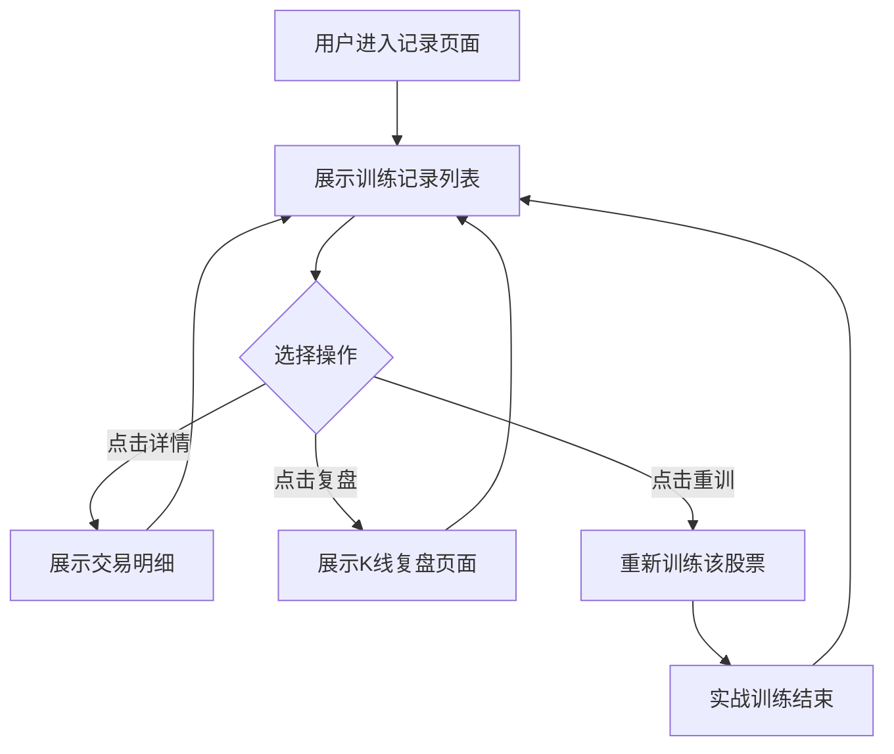

# 记录页面功能需求文档

## 1. 需求概述

在底部导航栏新增"记录"页面（位于"实战"和"我的"之间），整合训练记录列表、交易详情、复盘分析和重新训练功能。原"我的"页面中的训练记录入口将被移除。

---

## 2. 核心流程



---

## 3. 验收标准（AC）

### 3.1 Happy Path（正常流程）

| AC编号 | 验收标准 |
|:---:|----------|
| AC-001 | Given 用户在底部导航栏，When 用户点击"记录"图标，Then 导航到记录页面并展示训练记录列表。 |
| AC-002 | Given 用户在记录页面，When 页面加载完成，Then 显示所有历史训练记录，每条记录包含股票名称、代码、训练周期、收益率、交易次数、胜率。 |
| AC-003 | Given 用户在记录页面的某条训练记录上，When 用户点击"详情"按钮，Then 展示该训练的交易明细列表，包含每笔交易的买卖类型、价格、数量、金额。 |
| AC-004 | Given 用户在记录页面的某条训练记录上，When 用户点击"复盘"按钮，Then 跳转至实战页面并展示该训练的最后一天状态，包含完整训练周期的K线图，K线上标记买入点（红色向上三角）和卖出点（绿色向下三角）。 |
| AC-005 | Given 用户在记录页面的某条训练记录上，When 用户点击"重训"按钮，Then 在当前页面开始重新训练该训练周期的该股票（保留原有训练时间范围和股票标的）。 |
| AC-006 | Given 用户在记录页面点击复盘按钮后，When 页面加载完成，Then 展示效果与实战页面训练完成后点击复盘的效果完全一致，即展示训练最后一天结束后的状态（包含MA均线、成交量、MACD指标、买卖点位标记、账户资金、持仓信息等）。 |
| AC-007 | Given 用户在"我的"页面，When 页面加载完成，Then 原有的"训练记录"入口已被移除。 |
| AC-008 | Given 用户完成一次实战训练后，When 用户点击底部导航栏的"记录"，Then 在记录列表中能看到最新完成的训练记录。 |

### 3.2 Edge & Error Cases（边界和异常）

| AC编号 | 验收标准 |
|:---:|----------|
| AC-009 | Given 用户没有任何训练记录，When 用户进入记录页面，Then 显示"暂无训练记录"提示，无按钮可点击。 |
| AC-010 | Given 某条训练记录没有交易记录，When 用户点击"详情"按钮，Then 显示"暂无交易记录"提示。 |
| AC-011 | Given 某条训练记录缺少K线数据，When 用户点击"复盘"按钮，Then 显示"暂无K线数据"提示，并提供返回按钮。 |
| AC-012 | Given 用户在复盘页面，When 用户点击返回，Then 返回记录页面的训练列表。 |
| AC-013 | Given 用户在重训过程中，When 用户点击底部导航栏的其他选项，Then 当前训练进度保存，切换到对应页面。 |

### 3.3 Business Rules（业务规则）

| AC编号 | 验收标准 |
|:---:|----------|
| AC-014 | Given 任何情况下，When 展示训练记录列表，Then 列表按训练结束时间倒序排列（最新的在最上面）。 |
| AC-015 | Given 任何训练记录，When 展示收益率，Then 正数显示红色，负数显示绿色。 |
| AC-016 | Given 任何复盘页面，When 展示K线图，Then 买入点标记为红色向上三角形，卖出点标记为绿色向下三角形。 |
| AC-017 | Given 用户点击重训，When 开始重新训练，Then 使用与原训练相同的股票标的和时间范围。 |
| AC-018 | Given 任何情况下，When 计算胜率，Then 胜率 = 盈利交易次数 / 总交易次数 × 100%（保留1位小数）。 |

---

## 4. 范围界定

### 4.1 本次做
- 新增底部导航栏"记录"页面（位置：实战和我的之间）
- 记录页面展示训练记录列表（股票名称、代码、训练周期、收益率、交易次数、胜率）
- 每条记录提供"详情"按钮（展示交易明细）
- 每条记录提供"复盘"按钮（展示K线复盘，含买卖点标记）
- 每条记录提供"重训"按钮（重新训练该股票和周期）
- 删除"我的"页面中的训练记录入口
- 复盘页面与实战结束页面保持一致的视觉风格

### 4.2 本次不做
- 不新增其他复盘分析功能（如AI分析、策略评估等）
- 不修改实战页面的训练逻辑
- 不修改原有的训练记录数据结构
- 不支持训练记录的删除或编辑功能

---

## 5. 页面原型参考

### 5.1 记录页面布局

```
┌─────────────────────────────────────────────────────┐
│                   记录                             │
├─────────────────────────────────────────────────────┤
│  ┌─────────────────────────────────────────────┐   │
│  │ 私人场 / 试炼场 / 冲刺赛 (Tab切换)           │   │
│  └─────────────────────────────────────────────┘   │
│                                                   │
│  ┌─────────────────────────────────────────────┐   │
│  │ 双飞股份 300817                           │   │
│  │ 2022-03-07 - 2022-10-18  -11.59%          │   │
│  │ ┌────┬────┬────┬────┐                      │   │
│  │ │详情│复盘│复盘│重训│                      │   │
│  │ └────┴────┴────┴────┘                      │   │
│  │ 盈亏 -7517 -7.54%  103天                   │   │
│  └─────────────────────────────────────────────┘   │
│                                                   │
│  ┌─────────────────────────────────────────────┐   │
│  │ 云天励飞 688343                           │   │
│  │ 2024-12-09 - 2025-07-22  +20.41%          │   │
│  │ ┌────┬────┬────┬────┐                      │   │
│  │ │详情│复盘│复盘│重训│                      │   │
│  │ └────┴────┴────┴────┘                      │   │
│  │ 盈亏 6600 +6.21%  104天                    │   │
│  └─────────────────────────────────────────────┘   │
│                                                   │
│  ... (更多训练记录)                                │
├─────────────────────────────────────────────────────┤
│  首页 │ 实战 │ 记录 │ 竞技 │ 行情 │ 我的          │
└─────────────────────────────────────────────────────┘
```

### 5.2 复盘页面布局

```
┌─────────────────────────────────────────────────────┐
│                   复盘                             │
├─────────────────────────────────────────────────────┤
│  14.58 收  高 14.70  低 14.22  ...              │   │
├─────────────────────────────────────────────────────┤
│                                                   │
│  ████████      ▲(B)  ██                          │   │
│  ██    ██            ████                        │   │
│  ██    ██            ██  ██      ▼(S)            │   │
│  ██  ██ ██              ████                     │   │
│      ██    ██              ██                     │   │
│   ████      ██              ██                    │   │
│                                                   │
│  ┌─────────────────────────────────────────────┐   │
│  │ 成交量 │ 条件单 │ 止盈止损 │ 画线 │ ...    │   │
│  └─────────────────────────────────────────────┘   │
│                                                   │
│  ┌─────────────────────────────────────────────┐   │
│  │           成交量柱状图                       │   │
│  └─────────────────────────────────────────────┘   │
│                                                   │
│  ┌─────────────────────────────────────────────┐   │
│  │           MACD指标图                        │   │
│  └─────────────────────────────────────────────┘   │
├─────────────────────────────────────────────────────┤
│  首页 │ 实战 │ 记录 │ 竞技 │ 行情 │ 我的          │
└─────────────────────────────────────────────────────┘
```

---

## 6. 数据来源

| 数据项 | 来源 |
|--------|------|
| 训练记录列表 | training_sessions 表 |
| 交易明细 | trades 表（通过 session_id 关联） |
| K线数据 | kline_data 表 |
| 买卖点位标记 | 根据 trades 记录与 K线日期匹配生成 |

---

## 7. 文档版本

| 版本 | 日期 | 更新内容 | 作者 |
|:---:|------|----------|------|
| v1.0 | 2026-05-25 | 初始版本 | AI助手 |

---

**最后更新**: 2026-05-25