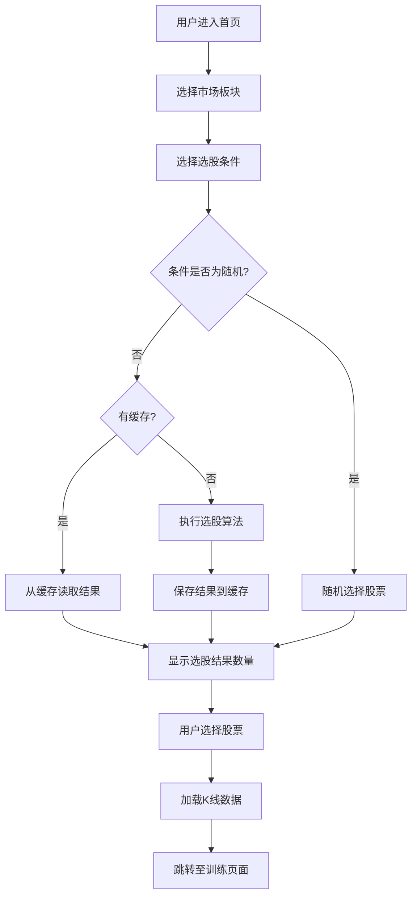

# K线训练营选股条件功能开发需求文档

## 1. 需求概述

### 1.1 业务背景
基于《K线训练营》产品规划，用户需要在首页通过选股条件筛选股票进行实战训练。本次需求旨在实现18种选股条件算法，完成前后端及数据库联动，支持实时选股筛选功能。

### 1.2 需求来源
- 产品文档：`kline-training-home-market-selection-plan.md`
- 计划文档：`2026-05-16-stock-selection-algorithm-implementation.md`

### 1.3 核心目标
| 目标 | 描述 |
|------|------|
| 算法实现 | 实现18种选股条件的精确算法 |
| 数据联动 | 完成前端页面与后台数据库的实时联动 |
| 性能优化 | 支持缓存机制，提升选股效率 |
| 用户体验 | 提供直观的选股条件选择和结果展示 |

---

## 2. 功能需求

### 2.1 选股条件类型

#### 2.1.1 趋势向上类（9种）

| 序号 | 条件名称 | 条件代码 | 算法描述 |
|------|----------|----------|----------|
| 1 | 历史新高 | `allTimeHigh` | 当前收盘价是该股票上市以来所有收盘价的最高点 |
| 2 | 一年新高 | `yearHigh` | 当前收盘价是过去252个交易日的最高点 |
| 3 | 200日新高 | `day200High` | 当前收盘价是过去200个交易日的最高点 |
| 4 | 30日涨幅前50% | `return30dTop` | 过去30日涨幅排名前50%的股票 |
| 5 | 15日涨幅前50% | `return15dTop` | 过去15日涨幅排名前50%的股票 |
| 6 | 涨停 | `limitUp` | 当日收盘价等于当日最高价 |
| 7 | 连板 | `consecutiveLimitUp` | 连续2个交易日收盘价均等于当日最高价 |
| 8 | 量价齐升 | `volumePriceUp` | 成交量较前一日上涨超过5%，且股价上涨超过2% |
| 9 | 上升趋势 | `upTrend` | 10日、20日、50日均线均向上，且均线角度递增 |

#### 2.1.2 趋势向下类（9种）

| 序号 | 条件名称 | 条件代码 | 算法描述 |
|------|----------|----------|----------|
| 10 | 历史新低 | `allTimeLow` | 当前收盘价是该股票上市以来所有收盘价的最低点 |
| 11 | 一年新低 | `yearLow` | 当前收盘价是过去252个交易日的最低点 |
| 12 | 200日新低 | `day200Low` | 当前收盘价是过去200个交易日的最低点 |
| 13 | 30日跌幅前50% | `loss30dTop` | 过去30日跌幅排名前50%的股票 |
| 14 | 15日跌幅前50% | `loss15dTop` | 过去15日跌幅排名前50%的股票 |
| 15 | 下降趋势 | `downTrend` | 10日、20日、50日均线均向下，且均线角度递减 |
| 16 | 跌停 | `limitDown` | 当日收盘价等于当日最低价 |
| 17 | 连续跌停 | `consecutiveLimitDown` | 连续2个交易日收盘价均等于当日最低价 |
| 18 | 随机 | `random` | 随机选择股票 |

### 2.2 核心功能

#### 2.2.1 条件选择功能
- **功能描述**：用户可从首页选股条件区域选择18种选股条件之一
- **输入**：用户点击单选框选择条件
- **输出**：选中状态更新，触发选股计算

#### 2.2.2 市场筛选功能
- **功能描述**：支持按市场板块（A股/港股/美股）筛选股票
- **输入**：下拉框选择市场板块
- **输出**：选股范围限定在所选市场内

#### 2.2.3 时间范围筛选功能
- **功能描述**：支持按时间范围（近1年/近3年/近5年/自定义）筛选股票
- **输入**：选择预设时间范围或自定义日期范围
- **输出**：选股数据限定在所选时间范围内
- **预设选项**：
  - 近1年（recent1Year）：当前日期减1年
  - 近3年（recent3Years）：当前日期减3年
  - 近5年（recent5Years）：当前日期减5年
  - 自定义（custom）：用户选择任意起止日期

#### 2.2.4 选股计算功能
- **功能描述**：根据所选条件和市场、时间范围，执行选股算法
- **输入**：选股条件、市场代码、选股日期、起始日期、结束日期
- **输出**：满足条件的股票列表

#### 2.2.5 结果展示功能
- **功能描述**：展示满足条件的股票数量和列表
- **输入**：选股结果数据
- **输出**：股票数量统计、股票列表展示

#### 2.2.6 缓存机制
- **功能描述**：自动缓存每日选股结果，避免重复计算
- **触发时机**：选股完成后自动缓存
- **缓存有效期**：当日有效

#### 2.2.7 训练跳转功能
- **功能描述**：选择股票后跳转至实战训练页面
- **输入**：选中的股票代码
- **输出**：携带K线数据跳转至训练页面

---

## 3. 数据需求

### 3.1 数据库表设计

#### 3.1.1 StockFilterResults（选股结果缓存表）

| 字段名 | 类型 | 约束 | 说明 |
|--------|------|------|------|
| id | INTEGER | PRIMARY KEY AUTOINCREMENT | 记录ID |
| filter_date | DATETIME | NOT NULL | 选股日期 |
| condition_type | TEXT | NOT NULL | 选股条件类型 |
| symbol | TEXT | NOT NULL | 标的代码 |
| market_code | TEXT | NOT NULL | 市场代码 |
| symbol_name | TEXT | NOT NULL | 标的名称 |
| close_price | REAL | NOT NULL | 当日收盘价 |
| change_percent | REAL | NOT NULL | 当日涨跌幅(%) |
| extra_data | TEXT | NULL | 额外数据(JSON) |
| created_at | DATETIME | DEFAULT CURRENT_TIMESTAMP | 创建时间 |

**索引设计**：
- `idx_filter_results_date_condition`：filter_date + condition_type
- `idx_filter_results_symbol`：symbol

#### 3.1.2 DailyStockStats（每日股票统计表）

| 字段名 | 类型 | 约束 | 说明 |
|--------|------|------|------|
| id | INTEGER | PRIMARY KEY AUTOINCREMENT | 记录ID |
| trade_date | DATETIME | NOT NULL | 交易日期 |
| symbol | TEXT | NOT NULL | 标的代码 |
| market_code | TEXT | NOT NULL | 市场代码 |
| close_price | REAL | NOT NULL | 当日收盘价 |
| open_price | REAL | NOT NULL | 当日开盘价 |
| high_price | REAL | NOT NULL | 当日最高价 |
| low_price | REAL | NOT NULL | 当日最低价 |
| volume | REAL | NOT NULL | 当日成交量 |
| return15d | REAL | NULL | 15日涨幅(%) |
| return30d | REAL | NULL | 30日涨幅(%) |
| ma10 | REAL | NULL | 10日均线值 |
| ma20 | REAL | NULL | 20日均线值 |
| ma50 | REAL | NULL | 50日均线值 |
| ma200 | REAL | NULL | 200日均线值 |
| historical_high | REAL | NULL | 历史最高价 |
| historical_low | REAL | NULL | 历史最低价 |
| year_high | REAL | NULL | 252日最高价 |
| year_low | REAL | NULL | 252日最低价 |
| is_limit_up | BOOLEAN | DEFAULT FALSE | 是否涨停 |
| is_limit_down | BOOLEAN | DEFAULT FALSE | 是否跌停 |
| listing_days | INTEGER | DEFAULT 0 | 上市天数 |
| is_suspended | BOOLEAN | DEFAULT FALSE | 是否停牌 |
| created_at | DATETIME | DEFAULT CURRENT_TIMESTAMP | 创建时间 |

**索引设计**：
- `idx_daily_stats_date`：trade_date
- `idx_daily_stats_symbol`：symbol

### 3.2 数据模型

#### 3.2.1 StockFilterConditionModel（选股条件模型）

| 字段名 | 类型 | 说明 |
|--------|------|------|
| code | String | 条件代码 |
| name | String | 条件名称 |
| direction | String | 趋势方向(up/down/neutral) |
| sortOrder | int | 排序序号 |
| description | String? | 条件描述 |
| formula | String? | 计算公式 |

#### 3.2.2 StockFilterResultModel（选股结果模型）

| 字段名 | 类型 | 说明 |
|--------|------|------|
| symbol | String | 标的代码 |
| symbolName | String | 标的名称 |
| marketCode | String | 市场代码 |
| closePrice | double | 收盘价 |
| changePercent | double | 涨跌幅(%) |
| extraData | Map<String, dynamic>? | 额外数据 |

#### 3.2.3 StockFilterResultResponse（选股结果响应）

| 字段名 | 类型 | 说明 |
|--------|------|------|
| condition | String | 条件代码 |
| conditionName | String | 条件名称 |
| date | DateTime | 选股日期 |
| total | int | 结果总数 |
| items | List\<StockFilterResultModel\> | 结果列表 |

---

## 4. 接口需求

### 4.1 DAO层接口

#### 4.1.1 StockFilterDao

| 方法名 | 参数 | 返回值 | 功能说明 |
|--------|------|--------|----------|
| `getActiveSymbols` | `marketCode`: String? | `Future<List<Symbol>>` | 获取指定市场的活跃标的 |
| `getKlineDataForDate` | `symbol`: String, `period`: String, `date`: DateTime | `Future<KlineDataData?>` | 获取指定标的指定日期的K线数据 |
| `getKlineDataBefore` | `symbol`: String, `period`: String, `date`: DateTime, `days`: int | `Future<List<KlineDataData>>` | 获取指定日期前N天的K线数据 |
| `checkAllTimeHigh` | `symbol`: String, `date`: DateTime | `Future<bool>` | 检查是否历史新高 |
| `checkYearHigh` | `symbol`: String, `date`: DateTime | `Future<bool>` | 检查是否一年新高 |
| `check200DayHigh` | `symbol`: String, `date`: DateTime | `Future<bool>` | 检查是否200日新高 |
| `checkAllTimeLow` | `symbol`: String, `date`: DateTime | `Future<bool>` | 检查是否历史新低 |
| `checkYearLow` | `symbol`: String, `date`: DateTime | `Future<bool>` | 检查是否一年新低 |
| `check200DayLow` | `symbol`: String, `date`: DateTime | `Future<bool>` | 检查是否200日新低 |
| `getReturn30dTop50` | `date`: DateTime | `Future<List<String>>` | 获取30日涨幅前50%标的 |
| `getReturn15dTop50` | `date`: DateTime | `Future<List<String>>` | 获取15日涨幅前50%标的 |
| `getLoss30dTop50` | `date`: DateTime | `Future<List<String>>` | 获取30日跌幅前50%标的 |
| `getLoss15dTop50` | `date`: DateTime | `Future<List<String>>` | 获取15日跌幅前50%标的 |
| `checkLimitUp` | `symbol`: String, `date`: DateTime | `Future<bool>` | 检查是否涨停 |
| `checkConsecutiveLimitUp` | `symbol`: String, `date`: DateTime | `Future<bool>` | 检查是否连板 |
| `checkLimitDown` | `symbol`: String, `date`: DateTime | `Future<bool>` | 检查是否跌停 |
| `checkConsecutiveLimitDown` | `symbol`: String, `date`: DateTime | `Future<bool>` | 检查是否连续跌停 |
| `checkVolumePriceUp` | `symbol`: String, `date`: DateTime | `Future<bool>` | 检查是否量价齐升 |
| `checkUpTrend` | `symbol`: String, `date`: DateTime, `startDate`: DateTime?, `endDate`: DateTime? | `Future<bool>` | 检查是否上升趋势 |
| `checkDownTrend` | `symbol`: String, `date`: DateTime, `startDate`: DateTime?, `endDate`: DateTime? | `Future<bool>` | 检查是否下降趋势 |
| `filterByCondition` | `condition`: StockFilterCondition, `date`: DateTime, `marketCode`: String?, `startDate`: DateTime?, `endDate`: DateTime? | `Future<List<String>>` | 根据条件筛选标的（含时间范围） |
| `saveFilterResults` | `date`: DateTime, `condition`: StockFilterCondition, `symbols`: List\<String\> | `Future<void>` | 保存选股结果到缓存 |
| `getCachedFilterResults` | `date`: DateTime, `condition`: StockFilterCondition | `Future<List<StockFilterResult>>` | 从缓存获取选股结果 |
| `hasCachedResults` | `date`: DateTime, `condition`: StockFilterCondition | `Future<bool>` | 检查是否有缓存 |

### 4.2 Repository层接口

#### 4.2.1 StockFilterRepository

| 方法名 | 参数 | 返回值 | 功能说明 |
|--------|------|--------|----------|
| `getAllConditions` | 无 | `List<StockFilterConditionModel>` | 获取所有选股条件 |
| `filterStocks` | `condition`: StockFilterCondition, `date`: DateTime?, `marketCode`: String?, `startDate`: DateTime?, `endDate`: DateTime?, `useCache`: bool | `Future<StockFilterResultResponse>` | 根据条件筛选股票（含时间范围） |
| `getRandomStock` | `marketCode`: String? | `Future<StockFilterResultModel?>` | 随机选择一支股票 |
| `getFilterCount` | `condition`: StockFilterCondition, `date`: DateTime?, `marketCode`: String? | `Future<int>` | 获取满足条件的股票数量 |
| `clearCache` | `date`: DateTime? | `Future<void>` | 清除选股缓存 |

### 4.3 Provider层接口

#### 4.3.1 StockFilterNotifier

| 方法名 | 参数 | 返回值 | 功能说明 |
|--------|------|--------|----------|
| `selectCondition` | `condition`: StockFilterCondition | `void` | 选择选股条件 |
| `selectConditionByLabel` | `label`: String | `void` | 通过标签选择条件 |
| `executeFilter` | `date`: DateTime?, `marketCode`: String? | `Future<void>` | 执行选股 |
| `updateFilterCount` | `date`: DateTime?, `marketCode`: String? | `Future<void>` | 更新选股数量 |
| `getRandomStock` | `marketCode`: String? | `Future<StockFilterResultModel?>` | 获取随机股票 |
| `clearError` | 无 | `void` | 清除错误 |
| `reset` | 无 | `void` | 重置状态 |

---

## 5. UI/UX需求

### 5.1 页面布局

#### 5.1.1 首页选股区域布局

```
┌─────────────────────────────────────┐
│  选股条件区域                        │
├─────────────────────────────────────┤
│  [市场板块下拉框]                    │
│  ───────────────────────────────────│
│  [趋势向上]                          │
│  [历史新高] [一年新高] [200日新高]   │
│  [30日涨幅] [15日涨幅] [涨停]        │
│  [连板]   [量价齐升] [上升趋势]      │
│  ───────────────────────────────────│
│  [趋势向下]                          │
│  [历史新低] [一年新低] [200日新低]   │
│  [30日跌幅] [15日跌幅] [跌停]        │
│  [连续跌停] [下降趋势]               │
│  ───────────────────────────────────│
│  当前满足条件: XX 支股票             │
│  [开始训练]                          │
└─────────────────────────────────────┘
```

#### 5.1.2 组件样式要求

| 组件 | 样式要求 |
|------|----------|
| 市场板块下拉框 | 宽度100%，圆角8px，边框1px |
| 条件单选框 | 网格布局3列，圆角8px，选中状态高亮 |
| 趋势向上组 | 红色主题，左侧4px指示条 |
| 趋势向下组 | 绿色主题，左侧4px指示条 |
| 结果提示 | 灰色文字，显示选股数量 |
| 加载状态 | 圆形进度条，居中显示 |

### 5.2 交互流程



---

## 6. 非功能需求

### 6.1 性能要求

| 指标 | 要求 |
|------|------|
| 选股响应时间 | ≤3秒（首次计算），≤1秒（缓存读取） |
| 支持标的数量 | ≥1000支股票 |
| 并发处理 | 支持多用户同时选股 |

### 6.2 数据完整性

| 检查项 | 要求 |
|--------|------|
| 数据校验 | 选股前校验标的数据完整性 |
| 异常处理 | 计算失败时跳过该标的，继续处理其他标的 |
| 日志记录 | 记录选股过程中的异常和错误 |

### 6.3 边界条件处理

| 边界条件 | 处理策略 |
|----------|----------|
| 上市不足30天 | 不参与筛选（历史新高/新低类） |
| 上市不足1年 | 取实际可用数据计算（一年新高/新低类） |
| 数据不足200天 | 取实际可用数据计算（200日新高/新低类） |
| 数据不足55天 | 返回false（趋势类条件） |
| 前一日数据缺失 | 返回false（连板、量价齐升类） |

---

## 7. 安全需求

| 安全项 | 要求 |
|--------|------|
| 数据加密 | 数据库敏感数据加密存储 |
| 输入校验 | 对用户输入进行合法性校验 |
| 异常捕获 | 捕获并处理所有可能的异常 |
| 日志脱敏 | 日志中不记录敏感信息 |

---

## 8. 部署与集成需求

### 8.1 代码生成

| 生成项 | 命令 |
|--------|------|
| Drift数据库代码 | `flutter pub run build_runner build --delete-conflicting-outputs` |
| Json序列化代码 | `flutter pub run build_runner build` |

### 8.2 数据库迁移

| 版本 | 变更内容 |
|------|----------|
| v1 → v2 | 添加StockFilterResults和DailyStockStats表 |

---

## 9. 测试需求

### 9.1 单元测试

| 测试模块 | 测试内容 |
|----------|----------|
| StockFilterDao | 18种选股算法的正确性测试 |
| StockFilterRepository | 缓存机制测试、数据转换测试 |
| StockFilterNotifier | 状态管理测试、条件选择测试 |

### 9.2 集成测试

| 测试场景 | 测试内容 |
|----------|----------|
| 选股流程 | 从条件选择到结果展示的完整流程 |
| 缓存机制 | 缓存写入、读取、过期处理 |
| 错误处理 | 网络异常、数据异常时的处理 |

### 9.3 验收标准

| 验收项 | 标准 |
|--------|------|
| 功能完整性 | 18种选股条件全部实现并可用 |
| 算法正确性 | 单元测试通过率100% |
| 性能指标 | 选股响应时间符合要求 |
| UI一致性 | 界面布局美观，交互流畅 |

---

## 10. 附录

### 10.1 算法公式汇总

| 条件 | 计算公式 |
|------|----------|
| 历史新高 | `close[t] = MAX(close[上市日..t])` |
| 一年新高 | `close[t] = MAX(close[t-252..t])` |
| 200日新高 | `close[t] = MAX(close[t-200..t])` |
| 30日涨幅前50% | `PERCENT_RANK(return_30d) <= 0.5` |
| 15日涨幅前50% | `PERCENT_RANK(return_15d) <= 0.5` |
| 涨停 | `close[t] = high[t]` |
| 连板 | `close[t]=high[t] AND close[t-1]=high[t-1]` |
| 量价齐升 | `volume[t]/volume[t-1]>1.05 AND close[t]/close[t-1]>1.02` |
| 上升趋势 | `MA10>MA20>MA50 AND angle(MA10)>angle(MA20)>angle(MA50)` |
| 历史新低 | `close[t] = MIN(close[上市日..t])` |
| 一年新低 | `close[t] = MIN(close[t-252..t])` |
| 200日新低 | `close[t] = MIN(close[t-200..t])` |
| 30日跌幅前50% | `PERCENT_RANK(loss_30d) <= 0.5` |
| 15日跌幅前50% | `PERCENT_RANK(loss_15d) <= 0.5` |
| 下降趋势 | `MA10<MA20<MA50 AND angle(MA10)<angle(MA20)<angle(MA50)` |
| 跌停 | `close[t] = low[t]` |
| 连续跌停 | `close[t]=low[t] AND close[t-1]=low[t-1]` |

---

*文档版本: v1.0*  
*创建日期: 2026-05-16*  
*需求状态: 待评审*
