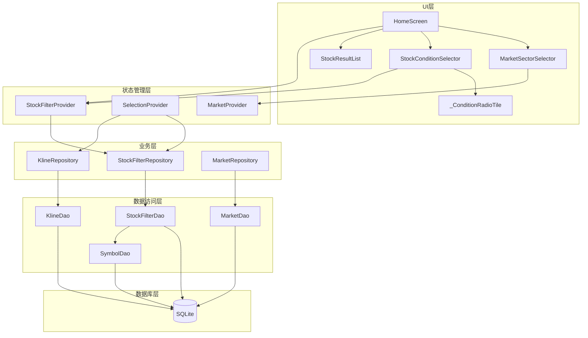
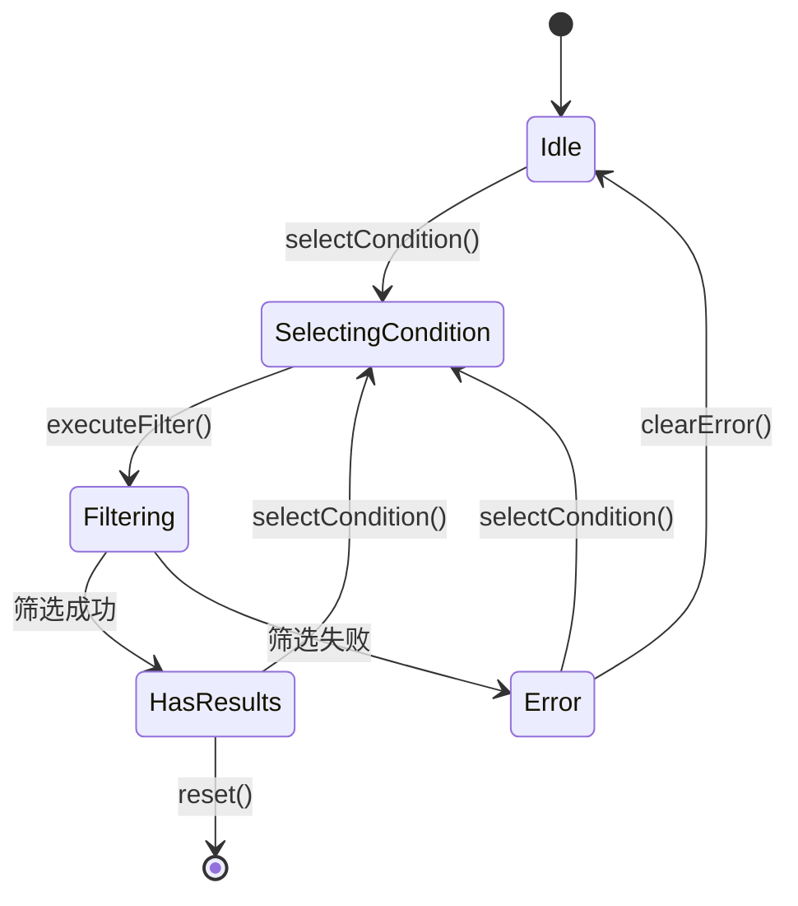
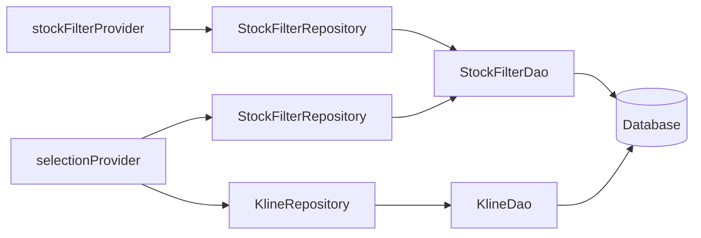
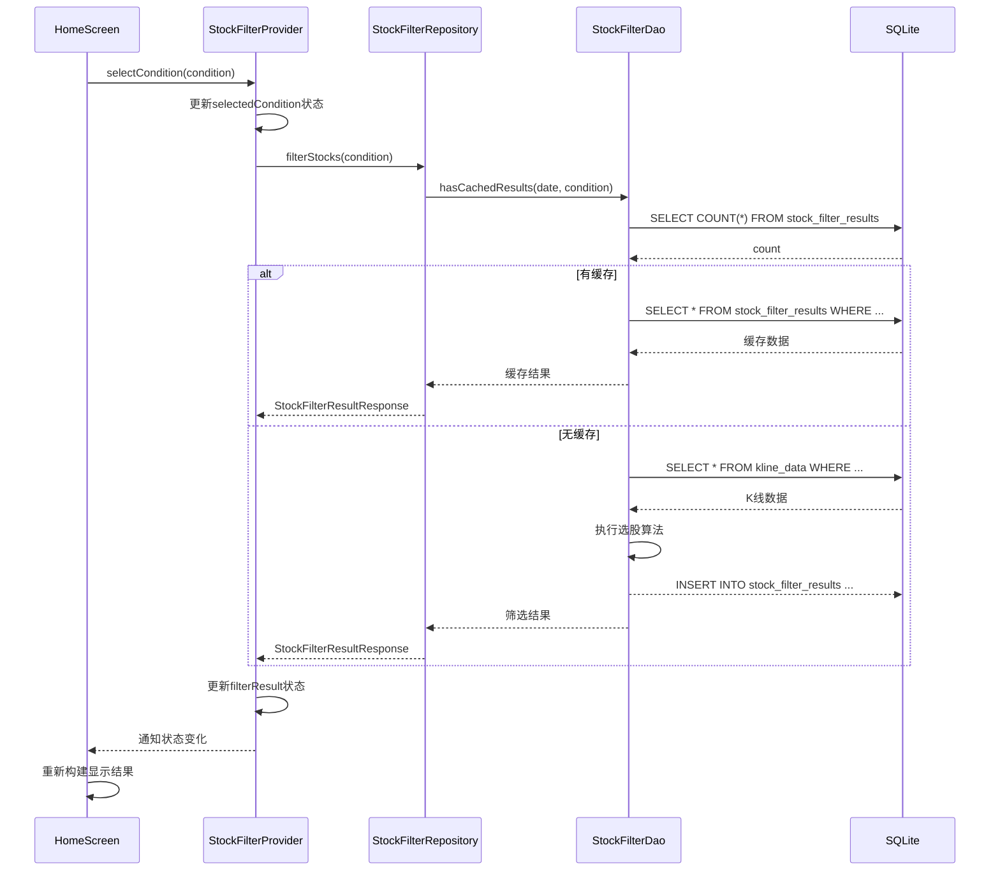
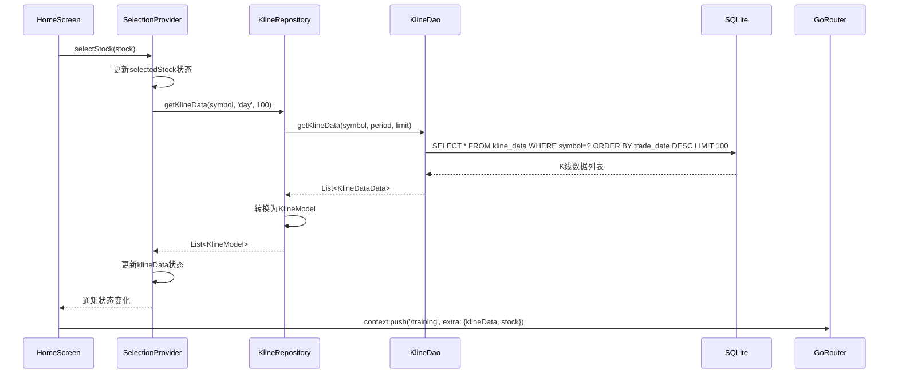

# K线训练营选股条件技术设计文档

## 1. 概述

### 1.1 设计目标
本技术设计文档基于《选股条件功能开发需求文档》，详细描述选股功能的实现方案，包括架构设计、数据库设计、API设计、UI设计和状态管理设计。

### 1.2 技术栈
| 层级 | 技术 | 版本 |
|------|------|------|
| 框架 | Flutter | 3.19+ |
| 状态管理 | Riverpod | 2.3+ |
| 数据库 | Drift (SQLite) | 2.18+ |
| 序列化 | json_serializable | 6.7+ |
| 路由 | GoRouter | 12.0+ |

### 1.3 架构图



---

## 2. 目录结构设计

### 2.1 新增文件

| 文件路径 | 文件说明 |
|----------|----------|
| `lib/core/enums/stock_filter_condition.dart` | 选股条件枚举定义 |
| `lib/data/database/tables/stock_filter_results_table.dart` | 选股结果缓存表 |
| `lib/data/database/tables/daily_stock_stats_table.dart` | 每日股票统计表 |
| `lib/data/database/daos/stock_filter_dao.dart` | 选股算法DAO |
| `lib/data/models/stock_filter_condition_model.dart` | 选股条件模型 |
| `lib/data/models/stock_filter_result_model.dart` | 选股结果模型 |
| `lib/data/repositories/stock_filter_repository.dart` | 选股仓库 |
| `lib/providers/stock_filter_provider.dart` | 选股状态管理 |

### 2.2 修改文件

| 文件路径 | 修改内容 |
|----------|----------|
| `lib/data/database/tables/tables.dart` | 添加新表导出 |
| `lib/data/database/daos/daos.dart` | 添加新DAO导出 |
| `lib/data/database/app_database.dart` | 添加新表和DAO，升级schema版本 |
| `lib/data/database/database_service.dart` | 添加StockFilterDao访问 |
| `lib/providers/selection_provider.dart` | 整合选股功能 |
| `lib/features/home/widgets/stock_condition_selector.dart` | 联动选股结果 |

---

## 3. 数据库设计

### 3.1 StockFilterResults表

```sql
CREATE TABLE stock_filter_results (
    id INTEGER PRIMARY KEY AUTOINCREMENT,
    filter_date DATETIME NOT NULL,
    condition_type TEXT NOT NULL,
    symbol TEXT NOT NULL,
    market_code TEXT NOT NULL,
    symbol_name TEXT NOT NULL,
    close_price REAL NOT NULL,
    change_percent REAL NOT NULL,
    extra_data TEXT,
    created_at DATETIME DEFAULT CURRENT_TIMESTAMP,
    UNIQUE(filter_date, condition_type, symbol),
    INDEX idx_filter_results_date_condition (filter_date, condition_type),
    INDEX idx_filter_results_symbol (symbol)
);
```

### 3.2 DailyStockStats表

```sql
CREATE TABLE daily_stock_stats (
    id INTEGER PRIMARY KEY AUTOINCREMENT,
    trade_date DATETIME NOT NULL,
    symbol TEXT NOT NULL,
    market_code TEXT NOT NULL,
    close_price REAL NOT NULL,
    open_price REAL NOT NULL,
    high_price REAL NOT NULL,
    low_price REAL NOT NULL,
    volume REAL NOT NULL,
    return15d REAL,
    return30d REAL,
    ma10 REAL,
    ma20 REAL,
    ma50 REAL,
    ma200 REAL,
    historical_high REAL,
    historical_low REAL,
    year_high REAL,
    year_low REAL,
    is_limit_up BOOLEAN DEFAULT FALSE,
    is_limit_down BOOLEAN DEFAULT FALSE,
    listing_days INTEGER DEFAULT 0,
    is_suspended BOOLEAN DEFAULT FALSE,
    created_at DATETIME DEFAULT CURRENT_TIMESTAMP,
    UNIQUE(trade_date, symbol),
    INDEX idx_daily_stats_date (trade_date),
    INDEX idx_daily_stats_symbol (symbol)
);
```

### 3.3 实体类设计

#### 3.3.1 StockFilterCondition枚举

| 字段名 | 类型 | 说明 |
|--------|------|------|
| `name` | String | 枚举名称（唯一标识） |
| `label` | String | 显示名称 |
| `direction` | FilterDirection | 趋势方向 |
| `sortOrder` | int | 排序序号 |

#### 3.3.2 StockFilterResultModel

| 字段名 | 类型 | 说明 |
|--------|------|------|
| `symbol` | String | 标的代码 |
| `symbolName` | String | 标的名称 |
| `marketCode` | String | 市场代码 |
| `closePrice` | double | 收盘价 |
| `changePercent` | double | 涨跌幅 |
| `extraData` | Map<String, dynamic>? | 额外数据 |

---

## 4. API接口设计

### 4.1 DAO层接口

#### 4.1.1 StockFilterDao接口

| 方法名 | 参数 | 返回值 | 功能说明 |
|--------|------|--------|----------|
| `getActiveSymbols` | `marketCode`: String? | `Future<List<Symbol>>` | 获取活跃标的列表 |
| `getKlineDataForDate` | `symbol`, `period`, `date` | `Future<KlineDataData?>` | 获取指定日期K线 |
| `getKlineDataBefore` | `symbol`, `period`, `date`, `days`, `startDate?`, `endDate?` | `Future<List<KlineDataData>>` | 获取历史K线（含时间范围） |
| `checkAllTimeHigh` | `symbol`, `date`, `startDate?`, `endDate?` | `Future<bool>` | 检查历史新高（含时间范围） |
| `checkYearHigh` | `symbol`, `date`, `startDate?`, `endDate?` | `Future<bool>` | 检查一年新高（含时间范围） |
| `check200DayHigh` | `symbol`, `date` | `Future<bool>` | 检查200日新高 |
| `checkAllTimeLow` | `symbol`, `date`, `startDate?`, `endDate?` | `Future<bool>` | 检查历史新低（含时间范围） |
| `checkYearLow` | `symbol`, `date`, `startDate?`, `endDate?` | `Future<bool>` | 检查一年新低（含时间范围） |
| `check200DayLow` | `symbol`, `date` | `Future<bool>` | 检查200日新低 |
| `getReturn30dTop50` | `date`, `startDate?`, `endDate?` | `Future<List<String>>` | 30日涨幅前50%（含时间范围） |
| `getReturn15dTop50` | `date`, `startDate?`, `endDate?` | `Future<List<String>>` | 15日涨幅前50%（含时间范围） |
| `getLoss30dTop50` | `date`, `startDate?`, `endDate?` | `Future<List<String>>` | 30日跌幅前50%（含时间范围） |
| `getLoss15dTop50` | `date`, `startDate?`, `endDate?` | `Future<List<String>>` | 15日跌幅前50%（含时间范围） |
| `checkLimitUp` | `symbol`, `date` | `Future<bool>` | 检查涨停 |
| `checkConsecutiveLimitUp` | `symbol`, `date` | `Future<bool>` | 检查连板 |
| `checkLimitDown` | `symbol`, `date` | `Future<bool>` | 检查跌停 |
| `checkConsecutiveLimitDown` | `symbol`, `date` | `Future<bool>` | 检查连续跌停 |
| `checkVolumePriceUp` | `symbol`, `date` | `Future<bool>` | 检查量价齐升 |
| `checkUpTrend` | `symbol`, `date`, `startDate?`, `endDate?` | `Future<bool>` | 检查上升趋势（含时间范围） |
| `checkDownTrend` | `symbol`, `date`, `startDate?`, `endDate?` | `Future<bool>` | 检查下降趋势（含时间范围） |
| `filterByCondition` | `condition`, `date`, `marketCode`, `startDate?`, `endDate?` | `Future<List<String>>` | 统一筛选接口（含时间范围） |
| `saveFilterResults` | `date`, `condition`, `symbols` | `Future<void>` | 保存缓存 |
| `getCachedFilterResults` | `date`, `condition` | `Future<List<StockFilterResult>>` | 读取缓存 |
| `hasCachedResults` | `date`, `condition` | `Future<bool>` | 检查缓存 |

### 4.2 Repository层接口

#### 4.2.1 StockFilterRepository接口

| 方法名 | 参数 | 返回值 | 功能说明 |
|--------|------|--------|----------|
| `getAllConditions` | 无 | `List<StockFilterConditionModel>` | 获取所有条件 |
| `filterStocks` | `condition`, `date`, `marketCode`, `startDate?`, `endDate?`, `useCache` | `Future<StockFilterResultResponse>` | 筛选股票（含时间范围） |
| `getRandomStock` | `marketCode` | `Future<StockFilterResultModel?>` | 随机选股 |
| `getFilterCount` | `condition`, `date`, `marketCode` | `Future<int>` | 获取数量 |
| `clearCache` | `date` | `Future<void>` | 清除缓存 |

### 4.3 Provider层接口

#### 4.3.1 StockFilterNotifier状态接口

| 状态字段 | 类型 | 说明 |
|----------|------|------|
| `selectedCondition` | StockFilterCondition? | 当前选中条件 |
| `availableConditions` | List\<StockFilterConditionModel\> | 可用条件列表 |
| `filterResult` | StockFilterResultResponse? | 选股结果 |
| `isLoading` | bool | 加载状态 |
| `error` | String? | 错误信息 |
| `filterCount` | int? | 结果数量 |

---

## 5. 核心算法设计

### 5.1 新高/新低算法

#### 5.1.1 历史新高

```
输入: symbol, date
输出: bool

算法步骤:
1. 获取指定日期的收盘价 close[t]
2. 查询上市以来所有收盘价的最大值 max_close
3. 判断 close[t] == max_close（允许微小误差）
4. 返回判断结果
```

#### 5.1.2 一年新高

```
输入: symbol, date
输出: bool

算法步骤:
1. 获取指定日期的收盘价 close[t]
2. 查询过去252个交易日的收盘价
3. 计算最大值 max_close_252
4. 判断 close[t] == max_close_252
5. 返回判断结果
```

#### 5.1.3 200日新高

```
输入: symbol, date
输出: bool

算法步骤:
1. 获取指定日期的收盘价 close[t]
2. 查询过去200个交易日的收盘价
3. 计算最大值 max_close_200
4. 判断 close[t] == max_close_200
5. 返回判断结果
```

### 5.2 涨跌幅排名算法

#### 5.2.1 30日涨幅前50%

```
输入: date
输出: List<String> (标的代码列表)

算法步骤:
1. 获取所有活跃标的
2. 对每个标的计算过去30日涨幅
3. 按涨幅从高到低排序
4. 取前50%的标的
5. 返回标的代码列表
```

#### 5.2.2 15日涨幅前50%

```
输入: date
输出: List<String> (标的代码列表)

算法步骤:
1. 获取所有活跃标的
2. 对每个标的计算过去15日涨幅
3. 按涨幅从高到低排序
4. 取前50%的标的
5. 返回标的代码列表
```

### 5.3 涨停/跌停算法

#### 5.3.1 涨停判断

```
输入: symbol, date
输出: bool

算法步骤:
1. 获取指定日期的K线数据
2. 判断 close == high（允许微小误差）
3. 返回判断结果
```

#### 5.3.2 连板判断

```
输入: symbol, date
输出: bool

算法步骤:
1. 获取今日K线数据
2. 判断今日 close == high
3. 获取昨日K线数据
4. 判断昨日 close == high
5. 两者都满足返回true，否则返回false
```

### 5.4 量价齐升算法

```
输入: symbol, date
输出: bool

算法步骤:
1. 获取今日K线数据 (close[t], volume[t])
2. 获取昨日K线数据 (close[t-1], volume[t-1])
3. 计算价格涨幅: price_increase = close[t] / close[t-1] - 1
4. 计算成交量增幅: volume_increase = volume[t] / volume[t-1] - 1
5. 判断: price_increase > 0.02 AND volume_increase > 0.05
6. 返回判断结果
```

### 5.5 趋势算法

#### 5.5.1 上升趋势

```
输入: symbol, date
输出: bool

算法步骤:
1. 获取至少55个交易日的K线数据
2. 计算当前MA10, MA20, MA50
3. 计算前一日MA10, MA20, MA50
4. 判断均线向上: MA10 > MA10_prev AND MA20 > MA20_prev AND MA50 > MA50_prev
5. 判断多头排列: MA10 > MA20 > MA50
6. 判断角度递增: angle(MA10) > angle(MA20) > angle(MA50)
7. 所有条件满足返回true
```

#### 5.5.2 下降趋势

```
输入: symbol, date
输出: bool

算法步骤:
1. 获取至少55个交易日的K线数据
2. 计算当前MA10, MA20, MA50
3. 计算前一日MA10, MA20, MA50
4. 判断均线向下: MA10 < MA10_prev AND MA20 < MA20_prev AND MA50 < MA50_prev
5. 判断空头排列: MA10 < MA20 < MA50
6. 判断角度递减: angle(MA10) < angle(MA20) < angle(MA50)
7. 所有条件满足返回true
```

---

## 6. 状态管理设计

### 6.1 StockFilterState

```dart
class StockFilterState {
  final StockFilterCondition? selectedCondition;
  final List<StockFilterConditionModel> availableConditions;
  final StockFilterResultResponse? filterResult;
  final bool isLoading;
  final String? error;
  final int? filterCount;
}
```

### 6.2 状态转换流程



### 6.3 Provider依赖关系



---

## 7. UI组件设计

### 7.1 StockConditionSelector组件

#### 7.1.1 组件结构

```
StockConditionSelector
├── Column
│   ├── _buildConditionGroup (趋势向上)
│   │   ├── Row (标题栏)
│   │   │   ├── Container (红色指示条)
│   │   │   └── Text ("趋势向上")
│   │   └── GridView.builder
│   │       └── _ConditionRadioTile x 9
│   ├── SizedBox (间距)
│   ├── _buildConditionGroup (趋势向下)
│   │   ├── Row (标题栏)
│   │   │   ├── Container (绿色指示条)
│   │   │   └── Text ("趋势向下")
│   │   └── GridView.builder
│   │       └── _ConditionRadioTile x 8
│   ├── SizedBox (间距)
│   └── _buildResultIndicator
│       ├── Row (加载中)
│       │   ├── CircularProgressIndicator
│       │   └── Text ("正在计算...")
│       └── Text (结果计数)
```

#### 7.1.2 _ConditionRadioTile组件

| 属性 | 类型 | 说明 |
|------|------|------|
| `condition` | String | 条件名称 |
| `isSelected` | bool | 是否选中 |
| `accentColor` | Color | 主题色 |
| `onTap` | VoidCallback | 点击回调 |

#### 7.1.3 组件样式

| 元素 | 样式 |
|------|------|
| 标题文字 | 14px, 600 weight, 主色 |
| 指示条 | 4px宽度, 圆角2px |
| 单选框容器 | 圆角8px, 边框1.5px |
| 选中状态 | 背景色10%透明度, 边框高亮 |
| 圆形选择器 | 14px直径, 选中时填充 |

### 7.2 MarketSectorSelector组件（下拉框版本）

#### 7.2.1 组件结构

```
MarketSectorSelector
└── DropdownButtonFormField<String>
    ├── hint: Text ("请选择市场板块")
    ├── items: List<DropdownMenuItem>
    │   └── Row
    │       ├── Text (图标)
    │       ├── SizedBox (间距)
    │       └── Expanded
    │           └── Column
    │               ├── Text (板块名称)
    │               └── Text (市场类型)
    └── onChanged: (value) => selectSector(value)
```

---

## 8. 数据流向设计

### 8.1 选股流程数据流向



### 8.2 训练跳转数据流向



---

## 9. 性能优化设计

### 9.1 缓存策略

| 缓存类型 | 缓存位置 | 有效期 | 触发时机 |
|----------|----------|--------|----------|
| 选股结果 | StockFilterResults表 | 当日有效 | 选股完成后 |
| 每日统计 | DailyStockStats表 | 当日有效 | 每日收盘后 |
| 均线数据 | DailyStockStats表 | 当日有效 | 每日收盘后 |

### 9.2 索引优化

| 表名 | 索引名称 | 索引列 | 用途 |
|------|----------|--------|------|
| stock_filter_results | idx_filter_results_date_condition | filter_date, condition_type | 查询缓存 |
| stock_filter_results | idx_filter_results_symbol | symbol | 按标的查询 |
| daily_stock_stats | idx_daily_stats_date | trade_date | 日期范围查询 |
| daily_stock_stats | idx_daily_stats_symbol | symbol | 按标的查询 |
| kline_data | idx_kline_symbol_period | symbol, period | K线查询 |

### 9.3 分批处理策略

对于涨跌幅排名类算法，采用分批处理避免内存溢出：

```
处理流程:
1. 分批获取标的列表（每批100个）
2. 并行计算每批标的的涨跌幅
3. 汇总所有结果并排序
4. 返回前50%的标的
```

---

## 10. 安全性设计

### 10.1 数据安全

| 措施 | 说明 |
|------|------|
| 数据库加密 | 使用SQLCipher加密数据库文件 |
| 敏感信息脱敏 | 日志中不记录完整标的代码和价格 |
| 输入校验 | 对标的代码、日期等输入进行格式校验 |

### 10.2 异常处理

| 异常类型 | 处理策略 |
|----------|----------|
| 数据库连接失败 | 重试机制 + 错误日志记录 |
| 数据查询失败 | 返回空结果 + 警告日志 |
| 计算异常 | 跳过该标的，继续处理其他标的 |
| 网络异常 | 提示用户检查网络 |

### 10.3 日志记录

| 日志级别 | 记录内容 |
|----------|----------|
| INFO | 选股开始、完成、缓存命中 |
| WARN | 数据缺失、计算失败 |
| ERROR | 严重错误、数据库异常 |

---

## 11. 代码生成与迁移

### 11.1 代码生成命令

```bash
# 生成Drift数据库代码
flutter pub run build_runner build --delete-conflicting-outputs

# 生成json_serializable代码
flutter pub run build_runner build
```

### 11.2 数据库迁移

```dart
@override
MigrationStrategy get migration => MigrationStrategy(
      onCreate: (Migrator m) {
        return m.createAll();
      },
      onUpgrade: (Migrator m, int from, int to) async {
        if (from < 2) {
          await m.createTable(stockFilterResults);
          await m.createTable(dailyStockStats);
        }
      },
    );
```

---

## 12. 测试设计

### 12.1 单元测试覆盖

| 测试模块 | 测试用例 | 预期结果 |
|----------|----------|----------|
| StockFilterDao | checkAllTimeHigh | 正确识别历史新高 |
| StockFilterDao | checkYearHigh | 正确识别一年新高 |
| StockFilterDao | checkLimitUp | 收盘价等于最高价返回true |
| StockFilterDao | checkConsecutiveLimitUp | 连续2天涨停返回true |
| StockFilterDao | checkUpTrend | 均线多头排列返回true |
| StockFilterDao | checkVolumePriceUp | 量价齐升返回true |
| StockFilterRepository | filterStocks | 返回正确的股票列表 |
| StockFilterRepository | getFilterCount | 返回正确的数量 |
| StockFilterNotifier | selectCondition | 状态正确更新 |
| StockFilterNotifier | executeFilter | 触发选股并更新结果 |

### 12.2 集成测试覆盖

| 测试场景 | 测试步骤 | 预期结果 |
|----------|----------|----------|
| 选股完整流程 | 选择条件 → 执行选股 → 查看结果 | 结果正确显示 |
| 缓存机制 | 首次选股 → 再次选股 | 第二次使用缓存 |
| 错误处理 | 无数据时选股 | 显示错误提示 |
| 市场筛选 | 选择市场 → 执行选股 | 结果限定在所选市场 |

---

## 13. 部署与集成

### 13.1 依赖配置

```yaml
dependencies:
  flutter_riverpod: ^2.3.0
  drift: ^2.18.0
  sqlite3_flutter_libs: ^0.5.0
  json_annotation: ^6.7.0
  go_router: ^12.0.0

dev_dependencies:
  drift_dev: ^2.18.0
  build_runner: ^2.4.0
  json_serializable: ^6.7.0
  flutter_test:
    sdk: flutter
```

### 13.2 构建命令

```bash
# 开发构建
flutter build debug

# 生产构建
flutter build release

# 运行测试
flutter test
```

---

*文档版本: v1.0*  
*创建日期: 2026-05-16*  
*设计状态: 待评审*
